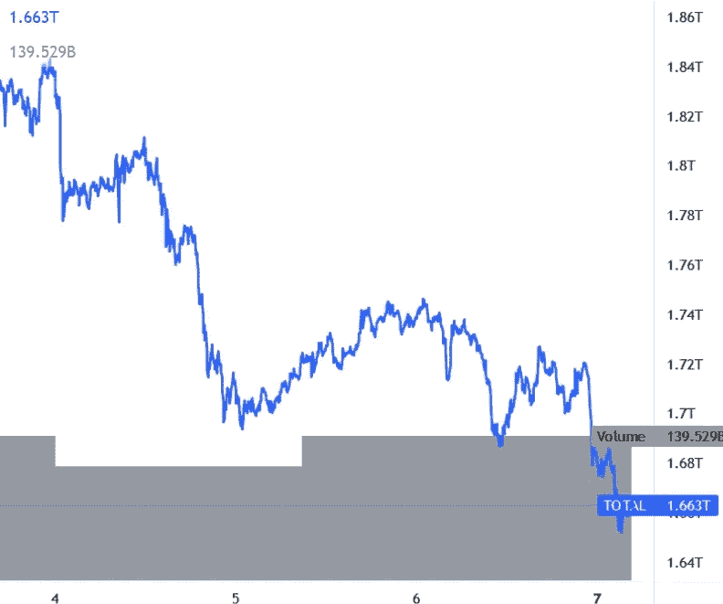

# 随着比特币和以太坊失去关键支持，Altcoins 跳水

> 原文：<https://medium.com/coinmonks/altcoins-dive-as-bitcoin-and-ethereum-lose-key-support-11a4f261e572?source=collection_archive---------97----------------------->

**Visit our website:-** [**https://bitcoinsupports.com/**](https://bitcoinsupports.com/)

——比特币跌破 38000 大关。

——XRP 交投于 0.70 美元附近，以太坊测试 2500 美元支撑。

——露娜、ZEC、QNT、FTM 都在 8%-18%之间下跌。

比特币价格持续暴跌至关键的 40000 美元支撑区下方，突破 38500 美元支撑区。它目前下跌了 3%，并在 37，900 美元附近显示出看跌迹象(04:12 UTC)。

同样的，大 altcoins 多数也在节节败退。ETH 价格下跌 4%，跌破 2550 美元。XRP 很难保持在 0.70 美元的支撑位之上。ADA 货币对正在逼近 0.80 美元的支撑位。

**总市值**

**Visit our website:-** [**https://bitcoinsupports.com/**](https://bitcoinsupports.com/)

**比特币的价值**

比特币价格在明显跌破 40000 美元后聚集了看跌的势头。BTC 已经跌破 38，500 美元的支撑位，现在在红色区域交易。空头似乎在控制局面，进一步跌破 37，000 美元是可能的。下一个主要支撑位在 36，200 美元附近，低于此价格可能会跌至 35，500 美元。

上行方面，价格可能在 38500 美元附近遭遇阻力。关键的周线障碍目前正在 40，000 美元上方构建，在此之上价格可能开始更大的上涨。

**以太坊的成本**

以太坊的价格也开始跌破 2800 美元支撑位。ETH 突破了 2650 美元和 2550 美元的支撑位。它也很难保持在 2500 美元以上。下一个主要支撑位在 2，440 美元附近，低于此价格可能下跌至 2，320 美元。上行方面，价格在 2550 美元附近遇到阻力。下一个重要的绊脚石可能是 2650 美元附近，这是一个前支撑区。

**阿达、BNB、索尔、多格、XRP 价格**

**卡尔达诺(阿达)**目前交易价格低于 0.82 美元支撑位。价格目前试图维持在 0.80 美元支撑位上方。如果价格跌破负值，可能会跌至 0.765 美元。

**BNB** 下跌 3%，已经明显突破 385 美元支撑位。价格目前徘徊在 365 美元的支撑位附近。任何进一步的下跌都可能将价格推至 350 美元以下。

**索拉纳(SOL)** 价值下跌 6%，跌破 85 美元支撑位。价格现在徘徊在 80 美元左右。下一个重要的支撑位在 75 美元附近，低于这个价格可能会触及 70 美元。

**DOGE** 现交投于美元 0.120 支撑位下方。如果价格收于 0.120 美元以下，可能会跌至 0.110 美元。另一方面，卖方可能面临向 0.125 美元的反弹。

**XRP**的价格已经跌破 0.72 美元的支撑位，尽管它已经设法保住了 0.70 美元的支撑位。如果价格跌破负值，可能会跌至 0.665 美元。

**其他替代币今日行情**

AVAX、DOT、DOGE、SHIB、MATIC、CRO、ATOM、LTC、NEAR、LINK、UNI、BCH 等都是价值跌幅超过 5%的加密货币。LUNA 表现最差，下跌约 8%，交易价格低于 80 美元。一周后还是涨了 8%。另一方面，WAVES 飙升 9%，接近 19 美元，周涨幅接近 67%。

总体来看，比特币的价格正在跌破 38500 美元关口，显示出看跌趋势。如果 BTC 跌破 38，000 美元，有可能涨到 36，200 美元或者 35，500 美元。

**访问我们的网站:-**[**https://bitcoinsupports.com/**](https://bitcoinsupports.com/)

**免责声明:以上为作者观点，不应视为投资建议。读者应该自己做研究。**