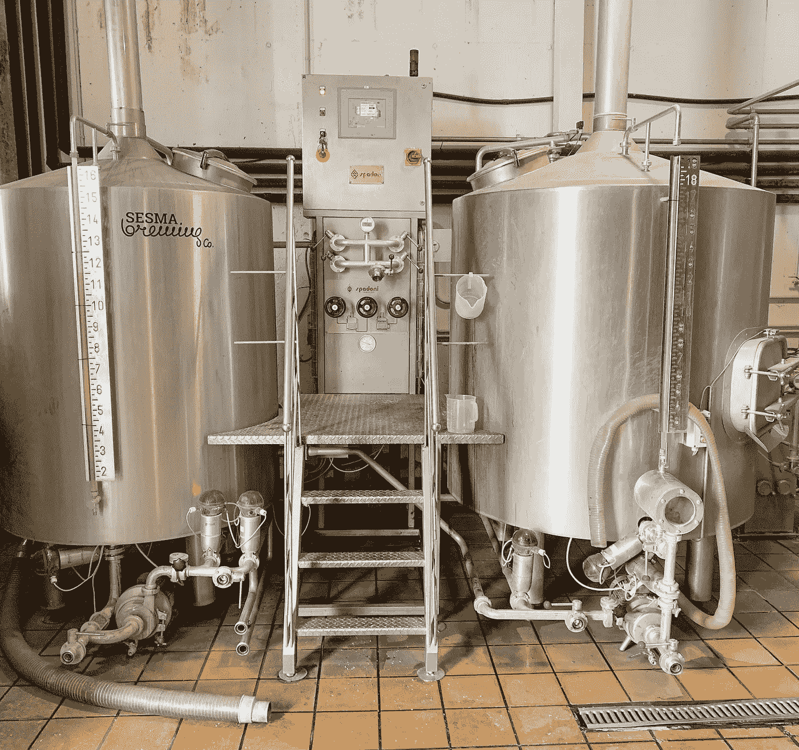

# 备选 NFT/加密“真实”用例🔐

> 原文：<https://medium.com/coinmonks/alternative-nft-crypto-real-life-use-cases-b7c0b08d99ef?source=collection_archive---------39----------------------->

# 不是所有的 NFT 都必须是亲民党的…

想象一下，拥有一张 NFT，就像进入一个社区的入场券，和/或一家企业的“股份”(比如**)。**

**假设你想去西班牙度假，这是西方世界中你能去的地理上最美丽、最便宜的国家之一，而且恰好也有一些最好的天气。**

**在大多数旅游场合，你可能不得不花数百美元租一个旅馆房间或住在招待所，如果你想住得豪华，甚至要花上几千美元。**

## **如果你拥有我们收藏的 NFT，这将允许你进入我们的“非网格”社区。你可以来我们的社区，想住多久就住多久(如果你住的时间超过 3 个月，我们不会告诉当局😉).**

***抵达后，我们会检查你是否拥有我们收藏的 NFT*(每人一辆)，如果你拥有，我们会非常欢迎你住在你的露营车/汽车/帐篷里，无论你喜欢什么。到时候，我们会设立公共空间，如果客人喜欢双层床、厨房、浴室等设施，他们可以在这里睡觉。我们建议，如果你选择呆一周以上，你可以在社区周围帮忙做些家务，以保持社区的繁荣。**

**这只是你可以选择让 NFT 在现实世界中适用的一种方式。**

****

**我们将为我们的 NFT 持有者创造价值的下一个方法是建立一个酿酒厂！(你真的可以建立世界上任何企业……)**

## **这样每个 NFT 人都能从生意中分得一份利润。**

**例如，在我们的酿酒业务中(将来还会有更多的酒吧/酿酒厂/餐馆)，所有利润的 20%将永远平均分配给我们 2000 年 NFT 收藏中的一个特别的 50 NFT。这 50 个 NFT 将以 1500 美元的价格出售，并将从酿酒业务的利润中获得股息。其余的，1950 年 NFT 的，将得到免费的啤酒/食物，每当他们来到我们的任何设施价值高达 100 美元/天。**

**这不像某些公用事业那么容易，但目前来说，这是一种弥合数字资产和现实世界公用事业之间差距的方式。**

> **使用 NFT 的投资股份，每个 NFT 都是公司的股份，并获得一定比例的利润。**

**这些是 NFT 的替代实用程序用例，甚至可以添加到其他实用程序之上，如赌注、令牌奖励、投票权等**

**你必须了解从事这些业务的法律措施，并在进行任何重大交易之前咨询律师。**

**总是跳出框框思考💫**

**___________________________________________________________________**

****永远小心！！！⚠️****

***这一点我怎么强调都不为过！保持高度警惕，注意你点击的每一个链接，你做的每一笔交易，和你交往的每一个人，因为骗子在这个领域是大量的，最好的项目也会被取消。***

**点击所有链接之前，要再三检查，确保它们是你要找的官方链接。在给自己或他人发送任何有价值的东西之前，也要仔细检查所有的钱包地址。**

****跟随我们的加密/NFT/区块链/元宇宙之旅，努力开启地球上第一个 NFT/以加密为中心的酿酒厂和离网公社🌱****

**[*推特*](https://www.twitter.com/metadadsxyz)[*不和*](https://discord.gg/Cv8v2Ert8m)[*YouTube*](https://www.youtube.com/channel/UC7pbtSBs9nRJHK6coMhCR8g)[*抖音*](https://www.tiktok.com/@thedudescrypto)[*insta gram*](https://www.instagram.com/thedudescrypto/)[*Spotify 播客*](https://open.spotify.com/episode/5U8vXE9HDAsGbSbebw9p62?si=2rZIigw-Tw2pCxjxmkbYzQ)**

***请将 Polygon Matic 发送到这个 Eth 地址，或 Eth 令牌:
0xb 53b 3978333 e 11 c 382 ab 619 f 02 f 469 A8 c 70750 af***

**___________________________________________________________________**

****

**感谢阅读:]**

**干杯，
***Ty 又名“纨绔子弟”*****

****我们其他的一些博文:**
[5 个失败的网站 3](/coinmonks/5-downfalls-of-web3-cd5dc8ade4fd)
[5 + 5 个不和谐的策略](/coinmonks/5-tips-for-a-better-discord-nft-crypto-edition-ff9b039d0359)
[Crypto 101:一个初学者指南](/coinmonks/crypto-101-a-beginners-guide-345d440bd163)
[NFT 最佳实践(营销&社区成长)](/coinmonks/top-5-nft-best-practices-marketing-and-community-growth-7025e26eb50c)
[网站 3 基础知识](/coinmonks/web3-basics-252121357f33)**

> **加入 Coinmonks [电报频道](https://t.me/coincodecap)和 [Youtube 频道](https://www.youtube.com/c/coinmonks/videos)了解加密交易和投资**

# **另外，阅读**

*   **[南非的加密交易所](https://coincodecap.com/crypto-exchanges-in-south-africa) | [BitMEX 加密信号](https://coincodecap.com/bitmex-crypto-signals)**
*   **[MoonXBT 副本交易](https://coincodecap.com/moonxbt-copy-trading) | [阿联酋的加密钱包](https://coincodecap.com/crypto-wallets-in-uae)**
*   **[Remitano 审查](https://coincodecap.com/remitano-review)|[1 英寸协议指南](https://coincodecap.com/1inch)**
*   **[iTop VPN 审查](https://coincodecap.com/itop-vpn-review) | [曼陀罗交易所审查](https://coincodecap.com/mandala-exchange-review)**
*   **[40 个最佳电报频道](https://coincodecap.com/best-telegram-channels) | [喜美元评论](https://coincodecap.com/hi-dollar-review)**
*   **[折 App 评论](https://coincodecap.com/fold-app-review) | [StealthEX 评论](/coinmonks/stealthex-review-396c67309988) | [Stormgain 评论](https://coincodecap.com/stormgain-review)**