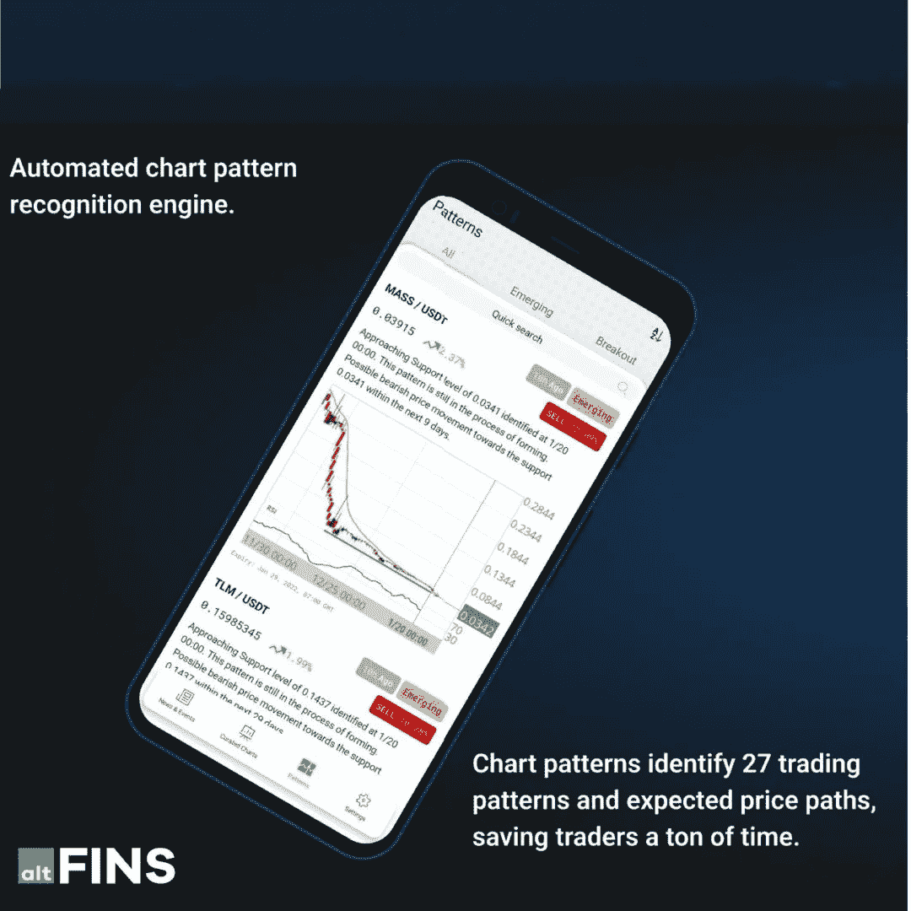

# altFINS 推出一款手机应用

> 原文：<https://medium.com/coinmonks/altfins-launches-a-mobile-app-c423dbfc4ee6?source=collection_archive---------74----------------------->

# 尝试独特的加密交易创意的移动应用程序

秘密投资者和交易者被无用的市场噪音淹没了。相反，投资者希望获得清晰、有用的信息，了解哪些硬币处于上升趋势、势头强劲或正在爆发，以及实时新闻和即将到来的重大硬币事件。

[altFINS 的分析平台](https://platform.altfins.com/)消除噪音，提供可行的投资理念。根据我们的用户社区的反馈，我们很高兴推出一款移动应用程序，我们相信它能够实现我们的使命，帮助日常加密投资者获得成功。

现在就开始使用 altFINS **手机 app** ，不要错过任何交易机会！

altFINS 的首席执行官兼创始人 [Richard Fetyko](https://www.linkedin.com/in/richard-fetyko-6765b63/) 表示:“自从一年前我们推出基于网络的平台以来，我们的用户群已经增加到每月数万人。他们的头号需求是一款能让他们快速获取交易想法的移动应用。”

# 我们移动应用的第一个版本包括最受欢迎的内容:

*   **自动图表模式识别**识别楔形、三角形、倒头肩底、通道和 20 种其他交易模式的硬币交易
*   **策划图表**:50 大另类币技术分析
*   超过 5000 个加密项目的实时 twitter 新闻和事件

# 2022 年的后续版本将增加以下功能:

*   **互动图表** (2Q-2022)
*   **警报** (2Q-2022)
*   最佳加密**市场筛选** (3Q-2022)
*   **交易** (4Q-2022)

下载我们的移动应用程序，加入成千上万活跃交易者的社区！

**关于阿尔特芬:**

[altFINS](https://altfins.com/) 是一个基于云的平台，使投资者和活跃的交易者能够在交易所之间筛选、分析和交易数字资产。该平台从交易所获取数据，计算超过 120 个技术指标(分析)，如 5 个时间间隔的 SMA、EMA、MACD 和 RSI。

这些复杂的时间序列数据和分析由专有的数据管理系统管理。因此，该平台能够使用技术指标和自动化图表模式识别来筛选替代硬币，帮助交易者发现交易想法。altFINS 还支持交易执行、投资组合跟踪和绩效监控。

> 加入 Coinmonks [电报频道](https://t.me/coincodecap)和 [Youtube 频道](https://www.youtube.com/c/coinmonks/videos)了解加密交易和投资

# 另外，阅读

*   [最佳比特币保证金交易](/coinmonks/bitcoin-margin-trading-exchange-bcbfcbf7b8e3) | [萝莉点评](/coinmonks/lolli-review-e6ddc7895ad8) | [比特币保证金交易](https://coincodecap.com/bityard-margin-trading)
*   [创造并出售你的第一个 NFT](https://coincodecap.com/create-nft) | [密码交易机器人](https://coincodecap.com/best-crypto-trading-bots)
*   [如何在 CoinDCX 上购买柴犬(SHIB)币？](https://coincodecap.com/buy-shiba-coindcx)
*   [CBET 评论](https://coincodecap.com/cbet-casino-review) | [库科恩 vs 比特币基地](https://coincodecap.com/kucoin-vs-coinbase) | [拜比特 vs 比特币基地](https://coincodecap.com/bybit-vs-coinbase)
*   [折叠 App 回顾](https://coincodecap.com/fold-app-review) | [LocalBitcoins 回顾](/coinmonks/localbitcoins-review-6cc001c6ed56) | [Bybit vs 币安](https://coincodecap.com/bybit-binance-moonxbt)
*   [加密保证金交易交易所](/coinmonks/crypto-margin-trading-exchanges-428b1f7ad108) | [赚取比特币](/coinmonks/earn-bitcoin-6e8bd3c592d9) | [Mudrex 投资](https://coincodecap.com/mudrex-invest-review-the-best-way-to-invest-in-crypto)