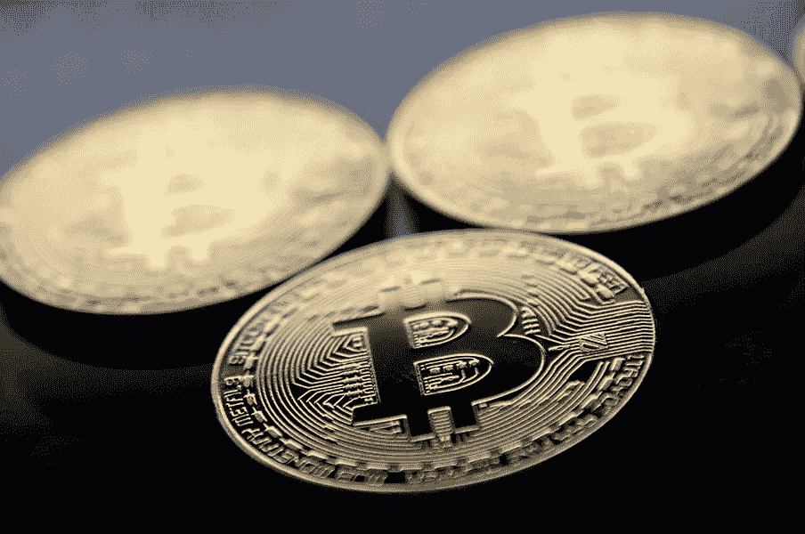

# 尽管痛苦，清除[密码]产业的“垃圾”可能是健康的

> 原文：<https://medium.com/coinmonks/although-painful-the-removal-of-the-crypto-industrys-junk-is-probably-healthy-5f4e270f185f?source=collection_archive---------42----------------------->

一位专家说，“虽然很痛苦，但是清除这个行业的‘垃圾’可能是健康的。”。

比特币自 2020 年 12 月以来首次跌破 19000 美元，因为在货币紧缩的背景下，加密行业内部压力加剧的迹象继续累积。

根据的数据，按市值计算，最大的数字令牌上周六跌幅高达 11%，至 18，334 美元，创下连续第 12 个交易日下跌的纪录。

以太坊跌破心理 1000 美元关口，下跌近 13%，至 951 美元。这是自 2021 年 1 月以来的最低水平。加密货币市场的两大支柱都从 11 月初达到的历史高点下跌了 70%以上。

*“我们看到的是更多的清算推动价格和投资者情绪下降，这引发了更多的清算和负面情绪。它仍然需要一些“清算”，但这将在某个阶段耗尽，”*数字资产领域最大和最知名的贷款机构之一 Genesis 的市场洞察主管 Noelle Acheson 说。

最新一轮下跌将比特币推低至 19511 美元以下，这是该货币在 2017 年上一个牛市周期中达到的最高点，该周期于当年年底达到。在其大约 12 年的交易历史中，比特币从未跌破前几个周期的峰值。

在比特币下跌后，Altcoins 也没有例外地受到投资者负面情绪的影响，交易中的每一枚代币都出现了亏损。[卡尔达诺](https://bitnewsbot.com/tag/cardano)、[索拉纳](https://bitnewsbot.com/tag/solana)、 [Dogecoin](https://bitnewsbot.com/tag/dogecoin) 和 [Polkadot](https://bitnewsbot.com/tag/polkadot) 周六录得 9%至 12%的 24 小时跌幅，而 [Monero](https://bitnewsbot.com/tag/monero) 和 [Zcash](https://bitnewsbot.com/tag/zcash) 等隐私令牌跌幅高达 11%。

坏消息和高利率的有害组合对加密货币等风险更高的资产不利。美联储于 6 月 15 日将关键利率上调了 0.75 个百分点，这是自 1994 年以来的最大增幅。央行行长们暗示，为了抑制通胀，他们今年将继续大幅加息。

美国银行(Bank of America Corp .)加密货币和数字资产策略主管阿尔凯什·沙阿(Alkesh Shah)周五在一份报告中表示，“在去年流动性主导的数字资产牛市之后，投资者继续将自己定位为防御性的。“虽然痛苦，但该行业的‘垃圾’退出可能是健康的，因为投资者将注意力转向现金流和盈利能力路线图清晰的项目，而不是单纯的收入增长。”

*原载于 2022 年 6 月 20 日*[*【https://bitnewsbot.com】*](https://bitnewsbot.com/although-painful-the-removal-of-the-crypto-industrys-junk-is-probably-healthy/)*。*

> 加入 Coinmonks [电报频道](https://t.me/coincodecap)和 [Youtube 频道](https://www.youtube.com/c/coinmonks/videos)了解加密交易和投资

# 另外，阅读

*   [3 商业评论](/coinmonks/3commas-review-an-excellent-crypto-trading-bot-2020-1313a58bec92) | [Pionex 评论](https://coincodecap.com/pionex-review-exchange-with-crypto-trading-bot) | [Coinrule 评论](/coinmonks/coinrule-review-2021-a-beginner-friendly-crypto-trading-bot-daf0504848ba)
*   [莱杰 vs n 格拉夫](/coinmonks/ledger-vs-ngrave-zero-7e40f0c1d694) | [莱杰纳诺 s vs x](/coinmonks/ledger-nano-s-vs-x-battery-hardware-price-storage-59a6663fe3b0) | [币安评论](/coinmonks/binance-review-ee10d3bf3b6e)
*   [Bybit Exchange 审查](/coinmonks/bybit-exchange-review-dbd570019b71) | [Bityard 审查](https://coincodecap.com/bityard-reivew) | [Jet-Bot 审查](https://coincodecap.com/jet-bot-review)
*   [3 commas vs crypto hopper](/coinmonks/3commas-vs-pionex-vs-cryptohopper-best-crypto-bot-6a98d2baa203)|[赚取加密利息](/coinmonks/earn-crypto-interest-b10b810fdda3)
*   最好的比特币[硬件钱包](/coinmonks/hardware-wallets-dfa1211730c6) | [BitBox02 回顾](/coinmonks/bitbox02-review-your-swiss-bitcoin-hardware-wallet-c36c88fff29)
*   [BlockFi vs Celsius](/coinmonks/blockfi-vs-celsius-vs-hodlnaut-8a1cc8c26630)|[Hodlnaut 点评](/coinmonks/hodlnaut-review-best-way-to-hodl-is-to-earn-interest-on-your-bitcoin-6658a8c19edf) | [KuCoin 点评](https://coincodecap.com/kucoin-review)