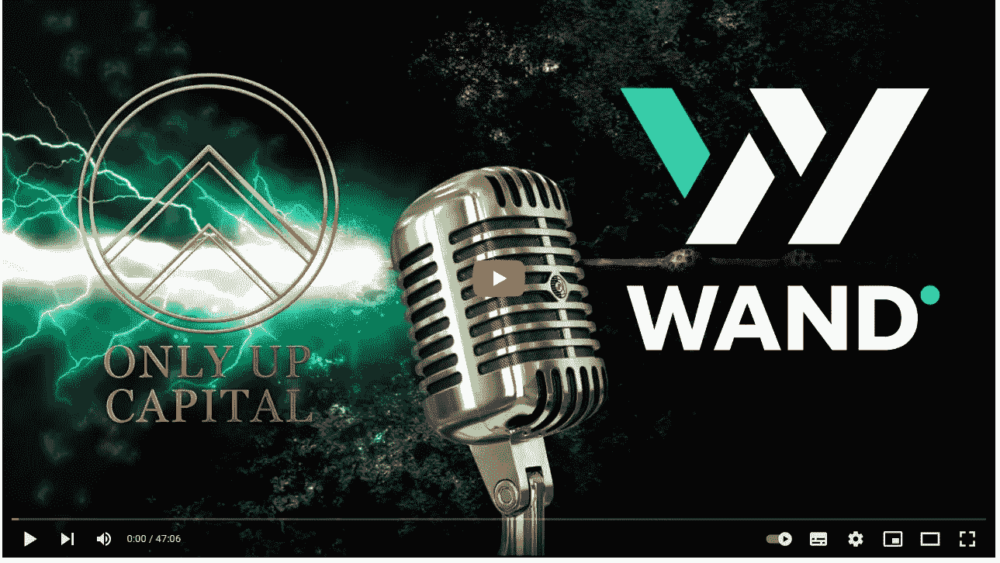

# AMA 重组:WAND 投资公司 x OnlyUp Capial

> 原文：<https://medium.com/coinmonks/ama-retranscription-wand-investments-x-onlyup-capial-fd6ebf70915a?source=collection_archive---------10----------------------->

Retranscription from the AMA held on April 3, 2022

你可以在这里听音频:[https://www.youtube.com/watch?v=pjmqtbPFoa4](https://www.youtube.com/watch?v=pjmqtbPFoa4)

**你能给我们介绍一下你自己和你的团队吗，还有你是怎么想到这个项目的？**
(0:40)去年 8 月，Ylchema 开始投资比特币和其他替代币。他很快发现，无论是直接在币安平台上，还是通过 Metamask 在其他协议上，赌注都进一步增加了他的投资的 APR。他从 10 月份开始投资 DAOs，但当它们崩盘时，他损失了一大笔钱。然而，WAND 的想法就是这样诞生的——“我们如何才能让刀更可持续？”这个想法成熟了，并在几个月的时间里一次又一次地被修改，直到这个项目变成了今天的样子。一旦 Ylchema 满意了，由于他不是开发人员，他就在各种 Discord 服务器上寻找一个团队。当前团队:
一名来自新加坡的首席开发人员，拥有 17 年的全栈开发经验和丰富的可靠性经验
一名来自巴基斯坦的开发人员，拥有 4 年的前端开发经验
一名设计人员
两名教育内容和编辑内容作者
最近，前端开发和设计团队增加了一名 FE 开发人员和一名设计人员。

**我们离发射还有多远？(4:06)**
预计发布时间为 6 月/7 月。然而，由于某些原因，它可能更早:

1.  主合同的第一个版本将在几天内完成。
2.  登陆页面和 dApp 将在接下来的 7-10 天内完成。
3.  最耗时的部分将是 Certik 在发布前进行的审核。幸运的是，WAND 目前正在申请“透明联盟”(UoT)，这是有意义的，因为 WAND 拥有相同的价值观。UoT 与 Certik 合作，缩短了等待时间。

所以，总而言之，WAND 可能会提前一个月推出。

你能给我们一个项目的分解和解释吗？(6:07)
开始 WAND 投资的原因是许多高 APY 项目普遍缺乏可持续性。
问题:“如何用 0%的年利率让一个项目变得有吸引力？”
答案:如果你不创造新的代币，你需要增加它们的价值。第一个令牌是权杖，它 100%由稳定的硬币支持，因此风险较低。
权杖自有国库。每个代币的价格是通过将国库的数量除以权杖代币的数量来计算的。这意味着价格不是由市场或指数决定的(因为没有流动性对)。

WAND 有几种机制可以使比率增加，从而提高权杖的价格:
当你购买权杖时，你是在支持价格之上购买的。差额进入国库，将进一步提高价格。
·出售权杖时打折出售(低于底价)，也提高了权杖底价。因此，当鲸鱼丢弃令牌时，它有利于协议。
财政部将投资于其他低风险项目。
有一个风险金库，其中 33%的奖励进入权杖金库。

通过 SCEPTER，WAND 的目标是拥有与 Anchor 协议(稳定的硬币农场……)相同的风险状况，但具有更具吸引力的投资回报率。

第二个令牌是权杖，通过燃烧权杖获得。巴吞有自己的金库，进行中低风险投资。一部分奖励将是复合的，另一部分将作为 USDC 每周空投给持有者。

**你对这些令牌还有什么进一步的用途？(12:08)**
Ylchema 只能分享一些想法，因为 WAND 是社区驱动的，并且有一个治理委员会。因此，所有重要的决定都将由社区通过投票做出。有些想法是:
“权杖德根盒”——用权杖做抵押，借稳定币，用稳定币买权杖，再用这个新权杖做抵押。
·接力棒持有者收到的空投物品是他们选择的链条或代币，例如 Fantom 上的 50% USDC 和 Avalanche 上的 50% USDC。然而，离上市还有很长时间，市场也在不断变化。

**你是从哪里得到灵感来使用这种方法来解决你认为是这个领域的一个问题的销售压力/价格下跌？(17:15)**
首先，这是必要的。由于不是软件工程师，Ylchema 必须找到一个实用程序，或者至少是一个基于 defi/finance 的解决方案。WAND 的目标是，无论你何时进入协议，随着时间的推移，你都会获利。
这意味着你必须防止早期投资者向后期加入项目的人倾销(否则这就太接近庞氏骗局了)。因此，很明显，在出口时征税也是必要的，而不仅仅是在进口时。
通过运行模拟和实施越来越多的想法，WAND 模型诞生了。尽管如此，回答这个问题，解决这个问题，还是花了几个月的时间，多次迭代。

如果人们购买，协议的利润会比他们出售却什么都不做更高吗？如果是这样，WAND 推出后将如何吸引新的投资者加入该协议？(19:30) 所以我们鼓励人们运行他们自己的模拟，这实际上是相当容易的。

**在这三笔资金中，您认为哪一笔会为协议带来最大的收益？(21:36)**
风险金库，将用于高风险、高回报的投资和私募销售。为了找到这些机会，WAND 有一个投资分析师团队，该团队将提交一些建议(并将为此获得奖励)。

**您认为 defi 空间在未来一年将会如何发展，WAND 将如何为其发展做出贡献？(23:20)**
一年是非常非常长的时间。
从最近开始，在欧洲，超过 1000 美元的交易必须进行 KYC。对于生活在欧洲的 5 亿人来说，这将是一个很好的问题。印度也发生了变化。
撇开立法方面不谈，crypto 将继续发展，我们将看到更多的采用和使用案例。零售商(包括小零售商)开始接受加密货币作为支付方式。然而，这真的取决于州立法，谁将采取行动相当快，并希望有控制权。

WAND 的风险较低，无论何时加入该方案，都能给每个人带来相当好的投资回报。这使得它比大多数其他项目更安全，在这些项目中，情感和金融教育对成功起着重要作用。WAND 也可以让 defi 变得更加主流，因为我们回答了当今 DeFi 中最大的问题之一:
风险太大
误导营销

**你认为如何才能让人们对 WAND 保持忠诚，并帮助社区整体成长？(29:38)**
WAND 让社区参与很多决策过程。所有白名单点将给予参与社区成员。发现有利可图的投资机会的投资者会得到回报。WAND 希望越来越接近 DAO 的工作方式——不像 OHM fork，而是分散的自治组织。因此，最终，Ylchema 将不再担任项目领导，而作为创始人保留某种荣誉/顾问的角色。

**如果要在“更多资金”和“更可持续”之间做出选择，社区中的许多人不一定具备做出这些决定的知识或经验，他们会倾向于用钱。你能做些什么来保护协议吗？(31:16)**
首先，香港有一个由社区选举产生的管治委员会，负责组织辩论，并在有需要时在辩论中宣扬智慧。他们确实明白这是怎么回事。
其次，WAND 将提供信誉令牌，帮助贡献和分享好点子的人提高投票权。
第三，WAND 也能吸引鲸鱼，但投票权有限(不像《梦游仙境》那样)。总之，投票权将在“鲸鱼”和普通投资者之间实现平衡。

**协议将如何使用 WAND 令牌？(35:36)**
魔杖代币将作为借贷平台的抵押品，用于借入稳定的硬币，以充实权杖国库。
投资者无法购买或铸造魔杖代币，但权杖持有人将从中受益。

**虽然不推荐，如何确定 BATON 的赎回价格？(36:37)**
此时此刻，已经是最后三个月的空投了。但这个问题仍有争议，因为有两个问题，我们目前正在把这些未解决的问题捆绑起来:
1。如果赎回价格太高，投资者可以赎回权杖，购买权杖，燃烧权杖得到权杖，并重复这个循环。- >解决方案:赎回价格上限为 SCEPTER 支持价格的一半。
2 .如果市场在过去三个月是绿色的，而突然变成红色，那么 BATON treasury 的价值就会下降。如果有人想用他们的指挥棒赎回过去三个月的空投价值，他们可以得到更多的他们在美国财政部的份额。- >解决方案:WAND 将封顶与 BATON treasury 相关的价值。

**无限供应背后的理念是什么？**
(38:30)只要还有新投资者会购买或抛售 SCEPTER，就没有理由限制它。只有人们购买了代币，才会铸造新的代币，所以代币不会被稀释。

**目前有哪些 NFT？(39:22)**
一个是治理委员会根据他们的责任给予适度补偿(每月 100-200 美元)。
适合寻找投资机会的投资者，因为这个项目依赖于良好的投资，而 WAND 希望激励这些人——在 WAND 实际盈利的情况下，分享良好投资机会的投资者将获得其中的一部分利润。这是一个双赢的局面。

**就整体可持续性而言，你认为什么对《议定书》最有利——握权杖还是接力棒？**(42:00)
两者皆好。无论你想要权杖还是指挥棒，你都必须先买权杖。
当你出售权杖的时候，你必须交税。当你燃烧你的权杖时，权杖金库中会保留一小部分价值。
你的所有行为都有利于协议和持有者。

在我们结束工作之前，您还有什么要告诉我们的吗？(43:22 和 45:20)
魔杖的大部分重要方面都已经讲过了。WAND 由黑曜石制成，并与治理委员会进行多项协调，将由 Certik 进行审计。

**【对 OnlyUp 的提问】您能详细介绍一下我们的合作关系吗？(43:40)**
WAND 和 Only Up Capital 已同意合作，以任何必要的方式支持该协议。
Only Up Capital 的一名成员在管理委员会中帮助决策。

> 加入 Coinmonks [电报频道](https://t.me/coincodecap)和 [Youtube 频道](https://www.youtube.com/c/coinmonks/videos)了解加密交易和投资

# 另外，阅读

*   最佳[区块链分析](https://bitquery.io/blog/best-blockchain-analysis-tools-and-software)工具| [赚比特币](/coinmonks/earn-bitcoin-6e8bd3c592d9)
*   [Cloudbet 赌场评论](https://coincodecap.com/cloudbet-casino-review) | [点火赌场评论](https://coincodecap.com/ignition-casino-review)
*   [加密套利](/coinmonks/crypto-arbitrage-guide-how-to-make-money-as-a-beginner-62bfe5c868f6)指南| [如何做空比特币](/coinmonks/how-to-short-bitcoin-568a2d0b4ae5)
*   [如何在加拿大购买加密货币？](https://coincodecap.com/how-to-buy-cryptocurrency-in-canada)
*   [无聊猿游艇俱乐部(BAYC)回顾](https://coincodecap.com/bored-ape-yacht-club-bayc-review) | [拜比特 vs 比特币基地](https://coincodecap.com/bybit-vs-coinbase)