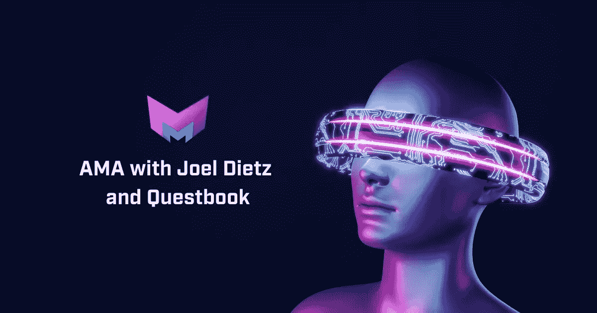
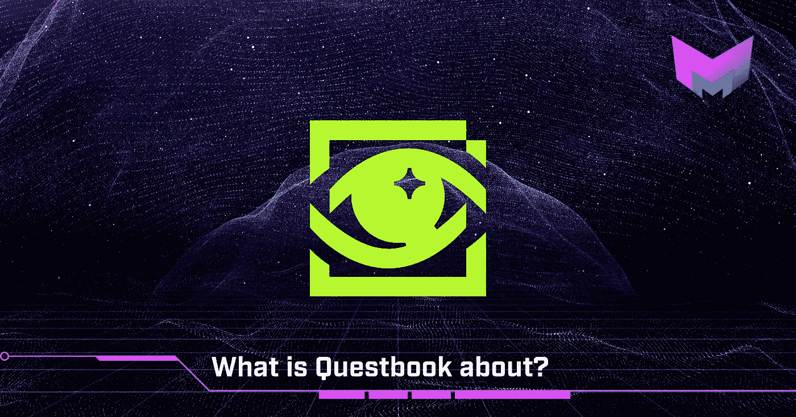
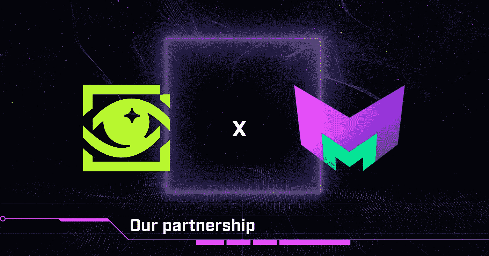
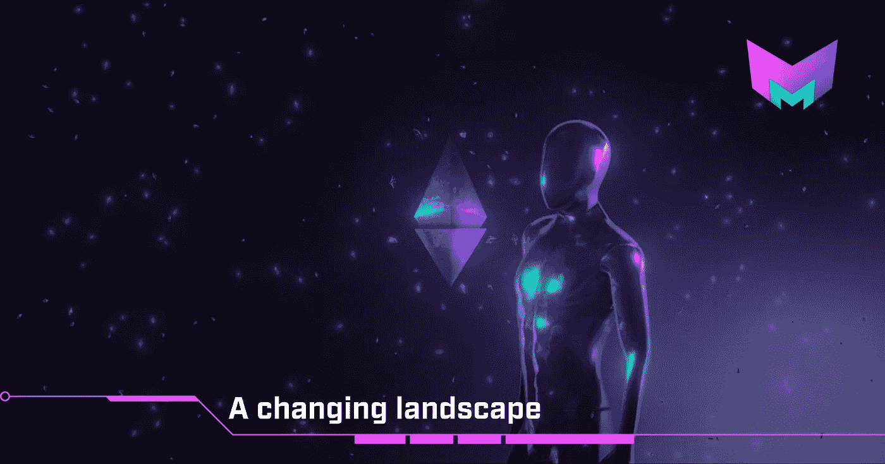
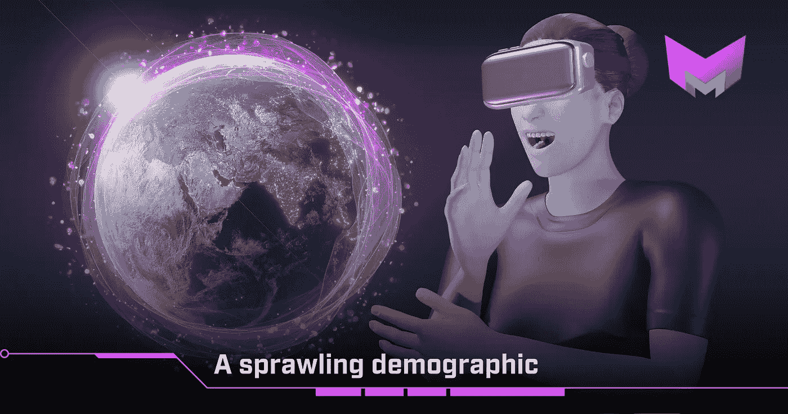
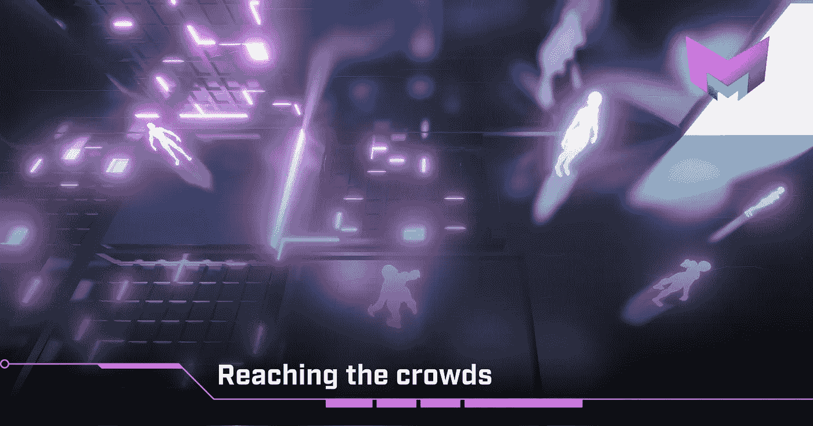
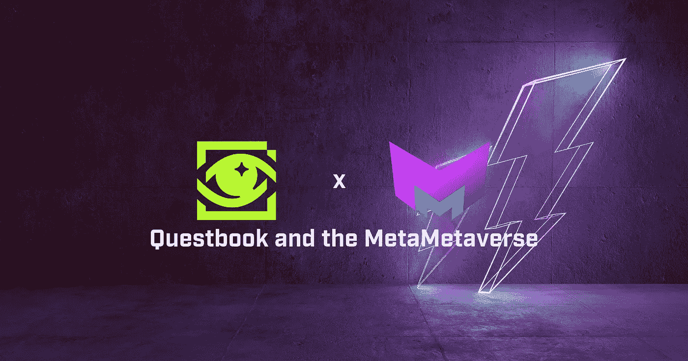

# AMA 与乔尔·迪茨和 Questbook

> 原文：<https://medium.com/coinmonks/ama-with-joel-dietz-and-questbook-1f9ce7dec6cf?source=collection_archive---------31----------------------->

MetaMetaverse 是一个创建你自己的元宇宙的平台。每个元宇宙都是一个虚拟社会，有自己的游戏、互动体验、经济和治理。这些元数据是用 metameta lang 构造的，meta meta lang 是元宇宙互操作性的第 1 层协议。

**目录**

*   Questbook 是关于什么的？
*   我们的伙伴关系
*   不断变化的风景
*   庞大的人口结构
*   接近人群
*   启动

本周早些时候，在阿姆斯特丹的区块链会议上，MetaMetaverse [的联合创始人兼首席执行官 Joel Dietz](https://twitter.com/jdietz?lang=de) 有机会采访了我们最新的合作伙伴 Questbook。创始人 [Madhavanmalolan](https://twitter.com/madhavanmalolan) 谈了一个多小时关于这种新联系的潜力以及他如何看待 web3 向前发展。

# Questbook 是关于什么的？

[Questbook](https://www.questbook.xyz/) 是一个去中心化的授权编排工具。使用分散系统，Questbook 旨在减轻拨款项目的资金过程。这应该有助于通过消除低效率来简化融资和建设周期。像今天许多前瞻性的协议一样，他们希望帮助新开发人员进入区块链领域。

他们特别关注 web3 方面的事情，特别关注 DeFi 和我们自己的部门元宇宙科技。在他们教育链成功的基础上，现在他们通过给开发者带来更大的机会来扩大机会。作为一个年轻而有前途的虚拟社会系统，元虚拟世界是进一步探索这些概念的伟大基础。

# 我们的伙伴关系

Questbook X MetaMetaverse 的合作始于对 web3 技术的共同热爱。认识到迫切需要改变对 web3 的看法，特别是在 DeFi 方面，Questbook 寻求保护所有参与者的利益。这是这两个人详细讨论过的事情。

鉴于大约有 1000 万到 2000 万新用户涌入，作为当前 [MetaMask](https://metamask.io/) 用户的估计，这些人需要认真考虑。根据 Madhavanmalolan 的说法，激励这些人进入这个空间的两种途径是游戏化和金钱激励。前者是 MetaMetaverse 的工作方式，后者连接到 Questbook。

看到这两个世界之间的潜在桥梁，Madhavanmalolan 可以看到有很大的机会邀请尽可能多的这些新人进入这个空间。当然，我们非常同意，也很高兴他们能加入我们。

# 不断变化的风景

就像乔尔自己一样，马达万马洛兰看到了一个新的黄金时代的到来。区块链和计算机科学领域的情况正在发生变化。当我们看到给 web2 和 web3 带来新鲜血液的机会时，这两位先生想成为欢迎开发者的守门人。

Joel 表示，虽然他不一定关心如何推进 web3 的目标，但他有一个非常清晰的愿景。他想创造一个史诗游戏。因此，当一只手洗另一只手的时候，他希望在实现这个目标的过程中，他可以进一步围绕 web3 基础设施展开对话。从很多方面来说，他确实觉得团队一开始就非常关注 web3，但现在问题是这仍然是他们的核心。

Madhavanmalolan 也倾向于同意这个事实。在努力实现这些崇高目标的过程中，如此坦率有时是无益的。当在传统的 web2 开发者和 web3 的新前沿之间架起桥梁时，尤其如此。它可能会令人畏惧，可能会令人不快，可能会设置不必要的障碍，而这些障碍本不应该存在。

他坚持认为，就其核心而言，web3 是经济实践的标志。加快生产高质量最终产品的过程。

Questbook 的主要用户群一直是那些跨过门槛的 web2 开发者。他们中的许多人，如果不是大多数人，可能在这个领域没有经验，但希望探索。如果你是一个年轻的专业人士，读到这里，你已经可以说迈出第一步有多难了。这就是任务书的全部内容。

# 庞大的人口结构

除了新的 web3 开发者，不难想象 Questbook 平台吸引了哪些人。他们是有远大梦想但没有多少资源的人。不是每个人都幸运地从谷歌或以太坊的办公室起步。联系，尤其是获得资金，对于一个新项目可能产生的长期影响是至关重要的。

Questbook 将这些机会带到了最前面。

从 Questbook 寻求帮助的人中有很大一部分来自印度，他们占了总用户数的 40-45%。其余的开发人员来自东南亚、尼日利亚、拉丁美洲和一些美国人。这些人往往是最容易被忽视的人，但正如我们在过去所看到的那样，他们也是最有决心做出成绩的人。

关于 Questbook 未来新成员的扩张，Madhavanmalolan 认为这次荷兰之行可能只是引入欧洲人的一个小把戏。

# 接近人群

分散项目成功的关键当然是参与。在这样一个充满活力、雄心勃勃的领域，有时很难被人注意到。到目前为止，Questbook 已经有大约 8500 名用户，其中 8200 人已经完成了七八个教程。

正如之前在演讲中提到的，Madhavanmalolan 认为新开发者进入 web3 的最好方式就是偶然发现它。偶然进入其中，让他们的好奇心带着他们。他接着说，这个领域的许多新来者将 web3 与学习可靠性混为一谈，这是有问题的。

“在我看来，在 web2 中已经是优秀开发人员的人在基础知识方面更强。他们明白，这与其说是关于语言，还不如说是语言引入的范式。”

当谈到引入更成熟和更安全的开发人员时，那些已经从大公司出来的人往往是更好的主动者。在栅栏的另一边，你也有那些刚从大学毕业，没有经验，或常春藤联盟背景的人。他们带来了同样多的东西，但方式不同。

他还坚持认为，找到最好的开发人员不一定是那些在 Questbook 上完成了最多课程的人，而是那些花时间探索各种机会的人，比如 Udemy。

GitHub 也改变了 Questbook 的游戏规则。他们看到很快他们就会将 GitHub 集成到他们的系统中。这将允许更容易地获得以前的经验和已经完成的工作。随着对 Twitter 和 Discord 等平台的如此关注，它变得错综复杂，难以跟上。一个像 GitHub 这样以开发者为中心的网站可以让一切变得不同。

# 启动

正如许多这些大创意项目一样，许多人心中的问题是，我如何开始？

目前，已经有各种各样的拨款可供争夺。许多获得这些资助的人对自己的技能缺乏信心，不愿意开始。Questbook 的建议是无论如何都要尝试一下这个提议。首先，简单地充实你的想法本身就是一个学习过程。其次，他认为一个写得好的提议总是会得到一个写得好的回应，即使它不是一个参与的邀请。这种反馈可能是无价的。

所以长话短说，如果你觉得你有一个值得分享的想法，你永远不会空手而归。

# 任务书和超时空宇宙

作为一个专注于游戏的 web3 平台，MetaMetaverse 看到了像 Questbook 这样的平台的增长和探索潜力。Questbook 同样看到，在区块链技术的这个新领域，还有很多可以进一步开发的地方。这是一个自然的决定，在两个项目之间形成一个强大的，有希望持久的关系。

区块链项目的首要目标通常是大规模采用。我们的项目和 Questbook 将这个目标推向了新的高度。我们希望看到许多新的和令人兴奋的开发者带着热情和激情进入元虚拟世界，这可能会进一步引起我们对整个空间的真正潜力的质疑。

请务必在我们的[推特](https://twitter.com/m2verse)、[脸书](https://www.facebook.com/meta2verse/)、 [Instagram](https://www.instagram.com/m2verse/) 、[抖音](https://www.tiktok.com/@m2verse)、[不和](https://discord.gg/TzTpmmSGXG)、[电报](https://t.me/metametaversechat)和[媒体](/@metametaverse)平台上关注我们，或者尽快查看我们的[网站](https://www.metametaverse.io/)以了解更多关于虚拟世界的信息！

查看 Questbook 的社交网站:

[Twitter](https://twitter.com/questbookapp)|[Discord](https://discord.gg/2WgXccCkdt)|[insta gram](https://www.instagram.com/questbookapp/)|[Medium](https://medium.com/questbook)|[quest book 网站](http://questbook.xyz/)

> 加入 Coinmonks [电报频道](https://t.me/coincodecap)和 [Youtube 频道](https://www.youtube.com/c/coinmonks/videos)了解加密交易和投资

# 另外，阅读

*   [SmithBot 评论](https://coincodecap.com/smithbot-review) | [4 款最佳免费开源交易机器人](https://coincodecap.com/free-open-source-trading-bots)
*   [杠杆令牌](/coinmonks/leveraged-token-3f5257808b22) | [最佳密码交易所](/coinmonks/crypto-exchange-dd2f9d6f3769) | [Paxful 点评](/coinmonks/paxful-review-4daf2354ab70)
*   [加密套利](/coinmonks/crypto-arbitrage-guide-how-to-make-money-as-a-beginner-62bfe5c868f6)指南| [如何做空比特币](/coinmonks/how-to-short-bitcoin-568a2d0b4ae5)
*   [币安期货交易](https://coincodecap.com/binance-futures-trading)|[3 commas vs Mudrex vs eToro](https://coincodecap.com/mudrex-3commas-etoro)
*   [如何购买 Monero](https://coincodecap.com/buy-monero) | [IDEX 评论](https://coincodecap.com/idex-review) | [BitKan 交易机器人](https://coincodecap.com/bitkan-trading-bot)