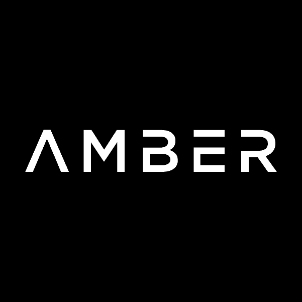

# 琥珀集团投资组合细分

> 原文：<https://medium.com/coinmonks/amber-group-portfolio-breakdown-39181e138e83?source=collection_archive---------21----------------------->

# **概要**

我最近和一位在琥珀集团工作的风险投资家聊过。他的名字叫奥斯汀·穆尼奥斯，是一个非常聪明的人，他对数字资产经济和琥珀集团的发展方向有一些很棒的观点。在这篇博文中，我们将详细介绍 Amber Group，这是一家位于新加坡的领先的全球加密风险投资公司。该公司提供世界一流的技术基础设施和研究能力，帮助机构客户管理数字资产，如加密做市、交易、赚取收益、管理风险和提供流动性，为各种规模的客户创造财富。该公司由琥珀集团联合创始人兼首席执行官吴荣国于 2017 年创立。在这篇博文中，我们将回顾一些关于 Amber Group 的最新消息，该公司已经进行的一些投资，以及哪些公司向该公司注入了资金。

# **关于琥珀集团的最新消息**

*   **新加坡加密公司 Amber Group 在淡马锡牵头的融资轮中估值达到 30 亿美元**

Amber Group 在新加坡国有投资公司淡马锡(Temasek)牵头的一轮融资中筹集了 2 亿美元，将这家加密货币金融服务公司的估值提高到 30 亿美元。根据该公司最近发布的一份声明，其他投资者包括现有股东红杉中国、老虎环球管理公司(Tiger Global Management)，以及潘迪拉资本，后者是一家加密对冲基金，由老虎环球管理公司的一名前高管创立。

*   **Amber Group 宣布将于 2022 年第三季度推出 Openverse，这是通往元宇宙的门户**

Openverse 是通往元宇宙的门户，为 Web2 创造者、品牌和企业提供工具和服务，以过渡到 Web3。Openverse 旨在成为一个 Web3 支持平台，由领先的实时 3D 渲染技术支持，为所有用户创建一个体验性的数字世界。

这将包括琥珀集团在建设元宇宙的竞赛中与索尼，facebook 等公司竞争。这太棒了，因为元宇宙预计到 2030 年将成为一个万亿美元的市场。

# 投资

琥珀集团已经进行了 18 项投资。他们最近一次投资是在 2022 年 5 月 18 日，当时 Pine Protocol 筹集了 150 万美元

*   **长期投资**

investments made over time

*   **该组织在哪些行业的投资最为活跃**

industries by number of investments

琥珀集团已经投资了几个组织，这里是他们筹集资金最多的三个投资(有些不是琥珀集团的主要投资)。

*   **1 英寸**

分散式交易所聚合器 1inch Network 已经完成了一轮规模可观的 B 轮投资，筹集了 1.75 亿美元，这是扩大协议效用和增加分散式金融(DeFi)市场流动性的更广泛努力的一部分。1inch (1INCH)是一个以太币令牌，支持 1inch，这是一个分散的交易所，旨在“通过发现所有领先指数中最有效的交换路线来提供最佳利率。”像 1inch 这样的分散式交易所(又名 DEXes)使用户能够在没有中介的情况下交易代币。

*   **接近协议**

利益证明(PoS)网络 sharded Near 区块链协议背后的团队在最近由三箭资本(Three-Arrows Capital)牵头的一轮融资中筹集了 1.5 亿美元的资本。根据资助公告，Mechanism Capital、蜻蜓资本、a16z、Jump、Alameda、Zee Prime、Folius、Amber Group、6th Man Ventures、Circle Ventures 和 Metaweb.vc 也参与了。琥珀集团不是近区块链协议的主要投资者。NEAR Protocol 是一个分散应用程序(dApp)平台，也是以太坊的竞争对手，专注于开发人员和用户友好性。它的本地 Near 令牌用于支付交易费用和 NEAR 加密平台上的存储。

*   **米娜**

周四，零知识证明向前迈出了一步，价值 9200 万美元的代币销售加速了 Mina 协议的采用。

这轮融资由 FTX 风投和三箭资本(Three Arrows Capital)领投，这是 FTX 风投对一个零知识项目的首次投资。其他参与者包括 Blockchain.com、阿伦·霍华德、琥珀集团、Brevan Howard、Circle Ventures、Finality Capital Partners 和潘迪拉。Mina 协议的原生加密货币 MINA，用于方便网络交易，并在用户之间分配费用。

# **融资轮次**

Amber Group 在 3 轮融资中总共筹集了 3.28 亿美元。他们最新的资金是在 2022 年 2 月 21 日从 B 轮融资中筹集的。

*   **哪种融资类型筹集的资金最多？**

funding types by money raised

*   **这个组织已经筹集了多少资金？**

cumulative funding raised over time

# 投资者

琥珀集团由 24 个投资者出资。淡马锡控股和 Tru Arrow Partners 是最近的投资者。

**哪些投资人参与的融资轮次最多？**

most active investors

这是琥珀集团的四个主要投资者

*   **潘迪拉资本**

潘迪拉资本是一家专注于加密货币的美国对冲基金。按 AUM 的说法，它是世界上最大的加密对冲基金。该公司由丹·莫尔黑德于 2003 年创立。2013 年，它在美国推出了首只专注于比特币的投资基金。

*   **范式**

Paradigm 是一家位于旧金山的专注于加密的投资公司。它投资于从创意形成到成熟的最早阶段的加密资产和业务。

*   **中华复兴**

华兴资本是一家中国金融机构。华兴资本由樊宝于 2005 年创立，当时是一家金融咨询公司，目前的核心业务包括投资银行、投资管理和财富管理。

*   **淡马锡控股**

淡马锡控股有限公司，简称淡马锡，是新加坡政府拥有的新加坡国有控股公司。淡马锡成立于 1974 年 6 月 25 日，截至 2021 年，其拥有和管理的净投资组合为 4050 亿新元，其中 390 亿新元被剥离，490 亿新元被投资。

# 琥珀集团:通向加密金融的大门

# 结论

据媒体报道，琥珀集团据说正在考虑明年在美国进行首次公开募股。该公司由一群来自摩根士丹利的量化交易员于 2017 年成立。它最近将总部从香港搬到了新加坡，许多人认为新加坡对加密更友好，因为这个东南亚国家在 2020 年初推出了允许交易所申请运营牌照的规定。随着加密行业的不断发展，琥珀集团将继续努力在顶级风险投资公司中树立自己的声誉。

希望你有一个精彩的阅读。来源由 crunchbase 提供。