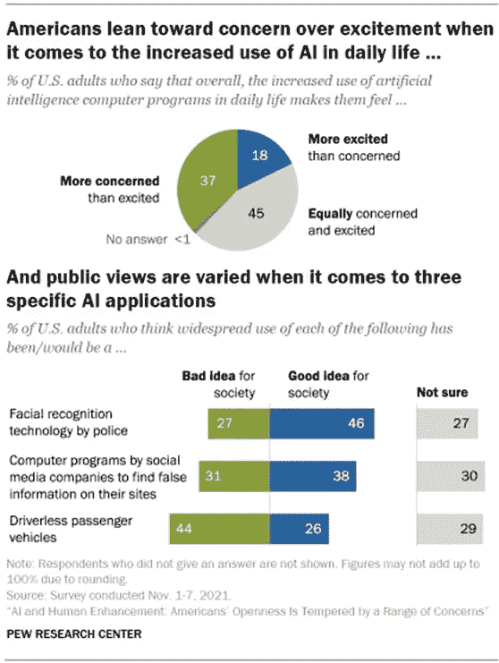
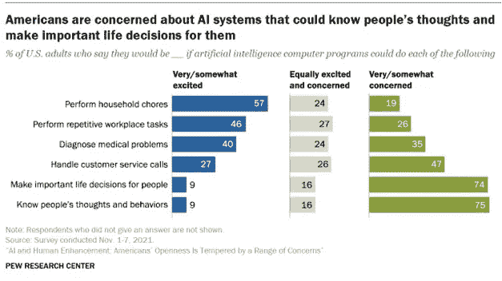

# 美国人对人工智能扩散的态度| 2022 研究

> 原文：<https://medium.com/coinmonks/american-attitudes-toward-the-proliferation-of-ai-2022-study-e34300b2ba82?source=collection_archive---------39----------------------->

人工智能是试图在人工智能系统中模拟人类推理的新兴技术之一。约翰·麦卡锡在 1950 年发明了人工智能这个术语。他说，'**学习的每一个方面或智力的任何其他特征原则上都可以被精确地描述，以至于可以制造一台机器来模拟它。人们将试图发现如何让机器使用语言，形成抽象概念，解决现在留给人类的各种问题，并改进它们自己。**'

# 1.美国在人工智能方面领先，但中国正在缩小差距

根据信息技术和创新基金会的一项新研究，美国在人工智能技术(ITIF)的开发和实施方面保持着对中国和欧盟的早期领先优势。根据分析，尽管美国仍有显著优势，但中国已准备好缩小差距，而欧盟基本上未能跟上。

"[谁在赢得人工智能竞赛:中国、欧盟还是美国？](https://www2.datainnovation.org/2021-china-eu-us-ai.pdf)“2021 年 1 月报告问。自 2019 年以来，ITIF 的数据创新中心发布了一份报告，使用六个类别的 30 个指标分析了三个地区的人工智能能力，包括人才，研究，开发，硬件，采用和数据，ITIF 的研究人员 Daniel Castro 和 Michael McLaughlin 比较了三个地区的表现。

# 2.人工智能在今天有什么好处

AI 是一个大多数人都不熟悉的概念。2017 年，当美国 1500 名高级商业领袖被问及人工智能时，只有 17%的人表示他们熟悉这个概念。他们中的一些人不知道这是什么，也不知道这将如何影响他们的业务。许多人看到了改变业务流程的巨大潜力，但他们不确定如何在自己的公司内实施人工智能。

人工智能是一项正在彻底改变生活方方面面的技术，尽管人们对它还不太熟悉。这是一个多功能的工具，允许人们重新思考他们如何整合数据，评估数据，并利用这些见解做出更好的决策。我们这次彻底审查的目标是向政策制定者、意见领袖和感兴趣的观察家解释人工智能，以及展示人工智能如何改变世界并给社会、经济和治理带来重大挑战。

# 3.美国如何监管人工智能

2021 年，至少有 17 个州出台了通用人工智能法律或决议，阿拉巴马州、科罗拉多州、伊利诺伊州和密西西比州成为第一个通过这些法律或决议的州。

2021 年通过的立法有双重目的，即解决日益增长的人工智能问题。它负责弄清楚美国应该如何管理这项技术，以及研究和开发人工智能。国家人工智能研究资源任务组(NAIRRTF)的成立是为了监测人工智能对美国人的影响。虽然人工智能有其优势，但它也有缺点，例如令人毛骨悚然的面部识别技术，它会跟随个人到任何地方。根据国家人工智能倡议办公室的说法，NAIRRTF 将处理与人工智能相关的“隐私、公民权利和公民自由”问题。

# 4.人工智能将如何影响美国人民的未来

人工智能(AI)正在进入一些社会最重要的行业，从医疗保健和法律服务到农业和交通运输。目睹其扩散，美国人在某些方面感到担忧，在另一些方面感到兴奋。

总的来说，更大比例的美国人表示，他们对人工智能在日常生活中的使用越来越多“更担心，而不是兴奋”，而不是相反。近一半的美国受访者(45%)表示，他们对这种情况既担忧又兴奋。当被问及人工智能最让他们担心的是什么时，那些更担心而不是兴奋的人提到了潜在的失业、隐私问题以及人工智能的崛起可能会超越人类的才能——而其他人则认为这将导致人类联系的丧失、被滥用或过度依赖它。

另一方面，其他人“更兴奋而不是担心”，列举了他们希望看到的社会效益，人工智能可能给日常生活带来的时间节省和效率，以及人工智能系统在工作中可能有所帮助和更安全的方式。对于三种特定的人工智能应用对整个社会是有益还是有害，人们存在分歧。

这一章讨论了关于人工智能项目的总体调查结果。它还强调了对公众对三个人工智能相关应用的看法的深入研究的关键发现，这些将在接下来的三章中详细介绍。一些重要发现包括:

警察使用面部识别:
我们选择调查警察使用面部识别，因为警察改革一直是讨论的热点问题，特别是在 2020 年 5 月乔治·弗洛伊德被谋杀以及随之而来的抗议活动之后。根据民意调查，大多数人(46%)认为警察使用这项技术对社会来说是一个好主意，而 27%的人认为这是一个可怕的想法，27%的人不确定。与此同时，57%的人认为，如果警方更广泛地使用面部识别，犯罪率将保持不变，而 33%的人认为犯罪率将下降，8%的人认为犯罪率将上升。

此外，对于面部识别技术的广泛使用可能会如何影响警务公平，人们的意见不一。大多数受访者认为，警方广泛使用这一技术将导致更多的失踪人员被发现，犯罪得到更迅速和有效的解决。尽管如此，大约三分之二的人认为，当局能够随时跟踪每个人的位置，黑人和西班牙裔社区将比其他社区受到更频繁的监控。

关于人工智能应用如何发展的一些观点褒贬不一:一些人更加热情，而另一些人则更加关注。
除了关于个人对人工智能的普遍兴奋或焦虑的广泛问题之外，这项调查还质疑了人工智能项目中一些更具体的假设进展。

公众对调查中包括的六种不同类型的人工智能应用的看法极其不同。有些引起更多的兴奋而不是关注，而另一些引起重大关注。例如，57%的人表示，他们会对可以做家务的人工智能应用感到非常或有点满意，但只有 9%的人对人工智能做出关键的生活决策或了解人们的想法和习惯感到满意。

近一半的受访者(46%)对能够处理重复性工作任务的人工智能非常或有点兴奋，相比之下，26%的人非常或有点害怕。当谈到可以诊断医疗问题的人工智能时，人们的分布更加均匀:40%的人至少有些兴奋，35%的人至少有些担心，24%的人同样兴奋和担心。当人们被问及人工智能(AI)可以处理客户服务电话时，47%的人非常或有点担心，相比之下，27%的人至少有点兴奋。

值得注意的是，当谈到这些问题时，大多数美国人表示，他们对各种人工智能突破既兴奋又担忧。根据未来的发展，这一比例可能在 16%至 27%之间。

*原载于 2022 年 05 月 07 日 https://wobelpost.com***

> *加入 Coinmonks [电报频道](https://t.me/coincodecap)和 [Youtube 频道](https://www.youtube.com/c/coinmonks/videos)了解加密交易和投资*

# *另外，阅读*

*   *[Bookmap 评论](https://coincodecap.com/bookmap-review-2021-best-trading-software) | [美国 5 大最佳加密交易所](https://coincodecap.com/crypto-exchange-usa)*
*   *最佳加密[硬件钱包](/coinmonks/hardware-wallets-dfa1211730c6) | [Bitbns 评论](/coinmonks/bitbns-review-38256a07e161)*
*   *[新加坡十大最佳密码交易所](https://coincodecap.com/crypto-exchange-in-singapore) | [收购 AXS](https://coincodecap.com/buy-axs-token)*
*   *[红狗赌场评论](https://coincodecap.com/red-dog-casino-review) | [Swyftx 评论](https://coincodecap.com/swyftx-review) | [CoinGate 评论](https://coincodecap.com/coingate-review)*
*   *[投资印度的最佳加密软件](https://coincodecap.com/best-crypto-to-invest-in-india-in-2021)|[WazirX P2P](https://coincodecap.com/wazirx-p2p)|[Hi Dollar Review](https://coincodecap.com/hi-dollar-review)*
*   *[加拿大最好的加密交易机器人](https://coincodecap.com/5-best-crypto-trading-bots-in-canada) | [库币评论](https://coincodecap.com/kucoin-review)*