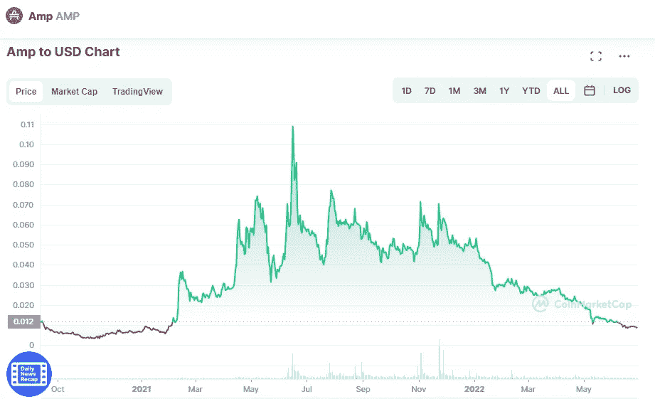

# 未来 5 年的价格预测

> 原文：<https://medium.com/coinmonks/amp-amp-price-prediction-in-the-next-5-years-fe5467834047?source=collection_archive---------17----------------------->

Source photo [Amp price today, AMP to USD live, marketcap and chart | CoinMarketCap](https://coinmarketcap.com/currencies/amp/)

# AMP 是什么？

AMP 硬币是 Flexa 公司在区块链以太坊生产的一种 ERC-20 代币。它旨在实现快速加密货币交易，并扩大数字资产的接受度和使用案例。Flexa 团队设计了一个开源和以商家为中心的支付系统，该系统被委托允许快速加密货币支付。