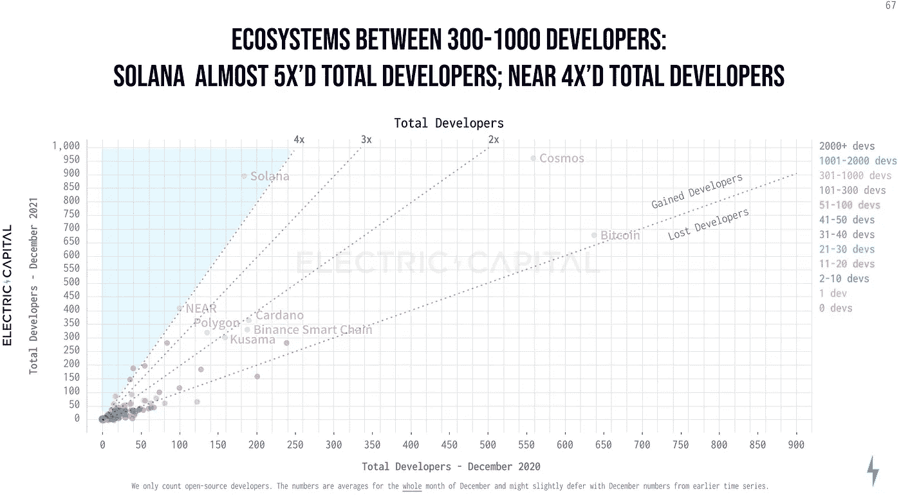
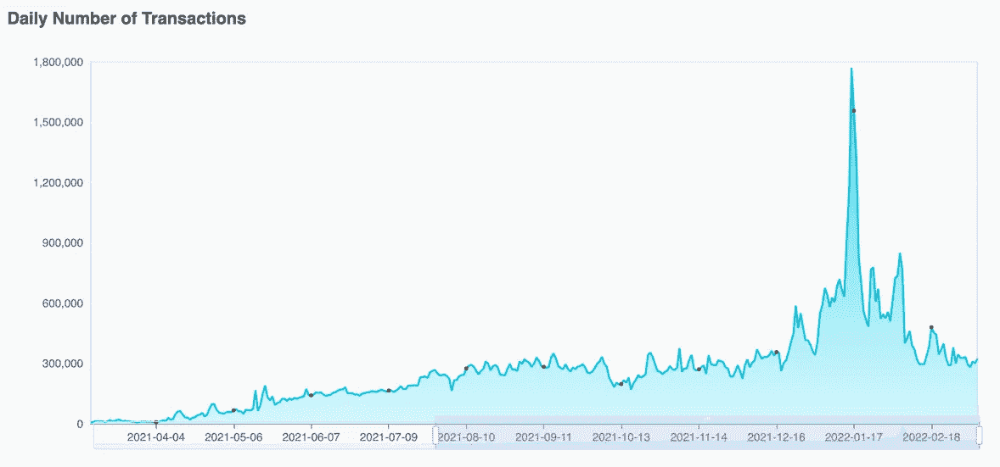
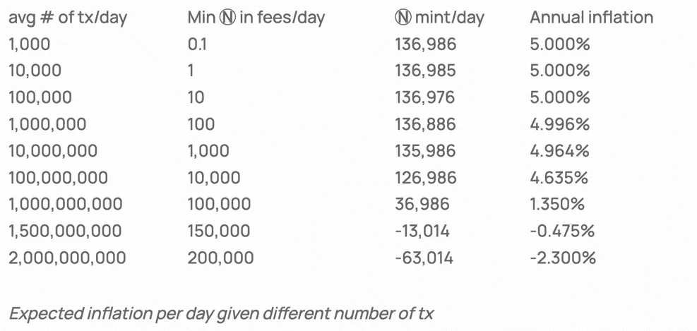

# 《近议定书》分析——一个天花板很高的新兴 L1

> 原文：<https://medium.com/coinmonks/an-analysis-of-near-protocol-an-emerging-l1-with-a-high-ceiling-9631cc518ecb?source=collection_archive---------12----------------------->

**关键要点:**

*   Near Protocol 是一种支持智能合约的第 1 层区块链，它使用一种**分片**的利益证明(PoS)机制，每秒钟可以处理多达 1000 笔交易。分片将区块链分成更小的片段，降低了运行一个节点所需的计算能力。
*   Near 在 2021 年见证了大量开发人员涌入其网络，在开发人员增长率方面超过了除 Solana 之外的所有第 1 层，增长率为 4 倍。
*   Near 拥有最有才华的加密团队之一，由曾在一些世界顶级公司工作过的工程师组成。
*   近令牌具有实体令牌组学。主要功能包括燃烧所有与非智能合约相关的交易费用，向智能合约开发者收取 30%的交易费用回扣，以及所有用户和智能合约所需的存储费用，随着交易活动的增加，智能合约将继续使令牌退出流通。
*   Near 目前面临着激烈的竞争和停滞不前的用户群指标等问题。此外，NEAR token 仅在少数交易所可用，尤其限制了对美国买家的可用性。

## **概述**

可伸缩性最近已经成为密码学中的主导概念之一。在区块链的上下文中,“可伸缩”意味着有能力处理越来越多的交易，同时保持合理的交易速度和成本。例如，以太坊正变得越来越拥堵，迫使用户不得不应对高昂的煤气费和缓慢的交易。

Near 协议使用**分片以一种独特的方式解决了可伸缩性问题。**分片将区块链分成更小的单个片段，称为“分片”这降低了在网络上运行节点所需的计算能力，因为每个节点只需运行属于其单独碎片的代码，而不是整个区块链的代码。因此，Near 协议的区块链具有极高的事务吞吐量。2021 年 12 月，Near 将其网络从一个碎片扩展到四个，没有任何网络宕机。

Near Protocol 还支持智能合约，并支持使用任何可以编译成 WebAssembly 的语言进行开发，包括 Rust、Java、Go、Python 等等。支持多种语言自然会增加能够在网络上构建的开发人员的数量。

## **核心关键绩效指标**

*   已上线的项目:有 359 个应用和服务集成到 Near 生态系统中，其中一些包括 Chainlink、Mintbase、Moonpay 和 The Graph。
*   开发者心智份额/增长:Near 生态系统中应用和服务的总市值为 67 亿美元，使其成为 crypto 中第 22 大最有价值的生态系统。2021 年，Near 网络上的开发者总数增长了 4 倍。在第一层中，这个增长率超过了除索拉纳之外的所有人。显然，Near 对开发者友好的努力正在奏效。

Source: [https://medium.com/electric-capital/electric-capital-developer-report-2021-f37874efea6d](/electric-capital/electric-capital-developer-report-2021-f37874efea6d)

*   交易量:尽管在 2021 年的大部分时间里稳步增长，但 Near 上的日交易量开始趋于平稳，该网络目前平均每天交易 30 万笔。请注意，2022 年 1 月中旬的飙升可能是 1 月 14 日宣布 Near 从三箭资本(Three Arrows Capital)和安德森·霍洛维茨(Andreessen Horowitz)融资 1.5 亿美元的结果。

Source: [https://explorer.near.org/stats](https://explorer.near.org/stats)

*   TVL:目前约有 39.1%的近供应量被押注，押注者的年回报率约为 10.8%。

*来源:*[*【https://www.stakingrewards.com/cryptoassets/】*](https://www.stakingrewards.com/cryptoassets/)

## **兼容性**

Near 与以太坊虚拟机(EVM)兼容，这意味着以太坊智能合约可以部署到 Near 区块链上。为了实现这一点，Near 使用了 Aurora 引擎，这是一个部署在 Near 上的侧链，用于连接以太坊。“侧链”是一个不在以太坊上结算交易但仍然兼容以太坊的网络。通过部署在 Near 上，Aurora 利用了用户在 Near 网络的其余部分上享有的同样高的事务吞吐量。一般来说，这很重要，因为它允许 Near 将用户从以太坊转移到它的网络上。

## **$接近记号组学**

**效用:**NEAR token 用于保障网络安全，支付交易和存储费用，在原生应用上转移价值，并对价值进行记账。

*   在附近下注以确保网络安全的验证者被奖励以附近令牌。验证者奖励占每年近供总量的 4.5%。
*   NEAR 令牌也用于支付网络交易费用。**交易费用全部烧掉**。这意味着随着网络上事务活动的增加，验证器将被激励运行节点，因为它们的产出会更高。这个 burn 规则的唯一例外是涉及智能合约的交易。**开发者从他们的应用/服务产生的交易费中赚取 30%的费用**，这是对网络上持续开发的强大激励。
*   为了使用近距离网络，用户和智能合约所有者都需要为他们的数据存储付费。这些款项都是在附近支付的。你需要的存储空间越多，你支付的费用就越多。这意味着**网络上活动的增加将导致更多的 NEAR 从流通中移除**，因为存储的令牌不能用于其他目的。
*   NEAR 用于跨近本机应用程序和帐户转移价值。
*   应用程序可以使用 NEAR 作为其服务的价值单位。

**令牌膨胀/收缩:**在推出时，Near 网络始于 1B NEAR 令牌。象征性的通货膨胀固定在每年 5%，尽管实际上，通货膨胀将是 **5%减去每年烧掉的交易费的百分比。**这意味着在网络上有足够的交易量的情况下，NEAR token 可以成为通货紧缩。Near 的团队预测，在网络平均每天处理 15 亿笔交易之前，这种情况不会发生。它目前每天处理大约 300k。

Source: [https://near.org/blog/near-protocol-economics/](https://near.org/blog/near-protocol-economics/). Ⓝ = $NEAR Token

## **团队背景**

Near Protocol 于 2018 年 8 月由伊利亚·波洛苏欣(Illia Polosukhin)和亚历山大·斯基丹诺夫(Alexander Skidanov)创立。Skidanov 之前在微软和 MemSQL 担任软件开发人员，而 Polosukhin 来自谷歌的工程职位。尼尔的团队才华横溢。该团队目前由 126 名成员组成，工程师来自世界上一些最著名的公司，包括谷歌、脸书和微软。他们中的两位成员都曾两次赢得国际大学生编程竞赛，这一壮举只有另外 7 个人完成过。

## **竞争格局**

Near 协议在每秒最大事务数、平均事务成本、阻塞时间和令牌堆栈产出方面超过了许多其他第一层协议。然而，除了它只是比其他公司做得更好这一事实之外，没有什么能让它从竞争对手中脱颖而出。

## **路线图**

*   Near 的一些未来计划包括增加验证器的数量和创建更多的碎片。
*   $NEAR token，“从长远来看，旨在成为个人以及合同和分散金融(DeFi)应用程序使用的单位。”

*来源:*[*https://near.org/blog/near-protocol-economics/*](https://near.org/blog/near-protocol-economics/)

## **投资论文**

Near 协议最吸引人的部分是它在分片中成功地使用了这种高度可扩展的区块链基础设施。然而，除了旨在成为最具伸缩性的区块链，Near 还开发了旨在用户友好的特性。该网络的一些独特功能包括易于阅读的帐户名，而不仅仅是钱包地址(像以太坊上的 [ENS](https://ens.domains/) )，以及用户在没有钱包的情况下与 dApps 互动的能力。

从开发者的角度来看，Near 是一个吸引人的平台，从用户的角度来看，Near 提供了一组易于理解和使用的特性。Near 的团队也非常有才华。就个人而言，我喜欢押注于伟大的团队，尤其是那些以用户和开发者为中心的团队。虽然 Near 勾选了这些框，但该协议并不是没有问题。

## **风险/顾虑**

*   最低代币可用性:目前$NEAR 代币没有在任何美国交易所交易，这可能导致 NEAR 错过了国内买家的大市场。
*   开发人员/用户流失到以太坊:尽管 Aurora 引擎成功地从以太坊吸引了用户，但也有可能将用户流失到以太坊。如果没有适当的激励来继续在 Near 上构建，那么机会主义的开发者没有理由不将他们的项目转移到世界上最大的智能合约平台上。
*   用户基数指标放缓:Near 的交易量和活跃账户似乎都处于平稳状态，尽管人们可能会将这些问题归咎于当前的加密“熊市”
*   竞争:有数百家 L1，它们都在争夺大致相同的市场份额。尽管 Near 从根本上来说是一个比许多公司更好的区块链，但该团队将不得不开始寻找更好的方法来吸引更多的用户。

## **最后的想法**

尽管用户活动指标落后，竞争激烈，但 Near 拥有一支最聪明的团队，打造出市场上最强的产品之一。作为投资者，押注于这些优势可能是一种谨慎的长期策略。

> 加入 Coinmonks [电报频道](https://t.me/coincodecap)和 [Youtube 频道](https://www.youtube.com/c/coinmonks/videos)了解加密交易和投资

# 另外，阅读

*   [OKEx vs KuCoin](https://coincodecap.com/okex-kucoin) | [摄氏替代品](https://coincodecap.com/celsius-alternatives) | [如何购买 VeChain](https://coincodecap.com/buy-vechain)
*   [ProfitFarmers 点评](https://coincodecap.com/profitfarmers-review) | [如何使用 Cornix Trading Bot](https://coincodecap.com/cornix-trading-bot)
*   [如何匿名购买比特币](https://coincodecap.com/buy-bitcoin-anonymously) | [比特币现金钱包](https://coincodecap.com/bitcoin-cash-wallets)
*   [瓦济里克斯 NFT 评论](https://coincodecap.com/wazirx-nft-review) | [比茨盖普 vs 皮奥克斯](https://coincodecap.com/bitsgap-vs-pionex) | [坦吉姆评论](https://coincodecap.com/tangem-wallet-review)
*   [如何使用 Solidity 在以太坊上创建 DApp？](https://coincodecap.com/create-a-dapp-on-ethereum-using-solidity)