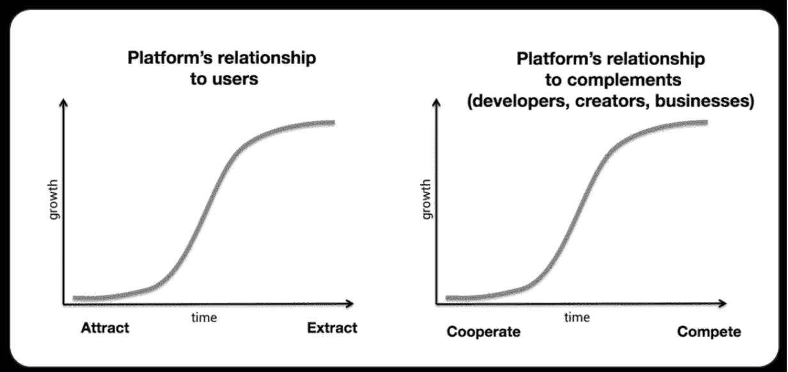

# 独裁者的效率——网络 3 与速度

> 原文：<https://medium.com/coinmonks/an-autocrats-efficiency-16de1c3fbb65?source=collection_archive---------17----------------------->

在分析区块链技术时，批评家们经常提到协议开发的缓慢。[莫邪写道](https://moxie.org/2022/01/07/web3-first-impressions.html):

> **协议比平台移动得慢得多。**30 多年后，电子邮件仍未加密；与此同时，WhatsApp 在一年内从未加密变成了完整的 e2ee。

都是真的。然而，在这个例子中，你被引导去相信不惜一切代价的速度是一个净正数。但是我会用一个经典的例子来打击你——缓慢不是区块链的缺陷，而是它的一个特征。在这种情况下，这是一个不可避免的特征，源于 web3 承诺的基础:民主化。就像在民主国家一样，立法进展缓慢。我会让[阿巴里解释](https://www.nytimes.com/2018/07/17/world/africa/obama-speech-south-africa-transcript.html):

> ……是的，民主可能是混乱的，可能是缓慢的，可能是令人沮丧的。我知道，我保证。但是独裁者提供的效率是一个虚假的承诺。不要采取这种方式，因为它总是导致上层财富和上层权力的进一步巩固，而且它更容易掩盖腐败和滥用权力。

*当然*民主比独裁发展得更慢，但是你不能挑选例外——你不能将民主的潜在僵局与仁慈的*最佳*情形独裁相比较，即正义的(而不是更常见的自以为是的)首席执行官。你必须比较苹果和苹果——期望值，所有结果的平均值。你还必须考虑假设的独裁者的发言权。它不应该只是将未加密的电子邮件与 WhatsApp 中的 e2ee 进行比较，还应该与关闭其第三方 API(OG rug pull)的 Twitter [进行比较——这是另一个快速实现的自上而下的功能。](https://www.theverge.com/2012/8/23/3263481/twitter-api-third-party-developers)

独裁政权不仅能让人民迅速脱离贫困，还能高效地建立集中营。

问题是——你想要独裁的便利吗？独裁目前可能是仁慈的，但你不能永远信任它。相反，对你的仁慈是*而不是*一个平台的长期最佳利益。这是一个简单的逻辑——当平台需要你来建立他们的诚信，并且你们的利益一致时，可能会有善举(脸书 2004-2011 英语)；一旦他们变得占主导地位，为什么他们会通过*而不是*榨取你所有的价值来妥协他们的利润(脸书 2012 —)？我们应该*期待*在资本主义市场。

Chris Dixon 对平台开发的[解释](https://future.a16z.com/why-web3-matters/)完美地阐明了这一点:“当(平台)到达 S 曲线的顶端时，它们与网络参与者的关系从正和变为零和。要继续增长，需要从用户那里获取数据，并与(以前的)合作伙伴竞争。”

Reproduced from [Chris Dixon’s piece](https://future.a16z.com/why-web3-matters/)

我的朋友彭江雨说得好:“你永远不会得到你应得的；只有你有谈判的筹码。”在独裁统治下，你的影响力会很快枯竭。

建立共识需要时间和精力，而且会影响速度。但这是最公平的。如果这意味着区块链不适合每一个应用或用例，这是公平的。当互联网出现时，它革新了技术，但数字化并不能解决所有问题。专注于它不适用的地方，而不是它可能具有革命性的地方，是只见树木不见森林。

有时需要速度和自上而下的领导。我同意 Ben Thompson 的观点— [最有可能的结果是 crypto 在已经存在的基础上提供了一个有用的层，而不是取代它。](https://stratechery.com/2022/opensea-raises-money-bans-nfts-openseas-value-cryptos-aggregators/)简单地说，去中心化是一种工具——它不需要被硬塞到每个应用程序中，就像锤子不能和螺丝一起使用一样。

但是我们不要批评这个工具缺少了它从来没有想过的特性。

…或者你是法西斯分子？！

> *加入 Coinmonks* [*电报频道*](https://t.me/coincodecap) *和* [*Youtube 频道*](https://www.youtube.com/c/coinmonks/videos) *了解加密交易和投资*

# 另外，阅读

*   [有哪些交易信号？](https://coincodecap.com/trading-signal) | [Bitstamp vs 比特币基地](https://coincodecap.com/bitstamp-coinbase) | [买索拉纳](https://coincodecap.com/buy-solana)
*   [ProfitFarmers 回顾](https://coincodecap.com/profitfarmers-review) | [如何使用 Cornix 交易机器人](https://coincodecap.com/cornix-trading-bot)
*   [十大最佳加密货币博客](https://coincodecap.com/best-cryptocurrency-blogs) | [YouHodler 评论](https://coincodecap.com/youhodler-review)
*   [my constant Review](https://coincodecap.com/myconstant-review)|[8 款最佳摇摆交易机器人](https://coincodecap.com/best-swing-trading-bots)
*   [MXC 交易所评论](/coinmonks/mxc-exchange-review-3af0ec1cba8c) | [Pionex vs 币安](https://coincodecap.com/pionex-vs-binance) | [Pionex 套利机器人](https://coincodecap.com/pionex-arbitrage-bot)
*   [我的密码交易经验](/coinmonks/my-experience-with-crypto-copy-trading-d6feb2ce3ac5) | [《比特币基地评论》](/coinmonks/coinbase-review-6ef4e0f56064)