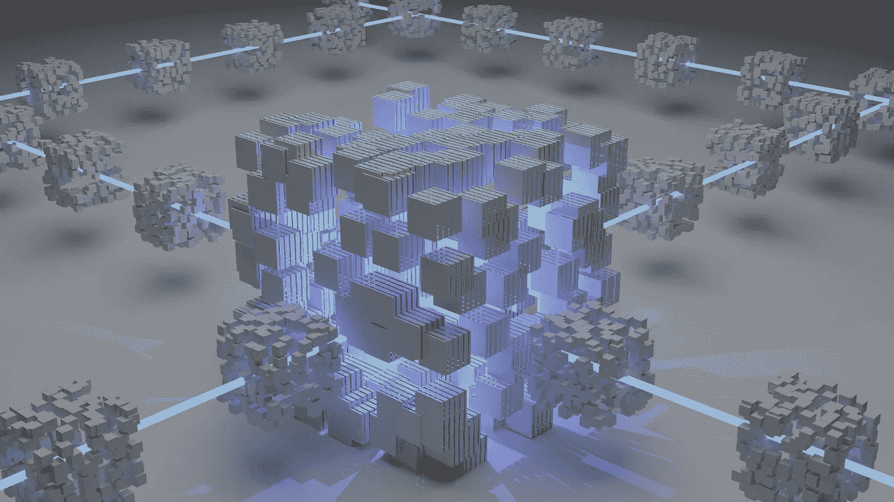
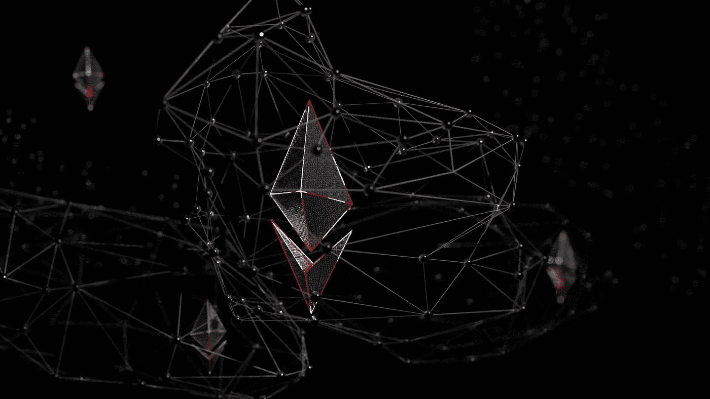
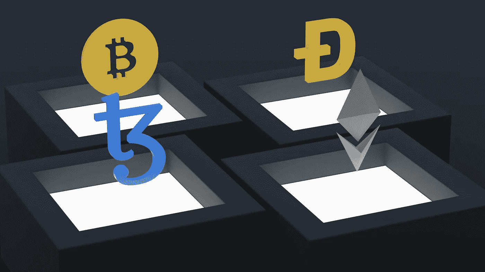

# 自主商业模式？遇见刀！

> 原文：<https://medium.com/coinmonks/an-autonomous-business-model-meet-the-dao-1a9cc32cbd62?source=collection_archive---------39----------------------->

“道”是一个简单的术语，它使许多人对广泛的大惊小怪和区块链谈论感到困惑，简单地说，就是去中心化的自治组织，这是指通过代码实现组织业务流程的自治功能的概念。但是，怎么做呢？一个完整的组织如何自主运作？如何才能让这些资金完全上线？你会对 DAOs 的潜力感到惊讶。

# 它是如何工作的？

分散的自治组织通过在区块链上自主运行和发布的代码来处理所有业务决策。该代码指定了组织通常根据特定标准采取的操作规则，也称为智能合同。

但是，DAOs 能获得完全的自主权吗？获得最终输出的功能和处理可以完全交给 DAO，特别是它是一个不可变的代码。然而，唯一与人相关的依赖功能是对组织的输入或投票。

# 投票系统和 DAO 令牌

尽管 Dao 是自动运行的代码，可以更顺畅地做出决策，但人们会对这些决策进行投票，以确认行为。一个人可以简单地拥有 DAO 令牌以获得投票权，然后他/她将有资格:

–对潜在资助的具体提案进行投票
–处理资助提案
–为相应的资助项目赚取利润

然而，当涉及到智能合约时，这些权利是有限的，因为代码是不可变的，并且不是单个令牌持有者可以改变或编辑代码。

# Dao 的重要性

# A.透明度和可信度

想象一下，你试图创办一个组织，在这个组织中，你与你从未见过或交往过的人一起投入资金和金钱。听起来很冒险！然而，对于 DAOs，您唯一需要信任的是代码，这是非常合理的，因为它是完全透明的，可供所有人使用。最值得信赖的是，代码在任何情况下都保持不变，并对每个人开放。

# B.在线横向决策

代码完全在线运行，甚至不需要人工交互。在那里，参与业务的所有个人可以以附带的方式集体投票，减少层级，并允许所有成员共享有效的意见，以免浪费未来的有益资金。事实上，有一些特定的 Dao 甚至将愿意投资或需要资金的志趣相投的人联合起来。

# 刀的种类有哪些？

**1。操作系统**
任何创建自己的 DAO 的组织都需要一个操作系统来编写其智能合约。

**2。协议 DAO 的一个例子可以是 MakerDAO，它主要用于投票和对即将到来的业务修改进行决策。**

**3。收藏家**
对于火烈鸟来说，这类信物主要用于 NFT 艺术品的创作和所有权

**4。社会道**
为了进一步鼓励道中的平等并行系统，社会道充当公开分享意见和观点的空间。一个很大的例子就是 Blockster。

**5。投资/风险** 这个特定的风险企业充当多个分散金融(DeFi)业务的分散功能。一个例子是 Unisway，由于所有的硬币互换，该公司的投资者收入呈指数增长。

**6。媒体 DAO 还扩展到媒体和营销领域，内容创作者可以直接使用它们来贡献自己的作品，而不需要中介和广告的麻烦。**

**7。这就是需求满足供给的地方。例如，在 Aave 中，需要资金的人可以向那些有多余资金的人借钱，以帮助支持需要这笔资金的投资者和企业。**

# 道组织面临的挑战

–拥有更多代币的人拥有更大的投票权，尽管分散的概念要求扁平的层级结构
–任何违反密码的人都会锁定整个群体的资金
–Dao 没有单一的法律框架，因为它们分布在多个管辖区，但这仍然是一个未优先化的问题，因为所有职能都是分散的

# 权力下放的未来

人们对“道”这样的新概念仍然固执己见，因为代码仍然是新出现的，这使得黑客的干扰更容易。然而，通过一个经过充分研究的智能合同，我们可以看到与 DAOs 及其所有组成部分相关的繁荣，包括 DeFi、房地产、艺术、身份证、慈善、自由职业者、风险企业以及为企业家开放的大量机会，这些企业家可以见证他们在分散化运动中的繁荣。砍掉中间商，编码！

订阅我们下面的电子邮件以获得最新的更新和 NFT 新闻，或者加入我们的 [Discord](http://discord.gg/h6yyGM236e)