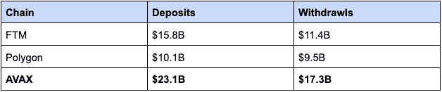
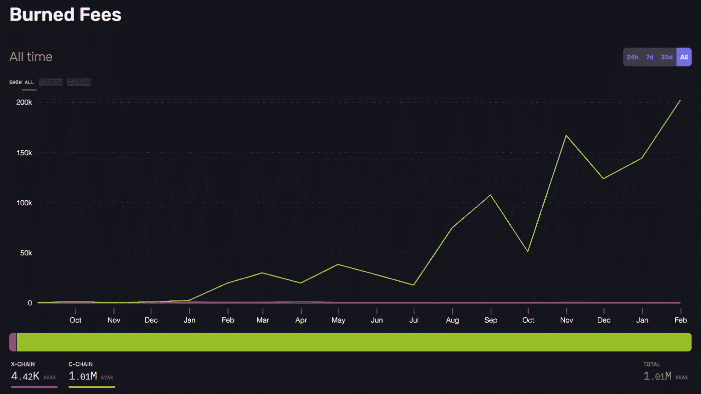

# 雪崩式的论题

> 原文：<https://medium.com/coinmonks/an-avalanche-thesis-2e5d68cdc6fe?source=collection_archive---------12----------------------->

*请注意，开头对 Avalanche 的概述旨在为生态系统的新成员提供入门知识。该概述将 Avalanche 如何真正成为共识中的一个突破联系了起来，这为后来的一些拍摄提供了信息。如果你只是想进入正题，使用目录跳过前面。*

**目录**

> [***雪崩概述***](#718e) *——*[语境化雪崩共识](#1d2e)
> ——[雪崩平台与子网](#00ba)[***论文:亮点/叙事***](#1d6d)——[亮点 1:表演 EVM](#4166)
> ——[亮点 2:快速子网](#06ec) [***分化***](#e823)[***度量***](#e3b1)[***催化剂***](#9de7)

虽然 2021 年为 crypto 带来了大量新资本，但许多新投资者和交易者专注于表层叙事，而不了解和押注核心技术。既然牛市狂潮已经平息，业内人士应该着眼于整合好的技术，并评估哪些产品实际上是有效的。

尽管如此，这份报告并不意味着 fud 任何其他第 1 层区块链；事实上，这篇论文认为**未来几年，所有协议的空间都将大幅增长，那些能够吸收这种增长的协议应该受到鼓励。**然而，似乎几乎每一个 L1 都将自己标榜为最新的创新或下一个大事件。

在所有的宣传和营销之下，Avalanche 是真正的技术突破，为行业增加了独特的价值。**凭借其技术、团队和生态系统，Avalanche 已准备好在多链的未来取得成功。**

# 雪崩概述

Avalanche 是使用 Avalanche 共识协议的第 1 层利害关系证明区块链。该协议最早于 2018 年由一个名为 Team Rocket 的假名小组提出，然后由艾娃实验室的团队开发，该团队由康奈尔大学教授 Emin Gun Sirer 及其博士生 Kevin Sekniqi 和 Mao fan“Ted”Yin 共同创立。

Avalanche Consensus 标志着除了先前存在的经典和 Nakamoto 共识协议家族之外的一类新的共识协议。它是高度可扩展的、分散的、低延迟的和高吞吐量的。Avalanche 已经在其基础上和本地子网上构建了大量的 DeFi、游戏、NFT 和企业协议和解决方案。

**艾娃实验室团队已经声明其目标是“数字化所有事物”，并试图通过雪崩生态系统来构建这一愿景。**

## 语境化雪崩共识

已经有很多关于雪崩共识如何工作的概述，所以我将保持简短，只建立一些背景。但是为了解释为什么雪崩共识实际上是一个计算机科学的突破，而不是一些以实际的去中心化、可伸缩性或安全性为代价的工程黑客，让我们首先快速地回顾一下共识协议的历史。

**共识机制概述**

共识旨在解决以下问题:“我们如何在一组机器之间达成一致？”(请注意，PoW 或 PoS 不是共识协议，它们是 Sybil 控制机制，即保护网络安全的方法，采用挖掘还是打桩的方式)

迄今为止，共有两大类共识协议。

**1。经典共识**

几十年来，所有的共识协议都属于经典共识协议家族。这些协议有一个显著的特点:它们使用全对全投票。

例如，在对一项法案进行表决的议会中，传统的共识协议将通过让每位参议员投票决定他们是否接受或拒绝该法案来达成一致。类似地，当发出一个事务时，每个验证者投票并听取其他人的意见。

虽然这些协议可以快速确认交易，但它们的可扩展性不是很好。这些协议只能支持不到几百个验证者，并且它们需要所有参与者的知识。

These protocols have a lower bound of O(n²) messages, where ’n’ is the number of validators.

**2。中本聪**

2008 年，Satoshi 引入了中本聪共识，也称为最长链共识。重要的是，不管参与者有多少，这个家族都以相同的速度运行。

然而，它们本身也很慢，并且需要高能耗。

迄今为止，大多数链的特点是对这些现有的共识协议家族进行了一些优化。值得看看你最喜欢的一些 L1，并问一问:“他们在多大程度上重复了 20 世纪 90 年代经典共识中的一个想法，或者真正像他们声称的那样建立了一些新东西？”

**雪崩共识**

密码和计算机科学社区中如此多的人如此热爱 Avalanche 的原因是，他们应用了科学和学术界的最佳成果，形成了一个新的共识协议家族。虽然这听起来像噱头， **Avalanche 通过其突破性的共识协议，在最基本的层面上将其与同行区分开来。**

Avalanche combines the best of Classical and Nakamoto

Avalanche 的主要突破不是全对全投票，而是使用重复子采样。每个验证者随机选择其他验证者来询问他们的决定。这种情况重复发生，直到有足够的数据达到概率终结。它还通过 DAG 使用传递投票，所有这些你都可以在这里阅读更多关于[的内容](https://docs.avax.network/learn/platform-overview/avalanche-consensus/)。

Read more here: [https://medium.com/avalancheavax/avalanche-consensus-101-99c68a3e3159](/avalancheavax/avalanche-consensus-101-99c68a3e3159)

**这种新颖的机制使 Avalanche 成为唯一高度可扩展的共识，可以提供签证级别的吞吐量、不到 1 秒的终结性和去中心化。**

## 雪崩平台和子网

雪崩网络由其主网络保护，主网络验证三个内置的区块链:

1.  交换链(X-Chain)，用于创建和交换令牌，这是雪崩虚拟机(AVM)的一个实例
2.  平台链(P-Chain)，一个元数据区块链，它协调验证器来创建/跟踪子网
3.  契约链(C-Chain)，创建和部署智能契约的以太坊虚拟机(EVM)的一个实例

然后，Avalanche 允许任何人创建他们自己的定制区块链网络，称为子网。**这些子网允许 Avalanche 水平扩展，Avalanche 最终将成为由许多区块链组成的平台的平台。子网允许开发人员根据动态验证器要求构建定制、灵活的网络，以满足任何特定需求，同时还提供雪崩共识的安全性和速度，以及与其他子网互操作的能力。**

验证器需要在主网络中投入 2000 个 AVAX(通过 P 链)来创建子网，但是子网可以通过 P 链之外的定制验证器来启动。所有子网都必须是雪崩验证器，但是验证器可以选择验证哪些子网。子网有三个优点(所有这些都使子网对企业非常有用):

1.  验证器可以选择验证或不加入哪些子网。这减少了网络流量，以及验证器所需的计算资源。
2.  私有网络可以通过子网实现，因为子网可以决定谁可以进入它们。
3.  您可以创建一个具有特定验证器属性的子网，这对于需要遵守某些法规/合规性的企业来说可能很有用。例如，可以创建一个子网，其中每个验证器都位于某个管辖区，或者每个验证器都被某个现实世界的契约所绑定。

了解更多:[资源 1](https://docs.avax.network/learn/platform-overview/) 、[资源 2](/avalanche-hub/avalanche-a-revolutionary-consensus-engine-and-platform-a-game-changer-for-blockchain-fdac008edc35) 。

# 论文:亮点/叙述

## **亮点一:表演家 EVM**

***短期* —** 我们仍在等待 Eth 2.0 和 L2 扩展解决方案的全面部署。从历史上看，就开发时间表和细节而言，Eth 2.0 一直是一个移动的目标，但来自 Vitalik 的最新消息表明，合并将在 6 月或 7 月进行。然而，一个完全以以太坊为中心的汇总可能需要更长的时间，甚至可能需要[年](https://polynya.medium.com/rollup-centric-ethereum-roadmap-november-2021-update-f8a8f6f518ce)。**在近期，Avalanche 是一个面向新用户和开发人员的 PoS、低费用、可持续、高度可扩展和高性能的链。最重要的是，它现在有效。**

*   雪崩共识代表了共识机制的突破，并且在可伸缩性三元悖论中没有折衷。一句话， **Avalanche 正在经受考验并取得胜利**:它目前处理 Eth 90%的交易量，同时保持较低的费用。也没有像 Solana 一样在网络高度拥塞时出现网络中断的问题

Avalanche handles 90.8% of Ethereum’s transaction volume while gas prices have remained low

*   **C-Chain 与 EVM 兼容**，允许开发人员和用户利用现有的各种 EVM 工具，并在 Avalanche 上部署现有的 Eth 应用
*   以太坊和雪崩之间的**高质量 AB 桥**提供了 L1 之间的廉价和容易的转移。与 Fantom 和 Polygon 相比，Avalanche 在过去 6 个月中从以太坊获得了最多的总净流量。AB 桥也非常安全:这是第一项基于英特尔 SGX 的同类技术，该技术有一个防篡改区域。

Avalanche has 25% of total market share in Ethereum bridges TVL

Avalanche leads the way in deposits from Ethereum, with net in flow of $5.8B

## **亮点二:子网快速增长+ Gamefi 量增长**

***短期到长期*** — **子网是一种独特的竞争优势**，它允许开发端的可定制性和灵活性、雪崩共识的快速终结以及与其他子网的互操作性，而无需通过中央集线器进行传输。**虽然这将最终导致企业和机构链(更多细节见下文)，但在近期，子网是新 gamefi 在 Avalanche 上开发的主要动力。**当然，子网也将扩展到 NFTs 和 DeFi 协议，但预计游戏将是未来几个月的主要驱动力。

*   区块链游戏一直是加密的主要驱动力。2021 年，区块链游戏占整个行业使用量的 49%，占整个 NFT 销售额的 20%。Gamefi 开发人员将被 Avalanche 吸引，因为子网为他们提供了为自己的区块链设置参数的自定义能力。每个游戏生态系统都有一个独立的区块链，这使得游戏可以更好地控制它们的令牌组学，减少链上的拥塞，并改善用户体验。**期待更多新游戏和生态系统迁移到自己的雪崩子网的公告。**
*   举个例子，该团队最近通过子网将一些新的高知名度游戏(包括 AAA)纳入其平台:榴霰弹，PlayAscenders，IME，Ragnarok。 **Avalanche 在激励新开发者方面一直很积极，似乎每天他们都会宣布一个新的游戏合作伙伴**
*   **Crabada，Avalanche 的旗舰 P2E，刚刚推出了一个名为** [**游泳者网**](/@swimmer_network/first-look-introduction-to-swimmer-network-testnet-alpha-launch-58716805dd3b) **的无缝子网。他们计划在 3 月底/4 月初将他们的游戏从 C 链完全迁移到游泳者网络。拥有自己的网络也让他们能够更好地扩展自己的游戏，他们已经宣布为开发者提供资助计划，让他们在游泳者网络的基础上扩展游戏。**这一举措将验证子网描述，并减少 C 链上的拥塞，证明水平可扩展性。****

New games will likely launch on top of the Swimmer Network as well

*   DeFi 王国:Crystalvale 也将很快加入雪崩子网。他们已经宣布了这一举措，并通过与 dex 在 Avalanche 上的合作开始了流动性激励。鉴于 DFK 是 Harmony 上交易的主要来源，这一举动肯定会推动 Avalanche 上的交易量，同时也表明子网架构是高质量协议的一个巨大卖点。

*   该团队经常提到 Dexalot 是一个 CLOB DEX，它将极大地受益于——并可能使用——自己的子网
*   子网也可能是价格的推动者，因为子网验证器需要雪崩验证器，这需要 2000 AVAX

## **亮点 3:企业采用/数字化 Tradfi 资产**

***长期****——**排山倒海为企业采用做准备。**从第一天起，艾娃实验室的愿景就与密码行业的未来保持一致。在未来的几年里，加密不再仅仅是它自己的资产类别，**所有的资产都有可能被捆绑成加密** [**资产**](https://twitter.com/balajis/status/1385572764485001221) (就像互联网捆绑了广播、音乐、电视等传统信息和媒体渠道一样)。**随着传统金融转向加密，Avalanche 已做好充分准备来获取大部分价值。**这里有几个分亮点，因为这将是 Avalanche's 在多链世界中创造独特价值的方式。*

**

***a .方向一致，技术匹配***

*   *从第一天起，Avalanche 就朝着“数字化所有事物”的目标前进。这是一个独立于比特币的数字现金或以太坊的世界计算机目标的目标。因此，Avalanche 从一开始就是专门设计的，旨在捕捉从传统金融到分散金融的价值，最终实现所有金融资产的虚拟化。这代表了 700-800 万亿美元的市场机会。*

***b .子网允许在可互操作的网络中构建自定义应用区块链***

*   *企业和机构客户需要比一般整体区块链(如 Eth、Sol)能提供的更多的特殊需求*
*   *Avalanche 子网的开发愿景是允许企业**构建符合其所需应用或法规合规性的定制复杂规则集**(即高性能子网，其中验证器必须具有特定的硬件要求，允许区块链遵循验证器 KYC 的特定规则)*

***c .业务发展战略***

*   *该团队积极定位于创建**企业合作伙伴关系**，并且已经与德勤/联邦应急管理局建立了合作伙伴关系，后者正计划利用 Avalanche 来简化救灾资金系统*
*   *与万事达卡、电动汽车制造商 TOGG 的额外合作，从它的声音来看，在幕后有更多的秘密合作关系*
*   *2020 年收购 Investery，让**吴炯加入团队，担任总裁。**他曾在 Kingdon 的 Tiger Capital 工作，有过华尔街的经历，并成立了自己的基金，由黑石投资。此举反映了 AVAX 将自身定位为企业和机构客户首选的**区块链的愿景。***
*   *此外，Avalanche 继续通过其名为暴雪基金的 2 亿美元基金向新的合作伙伴项目注入流动性。暴雪于 2021 年 11 月推出，由雪崩基金会、艾娃实验室、Polychain Capital、三箭资本、蜻蜓资本和 CMS Holdings 等投资雪崩生态系统的早期项目，包括分散金融(DeFi)、不可替代代币(NFT)、社交代币等..这表明该团队致力于**扩展雪崩生态系统，并为新协议带来更多流动性。***

***d .创建新的数字资产/原语***

*   *Avalanche 与 Roche Cyrulnik Freedman LLP 和 Republic Advisory Services 合作创建了首个**初始诉讼服务。这是一种将诉讼金融化的新型资产类别。***
*   *期待 Avalanche 团队在前进的道路上有更多这样的创新。听到 Avalanche 和企业合作伙伴之间的新原语和数字资产，我不会感到惊讶。*

***亮点 4:可扩展的模块化技术***

*在最基本的层面上， **Avalanche 拥有真正的创新技术，专为可互操作的多链世界而构建，并不断进行优化。**随着空间的增长，最终所有块空间都将被消耗。系统将接受压力测试，越来越多的人除了速度之外，还会要求去中心化和安全性。Avalanche 实现了这一切，这意味着**它是面向未来的，是为未来的增长而构建的。***

***a .世界级技术团队***

*   *Emin Gun Sirer、Kevin Sekniqi 和 Ted Yin 代表了领导 Avalanche 的一流技术团队。*
*   *Gun 在过去的 20 年里一直是康奈尔大学的教授，也是全球分布式系统领域最重要的专家之一。他在 2003 年创建了第一个战俘系统 Karma，首次发现了 BTC 自私采矿攻击，并开发了一些最快的 L2。他参与了密码技术的每一项重大发展，并将最好的科学应用于雪崩。很难不赌他。*
*   *Ted 也是 Hotstuff 论文的第一作者，这是脸书的 Diem(天秤座)选择的协议，他离开去建立 Avalanche。*

***b .雪崩共识***

*   *许多其他 L1 专注于工程优化，导致可扩展性三元悖论的折衷，或者对现有的经典共识协议进行调整，并将自己标榜为革命性的，同时仍然面临以前同行的问题。**通过重复二次采样的雪崩共识引入了一种新的共识机制家族，该机制不需要所有节点相互监听。**虽然有许多其他链将最新的技巧结合在一起，但**雪崩是快速、可扩展和分散的，复杂性最小→共识的真正突破。***
*   *在未来的几年中，crypto 无疑将继续看到更多的资金、使用和开发活动。整个市场空间将会增长，而将会成功的 L1 是那些最能吸收这种增长的人。Avalanche 不做任何妥协，提供所有现有解决方案中最好的:您可以获得 Solana 和 FTM 等链提供的高 TPS 和快速终结，同时还可以获得去中心化(大量验证器)，并通过子网为 Polkadot 和 Cosmos 等可组合、可互操作的未来做好准备。*

**

*[Comparison](/avalanche-hub/comparison-between-avalanche-cosmos-and-polkadot-a2a98f46c03b) of Cosmos, Polkadot, and Avalanche. Some info may be outdated*

*   *最棒的是，通过子网， **Avalanche 为所有其他新开发提供了即插即用架构**。您可以应用一个 Eth L2，启动一个 FTM 或 SOL 子网，将验证器需求调整到非常具体的参数。Avalanche tech 提供的灵活性使其成为吸收行业增长的最佳选择*

***c .团队总是在优化，总是在交付和构建***

*   *Avalanche 团队对问题的反应很快。9 月，他们推出了[雪人++](/avalancheavax/apricot-phase-four-snowman-and-reduced-c-chain-transaction-fees-1e1f67b42ecf) 来减少 MEV &竞争，以及一个新的动态费用，称为 Moderato，减少了 C 链上的费用*

**

*   *该团队对空间采取科学的方法，旨在解决所有区块链面临的主要问题。这种全面的方法与其他试图在利基市场开拓价值的区块链形成鲜明对比，这表明雪崩在未来几年将成为一个重要的参与者*
*   ***例如，他们正在开发新的本机虚拟机、脚本语言和一种应对状态增长的“超级修剪”解决方案***

## *亮点 4:强大的社区和生态系统*

***Avalanche 拥有一个庞大的开发者生态系统和《虎胆龙威》stans 的社交社区。**无论不同的 Eth 扩展解决方案会发生什么，很难相信 AVAX 社区会弃船而去。更不用说现在 Avalanche 在 DeFi 和 GameFi 方面有了非常明显的创新。*

*   ***雪崩现在有本土的 USDT、USDC 和 UST。**本土的 USDC 由 FTX 直接支持，而 USDT 则由币安支持。这为大规模采用雪崩技术打开了空间*
*   *原生 stableswap 协议现在在鸭嘴兽中可用，现在 PTP 战争类似于曲线战争(向量金融和鼹鼠金融)*
*   *本齐提供液体 AVAX 铆接*
*   *作为占主导地位的 DEX，Trader Joe 还推出了各种独特的用例，包括一个 launchpad 和一个在 USDC 支付的赌注奖励系统*
*   *在过去的一个月里，Crabada 在他们的空闲游戏模式下已经实现了 6000 万美元的销售额，而 Axie 的销售额为 8000 万美元。随着新的游泳网络子网，随着公会从 Axie 转移到 Crabada，游戏可能会吸引大量的雪崩*

**

*Development activity on AVAX has far surpassed FTM and MATIC as of late*

**

# *区别*

*在与同行进行基准测试时，Avalanche 通常是最好的*

*   ***最快在 1 秒内完成。**索拉纳耗时约 13 秒，以太坊 5-10 分钟，波尔卡多特约 6 秒。在蜻蜓进行的不同 AMMs 的实际 L1 性能中，Avalanche 以大约 1.75 秒的结束时间获得了最好的成绩。*

**

*Realistic performance as tested by Dragonfly on different native AMMs*

*   *Solana 依赖硬件要求来满足高事务速度，这样做牺牲了去中心化。Avalanche 的愿景允许任何拥有常规硬件的人成为验证者，这使得它受到 CPU 的限制。然而，最终可能会出现对硬件要求很高的自定义子网，这些子网可以实现极高的速度。(**今天的许多现有链在未来可能会成为 AVAX 子网**)*
*   *此外，FTM 最近的大肆宣传是由 Andre Cronje 的项目推动的，但他最近的离开导致了 FTM 价格和追随者的大幅下降。 **Avalanche 拥有最好的科学以及 tradfi 幕后建筑的精华**，吸引了大量不断创新的建筑商。*
*   ***Avalanche 提供了比 L1 同类产品更高的性能，同时也实现了 Polkadot 和 Cosmos 等同类产品所追求的互操作 L0 愿景。***
*   *Avalanche 提供了更高的可扩展性，因为对可创建的子网数量没有限制，并且子网享有 Avalanche 一致认可的高 TPS。从指标上看，Cosmos 可以达到 1000 TPS 左右(共识中的带宽瓶颈)，Polkadot 1500 TPS，AVAX 4500 TPS。Polkadot 也被限制在 100 个副链左右，而 Cosmos 在出现 TPS 问题之前只能支持 200 个节点。*
*   ***雪崩子网远比宇宙区域或波尔卡多副链灵活。子网提供了可定制的验证器需求，可以更好地支持可能需要创建特定监管参数的企业。子网可以是许可的，也可以是无许可的，并且可能更适合希望构建大型生态系统的游戏和 DeFi 开发者，这些生态系统可以使用自己的付费本地令牌，享受雪崩的速度和安全性，并与其他子网进行交互。***

# *韵律学*

*   *与同行相比，TVL 已经反弹并保持强劲的发展势头。Avalanche 目前在 TVL 所有连锁店中排名第四，超过了 Solana 和 Fantom。显然，现在宏是最值得关注的事情，而加密作为一个整体已经从 11 月的高点冷却了不少。与同行相比，Avalanche 的稳定性显示了其生态系统、社区和技术的实力。*

******

*AVAX Avg. TPS*

**

*回到这张开发人员图表，很高兴看到开发活动反弹良好，这表明 AVAX 的长期采用不受资本市场波动的影响。**如果熊市真的来了，就赌一赌建筑商在哪里。***

**

*Development activity on AVAX has far surpassed FTM and MATIC as of late*

# *催化剂*

*虽然在这个市场上看价格组合可能没有太大意义，但 AVAX 最终应该以与同行类似的 MC/TVL 比率进行交易。*

**

*AVAX’s MC/TVL ratio lower compared to peers*

*总的来说，加密现在将会更多地受到宏观经济的影响，但是通常有一些短期/长期的催化剂需要关注。*

1.  ***增加在 tradfi 市场的份额并宣布新的合作伙伴关系***

*   *如前所述，Avalanche 拥有强大的 BD 团队和企业关系。展望未来，预计他们将专注于其企业采用战略，并继续宣布与财富 500 强企业的战略合作伙伴关系*

***2。增加子网部署***

*   *与 l0 和其他 L1 相比，成功的子网部署将验证 Avalanche 最大的技术优势之一。随着 Crabada 迁移的到来，请密切关注新子网的实际工作情况*
*   *部署后，Crystalvale 迁移将是一个巨大的转变*
*   *新游戏肯定也会宣布与 Avalanche 合作，因为子网非常适合任何需要大量交易量的游戏(游戏、元宇宙等)。)*

# *令牌组学*

*AVAX 有 720，000，000(7.2 亿)个令牌的上限供应。genesis block 在推出时铸造了 3.6 亿个 AVAX 代币(其中 60%将在 4 年内解锁)，随着时间的推移，将会发行 3.6 亿个代币作为赌注奖励。*

*自发射以来，迄今为止已烧毁了 1，012，453 枚 AVAX。*

**

*1,012,453 AVAX burned since launch*

*根据[令牌白皮书](https://assets.website-files.com/5d80307810123f5ffbb34d6e/6008d7bc56430d6b8792b8d1_Avalanche%20Native%20Token%20Dynamics.pdf)，假设 100%的令牌供应被押下，AVAX 将在 20 年左右达到总上限。如果只有 50%被标桩(与目前的标桩率相当)，**那么到 20 年，象征性的供应将是 70%，并由于燃烧机制而永远保持在那里。**代币因交易费和创建资产、区块链和子网而被烧掉。*

**

*Token emissions curve, burning vs emissions rates will cap AVAX supply at around 70%: [whitepaper](https://assets.website-files.com/5d80307810123f5ffbb34d6e/6008d7bc56430d6b8792b8d1_Avalanche%20Native%20Token%20Dynamics.pdf)*

# *风险和缓解措施*

1.  ***风险**:很多雪崩故事都围绕着更便宜的费用，但是**成功的 L2 扩展和分片解决方案可能会削弱雪崩的优势，将价值转移回以太网***

*   ***用户还是先关心用户体验，L1s 会提供更好的体验。**例如，Avalanche 的资金进出更加顺畅，而 L2s 的资金等待期可能长达 7 天，这可能会阻碍其发展；用户仍然需要回到 L1 定居；智能合约缺乏不同 L2 之间的可组合性*
*   *L2 从基础链中获取价值，并将其转移到其他地方，这不仅分散了流动性，而且只是围绕价值转移，而不是增加价值。对于子网体系结构，为了创建子网，验证者需要在主链上下注。子网的可定制性也大大提高，从而产生更多特定于应用的区块链，从 tradfi world 中获取特定价值*
*   *Eth 分片和 L2s 一直是一个移动的目标，有发货延迟和不一致的路线图，而 **Avalanche 已经证明了自己是一个现在可以工作的系统***
*   *AVAX 上有一个强大的本地社区，即使在成功扩展 Eth 之后，他们也可能继续在 AVAX 上构建和交易。 **Crypto 是一个部落景观，红色 koiners 是一个顽固的部落***
*   *最终，没有 L1 会成为 Eth 杀手，但没有 L2 会杀死其他 L1。这些系统很可能会并行存在，特别是 AVAX，在数字化所有事物的使命中有着不同的愿景*

*2.**风险**:很多雪崩式的叙述都取决于其子网的**成功。我们还没有看到这些产品全部推出，它们可能并不像声称的那样好。然而，**证据正在酝酿中，**随着未来几个月首批几个子网的推出，一切都将很快揭晓(三月/四月的游泳者网络)。***

*3.**风险**:尽管 Avalanche 在过去几个月的表现可以说比 alt-L1 的同行好得多，但它还没有遇到 Eth 遇到的**州规模问题。**随着雪崩的增长，这可能会成为瓶颈，我们一直在等待“超级修剪”解决方案。同样，这取决于团队如何提供解决方案，但根据以往的记录，Avalanche 已经证明自己有能力应对每一个挑战。*