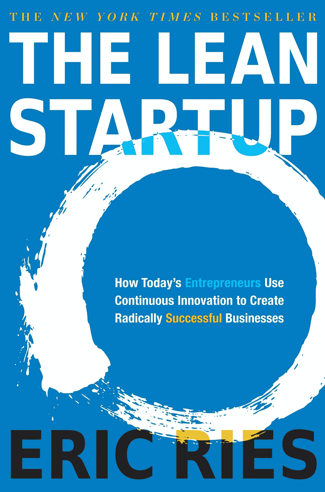

# 关于加密货币死亡项目的假设

> 原文：<https://medium.com/coinmonks/an-hypothesis-about-cryptocurrency-dead-projects-fdf66f4cb0dd?source=collection_archive---------54----------------------->

正如你们中的一些人已经知道的，我已经分析了一年多的加密项目，其中有大约两年的时间我的专业重点是创业。

基于所获得的知识，我想分享为什么我认为密码项目的成功率会非常低的原因。

通常，技术项目或创业的第一步不是(或不应该是)打开 IDE(开发环境)并开始编程。你想想，这样做没有任何意义:你想发展什么，为了什么，为了谁。你可能会想到这些天真的问题，但它们是正确的问题吗？

创业的要点是发现一个重要的问题并解决它。一个重要的问题(在这种环境下)是一个足够“痛苦”的问题，你可以找到愿意为解决方案付费的市场参与者。

> 交易新手？试试[密码交易机器人](/coinmonks/crypto-trading-bot-c2ffce8acb2a)或者[复制交易](/coinmonks/top-10-crypto-copy-trading-platforms-for-beginners-d0c37c7d698c)

问问你自己:
——这个问题是否大到足以让项目可以扩展？
-该解决方案是否可接受，足以使项目得以扩展？

一旦一个想法诞生，你需要验证问题的存在，因为直到你这样做，这个想法只是一个假设！它一文不值。这就是精益创业方法的目的。

精益创业是一种创建科技公司/创业公司的工作方法，涉及过程和目标的范式转变。焦点从性能转移💸向🧠:学习从问题、客户、市场的大小等方面学习。一个人应该充分意识到，主要任务是验证假设，信息是由市场而不是自己掌握的。例:

“我认为到达最终消费者手中的水果不够新鲜。”

我准备去问市场:
“你在市场买的水果够新鲜吗，吃新鲜水果对你来说重要吗？”

如果市场告诉我“不，没有问题”，那么设计解决方案就毫无意义。我在学习，节省时间和精力。这些信息帮助你将工作引向正确的方向，而不是建立一个解决方案来解决一个不存在的问题。

这个策略可以而且应该应用在项目开发的不同阶段:
-问题验证
-解决方案验证
-市场规模验证
-渠道验证
…

精益创业将帮助你转向，创造一个关注需求而非自我的产品或服务，让努力和资源变得有利可图，让你的知识成为潜在竞争对手的进入壁垒。

一旦我们奠定了这个基础，我想谈谈个人资料。在工作团队中，拥有多学科的背景是一种福气。有一个占据实现者角色的人是很重要的，但是认为一个伟大的实现者将会构建一个可靠的产品是一个常见的错误:大多数时候情况并非如此。你需要协调、评估和一系列其他技能，而擅长实施的人通常不具备这些技能。

这是创业的一个常见错误，即背对市场及其需求创造产品，过度定义的过程更多地基于创造者的自我，而不是填补需求缺口。创业不是这样，它是关于验证假设，灵活，旋转，专注于学习。

我想你已经明白我的意思了:区块链/Web 3 项目是由多学科团队运行的吗，它们是基于假设验证方法吗，或者它们是开发团队基于他们自己的想法(不可否认，有些想法很聪明)构建的，并且支持需求缺口？

我更进一步，以今天这个市场的投机量，开发人员创造长寿产品值得吗？即使没有市场、没有顾客、没有认可，只要走出去，把他们的想法编程，他们就可以过度投资。他们可以利用 FOMO 赚很多钱(我不认为这是一件坏事)。通过这个初步的过程值得吗？如果不是，那么一个以市场需求为背景的项目成功的可能性有多大？

您可以在以下网址找到我:

推特:[https://twitter.com/Trader_WB](https://twitter.com/Trader_WB)

YouTube:【https://www.youtube.com/channel/UCTkUdfI6gL4oKQcT_wMX1Tg 