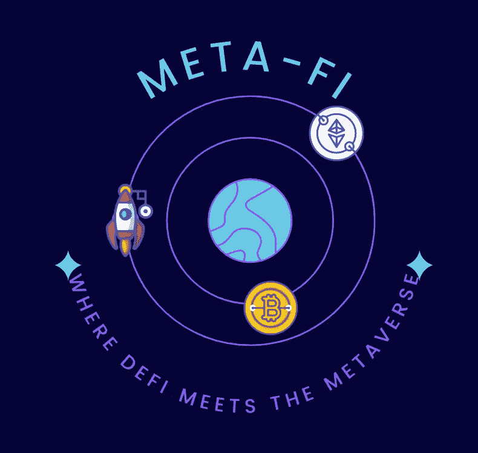
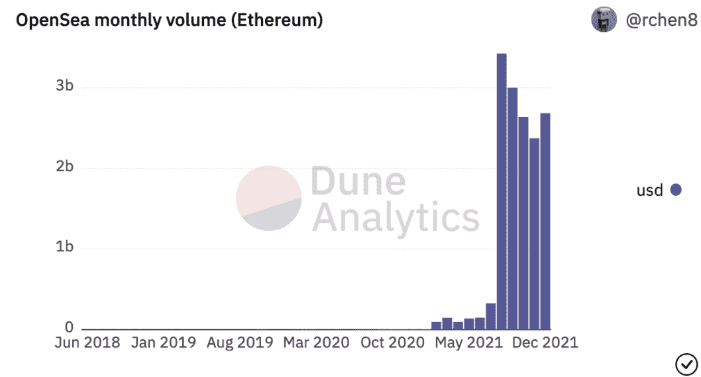
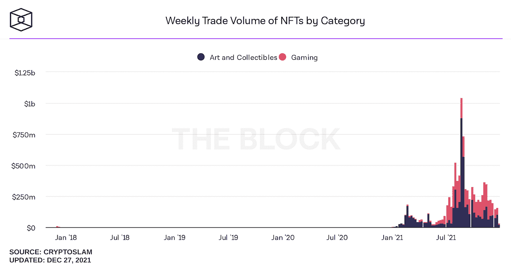
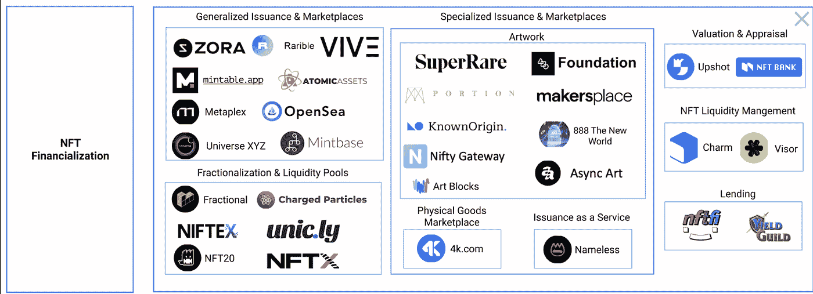
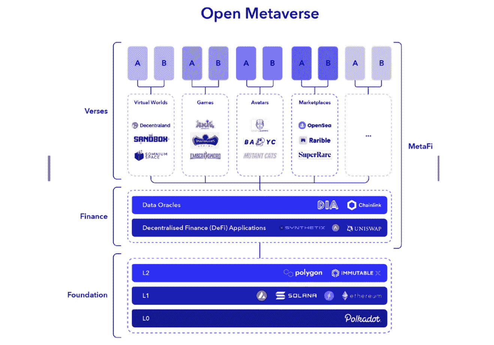
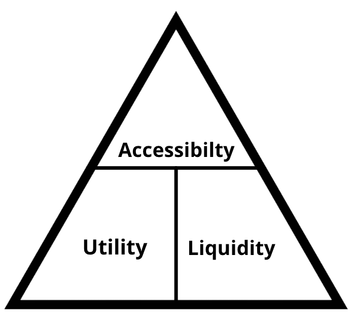

# 元 Fi 透视

> 原文：<https://medium.com/coinmonks/an-insight-into-meta-fi-15dd7669d9d?source=collection_archive---------4----------------------->

## 迪菲和元宇宙相遇的地方

***NFTs 的一小步。元宇宙的一大飞跃。***

> ****免责****
> 
> **这些都不是财务建议**

这件作品将:

*   解释元金融及其与非金融交易的关系
*   概述 Meta-Fi 的重要特征和领域
*   概述与 Meta-Fi 相关的项目
*   描述未来元金融的一些机会

# 介绍

Meta-Fi，或元宇宙金融，是一个协议、产品和服务的术语，支持不可替代和可替代令牌(及其衍生品)之间复杂的金融相互作用。

我们很清楚，NFT 或不可替代令牌基本上是一种文件格式，用于在区块链上传输信息或价值，就像但不限于以太坊一样。—最有可能的是，你与 NFTs 的共同关联是在 Jpegs 之类的图像中，你会在 BAYC & Crypto Punks 之类的数字化身中看到这些图像。

它的独特之处在于，通过位于区块链上，这些数据在链上是有标记的，并且是不可替代的。当某物是可替换的时，它意味着某物可以是相同的和可互换的。不可替代性与只能有一个相反——没有两个是相同的，存在唯一性。非常适合数字透明所有权。

无论如何，回到 Meta-Fi——由于新的和现有的加密用户对不可替代令牌(NFT)的需求呈指数增长，它的重要性已经增加。NFT 正在接纳一种新的用户类型，而分散融资(DeFI)在这方面有所欠缺。对这一趋势的解释可能是因为与 DeFI 相比，NFTs 更易消化。千禧一代和 GenZ 等之前对金融或金融产品一无所知的派别，正在对他们之前从未涉足的这个领域产生积极的兴趣。

NFT 的美妙之处在于，它们看起来很简单，但实际上非常复杂。原因是 NFT 目前是一个关系到所有权、JPEGS、图形设计、游戏的纽带，未来还会有更多的功能出现。这些 NFT 在 ETH(或其他优选密码)中具有相对值；这一价值通常由二级市场定价。解锁该值可以在新阶段执行；**元金融。**

这是由**万物金融化所驱动的，**这指的是加密正在实现的东西。令牌化能够实现这一点，因为它让一个行业、其参与者和经济体增加了货币化的方式。

在过去一年里，我们已经看到非功能性测试提高了一个层次。这其中的一个重要原因是越来越多地融入到基于**元宇宙&玩 2 赚**的项目和环境中。用户在这里玩、赚、探索，然后可以将所有这些与他们的 NFTs 集成。

*离群风险投资公司甚至说*“元宇宙首先是一个经济系统，一个元经济，它比任何数字经济都优越。随着这种元经济的国内生产总值总和超过那些民族国家，它也将享有超越其基于指令的经济的优势”。

要理解 Outlier ventures 团队所说的潜在“优势”,首先有利于理解不可替代代币可以利用借贷、流动性和资产管理工具的元素，就像 DeFi 一样——在所谓的**NFTs 金融化中。**

 [## NFT 十大铸币市场| CoinCodeCap

### 在开始投资和购买 NFT 之前，用户需要考虑一些关于最佳市场的因素。所以让我们…

coincodecap.com](https://coincodecap.com/nft-marketplaces) 

# 描绘 NFT 市场的故事

由于通过非金融交易的金融化增加了 NFT 的使用和整合，元金融的自然出现将会出现。我们可以通过观察 NFT 市场的状况来想象这一点——它目前的状况和未来可能的走向。

***Source A: @rchen8 Dune Analytics***

*上图是全球最大的 NFT 市场 Opensea 的图表。它在 X 轴上显示过去一年按月递增的 NFTs 量，在 Y 轴上显示以美元为单位的量。总体交易量在去年急剧增加，每月交易数百万到数十亿美元。*

*图表显示，与 2021 年前两个季度的百分比变化相比，2021 年前两个季度的数量增长百分比变化较低。保持上半年的百分比增长是不可持续的，现在活跃交易量似乎已经达到更可持续的水平。在 12 月的这个月，它的交易额有望达到约 25 亿美元。*

*我们可以推断，与今年年初相比，非功能性测试的数量仍然相对较高，这意味着仍然存在活跃的需求——尽管数量从 5 月/6 月的峰值水平略有下降。*

***Source B: The Block***

**超越艺术的思考**

*第二张图描绘了这幅图的另一个方面，如上图所示，NFT 每周的销售量分为两种 NFT 形式:“艺术和收藏品”&“游戏”*

就销量而言，2021 年 NFT 销量大幅增长。第一个值得注意的是，总量已经过了峰值，但是值得注意的是，大约从今年第二季度开始，NFT 市场的游戏领域或“游戏保真”部分的销售额开始超过艺术和可收藏的非功能性艺术品的销售额。现在，这并没有恢复峰值水平的总交易量，但它确实开始描绘出一幅增长趋势的画面，这可以归因于 ***【玩-2】****和/或* ***游戏-Fi*** *游戏的日益流行。*

*就发展而言，NFT 空间可以分为几个阶段，其中 Art &收藏品(例如头像和月猫、朋克等)是第一阶段，Game-Fi&Play-2-Earn(Axie infinity)是第二阶段，然后 Meta-Fi 是第三阶段——这个阶段将它们和谐地连接在一起。*

# NFT 项目可以分类

NFT 市场有相当数量的类别，在这些类别中可以形成元金融集团，参见下面的来源 c

***Source C:*** [***Mason Nystrom***](https://messari.io/research/mason-nystrom) ***@ Messari***

更具体地说，这些元 Fi 类别是:

*   估价和评估
*   细分化
*   放款
*   NFT 流动性管理

# 是什么在推动 Meta-Fi？

Meta-Fi 的驱动力有:

*   金融游戏化
*   金融工具的可用性
*   道及其国债的增长
*   非正规教育的增长

# Meta-Fi 适合哪里？

***Source D: Outlier Ventures***

*来源 D 显示了元宇宙&金融部门之间的总体联系。Meta-Fi 适合作为一个总体的桥梁，连接用户，项目和 NFT 格式。元金融整合了* ***虚拟世界、即玩即赚游戏、虚拟角色、市场、可穿戴设备、收益承载&细分非金融资产。***

# 为什么选择 Meta-FI？

Meta-Fi 为市场提供了 3 项独特的改进，它们是:

The Meta-Fi trio

*   **无障碍**

Meta-Fi 及其在 DeFi 协议中的 NFT 集成可以将学习游戏化，以满足参与 DeFi 的更高财务和知识要求，从而允许新一波零售用户进入市场。

*   **效用**

暴露于更大量的货币化方法，其中通过最大化 NFT 的所有权，出租、投资和赚取利息，甚至用作抵押品来获得贷款，从而产生新的潜在现金流。

*   **流动性**

市场的流动性更深，更好的是有更多的买家和卖家；这是受二级市场上交易 NFT 的影响。由于资产价格不断被用户评估，这进一步使得退出市场的方式更加容易。细分可以通过将高价值 NFT 分成更小的部分，进一步吸引那些因价格过高而无法获得高价值 NFT 的用户。

# 元金融的 3 个主要领域

# 1) NFT 衍生产品

为非金融交易创造衍生品在本质上是有问题的。这些基本上旨在将非流动性资产转化为流动性资产，但如何实现呢？合约和/或代币可以从基础 NFT 中“衍生”出来。

例如，可以创建一个典型的可替换的 ERC-20 令牌来表示 NFT，它使用以太坊上流行的 ERC721 标准。

这使得非金融交易更容易在市场上交易，并通过 NFT 衍生品创造新的借贷。

创造 NFT 衍生品创造了吸引更多投资和更高流动性的新机会。

这些能用来做什么？

1.  **NFT 地板价格预测市场**——使用平均指数价格交易特定 NFT 项目的总价值。可能利用简化的期权格式。
2.  **交换协议** —将 NFT 转换为 ERC20(或替代)代币，并在 DeFi 交易平台上交易。例子:通过出借 NFT 的 ERC20 衍生品版本产生被动利息，类似于通过出借你的加密资产获利。
3.  **做空 NFT** —使用 ERC20 令牌以期货合约的形式做空 NFT。
4.  **指数风格容器** —将一个或多个 NFT 组合成代币，创建一种新型金融产品。

**这样做的项目:**

*   ***合成期货***

允许用户对不可替代代币的未来价格下注(NFT)。面向散户投资者，**n features**使用的用户界面与。

分散式协议基于 SynFutures 现有的[合成自动做市商(sAMM)模型](/synfutures/synfutures-synthetic-automated-market-maker-samm-explained-4bdb0b767bd7)来匹配交易对手。

*   ***清道***

这个 Dao 提供了构建 NFT 衍生品所需的 SDK 工具。

*   ***带电 Fi***

带电粒子公司生产的 NFT 容器能够催化由基础资产铸造的有息不可替代代币，并随着时间的推移产生利息，从而赋予代币“电荷”。从代币中获得的利息代表粒子聚集的“电荷”。

公式:

粒子价值=内在价值(资产令牌的基础价值)+投机价值(不可替代的稀缺性)+利息价值(利息令牌中的应计值)

# NFTs 的细分

细分可以让更多的用户更加负担得起 NFTs。这是一个重要的概念，将 NFT 的所有权分割成数百万或数十亿个小块，这样几个人就可以购买、分享、交易并从中获利。类似于公司及其股份。

例如，创作者或所有者可以将其高价值甚至低价值的非功能性交易细分为具有高度可替代性的代币，并使用 Unsiwap 等定义指数进行交易。

正在细分 NFT 的著名项目包括原始 DOGE picture meme、Ross Ulbirtch Genesis collection 和其中一个 Ether Rocks。

**这样做的项目:**

*   ***分数***

即使不是最大的项目，也是其中之一。分数是一个分散的协议，其中 NFT 所有者可以铸造他们的 NFT 的象征性分数所有权。然后，这些令牌作为普通的 ERC20 令牌运行，对其拥有的 NFT 进行治理。

作为一个 NFT 所有者，当你来到分数平台，你会铸造一个 NFT 金库。这个金库将保管你的 NFT，作为交换，它会给你 100%的部分所有权令牌。此时，NFT 所有者可以随心所欲地使用他们拥有的分数

*   ***DAOfi***

DAOfi 是一个分散化的交易所，允许完全可定制的债券曲线，便于代币在二级市场上自由交易。这是在网络社区进行初级销售后完成的；这是通过一部分 NFT 艺术交易完成的。

*   ***桥梁分割***

Bridgesplit 是一个相对较新的项目，得到了以 Solana 为基础的知名投资者的大力支持。它旨在为跨链不可替代代币建立金融基础设施。最初在其阿尔法阶段开始细分索拉纳为基础的 NFT 的，但计划在不久的将来提供，NFT 抵押，指数乳化与 DeFi。他们认为，流动性和高资产生产率对他们的增长和发展至关重要。

*这个项目旨在结合，细分，然后使您能够交易 NFT。将你的 NFT 收藏转化为具有流动性的可交易资产类别。*

# *3) NFTs 与 DeFI 整合:抵押*

*DeFi 协议的下一个发展阶段是以存款或抵押品的形式更广泛地接受 NFT。这将使可扩展的 NFT 抵押贷款成为可能。类似于无追索权债务；这是一种由[抵押品](https://www.investopedia.com/terms/c/collateral.asp)担保的贷款，抵押品通常是财产。*

*例如，加密受限或现金受限的用户可以使用他们的 NFT 来借用本地令牌，以便他们可以使用它们。类似于你在 Compound、AAVE、离心机或 Pragmafy 上存入你的 ETH 并以它为抵押借入另一个本机令牌的方式。*

*现在与“真实世界”相关，德勤研究发现，自 2016 年以来，艺术担保贷款的价值增加了 40%以上，达到 210 亿美元。当我们考虑这些“真实世界”的例子时，NFTs 做类似的事情似乎并不遥远，因为我们可以看到它的明显功能。*

*加密领域的独特之处在于，没有获得许可的评估师或典当行经营者来决定抵押品的价值。相反，在一个通过智能合约发挥作用的空间里，确定非金融交易的价值是通过另外一种方式完成的，比如通过一个去中心化的自治组织(DAO ),或者 oracles，后者将传递来自二级市场的总价格。*

## *做这件事的项目:*

*   ****NFTFi****

*允许使用 NFTs 作为贷款抵押。直接产生产量可以通过结合 NFT 来实现，例如产生产量的 DeFi LP 标记。*

*有史以来最高的 NFL 抵押贷款是在 2021 年 10 月通过 NFTFi 获得的——140 万美元贷款给了 Autoglyph #488 的所有者。*

*NFTFI 利用借贷双方之间的交易，这些交易由特定的 ERC721 令牌管理。借款人可以用这个令牌来偿还债务和取回抵押品。贷款人用它来收取贷款还款和利息，或者在发生违约时获得借款人 NFT 的权利。*

*   ****CyberKongz****&****sup ducks****

*头像提供商通过艺术品项目，现在提供收益率产生 X 金额的 NFT，用于下注或持有。*

*   ****reNFT****

*reNFT 的初始和核心产品是一个协议层，支持在以太坊上对等租用 ERC-721 和 ERC-1155 不可替换令牌(NFT)。这些非金融资产可以出售、购买和转让。*

*NFT 采用虚拟艺术、游戏资产、虚拟土地、域名的形式，这为用户之间以少量租赁费进行租赁以产生收入打开了机会之门。reNF 使 NFT 资产的持有者能够以设定的价格、期限和担保金额出租这些资产。*

*   ****波尼****

*这是一个针对**非标准资产**的开源和非托管流动性协议。这包括但不限于由 NFTs 支持的贷款。非标准资产包括不可替代代币(NFT)、流动性提供者代币(LP 代币)、代币化权利和流动性相对较低的次要加密货币。*

*它通过为这些国家安全局运营一个贷款和租赁市场来做到这一点。它将优先支持 ETH、BSC、Polygon、Arbitrum 和 Moonbeam。*

*   ****条财****

*该平台将支持以太坊链、Matic 链、币安智能链，Solana 生态系统将允许在没有任何中介的情况下借入资金，类似于上文提到的其他 DeFi 协议。*

*Strip Finance 将遵循其 NFT 抵押贷款/借款市场的基本原则。借贷双方像平台上的 P2P 典当商一样被撮合在一起。*

# *未来赚钱的机会*

*在未来，让跨链的 NFT 更具互操作性& [composable](https://future.a16z.com/how-composability-unlocks-crypto-and-everything-else/) 将是提取最佳价值形式的关键，而不是局限于一个区块链。未来可以提供哪些服务:*

*   ***NFT 评估服务**:为了能够购买、出售或借贷 NFT，所有者需要知道他们的 NFT 值多少钱，如果没有二级市场，这可能很难做到。*

*NFTfi 试图通过让用户在 NFTfi 网站上列出他们的 NFT 作为抵押品来做到这一点，贷款人可以根据他们认为他们的 NFT 的价值向借款人提供贷款。评估通常由贷方进行，而不是第三方。*

*   ***法律咨询服务:**围绕细分:如果你把一个 NFT 分成 1000 份，分发给不同的人，特别是如果这个 NFT 带有投票权或收益权等权利，那么并不总是清楚谁能做什么，何时以及如何管理这些权利。*
*   ***抵押或抵押服务:**拥有高价值 NFT 的用户可能需要一个分散的项目来帮助提供基础设施，以支持将您的 NFT 抵押为代币。你可以用 NFTS 借款来对抗他们，在元宇宙购买甚至租赁土地或进行其他活动。*

# *其他值得关注的项目:*

*   *[**街机**](https://docs.google.com/document/d/1gNfP0cDkHK0W0mzAJ6jjzQ4_2wZLHuYa0t5Ike10eXI/edit#heading=h.h2hisbgwb9lm)*
*   *[**Asva launch pad**](https://asvalabs.com/)*

# *未来是元保真的*

*随着 2021 年 NFT 市场的成熟，更多的服务和集成将开始出现，更多的价值开始被释放和利用。随着市场的发展，NFT 整合并补充 DeFI 元素的市场似乎是很自然的。当考虑贷款、抵押和分割你的 NFT 以充分利用其长期潜力的用例时，元金融似乎是一个自然的下一步。*

****免责声明:这篇研究文章经过策划和启发，并受到以下来源的影响****

***来源:***

*   *[https://outlierventures . io/WP-content/uploads/2021/12/OV _ MetaFi _ Thesis _ v1b . pdf](https://outlierventures.io/wp-content/uploads/2021/12/OV_MetaFi_Thesis_V1B.pdf)*
*   *[洞察元 Fi](https://www.notion.so/An-Insight-into-Meta-Fi-af5e6c740d3f4ad69c25369926bc474b)*
*   *【https://bridgesplit.gitbook.io/welcome-to-gitbook/ *
*   *[https://medium . com/1kx network/fungible-non-fungi bles-the-financial ization-of-nfts-32565 ADF 454 a](/1kxnetwork/fungible-non-fungibles-the-financialization-of-nfts-32565adf454a)*
*   *[https://medium . com/Fractional-art/what-is-Fractional-DD 4 f 86 e 6458 a #:~:text = Fractional % 20 is % 20a % 20 de centered % 20 protocol % 20 where % 20 NFT % 20 owns % 20 can % 20 mint，the % 20 NFT % 20 that % 20 they % 20 own](/fractional-art/what-is-fractional-dd4f86e6458a#:~:text=Fractional%20is%20a%20decentralized%20protocol%20where%20NFT%20owners%20can%20mint,the%20NFT%20that%20they%20own)。*
*   *[https://quantstamp.com/blog/the-financialization-of-nfts](https://quantstamp.com/blog/the-financialization-of-nfts)*
*   *[https://consensys . net/blog/news/the-state-of-nfts-sales-pfps-financialization-and-more/](https://consensys.net/blog/news/the-state-of-nfts-sales-pfps-financialization-and-more/)*
*   *[https://onthebrink-podcast.com/arcade/](https://onthebrink-podcast.com/arcade/)*
*   *[https://www.youtube.com/watch?v=Xdkkux6OxfM](https://www.youtube.com/watch?v=Xdkkux6OxfM)*
*   *[https://onthebrink-podcast.com/arcade/](https://onthebrink-podcast.com/arcade/)*
*   *[https://dappradar.com/nft](https://dappradar.com/nft)*
*   *[https://future . a16z . com/how-composability-unlocks-crypto-and-everything-else/](https://future.a16z.com/how-composability-unlocks-crypto-and-everything-else/)*