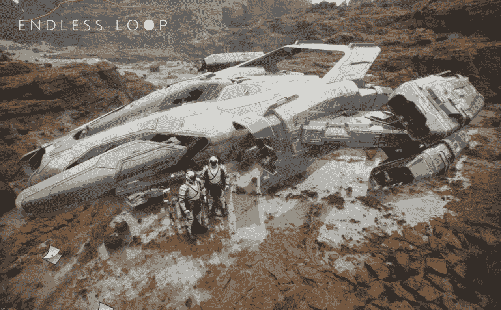
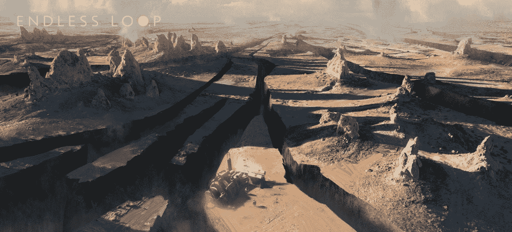
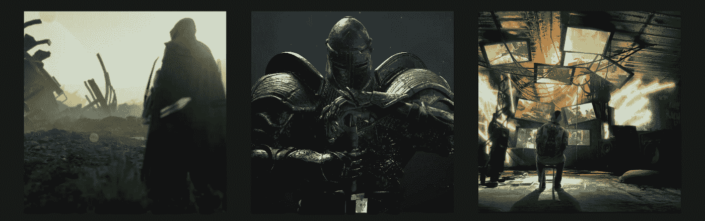
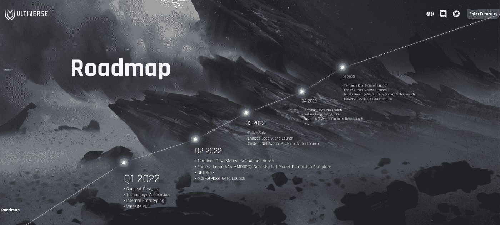
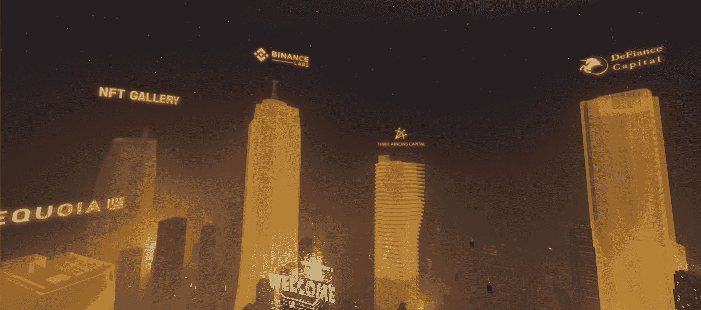

# 进入终极宇宙——它会是第一个 AAA 级游戏元宇宙吗？

> 原文：<https://medium.com/coinmonks/an-into-the-ultiverse-4147e250da0f?source=collection_archive---------33----------------------->

2022 年 4 月

数据来源:[足迹分析](https://www.footprint.network/dashboards)

如果你看过斯皮尔伯格的 *Ready Player One* ，那么 Ultiverse 会更有意义。

该项目旨在成为一个包罗万象的元宇宙，可以用 VR 玩，并以 AAA 的制作价值制作，类似于前面提到的电影中的绿洲。

该项目将于 2022 年在 Q2[BNB](https://www.footprint.network/@Bond/BSC-Chain-Dashboard?date=past180days&chain=Binance&symbol=BNB&channel=EN-242)连锁店上线。这是可以期待的。

# 什么是 Ultiverse？

Ultiverse 是一个元宇宙平台，整合了目前为止 GameFi 的所有流行元素，包括 [NFTs](https://www.footprint.network/@anzoni/GameFi-NFT-Dashboard?channel=EN-242) 、DeFi、P2E 等等。虽然其他几个项目也有类似的雄心，但这正是 Ultiverse 的独特之处。

*   **膨胀的多元宇宙生态系统**

Ultiverse 将自己描述为一个 MetaFi 项目，即一个结合了社交、游戏、MMORPG 和 Web3 元素的多元宇宙。

Ultiverse 的第一款游戏《无尽循环》( Endless Loop)是一款 [MMORPG](https://www.footprint.network/@nsm/GameFi-BlockchainRPG-Dashboard?day=past30days&game_name=BlockchainRPG&channel=EN-242) ,允许玩家探索不同的星球，夺取资源，并交换资源以赚取代币。已经有一个 Ultiverse NFT 收集，称为电子羊，以及。

Ultiverse 将提供多种游戏性，以确保可玩性。功能包括:

*   赛博朋克风格的 NFTs
*   太空主题游戏
*   多链集成

*   **经验丰富的团队**

据该项目的 AMA 称，Ultiverse 团队是一个新加坡游戏工作室，有 100 多人。核心团队成员参与了著名游戏的开发，如《埃尔登戒指》、《波斯王子》和《刺客信条》。

此外，Ultiverse 团队拥有先进的社区运营和产品设计能力。通常，用户越早，从项目的 NFTs 中获得早期价值的机会就越大。该团队发布了 NFTs 的路线图，捕捉了希望获得早期价值的用户的心态，并将其作为“种子”来推动其他操作工具的实现。

*   **广泛的风险投资支持**

Ultiverse 完成种子轮融资共[两轮，950 万美元](https://www.footprint.network/@DamonSalvatore/Fundraising-Dashboard?channel=EN-242)。支持者包括币安实验室、迪法恩斯资本、三箭资本、红杉资本和创维资本

# 怎么去终极世界？

Ultiverse 现在有几个白名单事件。以下是如何获得白名单的机会。

1)提高你的不和谐评分。如果你想在白名单中占有一席之地，你需要有一个不和谐的账户和至少 2 级的评级。为此，你必须与人交谈，以便在群体中保持活跃。通常你要在群里发 150 次甚至更多。

注意，每 30 秒只能发一次。也就是说，你需要在社区里待至少 75 分钟。如果你决定发送垃圾邮件聊天，这是不可取的。

**2)参与白名单活动。**在社区中寻找“绵羊”,如果你找到全部 20 只绵羊，你将有更大的机会获得白名单。

一只羊将在连续的 24 天中的每一天出现，并且每天将出现在不和谐的不同部分。也就是说，你至少需要登录 20 天才能领取全部 20 只羊。

**3)参加小测验。**正确回答问题，有机会获得白名单。问题都是关于 Ultiverse 的相关信息，包括事件、故事、人物、设定，这些都可以在专题资料中找到。

***此片由*** [***足迹分析***](https://www.footprint.network/?channel=ENG-209) ***社区供稿。***

足迹社区是一个世界各地的数据和加密爱好者互相帮助了解和获得关于 Web3、元宇宙、DeFi、GameFi 或区块链新兴世界的任何其他领域的见解的地方。在这里，你会发现活跃的、不同的声音相互支持，推动着社区向前发展。

> 加入 Coinmonks [电报频道](https://t.me/coincodecap)和 [Youtube 频道](https://www.youtube.com/c/coinmonks/videos)了解加密交易和投资

# 另外，阅读

*   [南非的加密交易所](https://coincodecap.com/crypto-exchanges-in-south-africa) | [BitMEX 加密信号](https://coincodecap.com/bitmex-crypto-signals)
*   [MoonXBT 副本交易](https://coincodecap.com/moonxbt-copy-trading) | [阿联酋的加密钱包](https://coincodecap.com/crypto-wallets-in-uae)
*   [雷米塔诺评论](https://coincodecap.com/remitano-review)|[1 英寸协议指南](https://coincodecap.com/1inch)
*   [iTop VPN 审核](https://coincodecap.com/itop-vpn-review) | [曼陀罗交易所审核](https://coincodecap.com/mandala-exchange-review)
*   [40 个最佳电报频道](https://coincodecap.com/best-telegram-channels) | [喜美元评论](https://coincodecap.com/hi-dollar-review)
*   [折叠 App 审核](https://coincodecap.com/fold-app-review) | [StealthEX 审核](/coinmonks/stealthex-review-396c67309988) | [Stormgain 审核](https://coincodecap.com/stormgain-review)