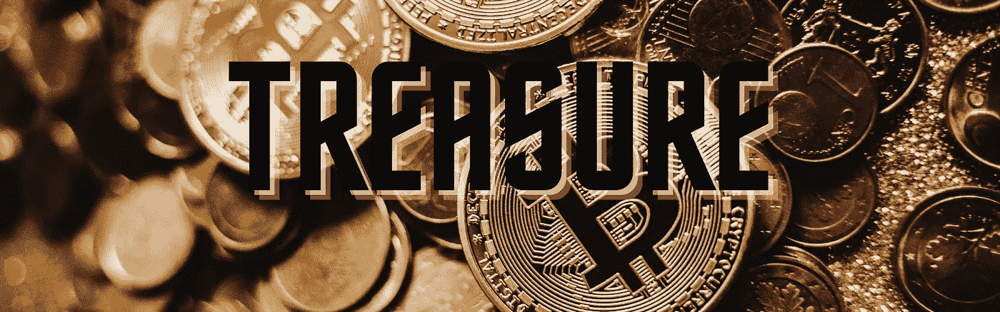
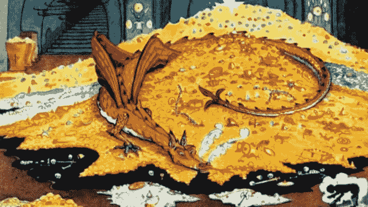

# 比特币简介:

> 原文：<https://medium.com/coinmonks/an-intro-to-bitcoin-8f22fe4d8794?source=collection_archive---------22----------------------->

## 宝藏原型

An Intro to Bitcoin

为了更好地理解比特币的必要性——尽管它很聪明——我们可以探索一下**人类**和**价值储存库**的简史。

从*非常*开始，当人类以某种方式意识到*的价值*可以隐喻性地储存在可替换的、无生命的物体中——具有[*独特*](https://en.wikipedia.org/wiki/Money) 物理属性的物体——我们把它们囤积起来，称之为 ***宝藏。***

这种宝藏的原型深深植根于人类的心灵之中。

## 价值储存的重要性

出于许多复杂的原因，宝藏的发明让我们的生活变得更好了。

当经济系统*在某种程度上*正常运转时，以财富为后盾的经济系统*—*以价值储存为后盾——使我们能够作为 [*难以想象的庞大部落*](https://en.wikipedia.org/wiki/United_States) 运转，彼此交易、*合作、*而没有任何预先存在的信任关系。

人类文明突飞猛进，因为价值 ***的隐喻储存*** 给了我们一个*放置在物理对象中的共同价值，在其中我们都可以以获取为目标——统一为一个网络。*

*难怪美元符号在我们心中占有特殊的位置。我们的眼睛照亮了宝藏原型的符号和标志。*

*金子的光亮是一种赏心悦目的景象。宝石的闪光很吸引人。*

## *处理*

*当我们同意这些*宝藏对象*可以被信任为有价值的*，*时，我们就可以创建一个有凝聚力的网络来*彼此传递价值*——无论何时，无论我们出于什么原因选择这样做。*

*财富是保持社会平稳运行的生命线——确保资源在需要的时候去需要的地方。*

*对财富的拥有赋予了个人潜在的权力，可以将这种价值转换成另一种形式的价值——无论是劳动、食物还是其他有价值的财富。*

*从本质上讲，当我们同意接受一笔付款，来交易宝藏的所有权时，我们*相信*收到的宝藏意味着一定数量的储值*与我们交易的价值成比例*。*

*这是通过对宝藏的合理经济属性的共识来确保的，并且在历史上，做到这一点的最简单的方法是选择具有 [*物理经济属性*](https://www.goldmoney.com/research/goldmoney-insights/golds-natural-monetary-properties) *的物体。**

*这一体系使得干预这些宝藏中价值的合法性变得更加困难。*

*但是像所有的发明一样，这个系统也有固有的缺陷。例如，通过欺诈和供应操纵中的抢劫或贬值，宝藏不断受到*扣押*的威胁。*

*这意味着你可以为网络提供价值，获得你的储值财富，但是仅仅因为它从你的队伍中被拿走了，它就被偷走了。然后，窃贼可以在网络中互动，交易你的*财宝，就像他是最初创造分配给它的价值的人一样。**

*最终，我们开发了减轻这些缺陷和利用这些缺陷的方法。*

**

*Smaug of [The Hobbit](https://en.wikipedia.org/wiki/The_Hobbit) lore ([J.R.R. Tolkein](https://www.tolkienestate.com/))*

*我们挖掘洞穴，建造精致的坟墓，牺牲所有权的可转化性。例如，每次你真的想用你的财富来结算一笔交易时，你就不得不召集建筑工人。这个原型意味着高安全性，但是缺乏实用性。*

## *保管人*

*我们逐渐提高了我们的金融知识，从而建立了思想学校和等级制度。*

*庞大的美联储银行和英国银行是我们文明的支柱——作为保管人，它们帮助我们管理我们的财富。*

*起初，他们通过发行新的财富来实现这一目标，这些财富的价值是从具有物理经济属性的财富中获得的。这解决了囤积具有经济属性的物品的效用问题。*

*因此，这些实体既是我们最珍贵资产的保护者，也是调停者。*

*不幸的是，也许是因为精英阶层的傲慢，随着*法定货币的发明，一种新的原型出现了。据称，这是一种更方便的存储和交易价值的方式。**

*从本质上讲，菲亚特是一笔财富，它的价值完全来自于对中央计划经济体系以及运行这些体系的人们的信任。*

**

*Chicago Federal Reserve (Photo by [Joshua Woroniecki](https://unsplash.com/@joshua_j_woroniecki?utm_source=unsplash&utm_medium=referral&utm_content=creditCopyText) on [Unsplash](https://unsplash.com/s/photos/federal-reserve-bank?utm_source=unsplash&utm_medium=referral&utm_content=creditCopyText))*

*我们大多数人都知道，在一个世界里，银行和直觉保管着我们的财富——将权力授予预选层级中的某些人。*

*用这种方法，我们为了*方便*牺牲了自己的主权。*

*几乎立刻，这些由像你我这样有缺陷的人类建立起来的实体，按照他们的喜好拉动了巨大经济机器中的杠杆，拨动了开关。*

*混乱随之而来。对这些实体决定经济价值的信任正在消退。*

## *君主*

*如今，我们有了[比特币](http://bitcoin.org)——一种仅存在于互联网上的财富，它解决了我们在这些价值储存中面临的大多数缺陷。*

*经过设计，*用户体验*模拟拥有**无记名资产**，但是*飘渺*如同互联网上所有**虚拟体验**，比特币是*宝藏原型。**

**在 2022 年，互联网比以往任何时候都更加无处不在。我们用来“接入”互联网的设备很少离开我们身边。仅存在于互联网上的宝藏也可能是一种不记名资产。**

**在比特币网络上，运行它的[开源协议](https://en.bitcoin.it/wiki/Protocol_documentation)，只有访问互联网和我们的 [*私钥*](https://en.wikipedia.org/wiki/Elliptic_Curve_Digital_Signature_Algorithm) 才意味着访问我们的比特币。这确保了除了比特币的所有者之外，所有人都无法使用比特币。**

**这当然比挖一个洞并藏一张通往那个洞的地图要好。**

****

**Blackbeard’s Treasure**

**比特币不仅高度安全，而且交易起来也很容易。比特币协议确保了每一枚比特币的 [*供给*](https://en.bitcoin.it/wiki/Controlled_supply) 和[合法性](https://en.wikipedia.org/wiki/Proof_of_work)。一个[对等](https://developer.bitcoin.org/devguide/p2p_network.html)网络确保这个*永远不会*改变。**

**当我们查看我们的[比特币钱包](https://en.wikipedia.org/wiki/Cryptocurrency_wallet)并看到我们的余额时，我们可以*保证*它的准确性。**

**这些协议模拟了存储和交易实物财富的经济属性。与用户*持有*资产不同，就像你口袋里的硬币一样，我们持有自己的*私钥。我们相信协议，而不是造币厂发行硬币并确保供应。***

## **结论:宝藏的未来**

**比特币发明至今十几年了，还没失败过。价值不断增长，并在网络上持续存在——在撰写本文时，市场市值仅略低于 1 万亿美元。**

**每天有超过 [20 万笔交易](https://ycharts.com/indicators/bitcoin_transactions_per_day#:~:text=Bitcoin%20Transactions%20Per%20Day%20is,8.92%25%20from%20one%20year%20ago.)被结算。[第二层](https://en.wikipedia.org/wiki/Lightning_Network#:~:text=The%20Lightning%20Network%20(LN)%20is,to%20the%20bitcoin%20scalability%20problem.)创新将成倍增加这一数字。**

**比特币是终极宝藏原型。**

> ***加入 Coinmonks* [*电报频道*](https://t.me/coincodecap) *和* [*Youtube 频道*](https://www.youtube.com/c/coinmonks/videos) *了解加密交易和投资***

# **另外，阅读**

*   **[3 商业评论](/coinmonks/3commas-review-an-excellent-crypto-trading-bot-2020-1313a58bec92) | [Pionex 评论](https://coincodecap.com/pionex-review-exchange-with-crypto-trading-bot) | [Coinrule 评论](/coinmonks/coinrule-review-2021-a-beginner-friendly-crypto-trading-bot-daf0504848ba)**
*   **[莱杰 vs n rave](/coinmonks/ledger-vs-ngrave-zero-7e40f0c1d694)|[莱杰 nano s vs x](/coinmonks/ledger-nano-s-vs-x-battery-hardware-price-storage-59a6663fe3b0) | [币安评论](/coinmonks/binance-review-ee10d3bf3b6e)**
*   **[Bybit Exchange 审查](/coinmonks/bybit-exchange-review-dbd570019b71) | [Bityard 审查](https://coincodecap.com/bityard-reivew) | [Jet-Bot 审查](https://coincodecap.com/jet-bot-review)**
*   **[3 commas vs crypto hopper](/coinmonks/3commas-vs-pionex-vs-cryptohopper-best-crypto-bot-6a98d2baa203)|[赚取加密利息](/coinmonks/earn-crypto-interest-b10b810fdda3)**
*   **最好的比特币[硬件钱包](/coinmonks/hardware-wallets-dfa1211730c6) | [BitBox02 回顾](/coinmonks/bitbox02-review-your-swiss-bitcoin-hardware-wallet-c36c88fff29)**