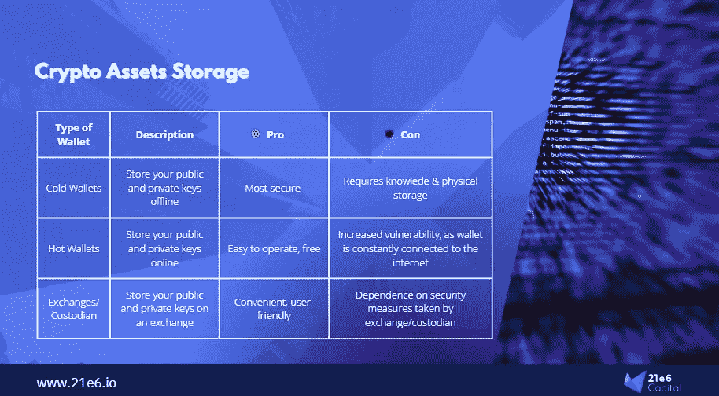
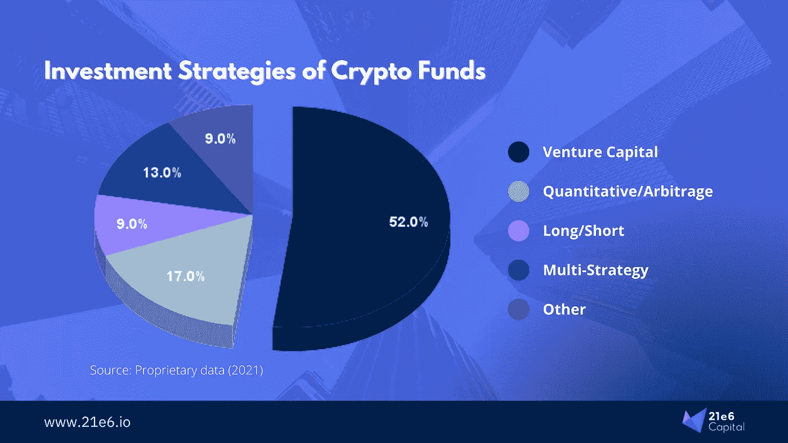
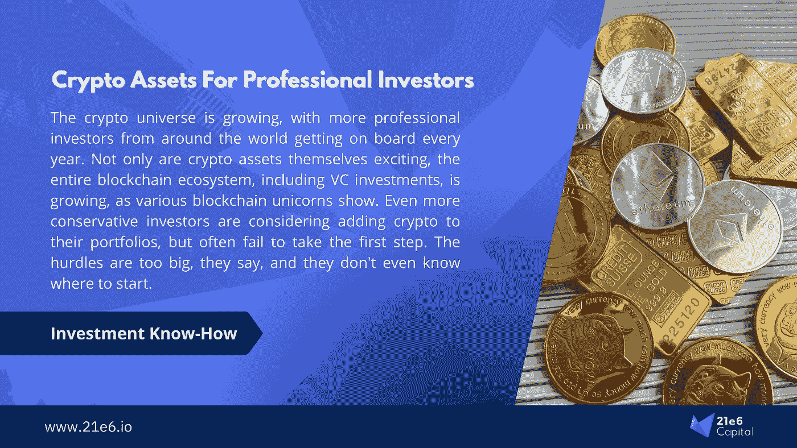

# 专业投资者投资加密资产入门

> 原文：<https://medium.com/coinmonks/an-intro-to-crypto-assets-for-professional-investors-40cd9a5a43e0?source=collection_archive---------29----------------------->

随着世界各地越来越多的专业投资者加入进来，并追随迈克尔·塞勒的脚步(尽管规模较小),加密世界正在不断壮大。不仅加密资产本身令人兴奋，整个区块链生态系统也在快速增长，风险投资也随之增长，这可以从许多区块链独角兽公司看到。甚至传统上更保守的投资者也在考虑在他们的投资组合中加入加密技术，但往往没有迈出第一步。他们说，障碍太大了，他们甚至不知道从哪里开始。本文旨在为这困难的第一步提供一些帮助，目的是解释专业投资者可以通过哪些渠道投资加密资产。
*作者:马克西米连·布鲁克纳教授，菲利普·桑德纳博士*

# 集中式交换、热钱包和冷钱包

最显而易见的加密投资途径可能是在一个流行的中央加密交易所设立自己的账户，并通过它们直接购买加密资产。通过这种方式，你可以完全控制你想购买的资产，而且由于流动性高，你可以在几分钟内随时卖出。这些交换本质上为你设置了一个钱包，基本上就是你在区块链的地址。或者，您可以使用单独的钱包提供商，如 metamask，并将您的资产发送到此地址。这样，你就不用再用集中交易所作为你的托管人了。然而，这些“热钱包”是永久连接到互联网的。虽然使用自己的钱包并通过大型交易所购买可以让您最大程度地控制和访问最多种加密资产，但风险也很高。**把大量的密码放在自己的钱包里，就好比把你投资组合中的所有证券、股票和其他投资永久地放在一个钱包里，或者把 100 公斤的黄金放在你家的金库里。在现实世界中，你会对这种安全级别感到不安，那么你为什么要以这种方式存储你的加密资产呢？有被抢的风险。在加密世界里，几乎没有可靠的保险——没了就没了。**

Figure 1: Option for storing your crypto assets

“冷钱包”可以被认为是一个更安全的选择；这些都没有联网。因此，冷钱包无法被黑，但设置它们更复杂，出售冷钱包上的资产需要更长时间，也更复杂。一个更简单的替代方案是通过提供信托托管的交易所进行交易，传统金融领域一直都是如此。例如，brse Stuttgart Digital Exchange(BSD ex)就提供了这些选项，同时还提供了易于使用的界面以及受德国监管的金融服务提供商的可靠背景。然而，多样化在这里可能被证明是困难的；在这个特定的例子中，可交易的加密资产的选择更加有限(至少目前如此)。

一般来说，你越想拥有控制权，这个过程就变得越复杂，你需要获取的知识也就越多。一个人需要操作钱包的技术知识，一个人应该了解当前的监管和税务方面，一个人需要完全靠自己管理他们的投资组合。为了有效地管理风险并获得良好的回报，需要具备专门从事加密资产的资产经理的技能。因此，在我们看来，这种方法并不适合所有想要“尝试加密资产”的专业投资者。

# 加密 etp、etn 和证书

etp、etn 和证书形式的加密资产监管金融产品也是一个有效的选择。有时，甚至可以通过当地银行直接购买。**在大多数情况下，这些工具本质上是被动包装，即它们在工具发行者持有的个人加密资产周围形成一个“外壳”。优点:买卖方便快捷，税务处理透明。**不需要技术知识，因为这里完全绕过了钱包问题。然而，通过购买加密 etp，投资者将自己暴露在发行人风险之下，而这在直接购买时是不存在的。成本也更高:预计总费用率约为 250 个基点，外加利差。此外，与用自己的钱包购买密码相关的大多数其他问题仍然存在。风险管理和重新平衡必须自己完成，加密资产的选择非常有限。

为了简单起见，对于仍然喜欢这一类别的投资者来说，加密指数 etn 提供了一个稍微好一点的选择。作为一种混合解决方案，这种 etn 比 etp 或单个加密资产的证书实现了更好的多样化，但这些 etn 几乎总是有上限加权。这意味着超过 60%投资于比特币和以太坊。此外，指数对加密资产的用途有限，因为宇宙内部(即比特币和其他加密资产之间)的相关性仍然相对较高。此外，这种方法仍然是一种简单的“只做多”策略，具有完整的市场测试。对于不想深入研究这个话题的人来说，在投资组合中增加 1-5%的加密 etn 仍然是一个不错的选择。

# 加密基金和基金中的基金

秘密基金的领域正在扩大。在撰写本报告时，全球大约有 1，000 个加密基金在运作。这些基金追求各种积极的策略，从多头/空头到套利和做市，因此提供了比 etp 和 etn 更多的选择。对于寻求区块链风险敞口但自己尚未准备好投资加密货币的投资者来说，也有许多风险投资基金。这些基金类似于常规的科技专业风险投资基金，但重点是区块链的初创公司。图 2 显示了加密基金的不同策略。我们最近发表了一篇专门关注加密基金生态系统的文章，其中我们分析了它们的住所、管理的资产、新基金的推出等等。你可以在这里阅读我们的[增长的加密基金宇宙地图。](https://assets.21e6.io/blog/crypto-fund-universe)

Figure 2: The crypto fund universe

基金的加密基金(FoF)可以被视为加密投资的“无忧无虑的套餐”。投资者有机会通过标准认购流程，直接通过他们的银行投资于受监管的工具，而不必担心技术、税收或其他问题。**当然，人们为此支付一定的溢价，但与所有其他工具相比，基金的基金提供了另一个重要方面:分散投资于不同的投资策略、风格和基金经理。**通过战略资产配置构建适当的投资组合，FoF 可以获得独特的风险调整回报。有可能将提款降低到全球股票的水平，同时保留加密资产的大部分高回报特征。因此，这种风格多样化在构建投资组合时开辟了一个更广阔的解决方案空间，因为 FOF 基金经理可以在市场中性和贝塔策略之间进行分配。

# 结论

虽然像 metamask 或 ledger 这样运行自己的钱包是最节省成本的，并提供最个性化的控制，但它也需要技术、资产管理和加密市场方面的最专业知识。etp 和个人加密资产证书极大地简化了投资，但它们相对昂贵，并且只适用于最大的加密货币。通过一些指数 etp，加密资产层面的多样化是可能的，但人们继续推动“只做多”策略，高波动性仍然存在。此外，加密市场在任何情况下都与比特币高度相关。基金和基金的基金提供了不同的积极策略。因此，通过套利和做市等市场中性策略的配置，基金的基金可以实现典型加密范围内的回报，同时大幅减少提款。

*本文是一份信息性文件，并不构成投资建议、投资建议、法律、税务或会计建议，也不构成出售或购买任何证券的要约，因此不得依赖于任何证券要约或出售。本信中表达的观点是 21e6 Capital 员工的主观观点，基于据信可靠的信息。任何意见表达(可能会在不通知的情况下更改)都是作者个人的，作者不保证所提供的任何信息或分析的准确性或完整性*。

## 大约 21e6

21e6 Capital 是一家瑞士投资顾问公司，为专业投资者提供最佳加密投资产品。21e6 Capital 已经分析了全球 1000 多只加密基金，并将其浓缩为一个精选，可以在最大限度降低下行风险的情况下产生加密风险。21e6 Capital 拥有一支经验丰富的加密和金融专家团队，他们在数字资产和 DLT 方面有着深入的知识，在此团队的支持下，21e 6 Capital 创建了一个独特的量化策略，旨在实现类似加密的回报，同时将全球股票水平的风险和波动性降至最低。21e6 资本团队建立在强大的学术基础之上，拥有领先的加密资产和分散金融出版物和研究的记录，确保为金融行业专业人士提供最先进的加密投资解决方案。

21e 6 LinkedIn 上的资本:【https://www.linkedin.com/company/21e6-dlt】T2

21e6 推特上的资本:【https://twitter.com/21e6_Digital】T4

网址: [www.21e6.io](http://www.21e6.io/)

## 作者

Maximilian Bruckner 是 21e6 Capital AG 的市场营销负责人。在此之前，他曾担任国际令牌标准化协会(ITSA)的执行董事，主要负责根据国际令牌分类(ITC)框架对加密资产进行研究和分类。他积极参与创建了世界上最大的令牌数据库，用于令牌的分类和识别数据(TOKENBASE)。马克西米利安毕业于法兰克福金融和管理学院，并在与菲利普·桑德纳教授的密切磋商下进行学术研究。您可以通过电子邮件联系 Maximilian。bruck ner @ 21e 6 . io，索取关于 21e6 Capital AG 的更多信息或询问有关本文的任何问题。你也可以在 LinkedIn 上关注 T2，了解他的最新动态。

【Philipp Sandner 博士教授创立了法兰克福学派区块链中心( [FSBC](https://t.sidekickopen87.com/s3t/c/5/f18dQhb0S7kF8cpmrkVr4RpG59hl3kW7_k2841CX6NGW36PLkb1DWFGZN1Dh2LLg4ZcWf197v5Y04?te=W3R5hFj26QkH2W4cfKWd43P1h_W3QZmG81JxXw90&si=8000000020483768&pi=8ade3d9e-01b0-4158-de77-3df023d454ee) )。2018 年至 2021 年，他被德国主要报纸《法兰克福汇报》(Frankfurter Allgemeine Zeitung，FAZ)评为[“前 30 名”经济学家](https://t.sidekickopen87.com/s3t/c/5/f18dQhb0S7kF8cpmrkVr4RpG59hl3kW7_k2841CX6NGW36PLkb1DWFGZN1Dh2LLg4ZcWf197v5Y04?te=W3R5hFj4cm2zwW4mKLS-3M0j6bW41RkwN3zcKSrW3K6jCB4mCWPMW4cHc2t3M84zZW3T30bh3F7xMzW4fNrs_4cPTnzW1Lxc331GLryyW3K5Wql43T9x2W49HS6G3T1k6SW1S1nmr1GznmZW1GJ1g23K6jDBW41nX311Y-gRrF1--VSgS6TW1&si=8000000020483768&pi=8ade3d9e-01b0-4158-de77-3df023d454ee)。此外，他属于“40 岁以下前 40 名”——德国商业杂志《资本》的排名。他是德国联邦财政部金融科技委员会和数字金融论坛的成员。他还是 [FiveT Fintech Fund](https://t.sidekickopen87.com/s3t/c/5/f18dQhb0S7kF8cpmrkVr4RpG59hl3kW7_k2841CX6NGW36PLkb1DWFGZN1Dh2LLg4ZcWf197v5Y04?te=W3R5hFj4cm2zwW3M3DBh4fdHZSW3_rh9h4kCJycF3M3CVFQs4J1&si=8000000020483768&pi=8ade3d9e-01b0-4158-de77-3df023d454ee) 、 [21e6 Capital](https://t.sidekickopen87.com/s3t/c/5/f18dQhb0S7kF8cpmrkVr4RpG59hl3kW7_k2841CX6NGW36PLkb1DWFGZN1Dh2LLg4ZcWf197v5Y04?te=W3R5hFj4cm2zwW3zh2yr4fNk1WF1QsWmxmM4N1&si=8000000020483768&pi=8ade3d9e-01b0-4158-de77-3df023d454ee) 和[block chain Founders Group](https://t.sidekickopen87.com/s3t/c/5/f18dQhb0S7kF8cpmrkVr4RpG59hl3kW7_k2841CX6NGW36PLkb1DWFGZN1Dh2LLg4ZcWf197v5Y04?te=W3R5hFj4cm2zwW3K726T3ZZmPcW3F7xMD41n_LkW4hJTXV49Rd2y348V2&si=8000000020483768&pi=8ade3d9e-01b0-4158-de77-3df023d454ee)的董事会成员，这些公司活跃于区块链初创公司的风险资本融资和加密资产投资管理。

> 加入 Coinmonks [电报频道](https://t.me/coincodecap)和 [Youtube 频道](https://www.youtube.com/c/coinmonks/videos)了解加密交易和投资

# 另外，阅读

*   [最佳加密分析或链上数据](https://coincodecap.com/blockchain-analytics) | [Bexplus 评论](https://coincodecap.com/bexplus-review)
*   [NFT 十大市场造币集锦](https://coincodecap.com/nft-marketplaces)
*   [AscendEx Staking](https://coincodecap.com/ascendex-staking)|[Bot Ocean Review](https://coincodecap.com/bot-ocean-review)|[最佳比特币钱包](https://coincodecap.com/bitcoin-wallets-india)
*   [Bitget 回顾](https://coincodecap.com/bitget-review) | [双子星 vs BlockFi](https://coincodecap.com/gemini-vs-blockfi) | [OKEx 期货交易](https://coincodecap.com/okex-futures-trading)
*   [美国最佳加密交易机器人](https://coincodecap.com/crypto-trading-bots-in-the-us) | [经常性回顾](https://coincodecap.com/changelly-review)
*   [在印度利用加密套利赚取被动收入](https://coincodecap.com/crypto-arbitrage-in-india)