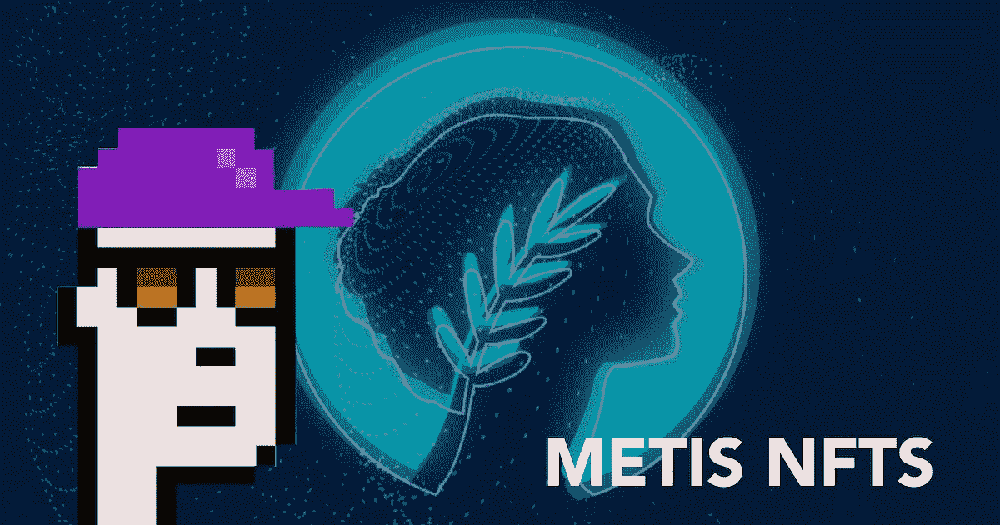
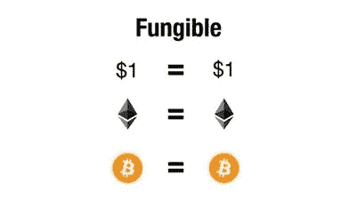
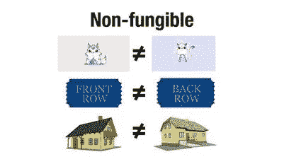
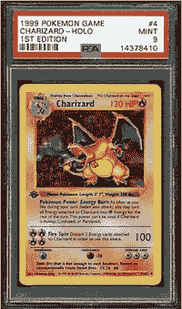
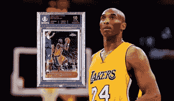
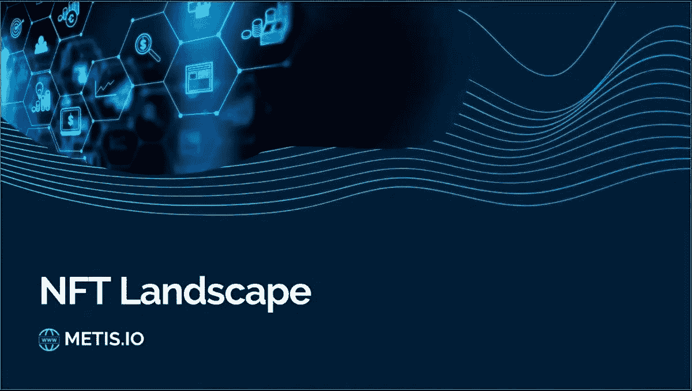

# Metis NFTs 简介

> 原文：<https://medium.com/coinmonks/an-intro-to-metis-nfts-d097b400135?source=collection_archive---------59----------------------->

Metis Punk NFT on Metis

# NFTs

无论如何，猿类图片有什么大不了的？

在我上一篇关于新梅蒂斯 NFT 大桥的帖子中，我认为向进入[@梅蒂斯道](https://twitter.com/MetisDAO)生态系统的新用户解释什么是 NFT 以及在建设领先的 NFT 枢纽方面有什么[$梅蒂斯](https://twitter.com/search?q=%24METIS&src=cashtag_click)计划是至关重要的。

首先，什么是 NFT？嗯，这是一个不可替代的令牌。那是什么意思？这意味着它是指向数字文件的唯一数字标记。这个标记或指针不能被复制。与加密货币代币不同，加密货币代币具有相同的质量，并且可以在不改变钱包的情况下相互交换。另一方面，非功能性测试是🂡🂱🃑🃁的一种表征

Fungible Tokens

Non-fungible Tokens

## *收藏家*

可互换的加密货币交易起来有趣又酷！为什么我们需要唯一的令牌？！嗯，你玩过口袋妖怪卡或者收集过稀有的运动卡吗？如果每个人都有你的第一版 Charizard 或超级罕见的科比·布莱恩特新秀卡，那就没什么意思了，不是吗？

Rare 1st edition Charizard Card

Rare Kobe Bryant Rookie Card

现在你明白为什么 [@BoredApeYC](https://twitter.com/BoredApeYC) 用最高调的人收集它接管了世界——NFT 建立社区！但是对于收藏者来说，NFT 不仅仅是可收藏的物品。他们还可以标记资产和合同！看看这张 [$METIS](https://twitter.com/search?q=%24METIS&src=cashtag_click) 的效用图——

NFT Utility Chart by Metis

## **Web3 实用程序**

这个世界甚至还没有想到 NFTs 的所有可能的用途。房产，门票，身份证，等等！我们才刚刚开始！

它在 Web3 中的应用潜力似乎是无限的。但是需要有 Web3 基础设施来释放它的全部能力。

这就是 [$METIS](https://twitter.com/search?q=%24METIS&src=cashtag_click) 的用武之地…

Metis NFT Landscape

就像我在以前的帖子中所说的， ***互操作性*** *是巨大的关键*

资产孤岛需要结束，这样 NFT 就可以变得与链和层无关。这是网络 3 经济真正被释放的时候

如果你错过了我的最后一个帖子，是的，你猜对了— [$METIS](https://twitter.com/search?q=%24METIS&src=cashtag_click) 正在解决这个问题…

Metis NFT Hub Thread

***超速行驶***

由于交易费用较低，NFT 的借贷和细分应该会加速。NFT 持有者快速而廉价地获得流动性，可以让 NFT 市场在 [$METIS](https://twitter.com/search?q=%24METIS&src=cashtag_click) 超速运转。我们来得太早了。我甚至没有提到元宇宙和游戏的潜力！

*博彩*

这里有一个即将到来的 P2E·NFT 游戏的例子，该游戏计划于 4 月份发布，名为 MetisKart，作者是[@ metis ATS](https://twitter.com/MetisCats)—

*未来 NFT 蓝筹股*

目前我最喜欢的一些释放仙女座菌株潜力的 NFT 项目是…

[@StarLedgerNFT](https://twitter.com/StarLedgerNFT)

[@BinaryDAO_fi](https://twitter.com/BinaryDAO_fi)

[@AndromedaToadz](https://twitter.com/AndromedaToadz)

[@NeptuneGameFi](https://twitter.com/NeptuneGameFi)

在我写这篇文章的时候，有太多的版本被发布了…如果我们准备好发射了，Idk！

给我的梅蒂斯社区更多的爱和祝福。

> 加入 Coinmonks [电报频道](https://t.me/coincodecap)和 [Youtube 频道](https://www.youtube.com/c/coinmonks/videos)了解加密交易和投资

# 另外，阅读

*   [40 个最佳电报频道](https://coincodecap.com/best-telegram-channels) | [喜美元评论](https://coincodecap.com/hi-dollar-review)
*   [折叠 App 审核](https://coincodecap.com/fold-app-review) | [StealthEX 审核](/coinmonks/stealthex-review-396c67309988) | [Stormgain 审核](https://coincodecap.com/stormgain-review)
*   [购买 PancakeSwap(蛋糕)](https://coincodecap.com/buy-pancakeswap) | [俱吠罗评论](/coinmonks/coinswitch-kuber-review-1a8dc5c7a739)
*   [瓦济里克斯 NFT 评论](https://coincodecap.com/wazirx-nft-review) | [比茨盖普 vs 皮奥克斯](https://coincodecap.com/bitsgap-vs-pionex) | [坦吉姆评论](https://coincodecap.com/tangem-wallet-review)
*   [如何使用 Solidity 在以太坊上创建 DApp？](https://coincodecap.com/create-a-dapp-on-ethereum-using-solidity)