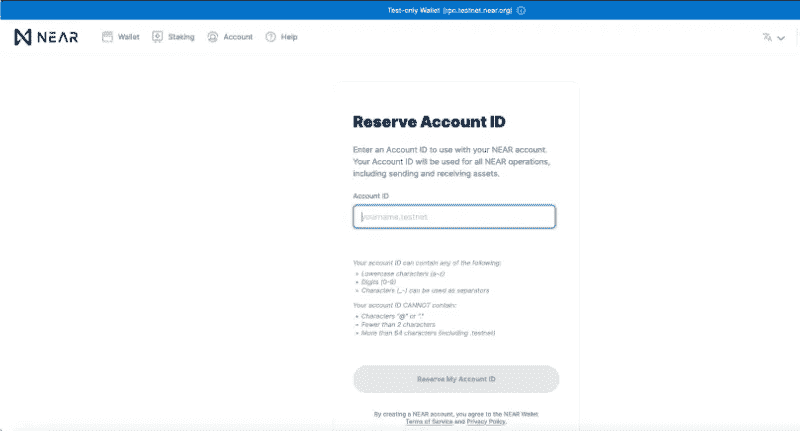
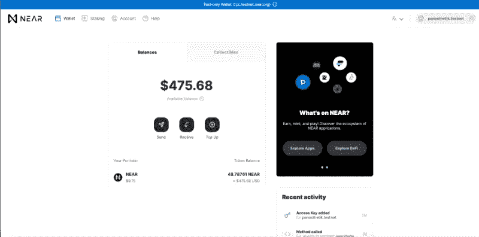
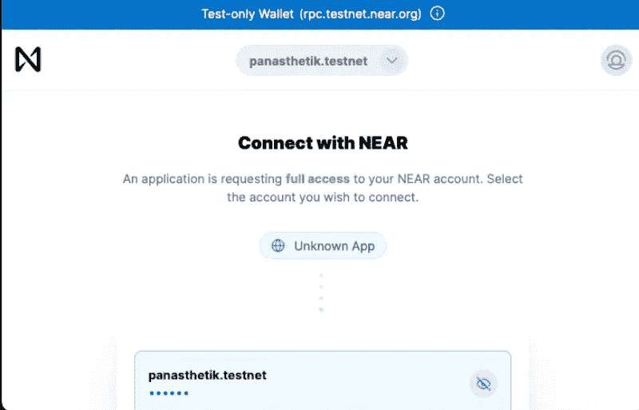
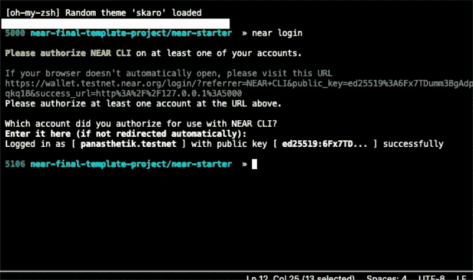
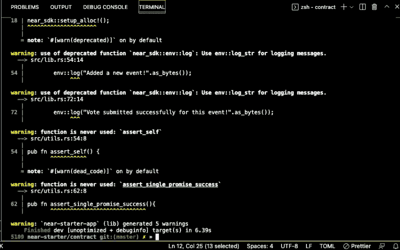

# Rust，WASM，Parcel 和 React 的近 Dapp 开发介绍-第 1 部分。

> 原文：<https://medium.com/coinmonks/an-intro-to-near-dapp-development-with-rust-wasm-parcel-and-react-part-1-e500a3abc597?source=collection_archive---------3----------------------->


本文将通过一个简单的、功能性的、从头到尾的例子分三部分向现有的 Web3 开发人员介绍 Near 协议。

**本教程第 1 部分和第 2 部分的完整代码库可以在** [**这里**](https://github.com/Panasthetik/near-starter-app) **找到。**

如果你来自以太坊甚至索拉纳，那么从现在(2022 年 3 月)开始，有一件事几乎与众不同，那就是没有很多最近的教程来开发一个具有可升级模板的基本的、全功能的应用程序——前端、后端和单元测试。

此外，我认为协议的契约是用 Rust 或 AssemblyScript(然后编译成 WASM)编写的，这一事实倾向于阻止潜在的开发者直接进入。

最后——在我看来，在各种新闻文章和报道以及像本文这样的开发人员教程中，近区块链和底层令牌都没有得到充分的体现。

我希望通过这篇文章来帮助缓解这些问题，使 Near 协议更容易为新的创作者所接受，同时也帮助潜在用户了解一些使 Near 成为一个令人敬畏、有趣、快速、鼓舞人心、具有巨大潜力的区块链的许多事情。所以让我们开始吧！

**基础知识。**

首先，为了让我们对 Near 的介绍更容易，本教程直接假设了一些事情:

1.  你已经在以太坊，EVM 或者第二层链，或者索拉纳或者类似的平台上进行了初步开发，并且拥有开发工具的经验，比如松露，安全帽，锚或者铸造。
2.  您运行的是 Linux 或 MacOS，并且安装了 Rust，包括最新的稳定版本、Cargo package manager 和 Rust extension/analyzer for VSCode(本文将使用 vs code)。
3.  Node.js 应安装在 14 . 19 . 0–17 . 1 . 0 版本，并且您的 NPM 至少是 8.3.0 以上版本
4.  您熟悉智能合同部署、汽油费、钱包账户、交易浏览器等。—基本的区块链原语。
5.  最后——尽管基本的 Rust 很有帮助，React 的经验也很棒，但要理解这个例子和所有东西是如何交互的，你不需要在专家水平上了解任何一个。

**设置我们的 Near Testnet 钱包。**

我们要看的第一件事是在 Near Testnet 上创建一个钱包/帐户，并获取一些测试 Near 令牌以部署在网络上。你可以去[这里](http://wallet.testnet.near.org)了解如何做到这一点，因为它非常类似于其他钱包(MetaMask，SolFlare):

 [## 近钱包

### 编辑描述

wallet.testnet.near.org](https://wallet.testnet.near.org) 

与 Near already 的一个有趣的区别是，Near 帐户地址显示为人类可读的文本(例如:“myaccount.testnet”表示测试，或者“myaccount.near”表示 mainnet)。只要您建议的名称尚未被采用，您就可以创造性地使用这些帐户名称。此外，无需保留单独的类似 ENS 的名称(。ETH)或。SOL like on Solana —有了 Near，您就拥有了开箱即用的能力，您部署的合同可以直接映射到您选择的地址！！



当我们在链上实际部署智能合同时，我们将选择子账户名称作为包含合同地址的最佳实践，如下所示:

contract.myaccount.testnet(用于测试)

contract.myaccount.near(用于 mainnet)

关于 Near 需要注意的一点是，每个子地址只能部署一个智能合约，这可以保持有序，并且可以升级(我们将在本系列的后面看到如何升级或替换合约)。

一旦我们创建了近测帐户，我们应该有一个样本近测令牌余额开始，这将有助于我们的下一步。



建立我们的环境。

开始组织我们的开发环境的最佳方式是使用 NPM 安装 Near CLI，如下所示:

```
npm install near-cli
```

正确安装后，您应该能够在终端中验证当前版本，如下所示:

```
near --version
```

接下来，使用 Near CLI，我们将使用以下内容登录 Near Testnet:

```
near login
```

当我们运行这个程序时，应该会弹出一个浏览器屏幕，指示在“rpc.testnet.near.org”上的登录请求，它应该(如果您正确地打开了您的 near 帐户)要求您批准登录事务。



批准后，您将看到一个屏幕，指示您登录成功，现在您可以关闭浏览器窗口并返回到 VSCode 终端。在终端中，有一条清晰的消息，表明您已使用指定的登录到近 CLI。测试网络地址:



太好了！我们有一个安装了 CLI 的 Near wallet 帐户(myaccount.testnet ),我们已经登录到 Near testnet，现在我们准备在 VSCode 中启动一个包含我们的项目目录的新项目。

*注意:虽然已经有一个 NPX 包来创建一个包含 Rust 或 AssemblyScript starter kits(带 React)的近似样板文件，但在本教程中，我已经通过消除 JavaScript 测试方法和避免诸如 Webpack、Babel、Jest、Nodemon、ShellJS 和其他一些节点依赖来简化这个过程。我认为在某些情况下，这些并不总是开箱即用，我们可以避免花时间诊断 JS/NPM 错误，而是专注于我们的近部署。*

*对于我们的近智能合同，我们将从头开始创建这个项目，并用 Rust 编写单元测试。在第 3 部分的后面，我们将使用最新的包并专门对前端做出反应。我希望这种方法能让新的 Near 开发人员稍微轻松一点。*

因此，在您的 VSCode 终端中，我们将开始创建一个新目录，如下所示:

```
mkdir near-starter-dappcd near-starter-dapp
```

在这个主目录中，让我们创建一个名为“contract”的文件夹，其中包含我们的 Rust 代码和编译文件，如下所示:

```
mkdir contract cd contract
```

在这个“合同”目录中，我们需要做两件事——使用 Cargo 初始化一个新的 Rust 项目，并在编译到 WASM 之前编写一些有用的脚本来构建和测试我们的 Rust 代码。

在“合同”中，输入以下内容:

```
cargo init --lib
```

正如我们所看到的，这创建了一个空的 Rust 项目，并为我们提供了开始编写智能契约所需的目录。“src”文件夹包含 Rust 文件，而“cargo.toml”将为我们的项目指定一些需求和依赖项。

在我们继续我们的 Rust 代码之前，有一件重要的事情我们需要添加到我们的 Rust 配置中，以便能够正确地编译我们的合同，这就是部署的 WASM 目标。在终端中输入以下内容:

```
rustup target add wasm32-unknown-unknown
```

一旦我们这样做了，我们的目录就准备好了，让我们创建一些简单的 shell 脚本，我们将需要在这个“契约”目录中执行简单的构建和测试终端操作。我们将创建以下脚本:

build.sh

```
#!/bin/bashset -eRUSTFLAGS='-C link-arg=-s' cargo build --target wasm32-unknown-unknown --releasecp target/wasm32-unknown-unknown/release/*.wasm ./res/
```

build .蝙蝠

```
cargo build --target wasm32-unknown-unknown --releasecopy target\wasm32-unknown-unknown\release\*.wasm res
```

测试. sh

```
#!/bin/bashset -ecargo test -- --nocapture
```

创建这些脚本后，我们的“合同”目录应该如下所示:

```
contract--|
          |src
          |build.sh
          |build.bat
          |test.sh
          |cargo.toml
          |cargo.lock
```

我们现在不担心 cargo.lock 文件，但是我们想用下面的代码编辑 **cargo.toml** 文件:

设置好这个目录结构后，让我们在“contracts”文件夹中创建最后一个目录:

```
mkdir res
```

我们最终的“合同”目录结构是:

```
contract--|
          |src
          |build.sh
          |build.bat
          |test.sh
          |cargo.toml
          |cargo.lock
          |res
```

现在我们的 Rust 环境已经设置好了，我们已经准备好为 Near 编写智能合约了！

**开始我们近乎智能的合同**

让我们检查一下主“contracts”文件夹中的“src”目录。

在内部，有一个名为“lib.rs”的 starter Rust 文件—在 VSCode 中打开该文件，让我们简单地看一下:

目前所做的只是运行一个简单的测试函数，如果我们现在运行我们的“test.sh”脚本(从我们的“contract”文件夹根目录)，文件会被快速编译并测试，终端中的结果如下:

```
running 1 test
test tests::it_works ... ok
```

现在，我们想把我们的“lib.rs”文件和**完全**用下面的代码覆盖它:

关于我们的“活动”合同的一些想法和解释。

现在，这是相当多的代码，因为这主要不是一个 Rust 教程，我将把它留给开发人员来研究每个导入、结构和函数在这个文件中做什么。

关于 Rust 宏和 Near SDK 的重要一点是——就像索拉纳、埃尔隆德和其他基于 Rust 的区块链一样，SDK 处理大量的抽象(这意味着它“包装”并大大简化了您的代码)。如果我们在低级 Rust 中输入上面的代码所做的一切，我们将有更多的代码要写，这对于入职来说将更加令人生畏。

简单总结一下我们的智能合同正在做的事情，这个项目创建了一个简单的应用程序，用于列出建议的活动，包括标题、描述和建议的预算。任何人都可以使用他们的 Near wallet 登录该应用程序来创建这些活动，然后任何人登录该应用程序也可以对列出的拟议活动进行投票。

我们将在创建前端时研究一些细节，并在部署时对底层功能提出改进建议。

但是首先，让我们向我们的项目添加两个 Rust 文件，这样我们就有必要的箱子和模型(常量/实用函数)来补充我们的主应用程序文件。

首先，我们将创建一个名为“utils.rs”的文件，并用以下内容保存它:

接下来，我们创建一个文件“models.rs ”,并在其中保存以下内容:

我们的“models.rs”文件包含一些重要的结构(主要是“Event”结构及其实现块)以导入到我们的主“lib.rs”文件中。这些可以在以后添加，这取决于我们可能希望在我们的整体合同中体现的其他内容(例如日历、进度、财务或成员目录结构)。

“utils.rs”文件旨在包含一些用于各种单位转换的核心变量、常量和函数。像“models.rs”一样，这个文件也可以在以后引入新功能时进行修改。现在，这个文件只包含两个通用函数来帮助承诺和序列化。

完成这三个文件后，它们都在“src”目录中，并准备好进行初步的“构建”,以查看我们的项目是否可以编译并准备好进行测试和部署。

在 Cargo 中建立智能合同并确保其编译。

在“contract”的根目录下，运行“build.sh”脚本，如下所示(这种方法在 Mac 和 Linux 之间会有所延迟——在 Linux 中，您不需要在终端命令前使用“bash ”,在 Mac 上，您的操作如下所示) :

```
bash ./build.sh
```

在短暂等待 Cargo 下载板条箱、安装所有 Rust 依赖项、编译和组装所有东西之后，我们的“合同”目录中应该会有一些新东西。

首先，您会注意到一个新创建的“目标”文件夹。这是随 Cargo package manager 提供的标准 Rust build 文件夹，它使输出文件的组织变得简单明了。在这个“目标”文件夹中是我们的 Rust 应用程序的初步构建(二进制文件)，其中一个构建在一个特殊的“wasm32-unknown-unknown”文件夹中。

现在，我们可以忽略“目标”中的这些文件，因为我们想要的近区块链是我们专门复制(使用我们的“build.bat”脚本自动化)到我们的 ***其他*** 构建目录的 WASM 文件——一个名为“res”的文件。

在“res”中，我们看到一个文件“ **near_starter_dapp.wasm** ”，这是我们最终需要在 near 上部署的文件。为了方便起见，我们实际上是从“target”中复制这个文件的，所以我们不必在每次进行更改和重新编译时深入挖掘目标/构建目录的几个层次来找到这个文件。

***Rust****中的错误消息提示:您可能已经完成了初步构建(显示已完成)，但您仍然会在终端中看到许多警告(用黄色强调)。别担心，我们仍然成功地编制了我们的合同！如果有任何“红色”警告，您会看到更严重的错误，项目将不会编译，直到解决。目前，这完全没问题:*



*随着我们使用 Rust 的最新稳定版本推进我们的项目，Cargo package manager 和 rustc 编译器将努力告诉您什么是优化的、最新的和正确的代码。一些警告将与我们在“cargo.toml”中指定的 Near SDK 版本相关，而另一些则与稍旧的语法或 Rust 版本本身有关。*

**我们教程的下一步，第 1 部分结束。**

本例不涉及太多的技术细节—我们使用了 Near SDK 版本 3 的一些方法/宏，而其他的(用于下一章的测试)将使用 Near SDK 版本 4 的一个新的、改进的“VMContext”构建器(一个测试模拟环境宏),该版本目前仍在开发中。对于我们在“cargo.toml”中指出的整体情况，我们可以在整个教程中保持 SDK 版本为“4.0.0-pre.4 ”,而不必降级到大多数教程中使用的早期版本。

说到测试，为什么不现在就在 Rust 中写几个单元测试，在我们最终的 WASM 构建之前运行，这样我们就知道它做了需要做的事情？

幸运的是，用 Rust 编写我们的测试非常容易，当然，一旦单元测试被添加到我们的主契约文件(lib.rs)中，我们已经在我们的“契约”根上准备好了测试脚本(test.sh)。此外，出于多种原因，最好用我们用来编写合同的本地语言(在我们的例子中是 Rust)来编写我们的测试，这样我们就可以从 Cargo 和编译器早期了解我们的代码是否正确运行，或者我们需要在将它编译到我们在 WASM 的“发布”文件中以进行合同部署之前对其进行调整。

**在本教程的下一部分中，我们将编写一些 Rust 单元测试，根据我们的智能契约运行它们，在 Near-CLI 中创建一个部署子帐户，将我们的契约部署到 Near Testnet，并且在我们继续第三部分中的 React 前端集成之前，实际上能够在控制台中与它进行交互。**

**我希望您喜欢这个向像您一样的新开发人员介绍 Near 协议的三部分系列的第一部分！**

感谢您的阅读，下次再见……—Panasthetik。

**资源:**

 [## 开始使用|靠近文档

### NEAR 平台上的开发分为两个主要类别:这里是对您…

docs.near.org](https://docs.near.org/docs/develop/basics/getting-started) [](https://docs.rs/near-sdk/latest/near_sdk/index.html) [## near_sdk - Rust

### 智能合约可用的 env 区块链特定方法。这是一个包装器，围绕着一个低级…

文件](https://docs.rs/near-sdk/latest/near_sdk/index.html) [](https://www.rust-lang.org/) [## 锈

### Rust 速度惊人，内存效率高:没有运行时或垃圾收集器，它可以支持关键性能…

www.rust-lang.org](https://www.rust-lang.org/)