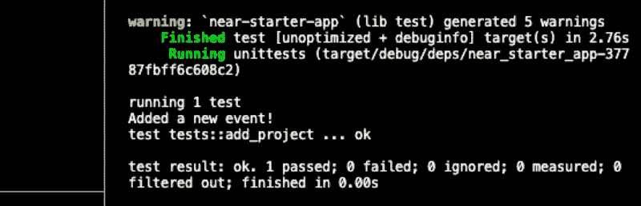
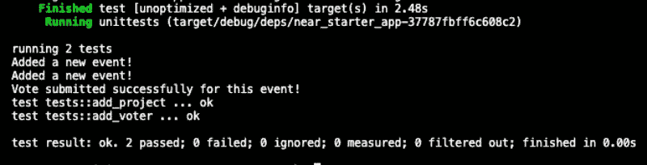

# Rust，WASM，Parcel 和 React 的近 Dapp 开发介绍-第 2 部分。

> 原文：<https://medium.com/coinmonks/an-intro-to-near-dapp-development-with-rust-wasm-parcel-and-react-part-2-6bd3a071b74e?source=collection_archive---------8----------------------->


本文用一个简单、实用、从头到尾的例子向现有的 Web3 开发人员介绍了 Near 协议，分为三个部分。

对于那些刚刚加入我们的人来说，请随意查看本教程的第 1 部分 [**这里**](/coinmonks/an-intro-to-near-dapp-development-with-rust-wasm-parcel-and-react-part-1-e500a3abc597?source=friends_link&sk=216f6365fcd46133ae278961c5260243) 以加快速度！

**本教程第 1 部分和第 2 部分的完整代码库可以在这里** **找到** [**。**](https://github.com/Panasthetik/near-starter-app)

上周，我们在区块链附近开始了我们的开发者之旅，涵盖了创建智能合约以部署在 Near Testnet 上的一些基本先决条件，并能够相应地设置我们的 Near wallet 和 Rust 环境。然后，我们完成了第 1 部分，使用 Cargo 和“contract”目录中的“build . sh”bash 脚本初步构建了我们与 WASM 的合同。

在今天的会议中，我们将继续我们的项目，首先编写一些 Rust 单元测试来运行我们的 smart 契约。然后，我们将在 Near-CLI 中创建一个部署子帐户，将我们的合同部署到 Near Testnet，并且在继续第 3 部分中的 React 前端集成之前，实际上能够在开发人员控制台中与它进行交互。

所以我们继续吧！

**编写 Rust 单元测试。**

首先，让我们再看一下我们的“事件”契约，看看我们需要在 Rust 单元测试中测试哪些函数。如果我们再次打开“src”文件夹中的“lib.rs ”,我们会看到上次写的以下内容:

因为我们知道这个契约需要 1)允许用户用他们的 Near wallet 登录来创建一个事件，2)让用户能够对列出的事件进行投票——我们可以立即指定一些功能作为我们的单元测试的目标。

在 Rust 中，最简单的方法是首先确定启动契约状态更改的两个函数:

1.  add_event()

2.add_vote()

我们将首先检查“add_event”及其相关函数—

第 43–55 行(在上面的“lib.rs”中):

“添加事件”功能是我们合同中的主要功能——它在事件列表中打开一个项目，带有标题、描述和建议的预算。一旦我们用“Event::new”调用“Event”struct(我们将它声明为我们的“models.rs”文件)，我们就能够在 Near Blockchain 上创建一个新事件，该事件稍后将被我们的前端引用，并显示在我们的 Dapp 的主页上。

为了验证一个事件是否被添加到链上，我们还有另外两个助手函数，它们首先显示事件列表…

```
// lines 57-61 (in “lib.rs” above)pub fn list_events()...
```

…然后还可以跟踪我们合同范围内的所有事件/项目的数量…

```
// lines 63-65 (in “lib.rs” above)pub fn event_count()...
```

我们需要做的是编写一个单元测试来验证这个整体函数是否如预期的那样工作，因此让我们将以下内容添加到“lib.rs”文件的*底部*:

*重要提示:上面的文件应该粘贴在主“契约”实现括号之外(在“lib.rs”中的第 82 行之后)。如果您将测试代码包含在主契约体中，您将在 Cargo 中得到一个编译错误，告诉您它超出了范围！！*

**在我们上面的测试代码中要考虑的重要事情。**

在 Rust 中执行智能合约的一个很棒的事情是，我们还可以在 Rust 中编写单元测试，并在 Cargo 中运行它们，在我们考虑在 WASM 进行最终部署之前，就可以利用令人难以置信的编译器和错误处理功能。

看一下我们从上面开始的单元测试，它针对“add_event”函数进行测试，与 JavaScript 中可能更“冗长”的测试环境(例如 Mocha)相比，这个系统的可读性和可理解性变得非常明显。

所以对于从我们的主契约调用的“add_event”函数:

```
contract.add_event()
```

我们设置了一个测试模拟环境(在我们的 Near SDK 中也称为“上下文”),以便能够想象一个场景，其中“alice”表示一个 Near 帐户(参见设置代码中的“alice.testnet ”),与一个新的契约实例(“Contract::new”)进行交互，然后在我们的“create_project”单元测试中创建一个新事件**。**

在这个整体测试中调用的另一个相关契约函数被分配给“result”变量，如下所示:

```
let result = contract.event_count()
```

这样做的目的是验证“add_event()”的结果—它确保在我们的测试中确实创建了一个新事件，并且总事件数为“1”:

```
assert_eq!(result, 1);
```

太好了！那么，为什么不运行这个测试，看看我们是否通过，只是用 Near SDK 启动一个上下文，让 Cargo 做剩下的事情呢？

在您的终端中，在“contract”文件夹中，执行测试脚本:

```
bash ./test.sh
```

就像之前在我们的初步构建期间一样，Cargo 将组装我们的板条箱和依赖项，编译我们的代码，从 SDK 附近创建“上下文”模拟环境，并使用新的契约实例运行我们的单元测试，因为它将部署在真实的区块链上。完成此过程后，您应该会在 VSCode 终端中看到以下内容:



太棒了，我们的第一个 Rust 单元测试通过了，它表明在模拟的“上下文”环境中，创建了一个新事件！

我们将为其构建单元测试的下一个函数是“add_vote()”函数。这体现在我们的主合同代码中:

第 67–75 行(在上面的“lib.rs”中):

这个函数获取一个事件，使它“可变”，这样就可以用“投票”来修改它，并执行将这个信息添加到由事件 ID(“ID:usize”)映射的事件中的过程。这里的“投票者”是指任何使用他们的 Near wallet 登录到 Dapp 的人，这将自动授予他们访问该功能的权限。

*有关 Near 帐户(“前任”、“签名者”和“当前”)的更多信息，请在此处* *查阅官方 Near SDK 文档* [*，因为这已经超出了本文的范围。*](https://www.near-sdk.io/zero-to-hero/beginner/actions)

在主契约的末尾(add_vote 之后)还有一个名为“get_total_votes()”的“helper”函数，它有助于确认是否添加了投票，并且我们还将在单元测试中引用:

第 77–81 行(在上面的“lib.rs”中):

**对于下面的 add_voter 单元测试，我们将创建一个与上面的 add_project 单元测试非常相似的结构。我们将把下面的代码添加到“lib.rs”底部的单元测试的末尾，作为“mod tests”括号{}内的第二个测试块(我将很快概括整个“lib.rs”文件，因此所有的闭包都很清楚):**

在这里，我们为“alice”和“Contract::new”进行与之前测试相同的“上下文”构建和帐户初始化。但是在这种情况下，我们在这里添加了代码…

```
contract.add_vote(0)
```

…其中“0”是事件 ID，然后…

```
let result = contract.get_total_votes(0)assert_eq!(result, 1)
```

一票完全正确，因为“alice”在这里创建了一个项目(事件列表中的项目 ID“0”)，并且**和**也投了一票(“1”代表项目 ID“0”)。

**在货物中包装单元测试。**

现在，我们将只包括这两个 Rust 单元测试，如果一切都正确，我们应该有以下完整的“lib.rs”文件准备好运行两个测试:

在我们的 VSCode 终端的“contract”文件夹中，让我们再次运行我们的“test.sh”脚本，如下所示:

```
bash ./test.sh
```

像往常一样，在短暂的编译期之后，我们现在应该看到两个单元测试都在控制台上通过，如下所示:



我们的 Rust 单元测试已经通过，我们已经准备好为我们的 WASM 合同做最后的构建，然后将它部署到附近的 Testnet！

**在部署前建立我们的 WASM 文件，并准备一个 Near Testnet 合同子账户。**

简要回顾一下我们在第 1 部分开始时所做的事情，我们可以回忆起，首先我们在“wallet.testnet.near”创建了一个近 Testnet 帐户，如浏览器所示:


在本课的剩余部分，我们将把大部分时间花在 VSCode 终端和 Near CLI 上。首先，让我们重复一下第 1 部分中的帐户登录过程:

```
near login
```

这样，我们在浏览器中检查弹出的交易批准，直到在 VSCode 终端中再次看到类似的内容:


接下来，我们需要做**一些全新的事情** —我们需要分配一个子帐户作为占位符，以便在上传之前在 Near 上“包含”我们的智能合约部署。

通常，最佳实践是使这个子帐户成为从您使用的主 Testnet wallet 派生的地址，如下所示:

近启动器-dapp。<your account="" name="">。测试网</your>

…或者，如果我们的主账户是“我的账户”:

near-starter-dapp . my account . testnet

因此，在使用“myaccount.testnet”作为我们的示例基本 wallet 地址的终端中(您的地址可能会不同，但应该遵循相同的结构)，我们需要输入以下内容，并密切注意此处 Near CLI 的语法:

```
near create-account near-starter-dapp.myaccount.testnet --masterAccount myaccount.testnet
```

作为响应，在终端中，您应该会看到以下确认信息，表明您的子帐户已创建:

```
Saving key to '/Users/<yourusername>/.near-credentials/testnet/near-starter-dapp.myaccount.testnet.json'Account near-starter-dapp.myaccount.testnet for network "testnet" was created.
```

此子帐户的密钥对存储在. json 文件中，作为您的。near-credentials”目录，现在我们准备在 near 上的这个子帐户地址准备我们的部署合同。

回到我们项目的“contract”文件夹，我们现在将最后一次运行“build.sh ”:

```
bash ./build.sh
```

构建完成后，在我们的主“contract”文件夹中的“res”目录中进行检查。应该有一个文件叫做:" **near_starter_dapp.wasm** "

再次在终端中，让我们运行下面的代码作为我们的部署脚本—这将实际启动我们的子帐户的部署过程:

```
near deploy --accountId near-starter-dapp.myaccount.testnet --wasmFile res/near_starter_dapp.wasm
```

如果一切顺利，您应该在控制台中看到这样的确认，即您的 Near testnet 智能契约现在已经部署了:

```
Starting deployment. Account id: near-starter-dapp.myaccount.testnet, node: https://rpc.testnet.near.org, helper: https://helper.testnet.near.org, file: res/near_starter_dapp.wasmTransaction Id 3fqzA9vpuKSSsrBry9jE2k2FjoKFZBCdwPU38fTcPVkTTo see the transaction in the transaction explorer, please open this url in your browserhttps://explorer.testnet.near.org/transactions/3fqzA9vpuKSSsrBry9jE2k2FjoKFZBCdwPU38fTcPVkT
```

请注意—您的交易 ID 将与上述不同！

我希望您的合同部署成功——我知道这个过程是一个漫长的过程，但我认为一旦您在 Near 上实际部署，您就会同意这个过程不仅非常轻松，而且在方法上对开发人员非常友好。

**智能合同与 NEAR 的交互:让我们来谈谈我们的合同吧！**

现在我们在 Near Testnet 上有了我们的合同，我们可以通过以太坊或 Solana 上的 RPC 来做你们中许多人已经做过的那种合同调用。这是一个契约调用的例子，它实际上在我们的智能契约中创建了一个新的事件列表，就像在我们的单元测试中一样。如果我们将它准确地粘贴到我们的控制台中:

```
near call near-starter-dapp.myaccount.testnet add_event '{"title": "New Contemporary Art Show", "estimated_budget": 300, "description":"Lots of amazing artists from all over the world, from the fields of painting, sculpture and photography"}' --accountId myaccount.testnet
```

我们将得到以下结果:

```
Scheduling a call: near-starter-dapp.myaccount.testnet.add_event({"title": "New Contemporary Art Show", "estimated_budget": 300, "description":"Lots of amazing artists from all over the world, from the fields of painting, sculpture and photography"})Doing account.functionCall()Receipt: 6Dm3ez8cYjB5xnpqQiJPVREk9zh6MJGeXo8pjKw58ksPLog [near-starter-dapp.myaccount.testnet]: Added a new event!Transaction Id 3dXoVaUV68Nm5kj1qS4A1cXavPJbsc2nwewBVtAk3BSjTo see the transaction in the transaction explorer, please open this url in your browser[https://explorer.testnet.near.org/transactions/3dXoVaUV68Nm5kj1qS4A1cXavPJbsc2nwewBVtAk3BSj](https://explorer.testnet.near.org/transactions/3dXoVaUV68Nm5kj1qS4A1cXavPJbsc2nwewBVtAk3BSj)
```

哇！它起作用了，我们的合同现在已经部署，甚至已经添加了一个事件。

现在，我们如何确认合同*真的*包含了我们近期的“当代艺术”活动？当然，我们可以检查浏览器的网址，如上面的终端所示。但是仅仅从命令行界面呢？

这就更简单了，我们只需再打几个合同电话，从以下内容开始:

```
near call near-starter-dapp.myaccount.testnet list_events --accountId myaccount.testnet
```

当我们运行它时，我们将得到这样的回报:

```
Scheduling a call: near-starter-dapp.myaccount.testnet.list_events()
Doing account.functionCall()
Transaction Id ASzDxXDHqVT82gs5kM3wwfcezJ75Wk9NGCizvvY7f5Ci
To see the transaction in the transaction explorer, please open this url in your browser
[https://explorer.testnet.near.org/transactions/ASzDxXDHqVT82gs5kM3wwfcezJ75Wk9NGCizvvY7f5Ci](https://explorer.testnet.near.org/transactions/ASzDxXDHqVT82gs5kM3wwfcezJ75Wk9NGCizvvY7f5Ci)
[
  {
    id: 0,
    creator: 'myaccount.testnet',
    created_at: 1646505825772610600,
    title: 'New Contemporary Art Show',
    estimated_budget: 300,
    total_votes: 0,
    description: 'Lots of amazing artists from all over the world, from the fields of painting, sculpture and photography',
    votes: []
  },
]
```

如果我们想重复同样的过程，为我们的活动合同添加一个投票(在项目 ID“0”处)，我们可以这样运行:

```
near call near-starter-dapp.myaccount.testnet add_vote '{"id":0}' --accountId myaccount.testnet
```

然后，为了验证我们的投票，我们可以在控制台中重复上面的“list_events”调用，我们最终应该得到以下结果:

```
Scheduling a call: near-starter-dapp.myaccount.testnet.list_events()
Doing account.functionCall()
Transaction Id ASzDxXDHqVT82gs5kM3wwfcezJ75Wk9NGCizvvY7f5Ci
To see the transaction in the transaction explorer, please open this url in your browser
[https://explorer.testnet.near.org/transactions/ASzDxXDHqVT82gs5kM3wwfcezJ75Wk9NGCizvvY7f5Ci](https://explorer.testnet.near.org/transactions/ASzDxXDHqVT82gs5kM3wwfcezJ75Wk9NGCizvvY7f5Ci)
[
  {
    id: 0,
    creator: 'myaccount.testnet',
    created_at: 1646505825772610600,
    title: 'New Contemporary Art Show',
    estimated_budget: 300,
    total_votes: 1,
    description: 'Lots of amazing artists from all over the world, from the fields of painting, sculpture and photography',
    votes: [myaccount.testnet]
  },
]
```

**结束这一部分，接下来的步骤以及我们将在第 3 部分做什么**。

如果您还在这里，我想对您在 Near 上部署您的第一个智能合同、进行 Rust 单元测试、设置您的 Near 开发人员环境、进行一些简单的合同调用，以及通常做到这一步表示热烈祝贺！

在下周的会议中，我们将讨论第 2 部分中的一些“细节”,说明如何通过清除子地址、在 Near CLI 中重新创建子地址、重建 WASM 文件以及在 Rust 合同被更改/编辑后重新部署来快速“升级”您的合同。

对于本教程的第三部分，也是最后一部分，我们将切换到 React / JavaScript 世界，并将我们的智能合约连接到一个简单而优雅的前端模板！这个模板是基于一个现有的设计，虽然我已经通过使用最新的包作为 bundler、transpiler 和 final dev 服务器极大地简化了它。

正如我们最终会看到的，应该很容易使这个项目成为您未来近期开发的主要入门工具包。

再次感谢您的阅读，下次再见……—Panasthetik

**资源:**

 [## 开始使用|靠近文档

### NEAR 平台上的开发分为两个主要类别:这里是对您…

docs.near.org](https://docs.near.org/docs/develop/basics/getting-started) [](https://docs.rs/near-sdk/latest/near_sdk/) [## near_sdk - Rust

### 智能合约可用的 env 区块链特定方法。这是一个包装器，围绕着一个低级…

文件](https://docs.rs/near-sdk/latest/near_sdk/) [](https://www.rust-lang.org/) [## 锈

### Rust 速度惊人，内存效率高:没有运行时或垃圾收集器，它可以支持关键性能…

www.rust-lang.org](https://www.rust-lang.org/) 

> *加入 Coinmonks* [*电报频道*](https://t.me/coincodecap) *和* [*Youtube 频道*](https://www.youtube.com/c/coinmonks/videos) *了解加密交易和投资*

# 另外，阅读

*   [3 商业评论](/coinmonks/3commas-review-an-excellent-crypto-trading-bot-2020-1313a58bec92) | [Pionex 评论](https://coincodecap.com/pionex-review-exchange-with-crypto-trading-bot) | [Coinrule 评论](/coinmonks/coinrule-review-2021-a-beginner-friendly-crypto-trading-bot-daf0504848ba)
*   [莱杰 vs n rave](/coinmonks/ledger-vs-ngrave-zero-7e40f0c1d694)|[莱杰 nano s vs x](/coinmonks/ledger-nano-s-vs-x-battery-hardware-price-storage-59a6663fe3b0) | [币安评论](/coinmonks/binance-review-ee10d3bf3b6e)
*   [Bybit Exchange 审查](/coinmonks/bybit-exchange-review-dbd570019b71) | [Bityard 审查](https://coincodecap.com/bityard-reivew) | [Jet-Bot 审查](https://coincodecap.com/jet-bot-review)
*   [3 commas vs Cryptohopper](/coinmonks/3commas-vs-pionex-vs-cryptohopper-best-crypto-bot-6a98d2baa203)|[赚取加密利息](/coinmonks/earn-crypto-interest-b10b810fdda3)
*   最好的比特币[硬件钱包](/coinmonks/hardware-wallets-dfa1211730c6) | [BitBox02 回顾](/coinmonks/bitbox02-review-your-swiss-bitcoin-hardware-wallet-c36c88fff29)