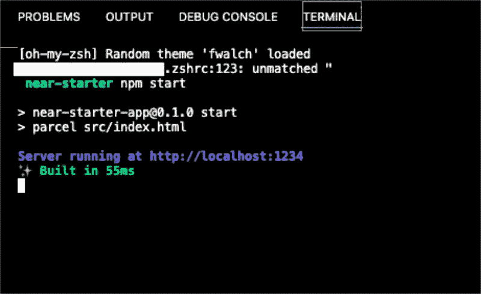
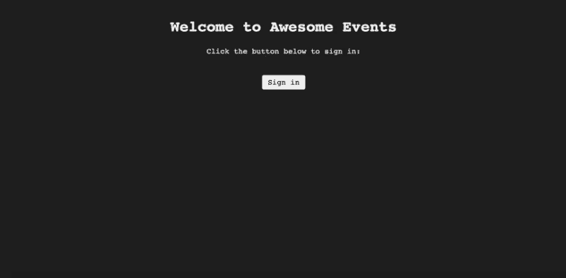
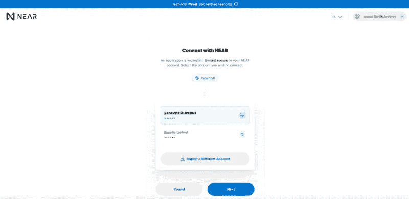
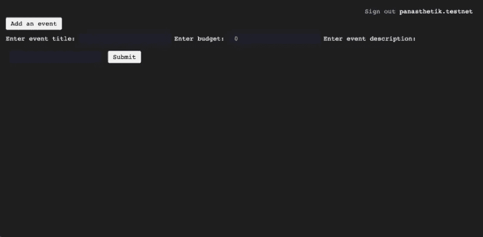
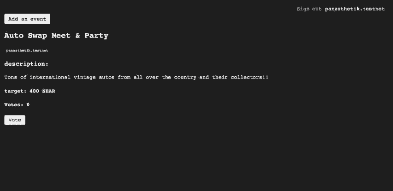

# Rust，WASM，Parcel 和 React 的近 Dapp 开发介绍-第 3 部分。

> 原文：<https://medium.com/coinmonks/an-intro-to-near-dapp-development-with-rust-wasm-parcel-and-react-part-3-6e4782dce459?source=collection_archive---------9----------------------->


本文用一个简单、实用、从头到尾的例子向现有的 Web3 开发人员介绍了 Near 协议，分为三个部分。

对于那些刚刚加入我们的人来说，请随意浏览一下本教程的前两部分以加快速度:

第 1 部分位于 [**这里**](/coinmonks/an-intro-to-near-dapp-development-with-rust-wasm-parcel-and-react-part-1-e500a3abc597?source=friends_link&sk=216f6365fcd46133ae278961c5260243) ，第 2 部分位于 [**这里**](/coinmonks/an-intro-to-near-dapp-development-with-rust-wasm-parcel-and-react-part-2-6bd3a071b74e?source=friends_link&sk=620e52f438cf57780e3c5de22044a704) **。**

**这些文章的完整代码库可以在** **这里找到** [**。**](https://github.com/Panasthetik/near-starter-app)

上一次，我们通过编写一些 Rust 单元测试来运行我们的 smart 契约，继续我们在区块链附近的开发之旅。然后，我们在 Near-CLI 中创建了一个部署子帐户，将我们的合同部署到 Near Testnet，并且能够在开发人员控制台中与它进行交互。

在本周的会议中，我们将把我们部署的智能合同与一个简单的 React 前端相集成。我们教程的这个 JavaScript 部分可以作为一个入门模板来适应您的需要(例如，您可以选择用 Next.js 或将来的另一个框架构建一个更全面、响应更快的界面)。

**在我们切换到 React / JavaScript 之前的一些后续项目**

正如上次会议结束时所提到的，在我们继续进行前端工作之前，还有一些“未解决的问题”需要与我们的合同部署联系起来。其中之一是解决当 Rust 代码发生变化或某些东西不能按预期工作时，我们如何在 Near 上“升级”我们的智能合同。

在区块链附近开发的优势之一是这种能力，可以重写 Rust 代码，重新编译到 WASM，并且当我们需要在同一个契约地址完全替换契约。

如果您还记得在实际部署契约之前，我们是如何首先在 Near Testnet 上创建子帐户的，您会注意到在 VSCode 终端中创建子帐户的以下代码:

```
near create-account near-starter-dapp.myaccount.testnet --masterAccount myaccount.testnet
```

事实上，更新智能合同的过程首先取决于**删除**该子账户——一旦子账户被删除，合同就从 Testnet 附近消失了，并且可以被替换。在 VSCode 终端中，输入:

```
near delete near-starter-dapp.myaccount.testnet myaccount.testnet
```

请注意，您不必像创建子账户一样在这里填写“主账户”。只要您仍然使用主帐户登录 Near，您就有权删除您用它创建的任何子地址，如上所述。

**在**附近升级/更换智能合同

我们现在需要做的第一件事是使用与之前相同的过程再次重新创建相同的子帐户(如上所示):

```
near create-account near-starter-dapp.myaccount.testnet --masterAccount myaccount.testnet
```

当然，您可以用不同的方式命名新的子帐户，或者在 Testnet 上的单独子帐户名称下保存合同本身的替代版本。

但是，每次升级时删除并重新创建 smart contract 子帐户通常是一种好的做法，这样可以让 Near 上的事情更有条理。通过这种方式，我们减少了区块链上浪费的、重复的、不在使用的合同！

重要提示:*现在我们又创建了一个空账户来包含智能合约，我们可以在 Rust 中进行修改了。我会把任何潜在的编辑留给开发人员，但一旦我们改变了 Rust 代码，我们还需要删除“res”文件夹中的 WASM 文件，然后再用我们的构建脚本重新编译它。继续之前，请仔细检查“res”文件夹，确保它是空的！*

从“res”文件夹中删除以下内容后，您的 Rust 发生变化…

" res/near_starter_dapp.wasm "

让我们用我们在教程中一直使用的相同的构建脚本重新编译我们新修订的 Rust 代码:

```
bash ./build.sh
```

编译完成后，您应该在“res”中有一个新的、更新的 WASM 文件。然后，我们可以像以前一样再次运行部署命令:

```
near deploy --accountId near-starter-dapp.myaccount.testnet --wasmFile res/near_starter_dapp.wasm
```

如果一切顺利，您应该会在终端中再次看到与上次一样的部署确认屏幕:

```
Starting deployment. Account id: near-starter-dapp.myaccount.testnet, node: https://rpc.testnet.near.org, helper: https://helper.testnet.near.org, file: res/near_starter_dapp.wasmTransaction Id 3fqzA9vpuKSSsrBry9jE2k2FjoKFZBCdwPU38fTcPVkTTo see the transaction in the transaction explorer, please open this url in your browserhttps://explorer.testnet.near.org/transactions/3fqzA9vpuKSSsrBry9jE2k2FjoKFZBCdwPU38fTcPVkT
```

注意:您的具体交易 ID 将与上述不同！

为了完善我们的“未解决的问题”，在开发 Near 时经常出现的最后一个问题是:

"我在区块链部署的合同地址的最长十六进制字符串在哪里？"

"你知道，就是我需要在我的 React 应用程序中调用的那个？"

“我没有在终端中看到像 EVM 链上的 Truffle/Hardhat 那样的大十六进制字符串(甚至也没有像 Solana 上的 Anchor 那样的长十六进制字符串)。”

答案是:*对于契约实例，Near 上没有长而复杂的十六进制字符串*——我们已经为契约保留了一个人类可读的地址！请记住，为了在 Near 上部署合同，我们创建了以下子帐户:

```
near-starter-dapp.myaccount.testnet
```

这是我们将粘贴到 React 应用程序中来调用我们的函数的*实际地址*——这里不需要跟踪复杂的十六进制字符串！这将是相同类型的可读合同地址，只要它可用。例如，它可能是这样的:

```
near-starter.myaccount.near
```

因此，现在我们已经了解了如何在 Near Testnet 上“升级”我们的智能契约，并且我们了解了更多关于契约地址如何工作的信息，我们准备切换到 React/JavaScript 来与一个简单的前端模板集成！

**为前端集成设置目录和配置文件**

我们需要做的第一件事是在我们的文件夹结构中向上移动一级，从“合同”文件夹(保存项目的 Rust/WASM 部分的文件夹)进入我们的根目录:

```
cd ../near-starter-dapp $
```

一旦我们进入这个根目录(near-starter-dapp ),让我们用如下依赖项创建一个“package.json”文件:

正如我们所见，与其他教程相比，这个列表非常简洁。原因是我使用了 package 2.0+进行捆绑、传输和开发服务器，这消除了对“Babel”、“Bundler”和许多其他常见依赖项的需要。

这为您提供了一个基本的、可工作的开发模板，它在本地端口上的浏览器中运行，并且可以在以后为最终的产品版本进行增强。

现在让我们在 Yarn 中运行我们的 JS 依赖项安装程序(或者 NPM，如果你喜欢的话——我将在这里使用 Yarn):

```
near-starter-dapp $yarn
```

现在我们的项目依赖项已经安装好了，我们需要再创建两个文件，它们的行为类似于您在 Anchor、Hardhat 或 Truffle 中找到的其他配置文件。通常这些是其他框架中的“配置”文件，它们标识网络信息、钱包配置和前端的契约 ID。

在根目录(near-starter-dapp)中，创建一个“src”文件夹:

```
near-starter-dapp $mkdir srccd src
```

对于我们的 Near 配置文件，第一个应该是我们新的“src”目录中的以下内容。我们将这个文件命名为“config.js”:

配置文件

这个文件做两件事:

1.  它定义了我们的 Dapp 将通过契约地址(CONTRACT_NAME)调用的智能契约。您可以看到顶部的指定合同地址与我们预订/部署的地址相同！在所有情况下，这应该与您在部署时使用的任何地址相匹配。
2.  它列出了 Near 的网络配置。在我们的例子中，我们只使用 Testnet 配置(与配置中的“开发”相同)，但是最好在这个文件中包含所有选项(包括 Mainnet)以供将来参考。

我们将在“src”文件夹中创建的下一个文件是一个 API 连接器文件。它初始化钱包、活动帐户 ID 和智能合约本身。它还定义了我们将使用 Dapp 调用的函数。我们将该文件命名为“utils.js ”,如下所示:

实用工具

这里需要注意的一些重要代码行是第 19–24 行:

```
window.contract = await newContract(window.walletConnection.account(), nearConfig.contractName, { 
viewMethods: ["exhibition_count"],    
changeMethods: ['add_exhibition', 'add_vote', 'list_exhibitions', })
```

在此代码块中，我们列出了我们将需要在前端应用程序中调用的每个智能合约函数，它们分为“查看方法”(只读且不更改合约状态的方法)和“更改方法”(启动状态更改的函数)。

当然，当我们扩展我们的 Rust 代码和构建我们的项目时，我们可以添加到这个函数列表中，然后在 React 中，我们也可以为我们的前端加入相应的功能。

只要确保你在 Testnet 上“升级”了合同(就像我们在上面学到的那样)，如果你在 Rust 上做了任何进一步的改变！

**编写反应组件**

在我们处理“App.js”和 React 的一些组件文件之前，让我们首先将一些我们需要的通用文件添加到我们的“src”目录中——“index . js”、“index.html”和“global.css”:

索引. js

index.html

global.css

我们的基本文件已经完成，现在我们将把注意力集中在 App.js 文件上，这是 Dapp 的主要入口文件。在我们的“src”文件夹中，添加以下内容:

App.js

完成 App.js 文件后，我们可以将最后两个文件添加到一个新的“components”子目录中。首先在“src”目录下创建一个新文件夹“components ”:

```
near-starter-dapp/src $mkdir componentscd components
```

在新的“components”文件夹中，我们将创建文件“CreateEvents.js”和“ListEvents.js”:

CreateEvents.js

列表事件. js

如果我们回头参考我们的 Rust 代码以及特定的函数调用和变量，我们可以在上面的文件中识别出我们在 Rust 中编写的特定项目:

信任函数:添加事件、添加投票、列表事件

信任变量:估计预算、总票数、标题、id、描述

创建所有这些文件并添加到适当的目录后，我们最终的文件结构应该是:

```
"near-starter-dapp" root folder:near-starter-dapp--|
                   |contract
                   |src
                   |package.json
                   |package-lock.json
                   |node_modules"src" front end folder (in list above) w/ "components" sub-directory:src-------|
          |global.css
          |App.js
          |utils.js
          |config.js
          |index.html
          |index.js
          |components--|
                       |CreateEvents.js
                       |ListEvents.js
```

**关于这个项目反应部分的一些想法**

您会注意到，这个 React 示例基于您可能已经看到的现有 Near tutorial 模板，在功能和状态管理方面是一个非常**简单的例子。**

例如，我们只依赖“UseState”和“UseEffect”挂钩来更新区块链上的合同状态，在我们开始在浏览器窗口中显示页面之前，没有服务器端的页面呈现(或更高级的路由)。

正如我们将了解到的，对于生产来说，这肯定**不**理想，因为在客户端刷新这个更新的状态信息会有一些延迟。

出于本教程的目的，我们假设可能需要不时地“刷新”浏览器窗口，以显示更新的合同状态。由于我们只在本地机器上启动它，我们对此没有意见，但是如果它是一个真实的生产部署，我们将需要实现更高级的 React——使用上下文、路由器和/或 Redux，或者其他一些用于状态管理的“存储”(例如:Next.js with SSR)来自动及时地预呈现页面。

我们还需要部署到数字海洋，Vultr，Heroku，Vercel 或其他一些主机服务，将处理服务器端的高级节点应用程序。

然而，这超出了本教程的范围。这是将来另一篇 Near 文章的绝佳主题——特别是在前端使用 Next.js 扩展一个 Near 项目，并将服务器端部署到云！我期待这一领域的其他开发者做出贡献。

**(终于！)用包**在我们的本地机器上启动我们的 React Dapp

因此，让我们确保我们在我们的根目录…

```
near-starter-dapp $
```

然后是“npm 开始”或“纱线开始”:

```
npm start
```

我们应该在 VSCode 终端中看到以下内容:



*注意:确保你已经完全***“注销”了你之前可能加载的这个 Dapp 的任何版本。Near wallet 接口中存在一个缺陷，如果智能合约代码发生更改或被替换，该缺陷将在循环中反复“强制”交易批准。目前正在诊断该问题的确切原因。**

*如果我们在 localhost:1234 的浏览器中确认(推荐使用 Chrome 或 Firefox ),您将会看到我们 Dapp 的“登录”页面。*

**

*继续使用 Near Wallet 照常登录(批准使用“localhost”应用程序登录 Near Testnet 的“交易”):*

**

*我们进入“事件”屏幕:点击“添加事件”按钮，填写下拉切换反应表单:*

**

*在活动表单中填写标题、建议预算和活动描述，并点击“提交”:*

**

*我们提交事件后，会有一个短暂的“重置”期(如上所述的等待时间),您可能需要**刷新**浏览器，我们才能在主页上看到更新的事件列表:*

**

*要为项目添加“投票”,您可以点击“投票”按钮，**再次刷新**页面，您投票的项目将出现更新的投票数。*

***一些结束语(以及改进的空间)***

*因此，我们已经实现了一个非常基本的端到端解决方案来开始使用 Near 协议，我希望这整个教程对您和我来说都是愉快的。*

*我一直在考虑的一件事是在我们的契约逻辑中加入基于 Rust 的检查和平衡，虽然这可能是(又一个)完全不同的文章，但我们可能会在任何升级中包括以下内容:*

1.  *Allow-listing for addresses:如果合同所有者要求对谁可以添加到平台上的事件列表进行一些限制，我们可以在 Rust 中实现检查，以汇集一个“批准的”用户列表。*
2.  *选民检查:类似于“允许列表”，这将强制执行“尚未投票”和“已经投票”的逻辑，以确保一个选民不能投票超过一次，或者“所有者”不能对他们自己的事件投票。*
3.  *本地令牌对事件平台上的项目的贡献:如果要为平台铸造一个具有初始供应的本地令牌，并且允许注册用户使用，我们可以相应地记录他们的事件捐赠。项目贡献的代币余额可以包含在我们的事件数据中。这些都可以在 Rust 中使用标准的 FT 令牌合同标准来完成。*
4.  *最后，正如我上面所描述的 React 部分的重新设计包含了类似 Next.js 的内容，重点是路由器、“GetStaticProps”和一些服务器端渲染(SSR ),这肯定会使我们的应用程序响应更快，并为真正的生产部署做好准备。为此，多页面设置也是有意义的，因为我们可以在 Next.js 中使用“slugs []”为每个事件生成一个单独的、唯一的页面。*

*我们教程的第三部分也是最后一部分到此结束——感谢您完成这个项目。我鼓励您使用这个基本模板作为您近期开发之旅的基础，在您认为适合未来更强大的解决方案时，根据您的需求对其进行调整。*

*再次感谢您的阅读，下次再见！。— Panasthetik。*

***资源:***

*[](https://parceljs.org/) [## 网络零配置构建工具。

### Parcel 将出色的开箱即用开发体验与可扩展的架构相结合，可让您的项目…

parceljs.org](https://parceljs.org/) [](https://reactjs.org/) [## react——用于构建用户界面的 JavaScript 库

### React 使得创建交互式 ui 变得不那么痛苦。为应用程序中的每个状态设计简单的视图，并反应…

reactjs.org](https://reactjs.org/)  [## 开始使用|靠近文档

### NEAR 平台上的开发分为两个主要类别:这里是对您…

docs.near.org](https://docs.near.org/docs/develop/basics/getting-started) [](https://docs.rs/near-sdk/latest/near_sdk/) [## near_sdk - Rust

### 智能合约可用的 env 区块链特定方法。这是一个包装器，围绕着一个低级…

文件](https://docs.rs/near-sdk/latest/near_sdk/) [](https://www.rust-lang.org/) [## 锈

### Rust 速度惊人，内存效率高:没有运行时或垃圾收集器，它可以支持关键性能…

www.rust-lang.org](https://www.rust-lang.org/) 

> 加入 Coinmonks [电报频道](https://t.me/coincodecap)和 [Youtube 频道](https://www.youtube.com/c/coinmonks/videos)了解加密交易和投资

# 另外，阅读

*   [如何购买 Monero](https://coincodecap.com/buy-monero) | [IDEX 评论](https://coincodecap.com/idex-review) | [BitKan 交易机器人](https://coincodecap.com/bitkan-trading-bot)
*   [CoinDCX 评论](/coinmonks/coindcx-review-8444db3621a2) | [加密保证金交易交易所](https://coincodecap.com/crypto-margin-trading-exchanges)
*   [红狗赌场评论](https://coincodecap.com/red-dog-casino-review) | [Swyftx 评论](https://coincodecap.com/swyftx-review) | [造币厂评论](https://coincodecap.com/coingate-review)
*   [Bookmap 评论](https://coincodecap.com/bookmap-review-2021-best-trading-software) | [美国 5 大最佳加密交易所](https://coincodecap.com/crypto-exchange-usa)
*   [如何在 FTX 交易所交易期货](https://coincodecap.com/ftx-futures-trading) | [OKEx vs 币安](https://coincodecap.com/okex-vs-binance)*