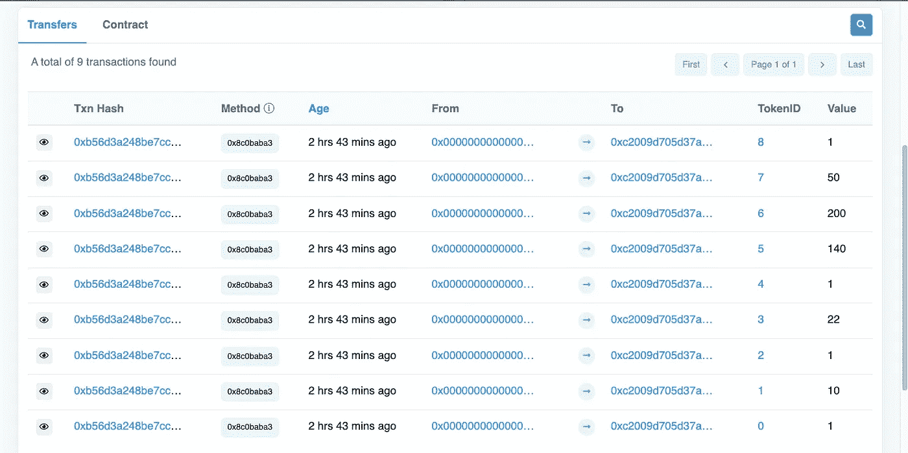
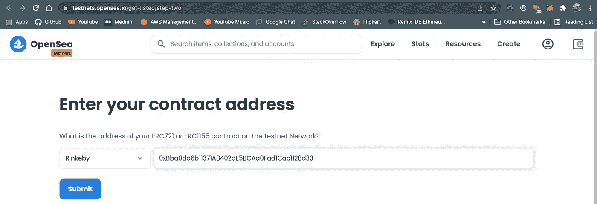
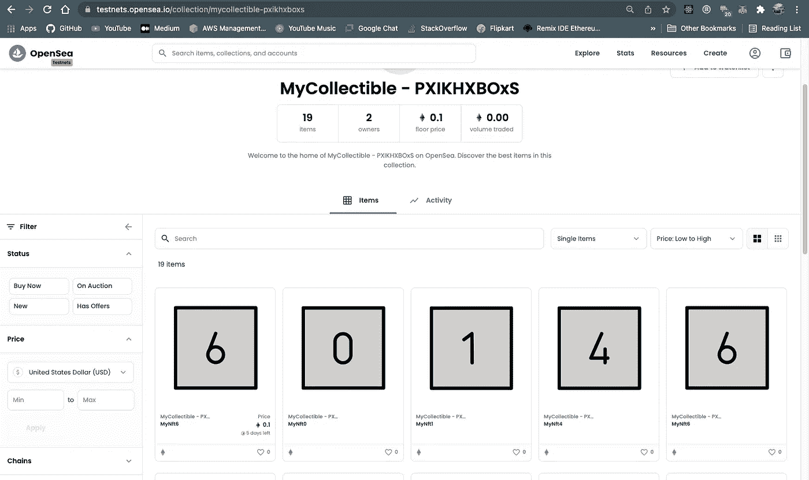

# NFT 介绍，通过 CSV 创建 NFT，并在 Opensea 上列出它们

> 原文：<https://medium.com/coinmonks/an-intro-to-nfts-mint-nfts-through-csv-and-list-them-on-opensea-958b182dc6de?source=collection_archive---------1----------------------->

**什么是 NFT？**

NFT *作为区块链世界的热门话题之一，无需介绍。*但是，如果你对这个话题不熟悉，让我用几句话解释一下。

NFT 是代表数字资产的不可替代的令牌。它们可以用来表示任何独特资产的所有权，它是物理资产的数字表示。他们让我们将艺术品、收藏品、甚至房地产等事物符号化。与可互换代币不同，一个 NFT 不能与另一个 NFT 互换。拥有 NFT 意味着您拥有该资产的数字表示，并证明该资产的所有权(如艺术、绘画、土地所有权)。

**NFTS 的例子**

1.  独特的数字艺术作品(gif、音乐、视频、绘画、图片)
2.  为您提供服务的门票或优惠券(电影票、比赛门票、课程优惠券)
3.  实物资产(汽车、土地、房屋所有权等)的数字表示
4.  拥有域名
5.  投资和股份
6.  虚拟土地
7.  游戏中的物品

**不可替代令牌标准**

大多数 NFT 使用标准的 [ERC721](https://eips.ethereum.org/EIPS/eip-721) 简称“以太坊请求注释 721”。但是也有其他标准像 [ERC1155](https://eips.ethereum.org/EIPS/eip-1155) 。ERC1155 是一个多令牌标准，允许您以一种高效的方式创建可替换、不可替换和半可替换的令牌。

**为什么是 ERC1155？**

铸造 NFTS 的一个重要特征是能够一次铸造多个非功能性坦克。我们仍然可以使用 ERC721 标准一次制造多个 NFT。但是这很耗时间，因为我们在 for 循环中多次调用 mint 函数。因此，如果我们试图一次铸造数百个 NFT，我们可能会遇到气体限制错误。但是，ERC1155 提供批量铸造功能，我们可以一次铸造 1000 个 NFT 或可替换令牌(甚至两者都有)。ERC1155 还提供其他批处理操作，如查询多个令牌的余额，一次性转移多个令牌，更简单，更节省汽油，并节省交易成本。

**NFT 元数据标准**

> NFT 元数据，NFT 中的一个重要元素

我们知道 NFT 代表资产。[元数据](https://github.com/ethereum/EIPs/blob/master/EIPS/eip-1155.md#erc-1155-metadata-uri-json-schema)是一个 JSON 对象，它描述了资产的属性，如名称、描述、图像链接和其他特定于资产的属性(颜色、重量、大小等)

NFT 市场使用元数据向买家和卖家显示 NFT，元数据的格式必须是市场能够理解的，这一点很重要。为了使您的 NFTs 与尽可能多的市场、钱包和其他 NFT 工具的生态系统兼容，您应该采用一个现有的元数据标准，并且如果需要的话，根据您的特定需求扩展它。

**上传元数据到 ipfs**

创建 NFT 时，我们实际上是在智能合约中将元数据链接到它。因此，了解元数据存储在哪里非常重要。如果我们将元数据存储在传统的 HTTP 服务器上(比如 s3 bucket ),那么以后随时都有可能更改元数据属性的内容，这反过来会改变 NFT 的含义。这个问题被一位艺术家证明了，他在 NFT 上 [*揭了*](https://cointelegraph.com/news/opensea-collector-pulls-the-rug-on-nfts-to-highlight-arbitrary-value) 的疮疤，他在 NFT 被铸造并出售给他人后，通过改变它们的图像来创造 NFT。这就是传统服务器不适合存储元数据的原因。

由于[内容寻址](https://docs.ipfs.io/concepts/content-addressing/)，IPFS 解决了这个问题。将数据添加到 IPFS 会产生一个内容标识符(CID ),该标识符直接源自数据本身并链接到 IPFS 网络中的数据。因为一个 CID 只能*曾经*引用一段内容，我们知道没有人能在不破坏链接的情况下替换或改变内容。

**如何通过 CSV 铸造 NFT？**

众所周知，元数据包含 NFT 的属性。因此，我们可以创建一个 CSV 文件，其中包含我们想要创建的所有 NFT 的属性，稍后将该 CSV 文件转换为 ERC1155 JSON 元数据标准，然后将其上传到 ipfs，然后通过契约将其链接到特定的 NFT。这是我们的样本 CSV 文件

**合同**

如果您看到我们的 **mintBatchTokens** 函数，它接受数组**id**、**数量**、**uri**作为参数。ids 是一个令牌 id 数组，与 erc721 不同，在 ERC 721 中，您可以传递代表一个 NFT 的单个 id，而在 ERC1155 中，id 可以代表 NFT、可替换令牌或半可替换令牌。如果数量是 1，这意味着你正在铸造一个 NFT，如果数量大于 1，这意味着你正在铸造一个可替换的令牌。**uri**是一个 uris 数组，其中每个 URI 是一个令牌的元数据 URI。我们制作的每个令牌都应该有一个唯一的 Id，这是令牌的唯一标识符。因此，我们需要跟踪到目前为止已经创建的令牌 id，并用新的令牌 id 连续更新 ids 数组。最后，我们使用映射将令牌 id 链接到令牌的元数据 URI。

**注:**

ERC1155 允许您在合同中仅设置一次元数据 URI。`uri`可以包括字符串`{id}`，客户端必须用小写十六进制(没有 0x 前缀)的实际令牌 ID 替换该字符串，并以零填充到 64 个十六进制字符。例如，如果您在 ERC1155 构造函数中将元数据 URI 设置为`[https://my-nft-server.com/api/token/{id}.json](https://my-nft-server.com/api/token/{id}.json)`，则您负责在“https://my-NFT-server . com/API/token/00000000000000000000000000000000000000000000000000000001 . JSON”上为 id 为`1`的令牌提供元数据。

虽然这是推荐的方法，但是我使用了映射方法来让您了解事情是如何工作的，并使本教程更加简单。

**准备代币 id、元数据、金额和代币 URIs:**

**注意:**我不会谈论部署合同或连接钱包到前端，其他 web3 的东西(那是另一个故事)。您可以使用 [remix](https://remix.ethereum.org/) 来部署合同。如果你想直接跳到代码，这里有[链接](https://github.com/Salmandabbakuti/bulkmint-nft/blob/main/src/App.jsx)。部署合同后，请不要忘记更新`App.jsx`的合同地址

因此，我们的下一个任务是在客户端创建一个函数，该函数将基于 CSV 行准备令牌 id、数量、元数据 URI 数组。这是:

所以函数的输入是来自 CSV 文件的解析 JSON 记录(我已经使用了 [papaparse](https://www.npmjs.com/package/papaparse) 库将 CSV 转换成 JSON)。根据合同中当前生成的令牌 Id，我们将按顺序填充令牌 Id。我们还需要用每种令牌类型要铸造的令牌数来填充令牌数量数组。如果 CSV 文件中的数量属性为空，那么我们将通过将数量设置为 1 来将其创建为 NFT。

现在我们需要将每个 CSV 行的 JSON 数据转换成 ERC1155 元数据标准。我在数组映射和 rest 操作符的帮助下做到了这一点。最后将每个元数据对象上传到 ipfs 并获取 ipfs 散列。

**铸造代币:**

一旦我们有了令牌 id、数量、令牌 URIs，我们就可以通过传递这些值来调用契约的`mintBatchTokens`函数。等待交易成功。在交易被挖掘之后，我们可以在 etherscan 中检查令牌。

Minted token details on rinkeby etherscan

**在 Opensea 上列出令牌**

Opensea 是最大的加密收藏品和不可替代代币(NFT)的数字市场，在这里你可以购买、出售和发现独家的数字物品。

为了列出您新创建的收藏，请转到[https://testnets.opensea.io/get-listed/step-two](https://testnets.opensea.io/get-listed/step-two)并选择您已部署合同的网络，粘贴合同地址，然后提交。

有时您可能会遇到以下错误:'*我们找不到此合同。请确保这是部署在 Rinkeby 上的有效 ERC721 或 ERC1155 合同，并且您已经在合同*上铸造了项目。

这是一个常见问题，Opensea 会显示您的令牌，但可能不是即时的。有时你必须等 10-24 小时才能让他们的非功能性食物出现。

Collection in opensea

瞧。！你已经在市场上列出你的收藏，你可以看到你收藏中的铸造物品清单。

[链接到源代码](https://github.com/Salmandabbakuti/bulkmint-nft)

> 加入 Coinmonks [电报频道](https://t.me/coincodecap)和 [Youtube 频道](https://www.youtube.com/c/coinmonks/videos)了解加密交易和投资

# 另外，阅读

*   [比特币基地评论](/coinmonks/coinbase-review-6ef4e0f56064) | [德里比特评论](/coinmonks/deribit-review-options-fees-apis-and-testnet-2ca16c4bbdb2) | [FTX 评论](/coinmonks/ftx-crypto-exchange-review-53664ac1198f)
*   [n rave 零点回顾](/coinmonks/ngrave-zero-review-c465cf8307fc) | [Phemex 回顾](/coinmonks/phemex-review-4cfba0b49e28) | [PrimeXBT 回顾](/coinmonks/primexbt-review-88e0815be858)
*   最佳[区块链分析](https://bitquery.io/blog/best-blockchain-analysis-tools-and-software)工具| [赚比特币](/coinmonks/earn-bitcoin-6e8bd3c592d9)
*   [Cloudbet 赌场评论](https://coincodecap.com/cloudbet-casino-review) | [点火赌场评论](https://coincodecap.com/ignition-casino-review)
*   [加密套利](/coinmonks/crypto-arbitrage-guide-how-to-make-money-as-a-beginner-62bfe5c868f6)指南| [如何做空比特币](/coinmonks/how-to-short-bitcoin-568a2d0b4ae5)
*   [如何在加拿大购买加密货币？](https://coincodecap.com/how-to-buy-cryptocurrency-in-canada)
*   [无聊猿游艇俱乐部(BAYC)评论](https://coincodecap.com/bored-ape-yacht-club-bayc-review)
*   [5 款最佳加密交易终端](https://coincodecap.com/crypto-trading-terminals) | [最佳 DeFi 应用](https://coincodecap.com/best-defi-apps)
*   [比特币基地 vs 瓦济克斯](https://coincodecap.com/coinbase-vs-wazirx) | [比特鲁点评](https://coincodecap.com/bitrue-review) | [波洛涅克斯 vs 比特鲁](https://coincodecap.com/poloniex-vs-bittrex)