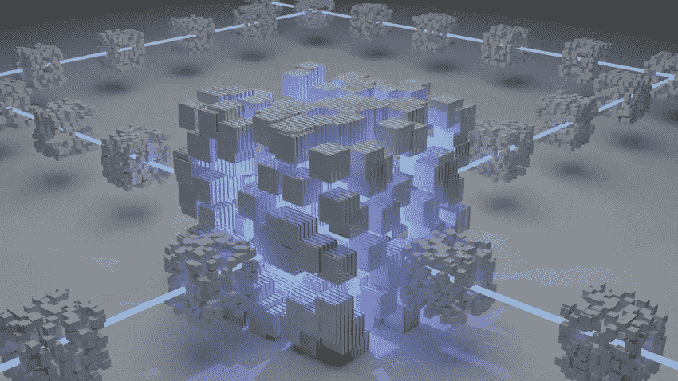
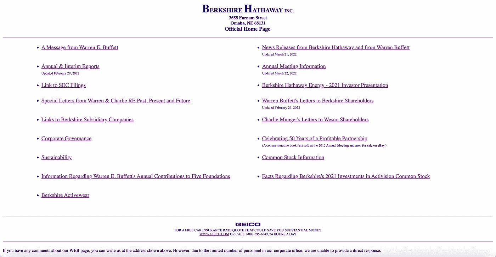
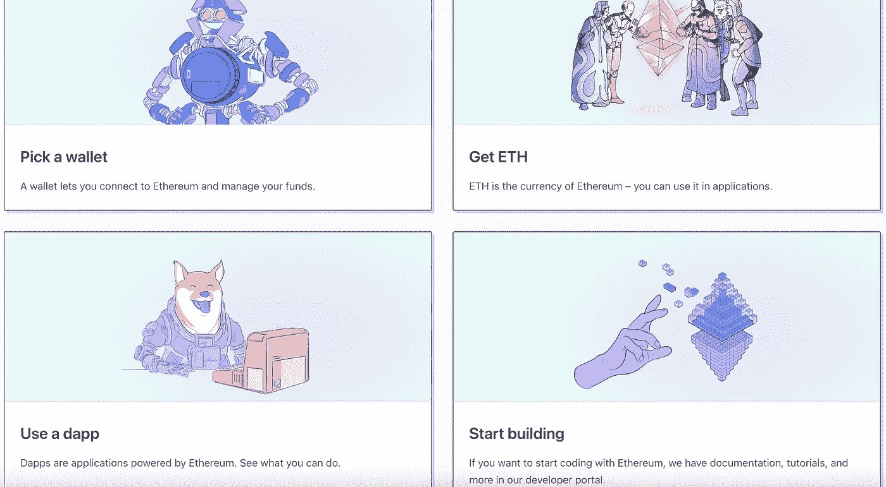

# Web 3.0 简介—面向虚拟人

> 原文：<https://medium.com/coinmonks/an-intro-to-web-3-0-a10b9520e690?source=collection_archive---------19----------------------->

似乎每隔几年就会有一个新的流行语或潮流出现。嗯， ***Web 3.0 是新的流行语*** 。每个人都谈论它。但是如果你对什么是 Web 3.0 感到困惑，你并不孤单。但是不要担心，2-3 分钟内你就会成为专家。

> 要理解 Web 3.0，你必须了解 Web 的历史。

# Web 1.0

在 Web 1.0 中，所有的网站都是静态的 HTML 页面。为了向网络贡献内容，你必须建立一个网站。所有用户都是消费者。

# Web 2.0

在 Web 2.0(现在)中，我们看到了 JavaScript 和 HTML5 的兴起，它们使网站具有了交互性。这些交互式网站允许用户在没有任何编码的情况下对网络做出贡献。

他们可以在网站上写一篇文章来为网络做贡献。这导致了动态网站的兴起，尤其是社交媒体巨头的崛起。垄断企业出现了，比如脸书、谷歌和亚马逊，它们收集了我们贡献的每一份数据。

有了这些数据，他们会为我们提供更好的内容，因此我们会在他们的网站上停留更长时间，从而赚更多的钱。然而，公司很快意识到他们可以将数据打包出售给广告商，这也导致了定向营销时代的兴起。在 Web 2.0 中，用户变成了产品。

# Web 3.0

在 Web 3.0 中，用户是所有数据的所有者。他们拥有数据，只有在他们愿意的情况下才能出售。还有，在与数据交互时，不需要中间人。例如，在 Web 2.0 中，如果你想发布一个帖子或类似的东西，它将首先通过大型技术公司，然后到达其他用户。

Web 3.0 利用区块链技术来消除这个中间人，而不是由一个技术公司来操作所有的数据。通过一个加密钱包账户，你可以访问电子邮件、购物、社交媒体等，并在区块链上创建所有这些数据的公共记录。

# 如果没有公司，它将如何运作？

这就带来了一个问题，如果 Web 3.0 不受公司控制，它将如何保持运行？理论上，人们将被给予加密货币，以激励他们参与 Web 3.0 的运营。

这个想法是为每一个可能的交互发布一个令牌，这样用户就可以拥有一系列加密货币、数字资产和 NFT，能够在这个庞大的数字资产生态系统中进行交易和销售。

# 批评

尽管如此，对于 Web 3.0 还是有很多批评:

*   它将如何扩展？
*   如何监管它以确保非法活动不会发生？
*   它将如何在互联网上分配控制权？
*   它是去中心化的吗，就像一些人认为风险投资家拥有 Web 3.0 那样？
*   我们目前没有带宽和电子计算能力来在可扩展的水平上实际使用 Web 3.0。
*   这一切都是泡沫吗？如果加密崩溃，Web 3.0 也会崩溃，因为所有的代币和加密货币都没有任何价值。

C ***结束语:*** 风投们在 Web 3.0 上投入了大量资金，我们将在很长一段时间内听到这个消息。此外，Web 3.0 可能不会获得牵引力，因为人们大多对 Web 2.0 感到满意。但是，每一项新技术在短期内都会被高估，但在长期内会被低估。但是，我认为 GitHub 的首席执行官 Mike Crittenden 说得最好:

> 悲观主义者听起来很聪明。乐观者赚钱。”

> 查看我的[个人网站](http://nagelia.com)！
> 
> 加入 Coinmonks [电报频道](https://t.me/coincodecap)和 [Youtube 频道](https://www.youtube.com/c/coinmonks/videos)了解加密交易和投资

# 另外，阅读

*   [如何在 FTX 交易所交易期货](https://coincodecap.com/ftx-futures-trading) | [OKEx vs 币安](https://coincodecap.com/okex-vs-binance)
*   [CoinLoan 评论](https://coincodecap.com/coinloan-review) | [YouHodler 评论](/coinmonks/youhodler-4-easy-ways-to-make-money-98969b9689f2) | [BlockFi 评论](https://coincodecap.com/blockfi-review)
*   [XT.COM 评论](https://coincodecap.com/profittradingapp-for-binance)币安评论 |
*   [SmithBot 评论](https://coincodecap.com/smithbot-review) | [4 款最佳免费开源交易机器人](https://coincodecap.com/free-open-source-trading-bots)
*   [比特币基地僵尸程序](/coinmonks/coinbase-bots-ac6359e897f3) | [AscendEX 审查](/coinmonks/ascendex-review-53e829cf75fa) | [OKEx 交易僵尸程序](/coinmonks/okex-trading-bots-234920f61e60)