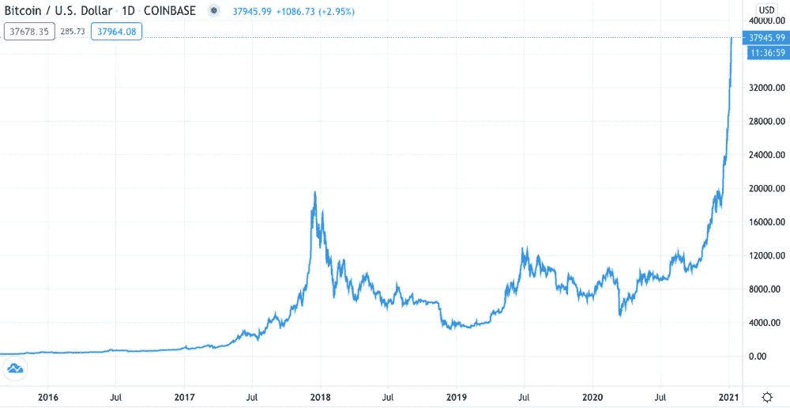
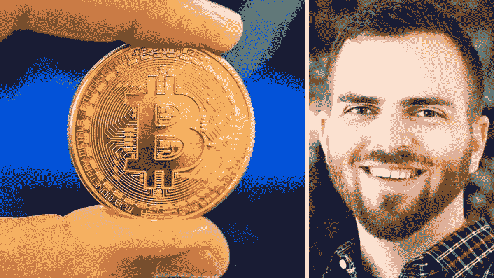
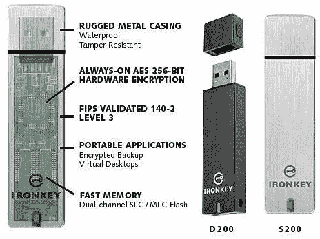

# 比特币简介和 2.2 亿美元的争议

> 原文：<https://medium.com/coinmonks/an-introduction-to-bitcoin-and-the-220-million-controversy-a0f66c48ce80?source=collection_archive---------5----------------------->

> 随着加密货币越来越高，比特币所有者越来越富有，但如果密码丢失导致百万富翁无法获得比特币财富，那该怎么办？

# 比特币简介

比特币是第一种，也可能是最成功的获得广泛认可的去中心化数字货币。底层的区块链系统允许用户通过点对点(P2P)网络进行和接收比特币支付。中本聪的身份仍然未知，他在 2008 年 10 月以白皮书的形式将其概念化。最初的 10 个比特币交易是由中本聪转给已故的哈罗德(Hal)芬尼(Harold Finney)的，芬尼是比特币社区的定期贡献者，也是一位著名的密码学家，他创造了所有比特币交易中使用的可重复使用的工作证明(PoW)方法。这就是比特币网络的起源，它导致了数字货币生态系统的兴起和其他数字资产的出现。

Bitcoin/US$ price 2016–21

比特币的创立目标是消除通过金融中介进行交易带来的许多问题，如高费用、处理时间慢以及不可避免的欺诈交易。比特币越来越多地被用作支付机制，这反映了人们对传统货币形式和现有金融机构的态度正在转变，因为它建立在共识、透明和不变性(如中央政府和商业银行)的核心概念之上。

比特币最近已经成为新兴数字资产类别中的明星。它是迄今为止最大的网络，占所有数字货币总市值的一半以上。此外，其特点导致了各种使用案例的建立，包括作为黄金的替代品作为财富的储存手段和作为防范全球金融危机的可能手段。

# 比特币的价格为什么会上涨？

尽管有几个因素通常会让投资者紧张，如中美紧张局势、英国退出欧盟，当然还有国际流行病，但比特币在 2020 年出现了惊人的飙升。随着对疫情的担忧蔓延，比特币在 3 月中旬的日线图上跌至 4748 美元(3490 英镑)的一年低点。到年底，这一数字上升到大约 30，000 美元。自那以来，它已飙升至 38，000 美元以上的历史高点，成为每日头条新闻，并推高了其他加密货币的价值。

养老金计划、大学捐赠基金和投资信托基金等大型机构投资者的大量涌入，是价格大幅飙升的一个原因。在 2017 年的上一轮牛市中，情况并非如此，当时比特币的价格飙升了 20 多倍，达到近 2 万美元，一年后跌至 3000 美元的低点。

个人散户投资者在 2017 年主导了加密货币生态系统，许多人被比特币的稀缺性和它在全球银行体系之外运作的事实所吸引。投资者在 2017 年牛市期间“害怕错过”(FOMO)买入，牛市具有典型金融泡沫的所有特征。

*现在，让我们来谈谈手头的事情，这件事引起了全球媒体专业人士和金融中坚分子的关注……*

# 斯蒂芬·托马斯(Stefan Thomas)还有两次机会来获得这个价值 2.2 亿美元的比特币钱包

斯蒂芬·托马斯(Stefan Thomas)的情况更进一步，十多年前，他因创作了一部名为《什么是比特币》(What is Bitcoin)的动画电影，被一位早期比特币爱好者奖励了 7002 个比特币

托马斯先生的困境是，他把写有他的 IronKey 密码的那张纸放错了地方(下面将详细描述)，该密码允许用户在永久获取和加密其内容之前猜测 10 次。从那以后，他尝试了八种最常用的密码组合，但都没有用。

Stefan Thomas — The man who stands losing $220m bitcoins because of “lack of remembering the password”

托马斯对人们应该成为自己的银行、自那以后保留自己的钱的想法感到不快，因为比特币的价值时涨时跌，他一直无法获得这种货币。"让我这么说吧:你自己设计鞋子吗？"他说，指的是成为自己的银行的概念。

因此，最严重的问题是比特币没有公司来创建或存储密码。根据虚拟货币的创造者中本聪的说法，比特币的目标是让世界上任何人都可以创建一个数字银行账户，并以任何政府都无法阻止或监管的方式储存资金。

# 那么铁钥匙到底是什么？

最近几天，IronKey 受到了很多关注，因为德国程序员 Stefan Thomas 的案件，他面临着损失 2.2 亿美元比特币的风险，因为他忘记了携带数字钱包私钥的 IronKey 的密码。

IronKey 被称为“世界上最安全的闪存驱动器”是有原因的:由于许多内置的保护措施，它宁死也不会泄露信息。它是由戴夫·杰文斯和吉尔·斯潘塞在 2005 年至 2007 年间创作的，现在由金士顿数码公司以“铁钥匙”的名字发行

Interior of a Basic IronKey Flash Drive

用户信息安全地保存在闪存中，闪存使用军用级 AES-CBC 模式加密。密码攻击保护了光盘上的数据。任何对这个装置的物理干扰都会导致它立即启动自毁程序。如果您连续 10 次输入错误的密码，您的数据将永久丢失，并且无法找回。因此，从放错地方的 IronKey 盘中恢复数据几乎是不可能的。

尽管有各种尝试在不弄乱数据的情况下打开它，但没有人能够在不丢失数据的情况下拆除它。由于其广泛的安全和加密能力，许多国家已经授权它存储敏感的政府和军事材料，在某些情况下达到绝密级别。

# 比特币的未来会怎样？

比特币在普通生活中的采用一直存在一个先有鸡还是先有蛋的问题:很少有人使用或接受它，因为很少有人使用或接受它。加密货币的未来仍然很不明朗。批评者只看到风险，而支持者只看到无限的希望。然而，在某些情况下，加密货币是一种现实的选择。例如，货币疲软国家的人们投资比特币可能比购买当地股票和债券更好。不管支持者是否承认，最乌托邦式的加密场景都依赖于这样一种想法，即加密同时保持边缘和流行。虽然这将是一个很难实现的把戏，但我们可以预计它在不久的将来会越来越受欢迎。

> 加入 Coinmonks [电报频道](https://t.me/coincodecap)和 [Youtube 频道](https://www.youtube.com/c/coinmonks/videos)了解加密交易和投资

## 也阅读

 [## 杠杆代币[多头代币]终极指南

### 杠杆化令牌是具有杠杆化风险敞口的 ERC20 令牌，不考虑保证金、要求、管理…

medium.com](/coinmonks/leveraged-token-3f5257808b22)  [## 最佳加密交易所| 2022 年十大加密货币交易所| CoinCodeCap

### 哪一个是最好的加密交换？在本文中，我们将根据多种加密货币列出 10 大加密货币交易所

coincodecap.com](https://coincodecap.com/crypto-exchange)  [## 2022 年最佳加密交换平台| CoinCodeCap

### 随着时间的推移，我们大多数人将转向 dex 以获得更好的安全性和隐私。因此。在这里，我们将讨论…

coincodecap.com](https://coincodecap.com/best-swap-platforms)  [## 10 大最佳在线赌场|赢得并赢取免费 BTC 2022 | CoinCodeCap

### 接收、支付和赚取加密货币| |有各种各样的最佳在线赌场可供选择，有可能…

coincodecap.com](https://coincodecap.com/best-online-casinos)  [## 2021 年最佳加密借贷平台| 6 大比特币借贷平台

### 获得比特币和其他加密货币的最佳贷款利率

medium.com](/coinmonks/top-5-crypto-lending-platforms-in-2020-that-you-need-to-know-a1b675cec3fa)  [## 2021 年 6 大最佳硬件钱包|顶级加密硬件钱包[更新]

### 最好的加密货币硬件钱包是绝对必要的。我们将在 NGRAVE、Ledger Nano X 和…

medium.com](/coinmonks/the-best-cryptocurrency-hardware-wallets-of-2020-e28b1c124069)  [## 加密交易机器人——19 款最佳免费加密交易机器人

### 2022 年币安、比特币基地、库币和其他密码交易所的最佳密码交易机器人。四进制，位间隙…

medium.com](/coinmonks/crypto-trading-bot-c2ffce8acb2a)  [## 最佳 4 个加密交易信号电报通道

### 这是乏味的找到正确的加密交易信号提供商。因此，在本文中，我们将讨论最好的…

medium.com](/coinmonks/best-crypto-signals-telegram-5785cdbc4b2b)  [## Bitsgap 评论-交易机器人加密信号和套利 2022

### 这篇文章的重点是 Bitsgap 审查，这是一个最终的交易解决方案，并提供交易机器人，信号…

coincodecap.com](https://coincodecap.com/bitsgap-review)