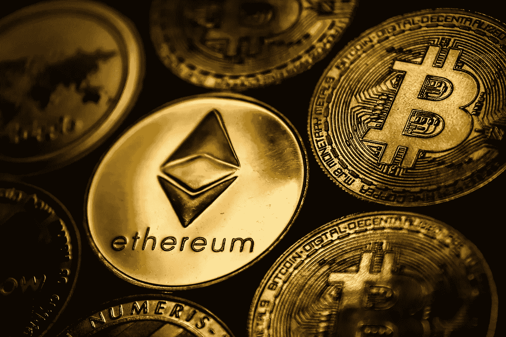

# 加密货币简介。

> 原文：<https://medium.com/coinmonks/an-introduction-to-cryptocurrency-a5dd65413e04?source=collection_archive---------51----------------------->

过去几年加密货币的增长，特别是今年的 NFTs 和元宇宙，让每个人都想争先恐后地进入它。但是绝对有必要了解你将要进入的领域，否则，你就有赔钱的风险。根据沃伦·巴菲特的说法，投资的第一条规则是“不要亏钱”，第二条规则是“不要忘记第一条规则”。说了这么多，我们开始吧。

什么是 Web 3.0？

Web 3.0 是一个简单的术语，意思是分散的互联网，意味着数据将以分散的方式连接..我们今天使用的互联网的当前版本大多是集中式的。世界上的大公司都是 it 的垄断者，比如谷歌和脸书。

Web 3.0 承诺没有人会拥有互联网的大部分或全部，而是每个人都会拥有一部分。它将分发给那些选择从中分一杯羹的人。

这将使我们能够理解下一个概念。

什么是加密货币？

加密货币(或“crypto”)是一种无需政府或银行等中央货币机构即可流通的支付形式。相反，加密货币是使用加密技术创造的，使人们能够安全地购买、出售或交易它们。

目前，银行和主要金融机构是货币的“谷歌”和“脸书”。加密货币是一种去中心化的支付形式(建立在 Web 3.0 概念之上)。

作为法定货币的加密货币。

随着围绕加密货币的大肆宣传，一个主要问题是，它会被普遍用作支付手段吗？

在互联网的初期，人们也提出过类似的问题，当时人们对互联网的未来持怀疑态度。好吧，既然我们基本上生活在互联网上，那么说我们将很快生活在加密货币上可能不是那么牵强。

萨尔瓦多等国家已经率先采用，目前正在接受它作为一种通用的支付手段。因此，我们通常会使用密码进行买卖。

我们继续吧。

什么是分权金融？

分散金融(DeFi)是一种新兴的金融技术，它基于类似于加密货币所使用的安全分布式分类账。该系统取消了银行和机构对货币、金融产品和金融服务的控制。

这是不是有点技术性？好吧，这里有一个简化的版本，它是所有的银行活动和更多，只是没有银行和其他金融中间人。

因此，如果没有银行，我们现在怎么能信任这个系统，因为如果出现任何问题，没有像高盛或 GT 银行这样的机构可以投诉或起诉……嗯，这就是智能合同的用处。

智能合同。

智能合同是一种自动执行的合同，买卖双方之间的协议条款直接写入代码行。守则和其中包含的协议存在于一个分散的区块链网络中。代码控制执行，事务是可跟踪和不可逆的。

还是太技术化？下面是简单的版本。智能合同就像一个编程律师，在两个或更多人之间充当证人，并在特定条件得到满足时执行特定的操作。

这里有一个例子。以法莲想把马克斯韦尔 5 BTC 换成同等的 ETH。

如果你要和一家银行机构正常交易，你需要一名双方律师来确保没有人违约。

使用 smart.contracts，非常简单。当以法莲点击发送按钮发送 BTC 时，它不会立即到达麦克斯韦尔，直到麦克斯韦尔也将它发送给以法莲。因此，一旦数字律师(智能合同)确认双方都发送了所需的密码，它就会将其发布给双方。所有这些都不需要实体律师和实体银行。

现在你可能会怀疑这个系统的安全性，这就是区块链技术的用武之地。

区块链技术。

区块链是一种记录信息的系统，这种方式使得改变、黑客攻击或欺骗系统变得困难或不可能。区块链本质上是交易的数字分类账，它被复制并分布在区块链的整个计算机系统网络中。

简单来说，区块链是一个系统，其中每个交易(如 Ephraim 和 Maxwell 的交易)都是一个链，这意味着它们相互链接。因此，为了破解当前的交易，您需要破解所有其他交易。这就是为什么很难或者不可能。

最后，你如何利用这些信息赚钱。

如何用 Crypto 赚钱？

贷款和借款:通过开始加密贷款从你的加密投资中赚取额外的钱。加密货币借贷涉及借贷双方的参与和他们之间的协议。一些加密交易所支持加密贷款，包括 Nexo、SALT Lending、BlockFi、Oasis 和 Celsius。

传统的买入并持有:从加密中赚钱的方法更适合那些准备冒险的人。这意味着从加密交易所获得你选择的加密资产，并在价格下跌时购买更多——传统上称为“买入下跌”。然后你可以在资产(密码)价值上升时卖出。

交易:投资是基于买入并持有策略的长期投资，但交易是利用短期机会。交易 crypto 时，你可以买入或卖出，这取决于你对资产价格的预期是上涨还是下跌。这意味着无论价格上涨还是下跌，你都可以获利。

赌注:赌注是阻止数字资产的行为，数字资产在分散加密网络中充当验证器，以确保网络的完整性、安全性和连续性。涉众保护他们的资产作为节点和验证器块。利益相关者将获得新创建的加密货币，作为帮助保护工作的激励。

空投:在所有获得免费加密货币的方式中，空投的风险最高。当开发人员希望支持新的加密货币时，他们会执行空投。简而言之，他们分发免费硬币来推广他们的项目，并鼓励人们采用它。

挖掘:这是验证交易和保护电力网络的过程。为了实现这些功能，矿工们会收到新的奖励形式的硬币。在比特币的早期，挖掘可以在台式电脑上进行，但今天，需要专门的挖掘硬件。

股息:简单地说，股息是支付给股东的小额现金。如果一家公司一个季度(或一年，这取决于独资企业)盈利，它将这些利润分割并返还给公司的所有者(股东)。

现在，这只是对加密货币的介绍，这个领域很广，而且每天都在增长。在这一点上，几乎可以肯定的是，加密是未来的发展方向，它将彻底改变我们的生活方式，因此，每个人都有基本的知识非常重要，这样他们才不会落后。这篇文章只是一个基本的介绍，但是你可以在网上找到很多免费的资料来帮助你的研究。

> 加入 Coinmonks [电报频道](https://t.me/coincodecap)和 [Youtube 频道](https://www.youtube.com/c/coinmonks/videos)了解加密交易和投资

# 另外，阅读

*   [交易信号是什么？](https://coincodecap.com/trading-signal) | [Bitstamp vs 比特币基地](https://coincodecap.com/bitstamp-coinbase) | [买索拉纳](https://coincodecap.com/buy-solana)
*   [ProfitFarmers 回顾](https://coincodecap.com/profitfarmers-review) | [如何使用 Cornix Trading Bot](https://coincodecap.com/cornix-trading-bot)
*   [十大最佳加密货币博客](https://coincodecap.com/best-cryptocurrency-blogs) | [YouHodler 评论](https://coincodecap.com/youhodler-review)
*   [MyConstant Review](https://coincodecap.com/myconstant-review) | [8 款最佳摇摆交易机器人](https://coincodecap.com/best-swing-trading-bots)
*   [MXC 交易所评论](/coinmonks/mxc-exchange-review-3af0ec1cba8c) | [Pionex vs 币安](https://coincodecap.com/pionex-vs-binance) | [Pionex 套利机器人](https://coincodecap.com/pionex-arbitrage-bot)