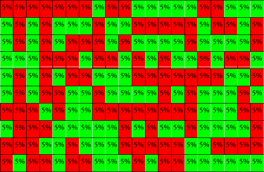

# 加密货币算法交易简介

> 原文：<https://medium.com/coinmonks/an-introduction-to-cryptocurrency-algorithmic-trading-8ae84b0fc1b9?source=collection_archive---------12----------------------->

算法交易是让计算机为你赚钱的艺术。或者，至少，这是目标。Algo 交易者试图找出一套规则，如果作为交易的基础，就可以盈利。当这些规则被选择和触发时，代码将执行一个命令。例如:假设你喜欢指数均线交叉交易。每当你看到比特币的 12 日均线通过 50 日均线，你就投资了 0.01 比特币。然后，你通常会在赚了 5%的利润时卖出，或者，如果没有成功，你会在 5%时止损。将这种偏好的交易策略转换成算法交易规则是非常容易的。你可以编写一个算法，跟踪比特币的所有数据，在你喜欢的均线交叉期间投资 0.01 比特币，然后以 5%的利润或 5%的亏损卖出。这个算法会在你睡觉、吃饭的时候为你运行，实际上是 24/7 或者在你设定的时间运行。因为它只在你设定的时候交易；你对风险很坦然。即使该算法在每 100 笔交易中只有 51 笔有效，从技术上讲，你也在盈利，并且可以永远继续下去，不需要投入任何工作。或者，你可以参考更多的数据，改进你的算法，使其工作 55/100 次，或者 70/100 次。十年后，当你在阳光明媚的海滩上啜饮热带果汁时，你现在是一个每天每秒都在赚钱的亿万富翁。

可悲的是，这并不容易，但这就是算法交易的概念。用机器交易的一个很好的假设方面是，收入上限实际上是无限的(或者，至少是非常可扩展的)。考虑下面的图表。这是一个算法的可视化，如果满足某些条件，每天交易 200 次。该算法将在 5%的利润或 5%的损失时退出头寸，如上例所示。让我们假设你给算法 10，000 美元，投资组合的 100%都投入到每笔交易中。红色代表无利可图的交易(5%的损失)，绿色代表好的交易，5%的收益。

根据图表，这个算法只有 51%的正确率。在这种微小的多数情况下，10，000 美元的投资将在一天内变成 11，025 美元，30 天后变成 186，791.86 美元，经过一整年的交易，结果将是 29，389，237，672，608，055，000 美元。那是 29 万亿美元，大约是流通中每一美元总价值的 783 倍。显然，这是行不通的。然而，现在让我们假设，在给定相同规则的情况下，该算法只有 50.1%的时间进行盈利交易，这意味着每 1000 笔交易中有 1 笔额外盈利交易。一年后，该算法会将 10，000 美元变成 14，400 美元。10 年后，略低于 40 万美元，50 年后，835，437，561，881.32 美元。那就是 8350 亿美元(用 Moneychimp 的复利计算器自己看看)

这似乎很容易。只需使用历史数据来测试算法，直到你找到一个至少 50.1%盈利的算法，获得 1 万美元，你的孩子将成为万亿富翁。遗憾的是，这不起作用，下面是算法交易员面临的一些挑战:

*错误*

最明显的挑战是创建一个无错误的算法。今天的许多服务使这个过程变得更加容易，并且不需要太多的编码经验，但是有些仍然需要一定程度的编码能力，其余的需要一定程度的技术知识。我相信你可以想象，创建算法的任何失误都可能导致游戏结束。*这就是为什么你可能不应该自己编码，除非你真的知道如何编码，在这种情况下，你可能仍然应该咨询朋友！

*不可预测的数据*

就像整个技术分析一样，对历史模式可能重复的预期是算法交易的基础。黑天鹅事件*和不可预测的因素，如新闻、全球危机、季度报告等等，都可能打乱算法，使之前的策略无利可图。

*缺乏适应性*

不可预测数据的挑战伴随着无法适应新的上下文数据环境。这样，可能需要手动更新。这个问题的解决方案显然是能够学习、改进和测试的人工智能，但这与现实相去甚远，即使它可行，对市场来说也可能不是那么好，因为少数有影响力的参与者可以简单地将其货币化供自己使用(假设它将是一台字面上的印钞机)或与所有人分享，在这种情况下，自毁挑战(如下)适用。

*滑点，波动，闪崩。*

由于算法遵循既定的规则，它们可能会被波动性“欺骗”,并因滑点而变得无利可图。例如，一枚小硬币可能会在几秒钟内上涨或下跌几个百分点。一种算法可能会看到价格触及限价卖单并触发清算，尽管价格只是跳回到之前的价格或更高。

*自毁*

假设出现一个智能人工智能，它整理所有可用的数据，识别最佳的交易算法，将它们付诸实践，并适应环境，多个这样的人工智能将根除自己的交易策略。例如:假设有 100 万个这样的人工智能存在(真的，如果可以购买的话，会有更多的人使用它)。所有的人工智能会立即发现最好的算法，并开始交易。如果出现这种情况，随之而来的交易量涌入将使这一策略失效。同样的场景今天确实发生了，除了没有人工智能。真正好的交易策略可能会被很多人发现，然后被使用和分享，直到它们不再盈利或不再像以前那样盈利。这样，真正好的策略和算法阻碍了自己的进步。

所以，这些挑战阻止了算法交易成为一个完美的、每周工作 4 小时的、热带度假式的印钞机。也就是说，算法肯定还是可以盈利的。许多大公司和企业的业务完全基于有利可图的交易算法。因此，虽然交易机器人不应该被认为是容易赚钱的，但如果有足够的时间和精力，它们应该被视为一门可以掌握的学科。以下是算法交易的一些亮点，以及你如何开始:

*回溯测试*

由于算法接受一定的输入并做出相应的反应，算法交易员可以根据历史数据对算法进行回溯测试。例如，根据前面的例子，如果交易者 X 想做一个基于均线交叉交易的算法，交易者 X 可以通过运行整个市场存在的每一年来测试这个算法。然后，回报将被绘制出来，通过对比测试，交易者 X 可以得出一个公式，这个公式在历史上被证明是有效的，而不需要把钱放到桌面上。通过这种方式，你可以测试自己的算法，并尝试不同的变量，看看它们如何影响整体回报。要尝试创建和使用交易算法，请访问以下网站:

*风险控制*

回溯测试是降低风险的好方法。最好的选择是通过有纪律的研究止损和跟踪止损。这两种工具在风险管理部分都有详细说明。

*简约*

许多人有算法交易的概念，需要复杂的多层代码，包括多个指标，模式或振荡指标。虽然无法解释未知因素，但专业人士和非专业人士使用的大多数成功算法都出奇地简单。大多数涉及一个指标，或者两个指标的组合。如果你进入算法交易，我建议你遵循这个既定的路线，但是，也就是说，如果你发现了一个极其复杂和优秀的算法，我会是第一个报名的！

> 加入 Coinmonks [电报频道](https://t.me/coincodecap)和 [Youtube 频道](https://www.youtube.com/c/coinmonks/videos)了解加密交易和投资

# 另外，阅读

*   [OKEx vs KuCoin](https://coincodecap.com/okex-kucoin) | [摄氏替代品](https://coincodecap.com/celsius-alternatives) | [如何购买 VeChain](https://coincodecap.com/buy-vechain)
*   [币安期货交易](https://coincodecap.com/binance-futures-trading)|[3 comas vs Mudrex vs eToro](https://coincodecap.com/mudrex-3commas-etoro)
*   [如何购买 Monero](https://coincodecap.com/buy-monero) | [IDEX 评论](https://coincodecap.com/idex-review) | [BitKan 交易机器人](https://coincodecap.com/bitkan-trading-bot)
*   [CoinDCX 评论](/coinmonks/coindcx-review-8444db3621a2) | [加密保证金交易交易所](https://coincodecap.com/crypto-margin-trading-exchanges)
*   [红狗赌场评论](https://coincodecap.com/red-dog-casino-review) | [Swyftx 评论](https://coincodecap.com/swyftx-review) | [CoinGate 评论](https://coincodecap.com/coingate-review)
*   [Bookmap 评论](https://coincodecap.com/bookmap-review-2021-best-trading-software) | [美国 5 大最佳加密交易所](https://coincodecap.com/crypto-exchange-usa)