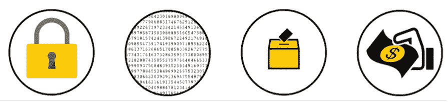

# 按市值排名的前 20 种加密货币简介

> 原文：<https://medium.com/coinmonks/an-introduction-to-the-top-20-cryptocurrencies-by-market-cap-fc9328fd08ac?source=collection_archive---------21----------------------->

本文按市值顺序介绍了排名前二十的加密货币的历史和前景。[【1】](#_ftn1)每个资产的网站和白皮书都有链接，请注意，鉴于其他地方有大量的媒体报道，比特币、以太坊和莱特币不在此列。

1.币安硬币(BNB)

2.系绳(USDT)

3.茄属植物

4.卡尔达诺

5.XRP (XRP)

6.波尔卡多(点)

7.美元硬币(USDC)

8.雪崩

9.Dogecoin (DOGE)

10.地球(月球)

11.UNI WAP(UNI)

12.链环(链环)

13.多边形(MATIC)

14.阿尔格兰德(ALGO)

15.埃尔隆德

16.无限轴(AXS)

17.分散土地(法力)

18.创(TRX)

19.宇宙(原子)

20.西塔

**币安币(BNB)**

币安交易所以“二元金融”命名，旨在解决许多交易所发现的问题，如技术架构差、安全性有限、客户服务差、国际化和语言支持差。币安在 2017 年交换了发射，其匹配的引擎每秒能够维持 140 万个订单。当时只支持五个交易对。此后，币安在 2020 年实现了 10 亿美元的利润和 1350 万用户。币安硬币(BNB)于 2017 年在以太坊网络上与交易所一起推出。硬币将被用来支付各种兑换费用。BNB 最终搬到了自己的区块链，名为币安智能链(BSC ),并成为目前现存的第三大加密货币，市值约为 1000 亿美元。[【我】](#_edn1)

在 binance.com[或 binance.us 访问币安，在 exodus.com/assets/docs/binance-coin-whitepaper.pdf](http://binance.com/)[访问他们的白皮书](http://exodus.com/assets/docs/binance-coin-whitepaper.pdf)

**系绳(USDT)**

Tether 最初于 2014 年以 Realcoin 的名义推出，并于当年 11 月更名，旨在提供一种由法定货币支持的数字令牌，以实现一种分散的价值交换方法，同时使用一种熟悉的会计单位。这种单位必须比大多数其他加密货币更不稳定，而 Tether 最终通过在所有 Tether 令牌和相关法定货币之间保持一对一的准备金率来实现价格稳定。Tether 成为第一种成功的稳定货币，并一直与美元挂钩。此后，系绳的稳定性提供了一种更可行的交换方式。假设你想买午餐——如果你用比特币支付，商家不知道比特币在一天、一周或一个月后会值多少钱。固有的波动性(费用除外)使得交易变得困难。稳定货币通过与美元或任何其他稳定的储备资产挂钩来解决这一问题，因此创造了一个更加舒适和熟悉的全方位交易环境。Tether 现在是一种 ERC20 令牌(意味着它在以太坊区块链上运行)，也是第四大加密货币。它目前呈现出惊人的 850 亿美元的 24 小时交易量。[【ii】](#_edn2)

请访问 tether.to 和他们在 tether.to/wp-content/uploads/2016/06/TetherWhitePaper.pdf 的白皮书

**索拉纳(SOL)**

Solana 于 2020 年 3 月推出，旨在提供以太坊的替代方案，该方案利用了基于历史证明(PoH)的区块链架构，可以验证区块链事件(数据)之间的顺序和时间流逝。PoH 与共识算法利害关系证明(PoS)一起使用。而以太坊每秒可以支持 15 到 45 笔交易，索拉纳可以处理数万笔，索拉纳的费用也明显低于以太坊。自推出以来，索拉纳已飙升至 670 亿美元的市值，并被誉为可能挑战以太坊霸权的硬币。[【第三期】](#_edn3)

在 solana.com[拜访索拉纳](http://solana.com/)在 solana.com/solana-whitepaper.pdf[拜访他们的白皮书](http://solana.com/solana-whitepaper.pdf)

**卡尔达诺(阿达)**

很像索拉纳，卡尔达诺被设计用来改进以太坊的许多功能。Cardano 于 2015 年由以太坊联合创始人查尔斯·霍斯金森(Charles Hoskinson)发起，旨在提供一个更加平衡和可持续的生态系统，以及一种标准和同行驱动的研究和改进方法。Cardano 在自己的区块链上运行，并利用名为 Ouroboros 的利益证明协议，该协议运行的协议类似于谷歌和脸书的协议，内置的扩展解决方案远远超过比特币和其他加密货币的解决方案。Cardano 已经成长为市值 590 亿美元的公司，其目标是通过覆盖 10 亿人的雄心勃勃的计划来“连接未连接的人”。[【iv】](#_edn4)

访问 cardano.org[的卡尔达诺和 whitepaper.io/document/581/cardano-whitepaper.的他们的白皮书](http://cardano.org/)

**涟漪(XRP)**

Ripple 于 2012 年由 Ripple Labs 推出，建立在一种新颖的共识算法(RPCA)基础上，与比特币等硬币相比，该算法等待时间短，费用低。据 Ripple 报道，有 100 多家银行对使用其 XCurrent 信息技术感兴趣，一些银行甚至计划使用 XRP 硬币。然而，2018 年，美国证券交易委员会(SEC)对 Ripple 提起集体诉讼，称该公司通过未注册销售 XRP 代币筹集了数亿美元，导致交易所退市和公众抵制。尽管如此，Ripple 已经基本恢复，成为第七大加密货币，市值 500 亿美元。[【v】](#_edn5)

在 ripple.com[参观 XRP](http://ripple.com/)和在 ripple.com/files/ripple_consensus_whitepaper.pdf[参观他们的白皮书](http://ripple.com/files/ripple_consensus_whitepaper.pdf)

**波尔卡多(圆点)**

由 Web3 基金会于 2020 年推出的 Polkadot 旨在从五个方面改善过去的硬币:可扩展性、可隔离性、可开发性、治理和适用性。Polkadot 网络协议旨在成为一种通用区块链，并利用池化安全和无信任链间可交易性来增强可伸缩性。DOT token 最初通过授权证明(PoA)运作，后来转变为提名利益证明(NPoS)，后者选择验证者参与共识协议(利益相关)。Polkadot 目前是第八大加密货币，市值保持在 400 亿美元。[【VI】](#_edn6)

请访问 polkadot.network 上的 Polkadot，以及他们在 Polkadot . network/polkadotppaper . pdf 上的白皮书

**美元硬币(USDC)**

美元硬币由 Circle 和 Centre 财团于 2018 年推出，其理念是通过创造一种具有强大治理和透明度的法定抵押稳定硬币来即兴创作(第一种大规模稳定硬币)。每一美元都由“完全保留的资产”支持，USDC 可以通过一个过程将美元令牌化，包括将美元发送到硬币发行者的银行账户，发行者提供智能合同以创建等量的 USDC，并将铸造的硬币发送给用户，美元作为储备。Visa 宣布，交易可以在 2021 年 3 月使用 USDC 结算，USDC 目前的市值为 380 亿美元。[【VII】](#_edn7)

访问 centre.io/usdc 的美元硬币和他们的白皮书，网址是[f . hubspotusercontent 30 . net/hub fs/9304636/PDF/centre-white paper . PDF](http://f.hubspotusercontent30.net/hubfs/9304636/PDF/centre-whitepaper.pdf)

**雪崩(AVAX)**

Avalanche 于 2018 年推出，旨在构建一个“高性能、可扩展、可定制、安全的区块链平台”，并迅速成为以太坊的主要竞争对手。用户可以在 Avalanche 平台上构建和启动分散式应用程序(dApps)。作为区块链行业最快的智能合同平台，雪崩网络已经发展到数百个 dApps 和 260 亿美元的市值。[【VIII】](#_edn8)

参观 avalabs.org[和 avalabs.org/whitepapers](http://avalabs.org/)的和[雪崩](http://avalabs.org/whitepapers)

**Dogecoin (DOGE)**

Dogecoin 的概念是由来自 IBM 和 Adobe 的工程师比利·马库斯和杰克逊·帕尔默提出的。Palmer 概念化了 Dogecoin，而 Markus 设计了基于 Litecoin 的 DOGE 协议。这枚硬币原本只是一个笑话，但它于 2013 年 12 月推出，第一个月就上涨了数百分之几。2014 年，Dogecoin 的交易量一度压制了每一种加密货币(包括比特币)的交易量总和。在整个 2020 年和 2021 年，社交炒作将 Dogecoin 推高了数千个百分点，在 meme coin 排名中仅次于柴犬。Dogecoin 社区继续围绕硬币建立效用，并作为心理学和金融视角中代际分裂的有趣例子。DOGE 的最高市值为 700 多亿美元，目前为 280 亿美元。[【IX】](#_edn9)

在 dogecoin.com 参观 Dogecoin。

**特拉(露娜)**

Terra 于 2019 年推出，旨在通过弹性货币供应和稳定的矿业激励措施实现价格稳定，并通过这种方式创造出一种密码货币，结合了比特币的分散特性和法定货币的相对稳定性。Terra 发起了 Terra 联盟，该联盟是亚洲 15 家电子商务公司的集合，每年处理 250 亿美元的交易量。该联盟将提供必要的规模来推动 Terra 的采用。如今，Terra 协议充当了稳定货币网络，用户可以在其中创建与法定货币挂钩的稳定货币，而 LUNA 币则充当了储备资产。LUNA 的市值为 160 亿美元，Terra 生态系统为 DeFi、Web3 和 NFT 空间的 100 多个项目提供动力。 [[x]](#_edn10)

访问 Terra at terra.money 及其白皮书，网址为 [assets .网站-files . com/611153 e7a Fe 981472 D8 da 199 c/618 b 02d 13 e 938 AE 1 F8 ad1 e 45 _ Terra _ White _ paper . pdf](http://assets.website-files.com/611153e7af981472d8da199c/618b02d13e938ae1f8ad1e45_Terra_White_paper.pdf)

**Uniswap (UNI)**

Uniswap(最初命名为 Unipeg，是独角兽和飞马座的混合体)于 2018 年推出，旨在完全融入抵制审查、分散、无权限和完全安全的特性，发明者(海登·亚当斯)认为这在 Ethereum 网络的主要项目中是缺乏的。Uniswap 交易所作为交易 ERC20 令牌的简单智能合同界面推出，UNI 令牌于 2020 年推出。2021 年，Uniswap 交易所的累计交易额超过 5000 亿美元，而 UNI 的市值为 120 亿美元。[【Xi】](#_edn11)

访问位于[uniswap.org](http://uniswap.org/)的 Uniswap，访问位于[uniswap.org/whitepaper.pdf](http://uniswap.org/whitepaper.pdf)的 unis WAP 白皮书

**链环(LINK)**

创建于 2014 年并于 2017 年推出的 ChainLink 开发了分散式 Oracle Networks (DONs)，这是一个由[ChainLink]节点组成的委员会负责维护的网络，这些节点与智能合同配对，最终提供了极其安全的交易。DONs 允许 ChainLink 开发混合智能合同，消除复杂性，实现规模和保密性，并通过强有力的激励机制追求安全性。此后，Link 网络获得了 830 亿美元的价值，LINK 拥有 100 亿美元的市值。[【XII】](#_edn12)

访问 ChainLink，网址为 chain.link，并在 chain.link/whitepaper.查看他们的白皮书

**多边形(MATIC)**

Polygon 于 2017 年在区块链以太坊推出，旨在解决以太坊面临的几个问题，即低吞吐量、高费用和缺乏主权。Polygon 作为“构建和连接以太坊兼容的区块链网络的协议和框架”推出，并于 2019 年切换到 Polygon 区块链。现在，Polygon 作为以太坊兼容网络的第二层扩展解决方案，甚至在 2021 年 10 月超过了以太坊的用户群。MATIC 的市值为 180 亿美元。[【十三】](#_edn13)

在 polygon.technology/lightpaper-polygon.pdf 访问 Polygon 在 [polygon.technology](https://polygon.technology/) 和他们的白皮书

**阿尔格兰德(ALGO)**

Algorand 于 2019 年推出，旨在通过一种新颖的拜占庭协议协议，在完全无许可的环境中提供更高的安全性、可扩展性和快速交易终结性。今天，Algorand 网络拥有 1500 万个地址，并在 4.39 秒内实现块终结。ALGO 的市值为 110 亿美元。[【十四】](#_edn14)

请访问位于 algorand.com[的阿尔格兰德公司](http://algorand.com/)，并访问他们的白皮书:algorandcom . cdn . prismic . io/algorandcom % 2 fece 77 f 38–75 B3–44 de-bc7f-805 f 0 e 53 A8 d 9 _ theory . pdf

**埃尔隆德**

埃尔隆德成立于 2017 年，旨在通过结合自适应状态分片和安全利益证明(SPoS)来创建高度可扩展的公共区块链。埃尔隆德的架构解决了比特币和以太坊的能源和计算浪费问题，并通过新颖的 SPoS 模型确保公平分配。埃尔隆德在 2021 年推出了一款名为 Maiar 的钱包和支付应用，旨在成为加密的 Venmo，EGLD 硬币的市值为 140 亿美元。[【XV】](#_edn15)

在 elrond.com[访问埃尔隆德](http://elrond.com/)和在 elrond.com/assets/files/elrond-whitepaper.pdf[访问他们的白皮书](http://elrond.com/assets/files/elrond-whitepaper.pdf)

**恒星(XLM)**

Stellar Lumens 引入了一种新的共识模型，称为联邦拜占庭协议(FBA)。建立在 FBA 基础上的 Steller 共识协议(SCP)将 PoW 和 PoS 提供的分散控制与拜占庭协议的低延迟和渐近安全性结合起来。Stellar 在 2014 年从 Stripe 获得了 300 万美元的种子资金，并在第一年增长到 300 万注册账户。现在有 80 多个项目在恒星区块链运作，XLM 的市值为 80 亿美元。[【XVI】](#_edn16)

在 stellar.org[和 stellar.org/papers/stellar-consensus-protocol?locale=en](http://stellar.org/)[分别访问恒星和他们的白皮书](http://stellar.org/papers/stellar-consensus-protocol?locale=en)

**无限轴(AXS)**

Axie Infinity 于 2018 年推出，是首批加密游戏之一，是一个受神奇宝贝启发的宇宙，玩家可以通过游戏和 PVP 战斗，以及培育“Axie”并在市场上交易来赚取代币。Axie Infinity 在 2021 年 10 月达到了 200 万日活跃用户，总销售额为 34 亿美元，而 AXS 令牌的市值为 80 亿美元。[【XVII】](#_edn17)

在 axieinfinity.com[访问 Axie Infinity](http://axieinfinity.com/)，在 whitepaper.axieinfinity.com[访问他们的白皮书](http://whitepaper.axieinfinity.com/)

**分散之地(法力)**

分散王国是一个位于区块链的虚拟世界(元宇宙),由区块链以太坊提供动力。土地永久归使用者所有，法力令牌用于购买世界内的物品和服务。分散土地的工作始于 2015 年，测试版于 2017 年推出。当时，每块土地的售价仅为 20 美元，而一个分散式地产组合仅在四年后就以创纪录的 243 万美元售出。MANA 的市值为 100 亿美元。[【十八】](#_edn18)

在 decentraland.org[访问分散的土地](http://decentraland.org/)和在 decentraland.org/whitepaper.pdf[访问他们的白皮书](http://decentraland.org/whitepaper.pdf)

**戴(戴)**

Maker Protocol 和 Dai token 成立于 2014 年(与第一枚 stablecoin，Tether 同年)，旨在成为一种“无偏见、抵押品支持的加密货币，软盯住美元”，最大限度地降低价格波动。Dai Stablecoin 系统，后来更名为 Maker Protocol，通过一系列称为抵押债务头寸(CDPs)的动态反馈系统，仍然与美元等值。CDP 是以太坊区块链上的智能合约衍生品，代表债务合约，由加密证券担保。一旦将资金存入智能合同，CDP 允许用户生成与他们希望借入的 Dai 等值的美元值。虽然这看起来可能很复杂，但戴在表面上与任何其他加密货币一样运作(忽略波动性)，并提供数字和分散货币的好处，而没有波动性和风险。戴坐拥 65 亿美元的市值。[【XIX】](#_edn19)

在的访问戴，在的访问他们的白皮书

**宇宙(原子)**

宇宙号于 2014 年发射，其使命是创造可以相互通信和互动的区块链，而不是标准的孤立网络。这些可互操作的区块链可以保留它们的安全属性，并且不会妨碍可伸缩性。宇宙网络现在由许多独立的区块链组成，称为区域，由 Tendermint 拜占庭容错(BFT)共识引擎共同提供动力。ATOM coin 的市值为 60 亿美元。[【xx】](#_edn20)

在 cosmos.network 访问 Cosmos，在 v1 . Cosmos . network/resources/white paper 访问他们的白皮书

**沙盒(沙子)**

沙盒旨在建立一个虚拟世界，在这个世界中，玩家可以使用 SAND 工具令牌“建立、拥有和货币化他们的游戏体验”。沙盒可以被认为类似于《我的世界》和 Roblox，除了玩家通过 NFTs 真正拥有他们的游戏内财产。游戏中的土地是稀缺的、可交易的、可定制的，玩家可以“在没有中央控制的情况下进行工艺、游戏、分享、收集和交易。”沙盒还提供了体素编辑器，允许用户创建 3d 对象并制作动画；一个市场，用户可以在其中上传、发布和出售他们的体素编辑作品(在游戏中使用)；以及一个游戏制作程序，可以在其中将自有资产放置在数字景观中的自有土地上。沙盒 alpha 版本于 2021 年 11 月上线，其 12000 名所有者现在集体拥有价值 5 亿美元的数字土地。[【XXI】](#_edn21)

访问 sandbox.game 上的 Sandbox 和他们在 installers.sandbox.game/The_Sandbox_Whitepaper_2020.pdf.的白皮书

**氦(HNT)**

氦是一个分散的无线网络，“使世界上任何地方的设备都能无线连接到互联网。”氦旨在打破垄断的无线网络行业，并消除在接收无线网络覆盖的中央中介的需要。分散的无线互联网覆盖通过矿工的分布式网络工作，矿工提供无线网络覆盖以换取 HNT 代币。氦网络拥有 30 多万个活节点，最近刚刚与 Dish Network 合作提供分布式 5G 接入，并使 HNT 的市值达到 45 亿美元。[【XXII】](#_edn22)

在 helium.com[参观氦](https://www.helium.com/)，在 whitepaper.helium.com[参观他们的白皮书](http://whitepaper.helium.com/)。

**EOS (EOS)**

EOS 于 2018 年作为私营区块链公司 block . one(b1.com)的后代推出，旨在为区块链创新和性能引入一个高度可配置的快速平台，主要针对企业和开发商。EOS 在 2018 年的 ICO 中筹集了 41 亿美元，此后市值增长到 41 亿美元。[【XXIII】](#_edn23)

请访问 eos.io 上的 EOS 及其白皮书，网址为[github . com/EOS io/Documentation/blob/master/technical white paper . MD](http://github.com/EOSIO/Documentation/blob/master/TechnicalWhitePaper.md)

**金恩硬币(ENJ)**

金恩是最大的游戏社区创建平台(拥有 1870 万注册用户)，旨在提供一个分散的平台来管理、分发和交易虚拟商品，以及创建和实现新的跨应用程序游戏和 NFT 体验的工具。超过 250，000 个游戏社区和数以千计的游戏创造了金恩网络的活跃社区，金恩硬币的市值达到 33 亿美元。[【XXIV】](#_edn24)

请访问 enjin.io 网站上的金恩和 cdn.enjin.io/downloads/whitepapers/enjin-coin/en.pdf 网站上的白皮书

**联欢晚会(GALA)**

Gala Games 生态系统是一个游戏平台，通过 16，000 个玩家运行的节点运行，并提供投票机制来决定哪些游戏应该得到资助并带到 Gala 平台上。在这个生态系统中，90 多名团队成员开发基于 NFT 和区块链的游戏。GALA token 的市值为 30 亿美元。

请访问 app.gala.games 上的 Gala 以及 support.gala.games/en_US/gala/what-is-gala 上的白皮书

***备注&演职员表***

[【1】](#_ftnref1)截至 2022 年初。市值数据基于流通供应量，而非最大供应量。

[【2】](#_ftnref2)根据以太扫描。

[【I】](#_ednref1)《币安交易所白皮书》，2021 年 11 月 26 日访问。[https://www . exodus . com/assets/docs/币安-coin-white paper . pdf](https://www.exodus.com/assets/docs/binance-coin-whitepaper.pdf.)

[【ii】](#_ednref2)“系绳:比特币区块链上的法定货币。”2021 年 11 月 26 日进入。[https://tether . to/WP-content/uploads/2016/06/tetherwhitepaper . pdf](https://tether.to/wp-content/uploads/2016/06/TetherWhitePaper.pdf.)

[【iii】](#_ednref3)“Solana:高性能区块链的新架构。”2021 年 11 月 26 日进入。[https://solana.com/solana-whitepaper.pdf.](https://solana.com/solana-whitepaper.pdf.)

[【iv】](#_ednref4)《卡尔达诺 Ada 白皮书》卡尔达诺 ADA 白皮书。2021 年 11 月 26 日进入。[https://whitepaper.io/coin/cardano.](https://whitepaper.io/coin/cardano.)

[【v】](#_ednref5)“涟漪协议共识算法。”2021 年 11 月 26 日进入。[https://ripple.com/files/ripple_consensus_whitepaper.pdf.](https://ripple.com/files/ripple_consensus_whitepaper.pdf.)

“POLKADOT:异构多链框架的愿景”2021 年 11 月 26 日进入。[https://polkadot . network/polkadotpaper . pdf](https://polkadot.network/PolkaDotPaper.pdf.)

[【VII】](#_ednref7)“白皮书— F.HUBSPOTUSERCONTENT30.NET”，于 2021 年 11 月 28 日获取。[https://f . hubspotusercontent 30 . net/hub fs/9304636/PDF/centre-white paper . PDF](https://f.hubspotusercontent30.net/hubfs/9304636/PDF/centre-whitepaper.pdf.)

"加密研究、数据和工具."梅萨里加密新闻。2021 年 11 月 28 日访问。[https://messari.io/asset/usd-coin/profile.](https://messari.io/asset/usd-coin/profile.)

《白皮书— F.HUBSPOTUSERCONTENT30.NET》，2021 年 11 月 28 日获取。[https://f . hubspotusercontent 30 . net/hub fs/9304636/PDF/centre-white paper . PDF .](https://f.hubspotusercontent30.net/hubfs/9304636/PDF/centre-whitepaper.pdf.)

"美元硬币(USDC):完全保留的法币支持的稳定硬币."美元硬币(USDC) |完全保留的法币。2021 年 11 月 28 日访问。https://www.circle.com/en/usdc.

[【VIII】](#_ednref8)《白皮书》艾娃实验室:打造金融互联网。2021 年 11 月 26 日进入。[https://www.avalabs.org/whitepapers.](https://www.avalabs.org/whitepapers.)

[【IX】](#_ednref9)Dogecoin。2021 年 11 月 28 日访问。[https://dogecoin.com/.](https://dogecoin.com/.)

乌斯曼·w·乔汉，《狗的历史》SSRN，2017 年 12 月 27 日。[https://papers.ssrn.com/sol3/papers.cfm?抽象 _id=3091219。](https://papers.ssrn.com/sol3/papers.cfm?abstract_id=3091219.)

[【x】](#_ednref10)“为货币创新提供动力。”泰拉。2021 年 11 月 26 日进入。[https://www.terra.money/.](https://www.terra.money/.)

"加密研究、数据和工具."梅萨里加密新闻。2021 年 11 月 26 日进入。[https://messari.io/asset/terra/profile.](https://messari.io/asset/terra/profile.)

[【Xi】](#_ednref11)“unis WAP v2 核心”2021 年 11 月 28 日访问。[https://uniswap.org/whitepaper.pdf.](https://uniswap.org/whitepaper.pdf.)

" Uniswap 简史"Uniswap 协议，2019 年 2 月 11 日。[https://uniswap.org/blog/uniswap-history.](https://uniswap.org/blog/uniswap-history.)

[【XII】](#_ednref12)“链环。”2021 年 11 月 28 日访问。[https://research.chain.link/whitepaper-v1.pdf.](https://research.chain.link/whitepaper-v1.pdf.)

[【XIII】](#_ednref13)“家——多边形|以太坊的区块链互联网。”2021 年 11 月 26 日进入。[https://polygon.technology/lightpaper-polygon.pdf.](https://polygon.technology/lightpaper-polygon.pdf.)

[【XIV】](#_ednref14)“请看……阿尔格兰德白皮书。”简单的比特币投资组合跟踪器。2021 年 11 月 26 日进入。[https://coin . FYI/news/algo rand/looke-the-algo rand-white paper-ohysad #！](https://coin.fyi/news/algorand/behold-the-algorand-whitepaper-ohysad#!)

[【XV】](#_ednref15)【埃尔隆德白皮书】2021 年 11 月 26 日进入。[https://elrond.com/assets/files/elrond-whitepaper.pdf.](https://elrond.com/assets/files/elrond-whitepaper.pdf.)

埃尔隆德。“货币的未来 Maiar。”梅尔。2021 年 11 月 26 日进入。[https://maiar.com/.](https://maiar.com/.)

[【XVI】](#_ednref16)“fin tech&区块链项目及合作伙伴。”太棒了。2021 年 11 月 26 日进入。[https://stellar.org/ecosystem/projects.](https://stellar.org/ecosystem/projects.)

亚洲的科技——连接亚洲的创业生态系统。2021 年 11 月 26 日进入。[https://www.techinasia.com/stellar-asia-growth.](https://www.techinasia.com/stellar-asia-growth.)

"恒星共识协议"太棒了。2021 年 11 月 26 日进入。[https://www.stellar.org/papers/stellar-consensus-protocol?locale=en。](https://www.stellar.org/papers/stellar-consensus-protocol?locale=en.)

[【XVII】](#_ednref17)“Axie Infinity 销量数据，图表&图表/ CryptoSlam！”/ CryptoSlam！2021 年 11 月 26 日进入。[https://cryptoslam.io/axie-infinity/sales/summary.](https://cryptoslam.io/axie-infinity/sales/summary.)

无限轴—无限轴。2021 年 11 月 26 日进入。[https://whitepaper.axieinfinity.com/.](https://whitepaper.axieinfinity.com/.)

[【XVIII】](#_ednref18)《白皮书——权力下放》2021 年 11 月 26 日进入。[https://decentraland.org/whitepaper.pdf.](https://decentraland.org/whitepaper.pdf.)

《制造者协议白皮书:2020 年 2 月》制造者协议白皮书| 2020 年 2 月。2021 年 11 月 26 日进入。[https://makerdao.com/en/whitepaper/.](https://makerdao.com/en/whitepaper/.)

[【xx】](#_ednref20)“宇宙网络生态系统概述。”2021 年 7 月 1 日，DezentralizedFinance.com。[https://dezentralized finance . com/cosmos-network-ecosystem-overview/。](https://dezentralizedfinance.com/cosmos-network-ecosystem-overview/.)

[【XXI】](#_ednref21)《沙盒白皮书》(2020 年 8 月)V22021 年 11 月 26 日进入。[https://installers . Sandbox . game/The _ Sandbox _ white page _ 2020 . pdf .](https://installers.sandbox.game/The_Sandbox_Whitepaper_2020.pdf.)

[【XXII】](#_ednref22)“氦。”2021 年 11 月 26 日进入。[http://whitepaper.helium.com/.](http://whitepaper.helium.com/.)

[【XXIII】](#_ednref23)Eosio。"文档/技术白皮书. md，位于 Master EOSIO/Documentation . "GitHub，2018 年 4 月 28 日。[https://github . com/EOS io/Documentation/blob/master/technical white paper . MD .](https://github.com/EOSIO/Documentation/blob/master/TechnicalWhitePaper.md.)

[【XXIV】](#_ednref24)“金恩币”2021 年 11 月 28 日访问。[https://cdn . en Jin . io/downloads/white papers/金恩币/en.pdf](https://cdn.enjin.io/downloads/whitepapers/enjin-coin/en.pdf) 。

> *加入 Coinmonks* [*电报频道*](https://t.me/coincodecap) *和* [*Youtube 频道*](https://www.youtube.com/c/coinmonks/videos) *了解加密交易和投资*

# 另外，阅读

*   [Bookmap 评论](https://coincodecap.com/bookmap-review-2021-best-trading-software) | [美国 5 大最佳加密交易所](https://coincodecap.com/crypto-exchange-usa)
*   最佳加密[硬件钱包](/coinmonks/hardware-wallets-dfa1211730c6) | [Bitbns 评论](/coinmonks/bitbns-review-38256a07e161)
*   [新加坡十大最佳加密交易所](https://coincodecap.com/crypto-exchange-in-singapore) | [购买 AXS](https://coincodecap.com/buy-axs-token)
*   [红狗赌场评论](https://coincodecap.com/red-dog-casino-review) | [Swyftx 评论](https://coincodecap.com/swyftx-review) | [造币厂评论](https://coincodecap.com/coingate-review)
*   [投资印度的最佳密码](https://coincodecap.com/best-crypto-to-invest-in-india-in-2021)|[WazirX P2P](https://coincodecap.com/wazirx-p2p)|[Hi Dollar Review](https://coincodecap.com/hi-dollar-review)
*   [加拿大最佳加密交易机器人](https://coincodecap.com/5-best-crypto-trading-bots-in-canada) | [库币评论](https://coincodecap.com/kucoin-review)
*   [火币加密交易信号](https://coincodecap.com/huobi-crypto-trading-signals) | [HitBTC 审核](/coinmonks/hitbtc-review-c5143c5d53c2)
*   [如何在 FTX 交易所交易期货](https://coincodecap.com/ftx-futures-trading) | [OKEx vs 币安](https://coincodecap.com/okex-vs-binance)