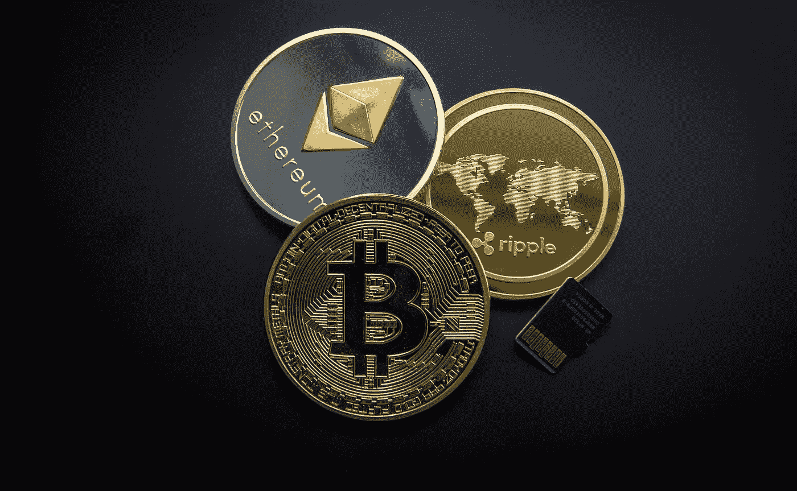

# 毛里求斯“虚拟资产”和虚拟代币产品介绍指南

> 原文：<https://medium.com/coinmonks/an-introductory-guide-to-virtual-assets-and-virtual-token-offerings-in-mauritius-b3f5f6005da?source=collection_archive---------7----------------------->

(截至 2022 年 4 月 27 日更新)

近年来，比特币和其他分散的虚拟资产(通常称为加密货币)越来越受到关注。这不仅是投资者之间的热门话题，也是流行文化中的热门话题，这要感谢像巴里·希尔伯特、埃隆·马斯克和杰克·多西这样的先驱投资者。虽然虚拟资产为支付系统提供了一个未来的机会，但它也为犯罪分子、资助恐怖主义者和其他逃避制裁者提供了一个强大的工具，以转移和存储非法资金，使其不受执法机构和其他机构的管辖。

《2021 年毛里求斯虚拟资产和首次代币发行服务法》( **VAITOS Act** )于 2022 年 2 月 7 日生效，为虚拟资产服务提供商( **VASPs)** 和首次代币发行人( **IITOs** )提供了监管框架。本文旨在解释 VAITOS 法案的核心内容，以及寻求在毛里求斯注册的 VASP 和 IITO 的潜在商业机会，以便开展受监管的 VASP 和 IITO 相关活动。

**根据 VAITOS 法案，什么是“虚拟资产”?**

“虚拟资产”系指:(a)可以数字方式交易或转让的价值的数字表示，并可用于支付或投资目的；但(b)不包括法定货币、证券和毛里求斯 2005 年证券法管辖范围内的其他金融资产的数字表示。

简而言之,“虚拟资产”将包括所有形式的加密货币，加密货币是区块链网络中可以交易、用作交换媒介和价值储存手段的固有资产(例如比特币和以太坊),并将涵盖基于智能合约的数字代币(例如 Solana、PolkaDot 和不可替代代币)。

**什么是 VASP？**

根据《瓦伊托斯法》, VASP 是指作为一个企业，为他人或代表他人从事下列一项或多项活动或业务的人——㈠虚拟资产和法定货币之间的兑换；㈡一种或多种形式的虚拟资产之间的交换；㈢虚拟资产的转让；㈣保管虚拟资产或能够控制虚拟资产的工具；㈤管理虚拟资产或能够控制虚拟资产的工具；(vi)参与和提供与以下内容相关的金融服务——( a)发行人的虚拟资产要约和销售；以及(b)发行人对虚拟资产的要约或出售。

**va itos 法案监管什么？**

毛里求斯金融服务委员会( **FSC** )是非银行金融服务部门和全球商业的综合监管机构，负责根据《VAITOS 法》对 VASPs 和 IITOS 的行为进行许可、监管、监测和监督。

《VAITOS 法》适用于在毛里求斯开展业务活动的任何 VASP 和任何 IITO，但有例外情况(例如，向 VASP 提供辅助服务或产品的人员无需持有《VAITOS 法》规定的任何许可证)。

同样，在毛里求斯开展首次代币发行业务之前，IITO 必须在 FSC 注册。

VASP 人未能持有《瓦伊托斯法》规定的执照和/或任何人未能在 FSC 注册为 IITO，一经定罪，可能会受到罚款甚至监禁的处罚。

**与 VASPs 相关的适用许可证**

有五(5)种许可证适用于 VASPs，即:

1.  “ **M** ”类——虚拟资产经纪交易商；
2.  Class " **O"** —虚拟资产钱包服务；
3.  Class " **R** " —虚拟资产托管人；
4.  类别“**I**”—虚拟资产咨询服务；和
5.  Class " **S** " —虚拟资产市场

每个许可证都是独一无二的，与 VASP 的特定活动相关。例如," O "类许可证将适用于参与代表他人进行的任何交易的 VASPs，这些交易将虚拟资产从一个虚拟资产地址或账户转移到另一个虚拟资产地址或账户。

**你能起到什么作用，有什么启示？**

**首次代币发行的发行人**

首次代币发行的发行人必须向 FSC 提交一份白皮书，该白皮书应*特别是*提供全面、准确的信息披露，以便潜在购买者做出明智的决定。

提供的任何虚拟代币只能在白皮书规定的提供期内**分发**，提供期不得超过 6 个月。

虚拟代币的购买者有权在同意购买虚拟代币之日后不迟于 **72 小时**发出书面通知撤回其购买。

**虚拟资产服务提供商**

除其他事项外，VASP 必须提交 FSC 提供的相关申请表，并具体说明申请的许可证类别。无论申请的执照类别如何，FSC 在特别考虑申请的所有情况后，可决定向申请人发放不同类别的执照(如果有的话)。

**vasp 和 IITOs 的职业操守**

VASP 和 IITO 在开展各自的业务活动时，应以诚实和公平的方式行事，以应有的技能、谨慎和勤勉行事，并遵守和保持高标准的职业行为。他们还应确保不从事任何不当或非法行为，并拥有适当的内部机制和政策来监控、监督和应对洗钱和恐怖融资风险。

监管将在哪里发生？

VASPs 和 IITOs 通常在全球都有业务和客户群。不管服务器位于何处，也不管它在哪里开展业务，都是成立并许可/授权 VASP 或 IITO(视情况而定)作为其主要监管机构的国家。

鉴于上述情况，在毛里求斯成立的 VASP 或 IITO，如开展受《VAITOS 法》管辖的活动，将受 FSC 监管。

**成长的机会？**

与全球其他监管机构一样，FSC 越来越关注各种来源，以识别和评估与 VASPs 和 IITOs 提供的虚拟资产产品和服务相关的洗钱和恐怖融资风险。

获得许可和授权的 VASP 或 IITO(视情况而定)提供了一个机会，向其利益相关方证明其受到有效系统的监管，以监测和监督反洗钱和打击资助恐怖主义的标准、预防措施(如客户尽职调查、记录保存和可疑交易报告)的遵守情况。最终，一个规范的 VASP 和 IITO 会给你的业务和提议的活动带来合法性和确定性。

毛里求斯在虚拟资产法律领域采取了非常进步的方法，在已建立的虚拟资产交易所和虚拟资产相关业务中日益突出。这在很大程度上归功于毛里求斯政府近年来颁布的一系列法律，这些法律基于三项基本原则——市场诚信、消费者保护和行业尽职调查。还应注意的是，FSC 将在不久的将来发布更详细的规则和条例，以使 VASPs 和 IITOs 更加清晰，从而塑造毛里求斯的虚拟资产法律环境。

ayyan Sorefan 被授予英格兰、威尔士和毛里求斯的律师资格。他是普华永道法律部(毛里求斯)的高级助理律师。他的业务重点是金融科技、公司法以及银行和金融。

欲了解更多信息，请联系 rayyan.sorefan@pwc.com 的雷扬

*本文旨在提供信息，仅阐述出版之日适用的毛里求斯法律的一般原则。它仅提供一般概述，并不构成或取代全面的法律意见，我们建议您在就虚拟资产相关事宜采取任何行动之前寻求全面的法律意见。*

> 加入 Coinmonks [电报频道](https://t.me/coincodecap)和 [Youtube 频道](https://www.youtube.com/c/coinmonks/videos)了解加密交易和投资

# 另外，阅读

*   [OKEx 回顾](/coinmonks/okex-review-6b369304110f) | [Kucoin 交易机器人](/coinmonks/kucoin-trading-bot-automate-your-trades-8cf0ca2138e0) | [期货交易机器人](/coinmonks/futures-trading-bots-5a282ccee3f5)
*   [AscendEx Staking](https://coincodecap.com/ascendex-staking)|[Bot Ocean Review](https://coincodecap.com/bot-ocean-review)|[最佳比特币钱包](https://coincodecap.com/bitcoin-wallets-india)
*   [霍比评论](https://coincodecap.com/huobi-review) | [OKEx 保证金交易](https://coincodecap.com/okex-margin-trading) | [期货交易](https://coincodecap.com/futures-trading)
*   [比特币基地跑马圈地](https://coincodecap.com/coinbase-staking) | [Hotbit 评论](/coinmonks/hotbit-review-cd5bec41dafb) | [KuCoin 评论](https://coincodecap.com/kucoin-review)
*   [购买 Dogecoin 的 7 种最佳方式](https://coincodecap.com/ways-to-buy-dogecoin) | [ZebPay 评论](https://coincodecap.com/zebpay-review)