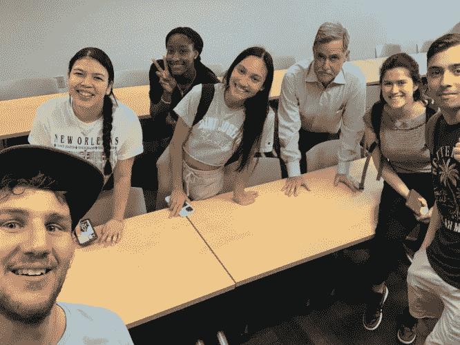
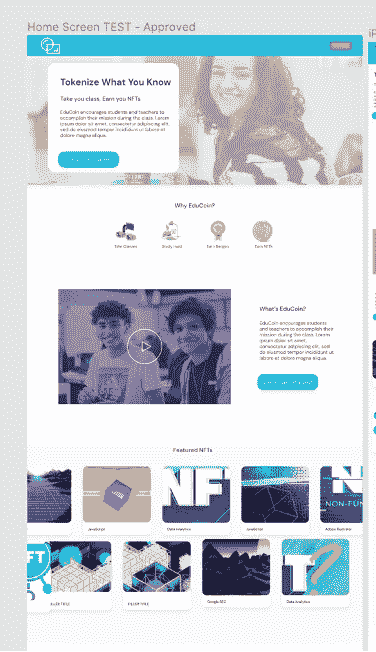
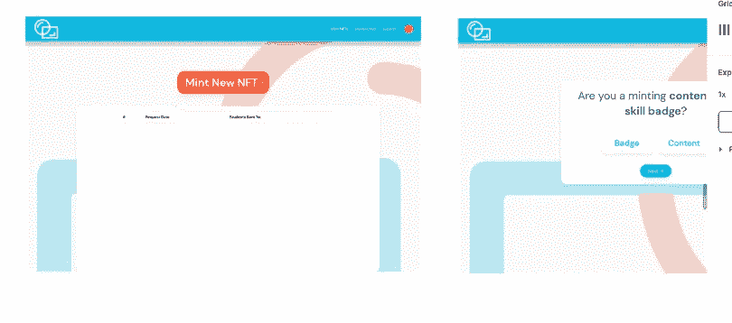
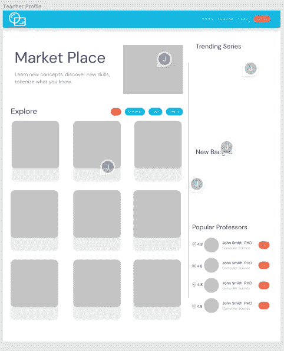
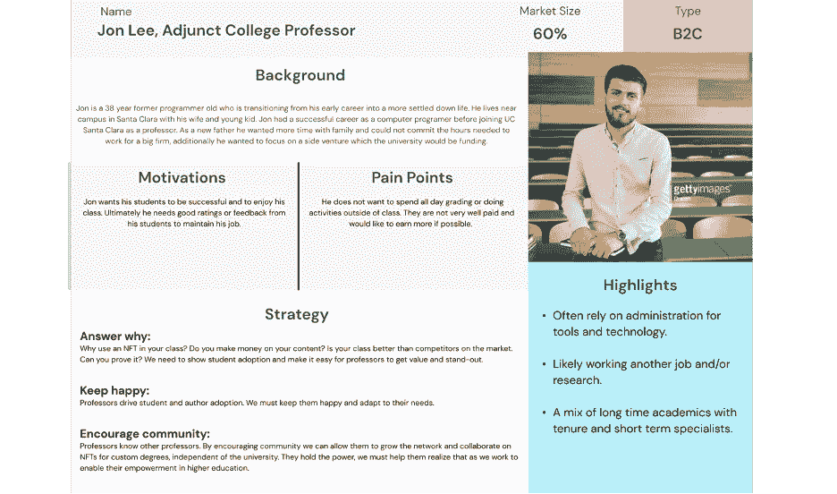

# 大学校园不可替代代币使用情况调查

> 原文：<https://medium.com/coinmonks/an-investigation-into-the-use-of-non-fungible-tokens-on-college-campuses-3ffa6686c2f4?source=collection_archive---------11----------------------->

*edu coin 团队开展的一项长期用户调查研究*

**研究日期:**2022 年 2 月 1 日—2022 年 5 月 30 日

**出版日期:【2022 年 6 月 1 日**

作者:杰克·迪巴蒂斯塔

编辑:科里·奥布莱恩

**鸣谢**:大卫·艾伦、Educoin 团队、博·布兰南、Blair Corcoran de Castillo 以及所有参与本次研究的参与者。

**关键术语和定义**

为了更好地支持可能对本研究感兴趣的非技术读者，下面列出了具有常见定义的关键术语，这将有助于您更好地理解值得注意的基础技术。

区块链:一种分散的分类账，用于公开记录和验证交易。通常被视为互联网不变的真理来源。

不可替代令牌(NFT):记录在区块链上的独特数字资产(显示为图像)，可作为独立艺术品或各种应用中的访问/实用密钥为用户提供价值。

智能合约:一个写在区块链上的应用程序，当某些参数准备好执行一个动作时触发。

学习赚钱:一种激励学习的模式，学生可以获得奖励，有时还会有等价的金钱来吸引未来的学习和参与。

经过验证的证书:许多公司和组织需要验证申请人的证书——无论是教育、职业执照、驾照、工作经验还是收入——都依赖于申请该公司或组织试图填补的任何职位的个人提交的证明。

代币:区块链上数字资产或货币的唯一(不可替代)或共同(可替代)表示。

铸造:在区块链上制造代币。

Discord:一个游戏玩家常用的社交网站，已经成为寻求联系的 web3 爱好者的首选。

Web3:基于区块链技术的应用和用例的产生。

元宇宙:一个在线社区或空间，参与者可以在其中扮演角色并创建在线角色。通常与虚拟现实相关联，但并非必须如此。

DApp:分散的应用程序是用区块链技术和通常的社区治理和所有权原则构建的

道:分散自主所有权是一种公司成立的形式，通过这种形式，公司可以由其社区资助和管理。它在做决策时使用其社区开发的编码规则(软件)。

**初始项目计划**

简而言之，问题是:与疫情开始的时候相比，现在的大学生人数减少了 100 多万([来源](https://www.nytimes.com/2022/01/13/us/college-enrollment-2021-omicron.html))。随着技术工作证书和在线学习的日益普及，大学学位不再是工作要求的一部分，这为学生学习和进入劳动力市场提供了新的选择。然而，随着更多的课程变得可用，对学生来说，确定哪些课程有价值，哪些没有价值是极其困难的。为了帮助解决这个问题，商会积极呼吁建立一个开放的技能网络([来源](https://www.globenewswire.com/en/news-release/2021/07/26/2268812/0/en/U-S-Secretary-of-Commerce-to-Headline-Open-Skills-Network-s-Inaugural-Skills-Summit.html))，旨在支持美国劳动力的大规模再技能培训以及所学技能的记录。与此同时，web3 和区块链技术公司正在成为下一波技术人才的主要雇主和教育者。这项研究着眼于这一新兴技术的交叉，并将阐明它在教育和可验证的工作技能的记录和传播中可能发挥的作用。

**影响:**过去十年，平均教育成本稳步增长，导致学生债务增加和技术劳动力不平等。Web3 承诺了一个更低成本的解决方案和一个分散的模型，允许任何人基于他们的工作贡献和收入。由于学术机构和数据收集的集中性质，当前的解决方案难以准确记录技能分布。通过让学生、教师和雇主能够更直接地互动，我们可以希望有更相关和更好记录的学习网络。学生们将对他们所选的课程变得更加挑剔，因为他们将被实时告知与技能和往届学生的旅程相关的工作成果。他们将建立一个基于技能和学科兴趣的学习者社区，而不仅仅是基于共同的位置和社交网络。教师将拥有在分散经济中赚钱的工具，并在课程中获得更大的自主权，同时对学生的成绩负责。最后，雇主将在调整教育和为教育提供信息方面发挥直接作用，以便从学校毕业的候选人做好准备，在快速变化的技术就业市场中获得收入。这一现实为教育系统的所有成员创造了巨大的社会和经济价值。

**问题和工作范围:**对于这个项目，我计划重点关注在大学校园内采用不可替代令牌(NFT)和区块链技术。在对 100 多名大学生进行了初步调查后，我和我的公司 EDUcoin 显然需要对我们所服务的学生有更多的了解。环境问题、对区块链技术的误解以及对技能徽章和 NFT 价值的怀疑都是大学校园采用区块链技术的主要障碍。正是考虑到这一点，我们想对大学生、教师和雇主使用非功能性外语教学的情况进行一次详细的调查研究。

在这项研究中，我将使用人物角色、旅程图和定性研究分析等工具来最好地理解收集到的数据。通过这个过程，我希望完善我的研究和设计技能，并获得新的有价值的见解，供更大的 web3 和 Edtech 社区使用。

**重点研究领域:**

●采用 NFT 技术的障碍是什么？

NFTs 能给现在的学生带来什么价值？

●我们如何改进现有的教育和招聘服务？

●如何在教育中运用游戏和激励机制来提高教学质量？

●选课时什么数据对学生最有价值？

**测试环境:**目前，EDUcoin 在 5 所学校的研究生班和本科生班中免费提供。我们最初的老师都同意让我们采访他们的任何学生(同意后)。我们还将与社区中的各种利益相关者和专家进行访谈，并结合现场观察测试，以便对该技术的当前和待采用状态进行全面评估。我们的目标是在项目结束时采访 50 名学生和相关专业人士。

**个人兴趣:**作为一个除了多个继续教育项目还上过 5 个学院的人，我一直认为传统学术界不是一刀切的。我有一个强大的背景，不相关的才能和兴趣最终形成了我的“教育”，如果没有一份 10 页的简历或网站，就没有很好的方法来有效地证明这一点。从学校出来后，我被称为“不专注”，被硬塞到与普通学位相匹配的职位上。我觉得不对劲。作为一个 web3 精神的坚定信仰者，我知道它可以成为这个领域变革和创新的伟大工具。

追溯到 2017 年，我一直对构建一个消费者应用程序感兴趣，该应用程序可以在非金融环境中使用区块链的最佳方面来带来转型和变化。我相信这种变化既是一种技术上的转变，也是一种文化上的转变，所以我非常想知道学生们对他们希望看到的未来互联网有什么看法。我个人的观点是，只有在 UX 和设计方面有丰富经验的人才能解决与区块链采用和 web3.0 相关的迫在眉睫的问题

**我们从现有解决方案中学到了什么:**

**徽章服务:**2010 年代，数字徽章服务作为学校和办公室跟踪员工和学生进步并奖励他们完成技能(如数据库管理和一系列大学课程)的徽章的一种方式而声名鹊起。**Badgr 和 Credly 提供经过验证的徽章和职业道路，已经发行了超过 5000 万个数字技能徽章，每个徽章的平均成本为 5 美元。获得徽章的学生可以利用 Badgr 或 Credly 平台的链接展示他们的徽章，也可以与同事竞争徽章相关的福利，如晋升机会。然而，通过深入挖掘，我们了解到，只有当技能文档在公司或学校内部释放出某种程度的效用时，它对学生才最有价值，而在公开市场上，这种价值就没那么大了。徽章发行似乎是为发行者而非接受者建立的，因此 Badgr 和 Credly 的大部分效用都集中在它们为雇主和学校而非学生提供的效用上。其中一个例子是，我们采访的一名员工谈到，在他们的公司，一旦他们离开，他们就无法获得所有的徽章，以及徽章是如何只为内部发展和效用而设计的。**

**大规模采用数字徽章表明，学校有兴趣向学生提供这些数字资产，并适应不断变化的需求，但尚不清楚他们是否充分反思了如何评估、拥有和共享网络上的技能徽章。虽然 Credly 和 Badgr 确实提供了将徽章保存到区块链的选项，但这一选项很大程度上没有得到利用(每个公司代表只有不到 1%的用户选择该选项)。当被问及该功能的效用时，该公司描述说，它存储在 BlockCert 钱包中，除此之外，不清楚如何使用它。**

**NFT 徽章仍然是一个非常新的概念，从上述许多问题的斗争。缺乏实用性和专注于作为商业模式的徽章实体，使得它很难作为传统成绩单和技能文档的真正替代方案而被主流采用。正是考虑到这一点，我们希望更好地了解哪些独特的属性使 NFTs 成为更好的徽章解决方案，以及 web3 的哪些方面可以使 NFTs 扩展到传统徽章无法扩展的领域。**

****研究过程:**我们的研究过程将遵循传统的 UX 框架。首先，我们将创建一份研究简报，其中包括目标、假设、问题和要执行的任务。然后，我们将准备任何视觉辅助工具，如原型、测试板和概念屏幕，以便在实际部署之前与参与者一起审查并获得反馈。我们将对所有最终产品进行可用性和可行性测试，并与最初的用户反馈和设计进行比较。对于招聘，我们将联系以前的调查参与者，他们提供了基于年龄、学位、性别和现有 NFT 经验的不同参与者的电子邮件。我们将根据要求向完成 1 小时采访和测试的用户支付标准报酬。利用我们收到的赠款资金，我们计划投资 UserZoom 来记录和主持与利益相关者的访谈，以及分析关键的调查结果。分析将包含趋势、报价和从用户访谈中获得的定性发现。**

****这项研究完成后，我们计划提交一份完整的调查结果报告。**我们将根据要求在我们的网站以及其他学术和技术研究机构(如 Edsurge)上公开发布这些信息。这项研究将有助于让社区了解当前教育和职业道路利益相关者的价值观和观点，并进一步了解 NFT 公用事业的采用和设计。**

****调研后总结****

**什么/为什么/谁/如何**

****什么****

**我的顶点研究的目标是更好地理解区块链技术的价值，特别是 NFT，以及它们在教育生态系统中的作用。我通过一位在这个领域积极运营公司的 CEO 的视角来进行这项研究，并在测试期间收集反馈时与真正的客户和利益相关者合作。**

**问题陈述:**

***我们如何利用 NFTs 来解决当前和未来学生在学习就业技能时面临的主要难题？***

**探索的关键领域:**

**定义可雇佣的工作技能**

**在教育背景下界定非正规教育的状况**

**为学生定义价值驱动因素**

****为什么****

**为了提高我们服务的可扩展性和用户体验，我们关注我们的核心用户:学生。虽然教师和企业将参与该平台，但他们这样做只是为了接触我们希望策划的学生受众。**

**以下指标引发了我对教育更高未来的关注:**

**2021 年比 2020 年少招生 100 万。([来源](https://www.npr.org/2022/01/13/1072529477/more-than-1-million-fewer-students-are-in-college-the-lowest-enrollment-numbers-?t=1653659582763))**

**2021 年本科院校辍学率为 40% ( [来源](https://educationdata.org/college-dropout-rates))**

**到 2024 年，40%的劳动力需要技能再培训([来源](https://www3.weforum.org/docs/WEF_Future_of_Jobs_2020.pdf)**

**据估计，大约 20%的大学生现在拥有一种加密货币([来源](https://bitcoinist.com/coinbase-study-almost-20-percent-of-students-own-cryptocurrency/#:~:text=Almost%20one%2Dfifth%20of%20US,released%20on%20August%2028%20reveals.))。**

****谁****

**2022 年 2 月至 5 月期间，共采访了 41 名利益攸关方。该小组包括以下利益相关方小组:**

**学院管理人员**

**Web3 和区块链内容创作者和教师**

**校园区块链小组的领导者(活跃的学生)**

**大学招聘人员(内部和外部)**

**现有 LMS 和 OpenSkill 解决方案网络工程师**

****如何****

**测试是通过 Zoom 会议和面对面进行的。在这三个月中，专家访谈、原型反馈 A/B 测试和现场观察研究都在不同的时间点展开。**

****遇到的障碍****

**在我们的研究中，出现了以下障碍，迫使我们适应额外的测试:**

**缺乏基本的 NFT 知识和采用**

**无法联系现有的技能注册机构**

**无法通过当前代码库批量发送 NFT**

**非共识链的选择和利用**

**在推广非功能性测试时，我们的团队遇到的第一个问题是该领域的所有利益相关者缺乏非功能性测试的经验。在定义 NFT 的价值时，讨论的大部分内容本质上是推测性的，测试通常需要当事人做一些准备，因为我们要求他们在测试前观看推荐的视频和报道。这创建了一个两部分的测试策略，即在效用测试之前进行基线培训，在该策略中，利益相关者接受关于 NFT 的教育(并观察采用情况)，然后询问他们如何看待利用率。**

**在执行测试时，我们最初的目标是，所有分发的 NFT 将向现有的技能分类帐(如 OSN 或 DoL)报告，以减少用户的负面风险，并提供与现有解决方案相当的好处。由于技术限制，我们无法提供这样的集成，所有分发的 NFTs 都是在 Ropsten 测试网络上完成的，不会大规模使用或上线。在尝试将我们的平台与现有的技能数据库连接时，我们遇到了许多障碍(成本、合法性和复杂性)，这些障碍是机构和教育实体在尝试向聚合源报告其数据时所面临的。根据我们的观察，汇总的技能数据(如 Emsi 燃烧玻璃)更有可能从各种来源提取数据，而不是让它们直接报告，从而导致报告数据的滞后和报告数据的总体不完整性。**

**围绕 NFT 标识的一个主要问题是大规模销售的障碍。为了让教师向多个学生发送徽章，所有学生必须首先拥有一个数字钱包，并与应用程序连接(签署智能合同)，以便接收批量铸造的产品。教师不应该对学生登录徽章软件或维护与我们团队共享的学生地址列表负责。由于在测试日之前缺乏学生钱包所有权或有钱包的学生的集中列表，Educoin 团队负责向想要选择参加我们实验的学生分发徽章(因此教师没有进行实际的铸造工作流程)。**

**对于那些在测试前在课堂上使用区块链和非功能测试的班级，没有关于应该使用哪种链的标准化。链的存在基于不同的原则和用例，但根据我们的发现，没有一个链成为托管教育数据的领先者。由于低成本和进入壁垒，教授们选择了 Solana、Algorand、Polygon 和其他方法，但教授们没有就他们将长期使用哪种链作为课堂数据达成共识。这进一步坚定了我们在进行现场测试时在测试网络上运营的决定，因为我们不确定 NFT 教育市场的长期前景。也许需要一种多链方法或观点，以便真正抓住市场中教师和学生的需求(关于这一点将有更多论述)。**

****我们学到了什么****

**数据收集的主要趋势如下:**

**铸造集合的长期价值和可伸缩性与其对现有系统的改进直接相关。**

**链式筒仓产生了类似于 web2 壁垒的问题。**

**高等教育的成果衡量相对主观，通过权力下放将会受益。**

**与 NFT 相关的一个实用功能是，它们在区块链上登录，因此受益于区块链技术的核心原则(不可变、公共、加密)。人们还普遍认为，通过增加数字钱包以包含更多代表游戏、货币或其他所有权形式的代币，人们正在增加他们在生态系统所有领域的数字身份和效用。人们相信，数字资产可以服务于所有创建的应用程序，因此在一个系统中获得的 NFT 可以被带到另一个系统中，从而赋予个人在线所有权和多功能在线资产。**

**然而，根据我们的研究，如果不对最初参与的生态系统进行额外的改进，大多数用户看不到分散所有权的任何效用。当我们问当前的 NFT 收藏家为什么他们会拥有 NFT 时，最大的拥有驱动力是投机价值和社交网络。当被问及为什么投机价值和社会因素比非功能性测试的基线效用更重要时，最常见的回答是，他们在市场上现有的非功能性测试中没有看到跨应用效用，或者那些确实提供效用(如财产所有权)的测试似乎有风险或负担不起。拥有 NFT 技能徽章的意愿在那些已经拥有 NFT 和没有的人之间的差异可以忽略不计。学生和教师都同意，为了将 NFT 用于课堂功能(如出勤、评分或内容)，它必须比现有解决方案好得多，才能被考虑。总之，仅仅将资产标记化并不能提供采用或拥有它的理由，与标记化相关的价值(如增加收益或效用)才是。**

**随着新链的不断涌现，我们必须小心不要陷入 web2 的陷阱。在积极利用区块链进行学习的 10 个班级中，4 个不同的链已经在使用中，同时还使用了多个测试链。虽然有一天可能会有一个教育交易主链，但我们发现，根据我们的研究，根据偏好和用例，教育数据更有可能跨多个链存在。随着交易成本和技术优势的波动以及偏好的形成，作为应用和解决方案架构师，我们必须保持灵活性，不要在此时对任何一个教育用例链投入过多，否则我们将面临 web2 中出现的不完整问题。在所有权和互操作性是实用程序的核心的凭证和徽章的情况下，这一点尤其重要。**

**在教育中采用 NFT 的一个关键驱动因素是结果测量和基于激励的学习的效用。在我们的研究中，我们调查了预测教育成果的十大软件。我们发现的最常见的问题是自我报告中的偏见(即记者被激励报告更好的结果以吸引未来的学生)，以及缺乏公正方的完整数据集(即政府机构依赖学校和雇主的结果指标)。权力下放始于创造从教育到就业安置的更清晰的途径。85%的学生报告说他们上大学的主要原因是为了找到一份工作。通过将可获得的工作与教师的课程更紧密地联系起来，NFTs 可以为学生提供赚取更多收入的工具，并跟踪他们从学习到就业的进展(因为 NFT 属于学生，而不是雇主或学校)。**

**游戏化的学习解决方案(如学会赚钱)也有助于将学生与雇主的需求联系起来，补贴教育成本，并吸引学生学习需求最大的技能。基于雇主的认证，如谷歌证书的上升，展示了一种未来的模式，让雇主更早地参与到他们人才的成长中。虽然目前这种情况并不常见，但我们采访的两位雇主表示，他们将在年底前参与资格认证，以帮助填补他们公司的技能短缺，并减少对外包的依赖。“双边认证服务”模式是我们研究的另一个例子。双面认证是一种服务，代理机构不仅为公司填补职位，还为大型组织的候选人提供培训(通常通过与认证学校的合作)。这有助于融合教育者和招聘者的利益，是传统招聘模式的一次飞跃。当我们致力于分散现有工作流程时，公司和支持技术公司的目标应该是创建认证计划，该计划能够可靠地将学生安置到工作中，同时又负担得起，具有吸引力，并促进社区发展。**

****按利益主体组织细分****

****教师****

**在我们与 8 位活跃的大学加密教授的访谈中，确定了以下主要趋势:**

**“不要让我的生活更艰难！”**

**群组和基于项目的学习的价值。**

**高等教育提供工作稳定性和额外的机会。**

**师生财务关系复杂。**

**校园中的早期采用者将成为你的产品冠军。**

**从 UX 的角度来看，黄金法则通常是在创建技术解决方案时减少冗余和节省时间。由于迁移和学习新系统的痛苦，以及缺乏与当前工作流的兼容性，遗留软件通常仍然很突出。简而言之，要想大规模地取代一个技术解决方案，你不仅仅要做得更好一点，你还必须做得更好。加密技术和软件没有什么不同。如果一个学生想从教授那里获得 NFT，或者如果 NFT 要提供一定程度的效用，那么它必须作为对现有解决方案的改进。学生需求在这一转变中扮演着重要角色。我们采访过的一位教授实际上已经调查了他们最近在 NFTs 和验证徽章领域的一系列课程，虽然许多学生对 NFTs 感兴趣，但没有多少人希望它们成为数字证书或验证证书。为了将 NFT 解决方案纳入他们的工作流程，所有教授都同意必须为他们和他们的学生提供足够的财务或公用事业激励。**

**教授们还对实施过程中的法律和政治障碍表示担忧。例如，成绩受 FERPA 法律保护。所有教授都认为像分数这样的敏感信息是禁止使用区块链的，即使学生同意或弃权已经完成。通过 NFTs 转售笔记和项目等材料对教授来说也是不可靠的。用于销售笔记的 Web2 解决方案在校园中基本上是被禁止的，因为这直接违反了学校的行为准则。虽然学习社区是一个重要的租户，但贬低课程价值或走捷径学习被我们的大多数参与者视为不道德。**

**Web3 和 NFT 通常以社区为中心；无聊猿游艇俱乐部与其说是艺术收藏，不如说是一个排外的社会组织。当被问及社区和 NFTs 的作用时，大多数教授都很兴奋。虽然多应用程序实用程序(例如在游戏应用程序中使用 NFT 类)对受访的教授没有什么吸引力，但群组和混合学习的想法很有吸引力。所有 8 位教授已经使用 Slack 等社交渠道来创建非正式和正式的班级交流，并重视 NFT 的发布，以帮助学生在班级和学校内保持联系和社区。诸如 POAPs(出勤证明协议)之类的 NFT 已经在毕业典礼上使用，以保持班级终身联系，并帮助了解他们上学的时间。**

**我们希望了解传统学术教师的驱动因素，以及以创造者为中心的经济能为他们带来什么价值，因为工作自主权似乎是真正分散教育的核心假设。在对他们的采访中，NFT 销售为教授们提供额外和被动收入的概念似乎让他们犹豫了很久。在这些教授中，只有 3 人认为经济激励是教学的主要驱动力，其他人坚决反对高等教育中的经济驱动力，因为他们认为这妨碍了他们在课堂上的道德。在接受采访的积极参与大学教学的教授中，大多数人表示，研究和附属项目往往推动他们的工资增长，获得资金和支持是大学提供的一个宝贵工具。他们把自己作为教师的角色更多地视为一种社会公益和相互学习的经历，而不是为自己或学生带来财务成果的驱动因素。当我们询问课程评估和学生的财务状况如何影响他们的课程时，他们一致认为评估是变革的驱动因素，因为他们认为提供一个有吸引力的课堂很重要，他们不能单独对学生的财务状况负责。**

**这让我们想到了最后一点，那就是师生财务关系的复杂性。默认的学费模式是先收取一大笔钱，然后将这笔钱分配给教师和学校支持的项目。通过取消学生和教师之间的直接支付，财务义务和结果转移到管理部门，管理部门负责更新课程并提供宝贵的职业道路。这种结构的设计非常集中，因为学生无法控制他们的付款或捐赠基金的去向。虽然不太清楚教师是否会直接从学生那里获得报酬，但在所有受访教师中，支持职业发展和投资回报的义务是一个难以回答的问题。根据我们的研究，我们得出结论，任何将教师和学生在经济上捆绑在一起的模式都可能难以在现有的学术机构中获得广泛的吸引力。**

**在进行非功能性测试研究时，我们接触了 80 多个不同级别和范围的机构和班级。在分析那些选择加入我们研究的人的趋势时，我们发现使用 NFT 的用户有以下特征。首先，那些已经使用区块链技术的教室和工作更有可能考虑将其用于其他用例。其次，建立了区块链学生团体的非常春藤联盟机构也可能选择加入，因为它们努力寻找任何学生都可以通过区块链在校园中利用的工具。我们把重点放在非常春藤院校，因为与捐赠基金较少的学校相比，许多顶级院校可能已经有了内部同等的解决方案，或者缺乏从外部拥抱和采用新技术的财务压力。当我们在外展期间搜索区块链的课程时，我们发现目前大多数教区块链的人都在金融或计算机科学领域。当希望在课堂上测试区块链解决方案时，提供针对这些主题领域的解决方案是最有意义的。了解 Github 和 learn2code 解决方案在市场上的作用以及区块链技术如何改进它们不在本研究的范围之内，但可以为这一早期采用者群体提供更具体的见解。我们确实承认目前围绕 web3 工作技能的 learn 2 代码学院的兴起，通常是通过 DAO(去中心化自治组织)进行的，并且确实为这项研究采访了这个生态系统中的参与者。**

****学生****

**通过与 20 名活跃的大学生(他们是校园区块链组织的成员或领导者)交谈，以及对 200 多名新加入 web3 的学生进行调查，我们能够确定以下趋势:**

**财政和社会激励都在教育选择中发挥着关键作用。**

**“不太可能找到一个班级或校园，其中超过 1/20 的学生知道如何使用 NFT”**

**在受访的 20 个区块链俱乐部中，有 18 个是在去年成立的。**

**超过 40%的学生现在将费用列为选择学校的主要驱动因素。这一观点以及其他观点是 Educoin 的动力，因为我们探索了使成本和预期回报对进入 4 年制院校和训练营的学生更加透明的方法。我们的采访显示，越来越多的人通过互联网获取信息，这让许多学生担心，大学是否应该在他们的课程和经历上支付额外的费用。开放教育资源和大规模在线开放课程是高质量教育的例子，现在可以在自定进度、按需和低成本的环境中公开获得。那么，当学生们可以在网上学到更多知识的时候，是什么驱使他们承担大学的经济义务呢？主要是社会因素。网络和校园项目是学生选择大学教育而不是低成本选择的两个最大驱动力。当被问及他们是否认为自己会达到或超过所在机构的平均工资预期时，超过 80%的学生回答“不确定”或“不”。**

**在观察试点中，我们观察到在大学教室中，不到 10%的人拥有活跃的 NFT。虽然据报道，现在有超过 100 万的大学生拥有一个加密钱包，并且加密和 NFT 拥有者的最大部分是 14-30 岁的人，但尚不清楚这是否已转化为大学生中的 NFT 拥有者。事实上，在一项研究中发现，82%受访的 z 世代学生认为非正规教育是骗局([来源](https://www.pcmag.com/news/the-kids-are-alright-82-of-gen-z-thinks-nfts-are-a-scam))。当我问学生们为什么不愿意拥有一台 NFT 时，他们的回答可以归为以下四类:成本、缺乏实用性、缺乏可理解的信息以及环境问题。对这项技术作为一种时尚或它的“不酷”的基本反对意见也出现在提出这个问题的聊天室中。当被问及他们是否想利用 NFT 来代替传统的学位或成绩单时，最大的回答是“不确定”。即使在我们试点之前需要钱包并且对技术有基本了解的班级，为什么非功能性钱包仍然存在的问题。随着时间的推移，我们改进了我们的产品，以解决其中的一些为什么，但关键的一点是，简单的符号化的东西没有吸引学生的广泛吸引力。**

**在接受采访的 20 名区块链俱乐部领导人中，18 人证实他们的俱乐部将于 2021 年成立。历史较长的俱乐部本质上主要是金融性质的，是校园内现有投资团体的延伸。大多数俱乐部平均拥有约 100 名会员，并且已经从现有的 web3 公司中找到了赞助商和演讲活动的早期牵引力。当观察那些在校园中积极参与的公司时，它似乎主要倾向于在令牌市值中排名 3-15 的交易所和连锁解决方案。俱乐部领导人几乎单方面地将校园教育、伙伴关系和会员增长作为未来几年成功的驱动力。在与这些区块链团队的演示中，我们审查了解决方案并向参与者提供了免费的 POAPs，用户参与度远远高于课堂。在会后调查中，报告的使用这种产品的可能性也增加了高到极高的趋势。**

****雇主****

**这一类别很大程度上集合了大学水平人才的就业和成果管道中所有人的经验。为了更好地理解学术界在帮助学生成功进入职场中所扮演的角色，我们采访了认证机构和劳动管理部门的成员、活跃的 web3 CEOs、传统的大学招聘人员以及其他人。以下是在大多数(如果不是所有)受访者群体中发现的主要趋势:**

**最后 5%的问题。**

**Web3 工作不再使用传统的招聘人员，正在快速增长。**

**Web3 工作需要超越计算机科学和编程的技能。**

**为了对糟糕的工作结果进行逆向工程，我们首先关注为什么会出现糟糕的结果。在这项研究中，不良结果被定义为学生未能完成学位或未能获得能收回学位成本的工作，即与没有学位的人相比，创造了合适的收入增长(债务和教育成本被认为太不稳定，不能考虑在内)。我们还考虑了在参加证书或自主学习课程的同时工作四年的收入潜力，以真正定义大学经历的投资回报率。**

**5%的问题是一个硬币，我们的团队将其定义为雇主所追求的技能，但其他合格的候选人却不具备。这缺失的 5%有多种表现形式，无论是沟通技巧、技术技能，还是行业知识。关键是候选人不会仅仅因为这个原因而被打动。当被问及在其他方面合格的候选人最常缺少的技能时，不同的利益相关者的回答差异很大，但在 UX、金融和软件工程领域，最常见的技能主要是流程技能或技术技能。人才倡导者(招聘人员和顾问)认为，获得关于这一缺失技能的反馈以及候选人如何知道这是需要改进的领域具有挑战性。**

**即使在那些已经确定了所需技能的领域(如编程语言),各种雇主之间关于什么样的合格能力的共识往往是模糊的，或者是具体到他们的工作要求。简而言之，在一家公司使候选人在编程语言方面“可靠”的资格，在另一家公司并不总是转化为能力。由于评估的主观性质，候选人及其支持方报告说，当涉及到任何一个职位的要求时，他们缺乏理解，并经常申请许多职位，希望找到最佳匹配。当我们问招聘人员，他们是否曾向雇主询问工作的细节，然后通过校园里的老师寻找人才，答案是“很少”。合格的候选人显然往往缺乏列出的所有技能，因此找到那些最合适的，并为公司带来各种各样的技能，通常是招聘人员的最佳策略。**

**在会见 web3 创始人时，我们想比较他们与现有公司相比是如何招聘的，以及区块链技术在他们招聘过程中的作用。虽然工作不匹配(5%的问题)仍然存在，但在这个过程中还是有细微的差别。作为一个基本上新兴的利基社区，web3 公司已经能够利用工作证明和在线社区来招募人才。工作证明招聘指的是候选人在开源项目和社区中有经过证明的业绩记录，因此作为潜在工作的候选人风险较低。由于没有更好的词，它相当于 web3 的认证证书。工作证明的一个例子是不和谐经理，他们将被公司积极招募和雇用，作为社区经理与他们一起工作。通过担任社区版主和开发贡献者，web3 的人才已经能够获得 web3 公司的关注，并在就业前展示他们的技能。web3 公司的另一个独特特征是他们对在线社区的投资。**

**通过对 Dao、discord 社区和代币产品的支持，web3 公司为世界各地的个人提供了在其平台上学习、贡献和赚钱的途径。最近的一个例子是应用程序“Stepn ”,它建立了一个跑步和锻炼社区，以吸引爱好者帮助推出和发展他们的互动鞋品牌。通常作为加入这些社区的额外津贴，你会通过 web3 公司获得社交机会和补贴技能培训。因为你积极地与公司接触，直接从公司学习，工作安排的机会比你突然申请要高得多。这也通过代币和分散所有权的伪股票组合来吸引人才，这是激励人才采取措施提高和学习的有力工具。虽然技能培训通常与开发人员培训相关联，但教育 Dao 和 web3 公司开始拓宽课程，以培训能够胜任各种角色的入门级员工。通过使用工作证明和投资网络，web3 公司正试图根据业绩和公开可用的网络建立明确的就业渠道，消除许多传统的就业障碍，并“认识合适的人”。**

**web3 就业安置中的另一个观察结果是过分强调编码和发展途径。虽然学习链特定的开发语言和工具很重要，但成熟的公司现在也在寻找开发人员附近的人才。我们发现，随着系统的成熟以及对可用性和合规性的关注，在 web3 领域对 UX、业务发展和法律顾问的需求尤其强劲。然而，此时此刻的独特之处在于，你可能会在 web3 帖子中发现各种各样的要求。由于链和协议的数量越来越多，理解任何一个链的细微差别都需要对其目的和架构有敏锐的理解。BlockBeam 等程序与 Algorand 链一起运行，使开发人员和非开发人员都可以公开获得关于这些细微差别的培训。在与 BlockBeam 的交谈中，他们讨论了如何将他们的课程扩展到目前的课程之外，以支持他们的业务合作伙伴的需求，这是一个头等大事。链条理想地支持整个大规模人才生态系统，通过只关注智能合同开发人员的技能，我们错过了大规模所需的关键角色。**

**在我们采访的雇主中，超过 95%有兴趣赞助 NFT 认证的人已经有了一个现有的 web3 团队。这被定义为主要作为 web3 解决方案存在的公司，或者为更传统的公司开发 web3 技术的团队。就像早期的教师示例一样，这个生态系统中已经存在的那些更有可能支持它的其他用例。虽然传统的简历仍在流通，但我们发现的许多 web3 机会的帖子都专注于行业知识和具体技能，而不是经验和文凭。作为一个较新的行业经验被认为是罕见的，给学生提供了一个很好的机会加入劳动力市场。**

****为什么这很重要****

**在这项研究中，我们旨在了解 NFT 公用事业在大学课堂中的作用，以及当前高等教育的利益相关者如何看待这项技术。我们的研究结果表明，在目前的状态下，在高等教育中，仅将 NFTs 作为 pdf 或论文工作流的替代品的需求可能不足以成为采用的理由。NFT 的生态系统很大程度上是单一的应用程序，单一的公用事业导致许多人质疑宣传的生态系统广泛的所有权和效用。虽然制造的大多数 NFT 都是低成本的单系列造币厂，但人们对 NFT 的看法更多的是高成本的 10k 跑步，这吸引了最大的媒体报道和在线关注。努力创造成本更低、效用更高的非功能性测试，并向最终用户展示它们的价值，将是克服当前进入壁垒的关键。**

**教育中的市场激励似乎表现不同，因为教师不认为自己是传统的销售者，也不认为他们的学生是传统的消费者。传统的 NFT 价值主张，如部分所有权和转售时的定制版税，在教育领域似乎不太重要，因为转让可能是单一的，内容的价值与未来的机会密切相关。这并不是说教师不重视这些特性，只是说他们自己并没有那么强烈地鼓励采用和利用新技术。我们的结论是，一个纯粹的经济驱动的论点，以提供课程，内容和证书的 NFTs 是足够令人信服的高等教育的变化。通过减轻管理负担和提高学生参与度和成绩，NFT 为大学市场提供了一个更强大的用例(如果它们在校园内运营的话)。**

**基于结果的学习和适应性更强的课程已经成为小型机构管理者的首要任务。那些传统上排名较低的学校(如《今日美国》)以及没有合适的捐赠基金的学校是开放的，并准备好适应不断变化的环境，以保持入学人数并提高成绩。重新考虑课程是如何形成的将是其中的一个关键组成部分。通过允许更灵活地选择课程，并要求教育工作者将他们的课程与实际成果和实际应用联系起来，管理人员正在承担必要的风险，以在其校园内创建相关且有吸引力的课程。在摩根州立大学可以看到这一点，那里的学生积极引导行政部门的投资决策，并对学校将向他们提供什么承担责任。通过学习在线和按需学习的时代，大学正在改变和适应，以更好地满足学生的期望。随着我们走向一个更加以零工为中心的经济，学生们必须能够快速学习新技能并适应，为他们职业生涯中可能面临的许多工作做准备。**

**在基于结果的学习方面，Web3 已经走在了前面。通过奖励给学生的代币和雇主资助的对加入网络感兴趣的人的学习机会，web3 公司正在主动发展他们的人才管道。寻找教育工作者加入这个生态系统将是至关重要的，了解教师在这样一个市场中的价值将有助于形成一个更加多样化的教育工作者联盟。随着我们向前发展，保持学习的社会和社区元素也将至关重要，因为网络将继续在人才安置和来源以及培养和支持那些学习新技能的人方面发挥重要作用。令牌理论、智能合同和分类账都是实现这一目标的良好工具，但如果没有社区、信任和权威等社会因素，我们将无法重新定义工作培训和安置的规则。**

**通过 web3 的镜头来看未来的工作可能是一个有趣而重要的思想实验，原因有几个。截至 2022 年 1 月，预计 web3 中有 8800 个职位可供选择([来源](https://www.businessinsider.com/web3-projects-europe-starting-lure-staff-from-big-tech-firms-2022-1))，其中许多职位似乎利润丰厚，而且位置偏远。虽然这在总体就业的宏伟计划中只是一个小数字，但如果这个部门继续以恒定的速度增长，它可能会成为下一代学生的重要就业基地。通过在学校教授 web3 的基础知识，并超越该技术的财务和开发用例，我们完成了两件事。首先，我们建立了一个基线知识，使用户能够参与 web3。第二，我们为多个领域的多元化人才管道建立了框架。**

****下一步是什么****

**根据这项研究的结果，Educoin 将在 2022 年下半年推进以下产品和研究计划:**

****商场实施****

**我们的教育内容和课程市场旨在遵循我们的列表的四个核心租户:**

**正投资回报率**

**在线优化**

**社区驱动**

**雇主认可**

**创造基于正净投资回报率的可负担的途径是我们使命的核心。我们将我们的平台视为优质课程的管理者，这些课程的价值和回报高于一切，并希望促进那些为学生提供社区和财务价值的教育者。在线是给定的，但在线优化不是。与我们的创作者合作，提供学生最有可能参与的工具，以创建实时和在线的教育体验，这是我们战略的关键。这就引出了我们的第三个租户，社区驱动的。教育不能在地窖里进行。由于缺乏动力和参与度，只有 30%的自定进度课程得以完成([来源](https://might-could.com/essays/online-classes-dont-work/#:~:text=Udemy%20reports%20that%20the%20average,any%20better%20at%20online%20classes.))。我们鼓励我们的教师跳过录制的幻灯片，考虑让学生参与的引人注目的活动和沟通渠道。最后，我们将实施雇主认可的课程、内容和认证。我们的市场将直接反映雇主最需要的技能，以避免 5%的问题，并创造成功过渡到劳动力的途径。**

****验证实现****

**在决定如何在我们的平台上排列和显示列表时，我们优先考虑了以下发布标准:**

**市场认可**

**社区排名**

**结果数据**

**为了促进和鼓励市场上最好的教育机会，我们将首先关注那些已经获得市场认可的课程。将教室与办公室联系起来是我们将推广或提供的任何课程的重点。为了提供雇主寻求的工作证明，我们希望通过教师和雇主之间的有机或有节制的讨论，鼓励课程和就业机会之间的一致性。我们也将校园等价物视为一种市场认可形式，因为实习和转化为 NFTs 的项目可以作为学分在校园内申请(已经有 2 所学校同意这样做)。通过创建一个新的课程可以与工作列表和大学学分挂钩的系统，我们希望增加教育支出、课程开发和劳动力安置的透明度。因为我们意识到这并不总是可能的，因为它需要雇主的支持和参与，我们也将依靠我们的学生群来提供关于课程效用和结果的数据。可信度是学术界吸引人的一大因素。无论是来自同龄人、父母还是雇主，其他人的意见都很重要，并且可能是学生选择投资教育的一个重要原因。通过允许学生在课程结束时给出反馈，以及在工作安排时对他们进行调查，我们希望在我们的系统中建立公共排名。通过工作结果数据，我们希望更好地了解哪些课程(NFT)会带来工作，哪些不会。我相信，通过确定这些关键技能并促进获得这些技能，我们可以成为一股力量，纠正当前就业过程中的一些不公平现象。随着技能数据变得更加透明，这也将允许教育投资实时、更灵活地进行调整。对我们团队来说很重要的一点是，Educoin 不验证教师或学生促进公平和消除偏见的能力。在创建学习路径时，数据和我们的行动者群体将成为我们的验证者和真理来源。**

****额外的实用程序测试和改进****

**现在，我们对非功能性测试及其在高等教育中的当前采用率和使用率有了更深入的了解，我们必须了解我们如何影响基线，以及大规模测试将带来哪些挑战。我们的团队经常被比作传统大学的竞争对手，但我认为我们更像是传统大学注册机构的竞争对手。我们可以用我们的模型取代大学的社会和情感学习，或者覆盖医疗保健和刑事司法等领域，这种想法在当前是不可能的。事实上，我们努力用我们的技术支持那些传统的领域和旅程，而不是在理想的世界中挑战它们。我们的目标是分散化，即一个机构提供的任何一套课程都可以满足终身学习者的所有需求。为您和您的旅程找到合适的课程组合和深度是我们的使命，支持企业过渡到更多地参与教育过程将是这一使命的副产品。雇主认证和 web3 为教育工作者和市场之间的联系铺平了道路，通过深入了解这一点，我们可以更平稳地过渡到未来的就业经济。在 Educoin，我们致力于长期采用非功能性测试，将其作为基于功能的实用工具和衡量教育投资回报的工具。通过我们接下来的步骤以及与雇主、学生和教育工作者等的持续合作，我们希望继续成为该领域积极颠覆的力量，以降低成本，减少学生旅程中的摩擦。**

****支持文件****

**所有 41 个用户访谈的原始记录可以在[这里](https://docs.google.com/document/d/1rHWm9vRbsuPaNd7Ml9YCJ7p96_B7WPnnx_t0fVdd2gA/edit#heading=h.jatadpjrv9tu)找到**

****

**Jake at St. Joe’s University**

**上图:在 Educoin 团队的一次网络研讨会后，现场产品测试展示了 NFT 徽章和内容分发。情感数据和可用性测试在三个校园的现场环境中进行。**

**以前**

****

**Home Screen V1**

**在...之后**

****

**Home screen V2**

**上图:从 2022 年 3 月开始嘲笑主屏幕，因为有人批评初始主屏幕不值得信任，无法输入钱包或电子邮件。我还收到反馈，它不属于 web3 的“品牌”。增加了图形和信息，可以帮助第一次访问该平台的用户自行启动**

**以前**

****

**Mint Flow V1**

**在...之后**

****

**Mint flow V2**

**Mint 是另一个我们根据测试反馈重点改革的领域。Mint 是教师可能在平台上采取的第一个行动，因此要求多个屏幕而没有上下文会让用户感到困惑，并导致减少。通过整合屏幕和向行业标准文本(如令牌 ID)中添加补偿，我们希望看到实施中的上升。**

****

**Student Hub v2**

****

**Market Place V1**

**在我们 9 月份的发布中，我们为我们的教育市场和学生系列推出了一些最佳的行业标准概念。通过使用卡片和排行榜，我们希望创造一种吸引人的体验，让 NFT 收藏者和第一次接触者都感觉正常。**

****

**Initial teacher user persona**

**在我们研究的开始，我们有一个教师角色，这是一个有缺陷的方法。事实上，在我们对教师利益相关者的研究中，我们开始定义多种角色:**

**许多老师活跃在他们的领域，教导学生要保持敏锐和回馈社会。这在各个专业中都是真实的，这帮助我们理解了如果这是教师正在做的许多工作中的一项，那么教师的时间可能是多么有限。**

****研究人员:**一些教师教书是出于对聘用他们从事本领域研究的机构的义务。对他们来说，教学是一项要求，尽管学生的成绩很重要，但我们发现，这一群体最不注重创建引人入胜的课程，也最不注重为学生之旅投入额外的时间或资源。**

****职业教授:**我们传统上认为的终身教职员工这些是终身教育工作者，他们深深地认同并根植于高等教育的规章制度。他们重视规定课程和创造全面学习途径的权力，可能会成为抵制特设学习和认证的力量，因为它剥夺了机构的权力。**

**下面是学生体验的路线图，以及我们如何看待 NFTs 影响和改进的机会。**

****

**NFTs intersection in the student journey**

**欲了解更多信息或确认索赔，请联系 Jake@educoinapp.com 的杰克·迪巴蒂斯塔。**

> **加入 Coinmonks [电报频道](https://t.me/coincodecap)和 [Youtube 频道](https://www.youtube.com/c/coinmonks/videos)了解加密交易和投资**

# **另外，阅读**

*   **[BigONE 交易所评论](/coinmonks/bigone-exchange-review-64705d85a1d4) | [电网交易机器人](https://coincodecap.com/grid-trading)**
*   **[氹欞侊贸易评论](https://coincodecap.com/anny-trade-review) | [CoinSpot 评论](https://coincodecap.com/coinspot-review)**
*   **[新加坡十大最佳加密交易所](https://coincodecap.com/crypto-exchange-in-singapore) | [购买 AXS](https://coincodecap.com/buy-axs-token)**
*   **[投资印度的最佳加密软件](https://coincodecap.com/best-crypto-to-invest-in-india-in-2021) | [WazirX P2P](https://coincodecap.com/wazirx-p2p)**
*   **[西班牙 5 大最佳文案交易平台](https://coincodecap.com/copy-trading-spain)**
*   **[Pionex 双投](https://coincodecap.com/pionex-dual-investment) | [AdvCash 审核](https://coincodecap.com/advcash-review) | [支持审核](https://coincodecap.com/uphold-review)**
*   **[面向开发者的 8 个最佳加密货币 API](https://coincodecap.com/best-cryptocurrency-apis)**