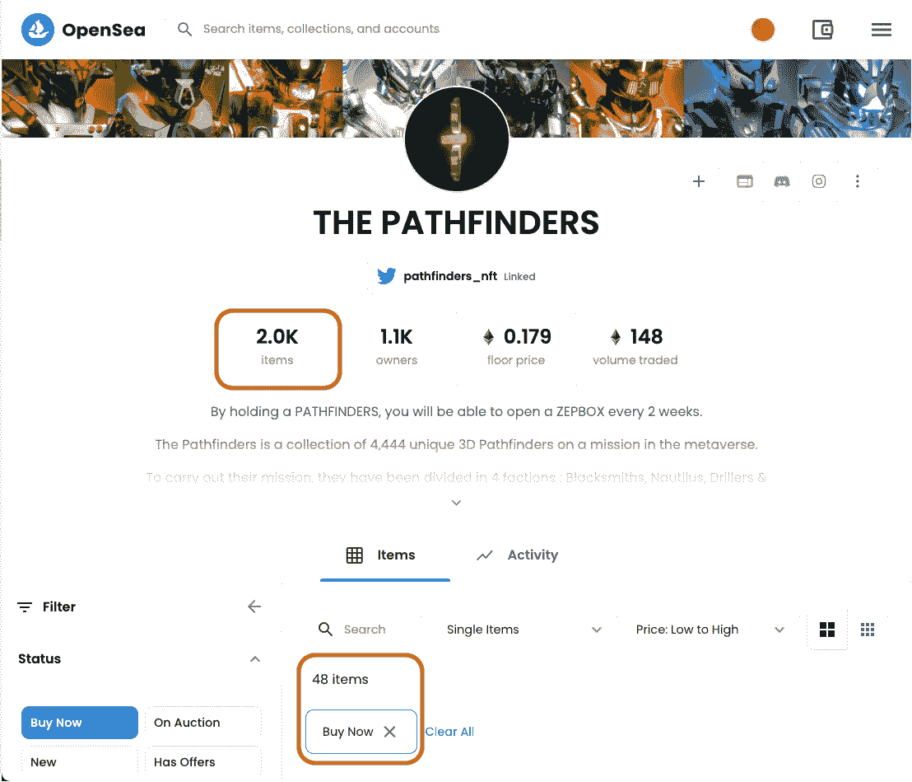

# 在复写纸、平庸和地毯的海洋中，NFT 是一个充满机会的岛屿。欢迎来到探路者…

> 原文：<https://medium.com/coinmonks/an-nft-island-of-opportunity-in-a-sea-of-carbon-copies-mediocrity-and-rug-pulls-6df03965ce88?source=collection_archive---------29----------------------->

作为一名新的或有经验的非金融资产投资者，在分析一项潜在投资时会遇到许多问题。

*   *我可以信任谁来实现增长和路线图目标？*
*   *我怎么知道我在做一项好的投资？*
*   *如何区分要翻转的项目和要暂停的项目？*
*   *想投资的项目应该找什么？*

*这些问题只是对投资 NFT 项目时我们所想的总结。*

今天，我想谈谈**探路者**，一个在我看来是市场上最被低估的 NFT 项目之一。(在这一点上，我要指出，这不是财务建议，我建议任何希望投资 NFT 项目的人在承诺之前做好研究。)我以前没有写过中型文章，但我被 NFT 病毒感染了，我想以此开始我的中型之旅。

他们的造币厂在明天(美国东部时间 2 月 23 日星期三中午 12 点，也就是今天**)如果你和我一样是 NFT 人，我鼓励你阅读这篇文章，以了解为什么这个项目适合你。**

# **为什么探路者被如此低估？**

**所有的项目都有坎坷，探路者也不例外。我用几个薄荷糖投资了这个项目，当问题在铸造期间出现时，当然有理由担心，直到我探索了问题背后的原因。在第一次造币期间，这个项目和许多其他 NFT 项目一样，成为影响 MetaMask 的世界性错误的受害者。**

**在 2 月 5 日的 Infura，MetaMask 的区块链解决方案遇到了一个问题，他们后来披露了他们的分歧。**

****

**然而，我相信探路者将在第二次造币期间更强大的原因是这个项目创造的生态系统，他们正在公开建立**我在 NFT 见过的最强大的价值杠杆之一。****

**一个公用事业“保证”有我们都在寻找的预期投资回报，以及我觉得难以置信的项目所提供的艺术质量标准。**

**称为 **ZepBox，**关于该项目的故事(你绝对必须去看，这对那些喜欢小说故事的人来说是一个纯粹的奇迹)，它提供了有价值的、真实的和与坚定相信探路者项目的持有人社区相关的奖励。**

# **ZepBox 炒作的背后是什么？**

****

**如果我必须用一句话来总结，那就是**一个装满惊喜的神秘盒子**，你可以每两周免费收到一次(只要你持有)。**

**这个 ZepBox 纯粹是面向社区的。持有者必须决定他们想在里面看到什么。你是这个项目的一部分，绝对…**

# **ZepBox 是如何充满惊喜的？**

**每个 ZepBox 从 OpenSea 和 LooksRare 的二级市场交易量中获得 7.5%的资金。**

**就数字而言，用一个例子来描述这一点是最简单的:**

**假设你有两周的 500 ETH 销量。**

**这些交易量的 7.5%进入社区金库。这相当于 37.5 ETH。**

**持有人群体决定如何使用过去 2 周收集的 37，5 ETH。**

**这个系统将继续填满社区的钱包，持有者将每 2 周对这些资金的使用进行投票。**

# **拿着探路者在 ZepBox 里能得到什么？**

**ZepBoxes 将包含的奖励示例包括:**

*   **其他 NFT 项目的白名单**
*   **来自其他项目的免费 NFT**
*   **开拓者物理艺术**
*   **Oculus Quest 2**

**还有更多…**

**这些只是齐柏林飞艇的组件。我不骗你——当我第一次在探路者的不和谐上读到这些东西时，我被说服了。作为一名 NFT 投资者，我知道如何评估一个被炒作项目的白名单。**

**我很早就开始研究心理猫和其他一些项目。在过去几个月的项目爆炸中，我见过不少。**

**因此，关于这个项目，我们应该理解的是，可能性是无限的。**

**即使持有者想向慈善机构捐赠，他们也能做到。**

****这是我投资探路者 NFTs 的主要原因。****

# **在一个因 FUD 和不信任而变得嘈杂的 NFT 空间，探路者的未来是什么？我为什么要相信它？**

**现在，看看让我对这个项目充满信心的其他因素，有什么让我感到突出？**

# **1.掌控这个项目的钻石手。**

**目前，我们谈论的是不到 3%的供应量，这些供应量在 OpenSea 上列出。这表明了社区对这个项目及其背后的团队有多信任。它强调了他们多么希望看到它成功。**

****

# **2.在过去的几个月里惊人的有机群落增长**

**他们已经设法**在上个月**将他们的 Twitter 关注增加到+50K，我认为这是市场预期的一个非常好的迹象。在最近的项目中，我们看到了一个令人耳目一新的变化，虚假的 Twitter 社区得到了发展。**

****

**通过排除不活跃账户，他们将不和成员减少到 75000 人。就在两周前，他们的 Discord 上有超过 18 万名成员(是的，我关注数字，我关注这些东西。很重要)。对我来说，探路者中唯一的机器人应该在项目的背景故事中，而不是活跃在社区中。**

****

# **3.他们用 ZepBox 实现的系统已经在其他项目中部署了**

**其他项目，如 Nanoverse，在推出几个月后的底价约为 1.8 ETH。**

**这让我对他们的 ZepBox 模型更有信心——并不是说我需要它…**

**此外，你感觉沉浸在探路者的故事中，你成为一个派别的一部分(铁匠，鹦鹉螺，钻孔者，齐柏林飞艇)。每 2 周，4 个探路者阵营中的一个会在 ZepBox 上获得 2 倍的掉落率奖励。对我来说，这将创造大量的交易量。**

# **4.一个 A 级球员创始团队完全 doxxed 回探路者**

****

**他们展示了即使在第一个创世纪造币厂建成后，他们是如何参与这个项目的。在过去的两个月里，他们证明了自己在项目执行中的参与程度和专业程度。**

**团队对社区在不和谐中提出的建议也非常积极，这增加了社区是项目真正一部分的事实。**

**我认为这对于这样一个项目的未来是非常重要的一点。他们定期主持关于他们不和的非常具体和相关的 ama。这增加了我对这个项目的信任度。**

**你可以在他们的网站上通过他们的官方链接了解这个团队。这总是令人鼓舞的。**

# **一些令我惊叹的杰出设计。**

****

**我喜欢艺术。我不擅长素描、油画或任何附庸风雅的东西。我父亲是个艺术家。我哥哥是学艺术的，即使不能实际创作，我也很欣赏。**

**你可以从他们放出的预览图中看出，这个团队真的在 NFT 的设计上下了一番功夫。高品质，视觉刺激和真实的背后故事，鼓励探路者。**

**我们离想成为“猿”或“涂鸦”的人还很远。**

**我觉得这是一个非常积极的迹象，表明了探路者团队**最初想要创造一些创新的、本质上具有收藏价值的东西。****

# **VI —前所未有的不和谐用户体验。**

**他们开发了一个性格测验，一旦回答了这个测验，你就可以成为 4 个派别中的一员。这很有趣，但也让你融入其中，让你觉得自己是故事的一部分。**

**从那里你可以立即进入一个策划的故事模式，在这个模式中，你必须为你的阵营和你探索探路者星球普罗西亚的最初任务做出日常决定。这让我想起了以前读《选择你自己的冒险》的日子。它给了我一种拥有感，同时也给了我一种神秘感。**

# **VII —一个创新且强大的白名单系统。**

****

**他们最近发布了一条关于研磨问题的推文，我相信这是 NFT 项目应该遵循的方式。我为支持精神健康的慈善机构工作。我看到了 NFT 项目中潜在的真正问题，这些问题需要 24/7 的关注和参与。这关系到我…**

**这是**一个不磨人的服务器**，他们充分尊重信任他们的人的生命。**

**除此之外，他们还做了一些我在其他项目中没见过的事情。他们设计了一个定制的测验来验证**你是否完全理解了这个项目及其目的。他们想让人们睁大眼睛参与项目。****

**这是**一个强大的系统。它将赋予白名单持有者权力，这也是任何 NFT 项目应该追求的目标。****

# **那么，从这里去哪里呢？**

**总结这篇文章，我提醒你，这不是财务建议，你应该对探路者做自己的研究。**

**加入 Discord 服务器，亲自了解项目，了解实用程序并参与社区活动。**

**你知道我对探路者感兴趣。球在你的球场上。**

****如何找到更多关于探路者的信息:****

*   **[加入他们的不和谐服务器](https://discord.gg/pathfinders)**
*   **[访问他们的网站](https://thepathfinders.io/)**
*   **[在 Twitter 上关注他们](https://www.twitter.com/pathfinders_nft)**
*   **[在 OpenSea 上买一个探路者](https://opensea.io/collection/the-pathfinders)**

> ***加入 Coinmonks* [*电报频道*](https://t.me/coincodecap) *和* [*Youtube 频道*](https://www.youtube.com/c/coinmonks/videos) *了解加密交易和投资***

# **另外，阅读**

*   **[有哪些交易信号？](https://coincodecap.com/trading-signal) | [Bitstamp vs 比特币基地](https://coincodecap.com/bitstamp-coinbase) | [买索拉纳](https://coincodecap.com/buy-solana)**
*   **[ProfitFarmers 回顾](https://coincodecap.com/profitfarmers-review) | [如何使用 Cornix Trading Bot](https://coincodecap.com/cornix-trading-bot)**
*   **[十大最佳加密货币博客](https://coincodecap.com/best-cryptocurrency-blogs) | [YouHodler 评论](https://coincodecap.com/youhodler-review)**
*   **[MyConstant Review](https://coincodecap.com/myconstant-review) | [8 款最佳摇摆交易机器人](https://coincodecap.com/best-swing-trading-bots)**
*   **[MXC 交易所评论](/coinmonks/mxc-exchange-review-3af0ec1cba8c) | [Pionex vs 币安](https://coincodecap.com/pionex-vs-binance) | [Pionex 套利机器人](https://coincodecap.com/pionex-arbitrage-bot)**
*   **[我的加密副本交易经历](/coinmonks/my-experience-with-crypto-copy-trading-d6feb2ce3ac5) | [比特币基地评论](/coinmonks/coinbase-review-6ef4e0f56064)**
*   **[CoinFLEX 评论](https://coincodecap.com/coinflex-review) | [AEX 交易所评论](https://coincodecap.com/aex-exchange-review) | [UPbit 评论](https://coincodecap.com/upbit-review)**
*   **[AscendEx 保证金交易](https://coincodecap.com/ascendex-margin-trading) | [Bitfinex 赌注](https://coincodecap.com/bitfinex-staking) | [bitFlyer 点评](https://coincodecap.com/bitflyer-review)**
*   **[麻雀交换评论](https://coincodecap.com/sparrow-exchange-review) | [纳什交换评论](https://coincodecap.com/nash-exchange-review)**
*   **[维护卡审核](https://coincodecap.com/uphold-card-review) | [信任钱包 vs 元掩码](https://coincodecap.com/trust-wallet-vs-metamask)**