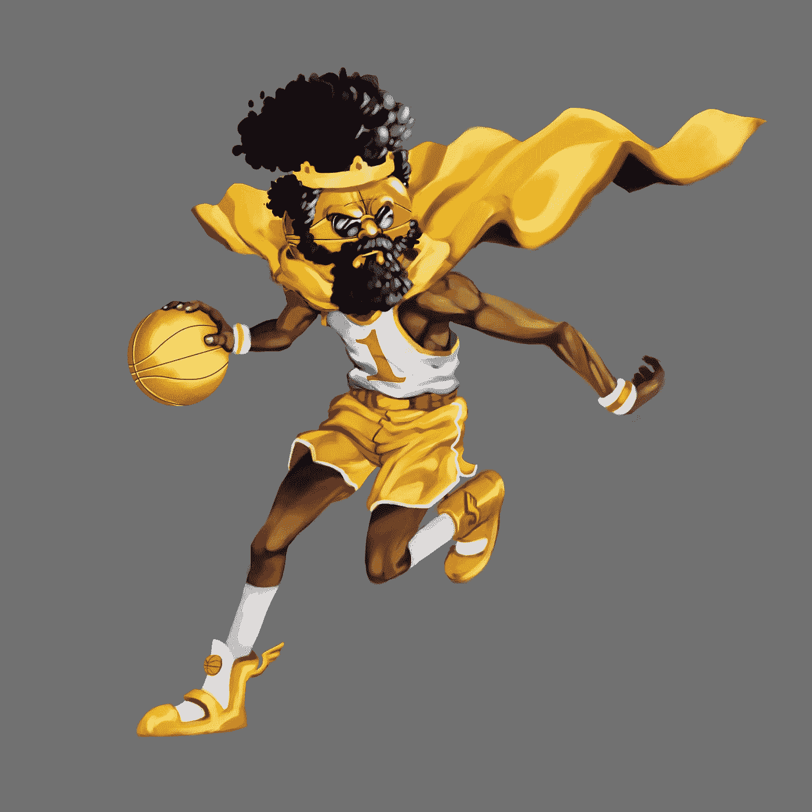

# 一个 NFT 项目刚刚创造了历史。

> 原文：<https://medium.com/coinmonks/an-nft-project-just-made-history-dfd4c38ce3f8?source=collection_archive---------52----------------------->

DeGods is one of the most successful NFTs on the Solana blockchain.

有史以来第一次，一个社区购买了一个职业 3on3 篮球队的所有权。

在我们进一步讨论之前，让你了解一些简单的事实。

DeGods 是一个基于 Solana 的 NFT 系列，基本上看起来像一个具有各种功能的人形，如护目镜，外星人皮肤和头骨纹身。

他们自称“宇宙中最堕落的一万个神。”

它们目前的价格约为每件 2 万至 2.5 万美元。

拥有 DeGods NFTs 的人被包含在一个名为 DeDAO 的 DeGods DAO 中。

我知道，多有创意的名字啊。

本质上，德道就像一个共享钱包和信仰体系的社区。

Big3 是一个职业篮球联盟，每方有 3 名球员，而不是通常的 5 名。

他们打半场比赛，一些规则有所改变，但总体想法是存在的。

它是由说唱歌手艾斯·库伯发起的，你知道，那个来自 21 Jump Street 的脾气暴躁、焦虑不安的队长会让你笑得像土狼一样。

无论如何，艾斯·库伯，一个有事业心的商人，决定开始通过 NFTs 出售 12 支球队的所有权。

那么德道做了什么呢？

他们决定购买价值 62.5 万美元的 NFT，并完全拥有一支名为黑仔 3s 的团队。

Where NFTs meets real-life basketball.

这意味着有史以来第一次，一群互不相识的陌生人在元宇宙聚集在一起，共同拥有一支职业篮球队。

这的确是数百万年轻人的梦想。

你多久能说自己实际上是一个职业篮球队的老板？

拥有并运营一支精英篮球队，按照他们的意愿推动战略和创新方向。

“DeGods 标志将出现在球队的球衣上。他们拥有团队知识产权的全部所有权，因此他们可以创建商品、收藏品等。他们将能够决定谁是教练，谁是团队的首席执行官、总裁和副总裁。”

他们有机会继续扩大和培养观众。

这确实是 Big3 的最佳营销策略。

作为 Web3 的观察者，看着它成长成熟，这让我脸上露出了笑容。

在黑客攻击、漏洞利用、失败和网络钓鱼骗局中，看到 NFT 和 Dao 如何为社区创造真正的用例是非常美好的。

现在，我的下一个技巧是，我将创造一个终极 DAO，收购特斯拉的少数股权，开始生产全电动、自动驾驶、带空调的婴儿车。

谁和我在一起？

=)

-

陌生人社区拥有自己的企业和品牌是个好主意吗？

-

# startups # business # startupx # growth # success # social media # culture # entrepreneur # strategy # NFTs # degods # Solana # Tesla # baby programs # Dao # dedao # ice cube # big 3 # basketball # NBA

> 加入 Coinmonks [电报频道](https://t.me/coincodecap)和 [Youtube 频道](https://www.youtube.com/c/coinmonks/videos)了解加密交易和投资

# 另外，阅读

*   [币安期货交易](https://coincodecap.com/binance-futures-trading)|[3 commas vs Mudrex vs eToro](https://coincodecap.com/mudrex-3commas-etoro)
*   [如何购买 Monero](https://coincodecap.com/buy-monero) | [IDEX 评论](https://coincodecap.com/idex-review) | [BitKan 交易机器人](https://coincodecap.com/bitkan-trading-bot)
*   [CoinDCX 评论](/coinmonks/coindcx-review-8444db3621a2) | [加密保证金交易交易所](https://coincodecap.com/crypto-margin-trading-exchanges)
*   [红狗赌场评论](https://coincodecap.com/red-dog-casino-review) | [Swyftx 评论](https://coincodecap.com/swyftx-review) | [CoinGate 评论](https://coincodecap.com/coingate-review)
*   [Bookmap 点评](https://coincodecap.com/bookmap-review-2021-best-trading-software) | [美国 5 大最佳加密交易所](https://coincodecap.com/crypto-exchange-usa)