# 记录你收藏的 NFT——介绍软盘

> 原文：<https://medium.com/coinmonks/an-nft-that-records-your-collection-introducing-floppy-disks-e9743ba6c031?source=collection_archive---------25----------------------->

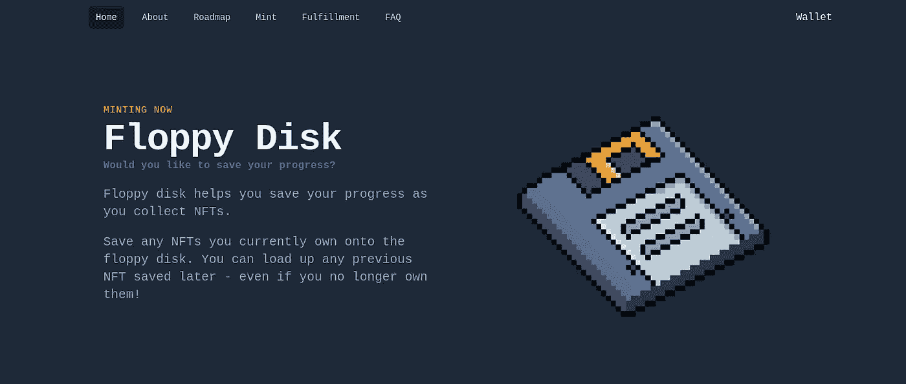

floppydisknft.com([NFT)是一个允许你记录你在以太坊上收集的不同 NFT 的项目。一旦一个 NFT 被“保存”,它将转换成那个，并且也将那个添加到它的保存的 NFT 的历史中。](https://floppydisknft.com/)

这不仅可以让你在卖掉你珍贵的无聊猿猴后继续在 Twitter 上佩戴你的验证个人资料照片，还可以让你炫耀你曾经收集的所有 NFT。

下面是一个快速指南，告诉你如何铸造你的软盘，获得一些免费存储令牌(用于保存 NFT)和保存你自己的 NFT 到软盘！

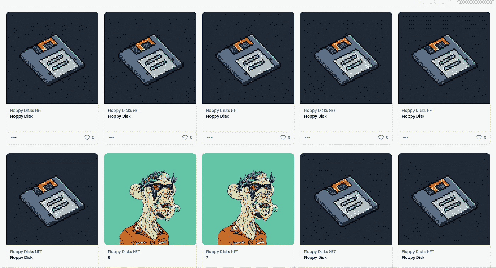

M2 Mutant Ape saved on the Floppy Disks

# 铸造软盘

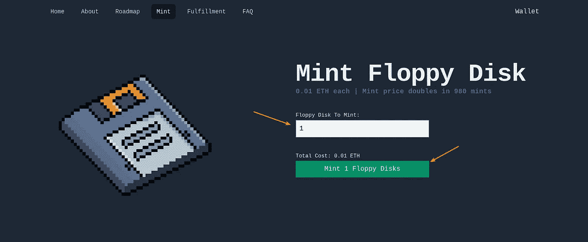

前往 https://floppydisknft.com/mint 的，连接你的 Metamask 钱包。

钱包连接后，选择您要制作的软盘数量。

点击按钮，制造选定数量的软盘。您需要确认 Metamask 钱包上的铸造交易。

目前的价格是每个 0.01 ETH(约 26 美元)，请注意，价格将每 1024 分钟翻一番，这意味着随着更多的铸币，NFT 将变得更加昂贵。

# 申请免费存储令牌

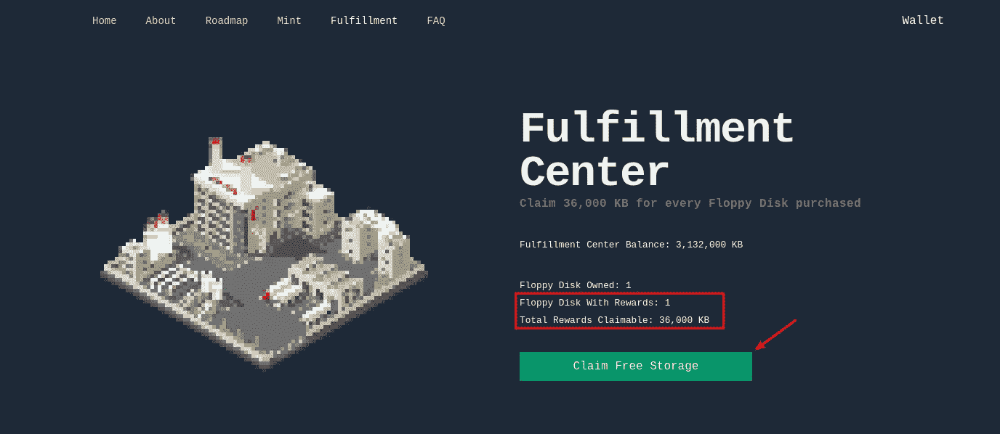

一旦你铸造了你的软盘，你可以在 https://floppydisknft.com/fulfillment[的履行中心申请免费的存储代币。](https://floppydisknft.com/fulfillment)

存储令牌是 ERC20 令牌，当您将 NFT 保存到软盘时会刻录这些令牌。每次保存都需要价值 **1，440 KB** 的令牌。

由于该项目处于早期启动阶段，当新的软盘被铸造出来时，存储令牌会被免费发放。你可以为你拥有的每张软盘申请 36，000 KB 的存储令牌。这就足够了 **25 保存**在软盘上。

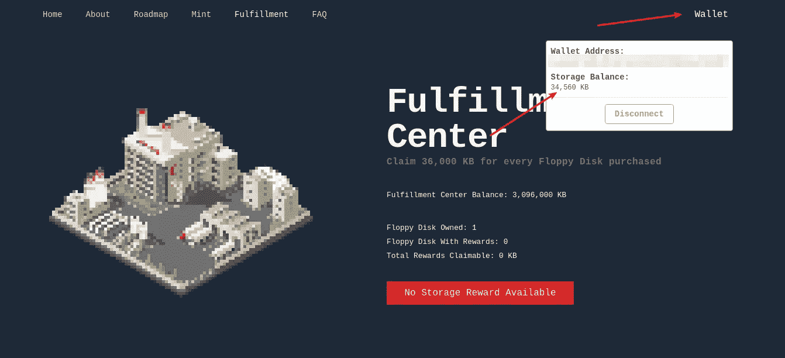

您可以通过点击右上角的“钱包”按钮并查看您的最新余额来确认代币已被存入。

请注意，履行中心的存储代币只够前 128 次申领，请在售完时申领代币！

# 将 NFT 保存到软盘

下一步稍微复杂一些，因为用于保存的 UI 还没有准备好。但是，您可以使用 Etherscan 的写合同功能执行保存。

首先，确定您想要保存到软盘的 NFT。请注意，您只能将自己的 NFT 保存到软盘上，并且 NFT 必须符合 ERC721 标准。

为了便于说明，我们将把一个未披露的克莱朋友保存到软盘上。

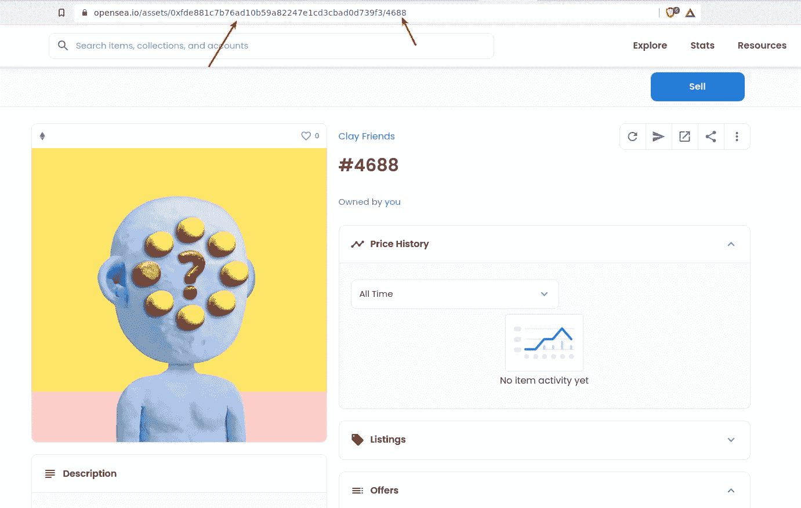

Get the target contract address and token ID from the URL from Opensea

从 NFT 的 URL 获取您的 NFT 的合同地址和令牌 ID。在这个例子中，合同地址是`0xfde8...39f3`，令牌 ID 是`4688`。

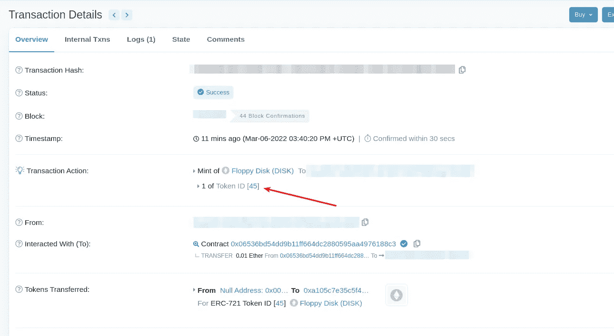

前往 Etherscan 上的 mint 交易，找出您制作的软盘的令牌 ID。在这个例子中，它的`45`。

前往位于[https://ethers can . io/address/0x 06536 BD 54 DD 9 b 11 ff 664 DC 2880595 aa 4976188 C3 # write contract](https://etherscan.io/address/0x06536bd54dd9b11ff664dc2880595aa4976188c3#writeContract)的软盘合同。

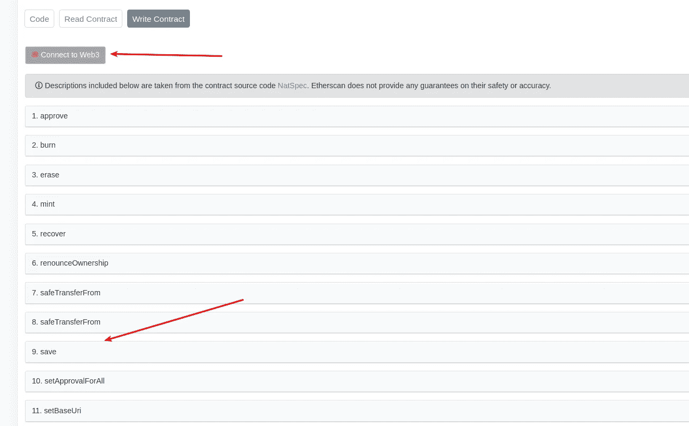

点击“连接到 Web3”连接您的 Metamask 钱包，然后展开“保存”功能。

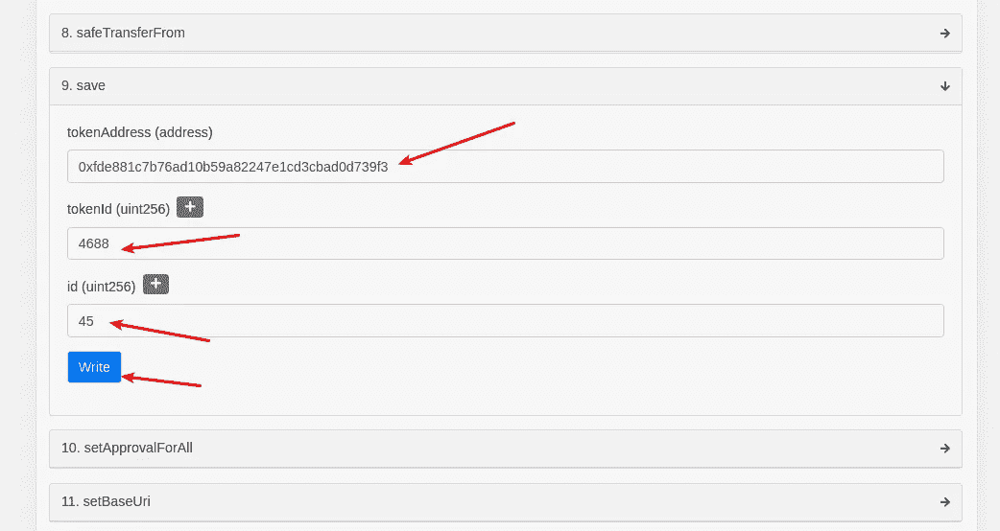

填写从上面收集的值，然后单击“写入”。您将被要求在 Metamask 上确认您的交易。

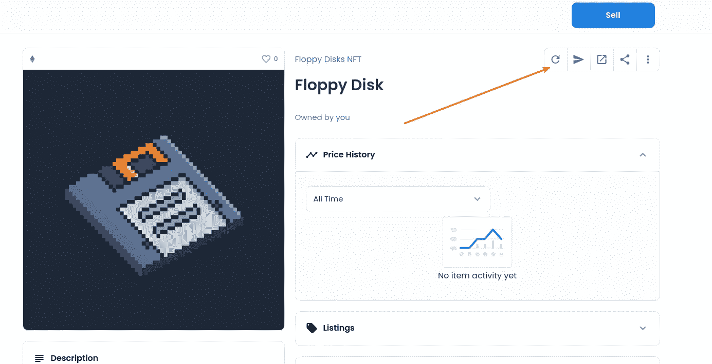

一旦交易确认，您可以前往您的 NFT 页面，刷新其元数据，看看它的新面貌！

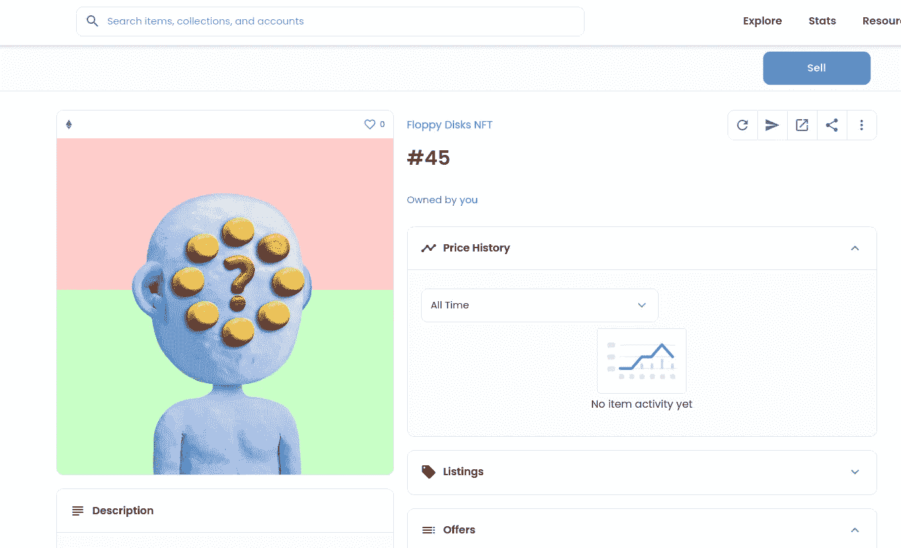

Floppy Disk with a new look!

# 下一步是什么

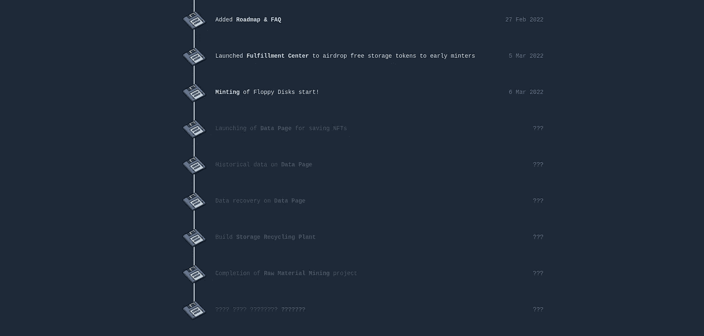

It’s early

下一个即将推出的功能是数据页面，这将使保存 NFT 和查看历史保存更加容易。

请在 Twitter 上关注 [@FloppyDiskMaker](https://twitter.com/FloppyDiskMaker) 继续关注该项目！