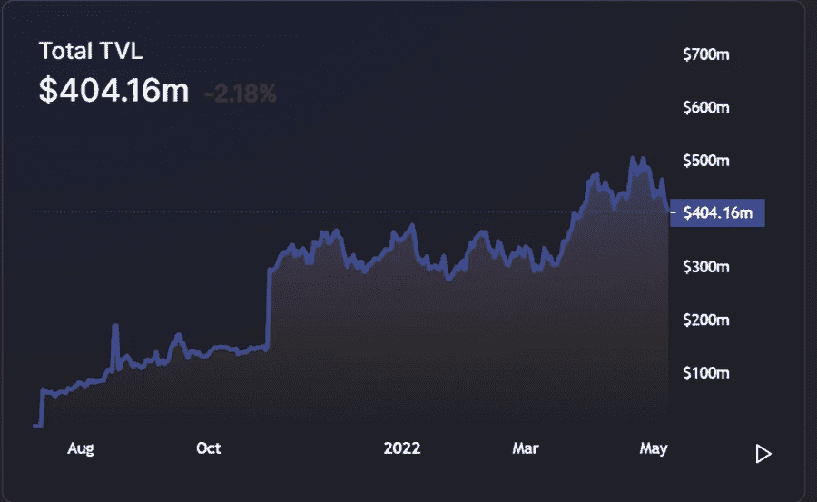
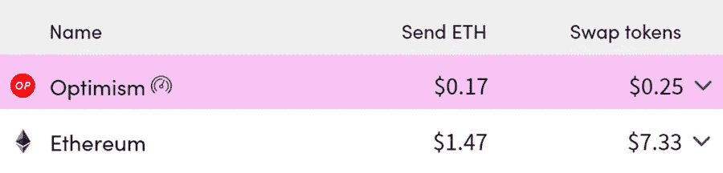
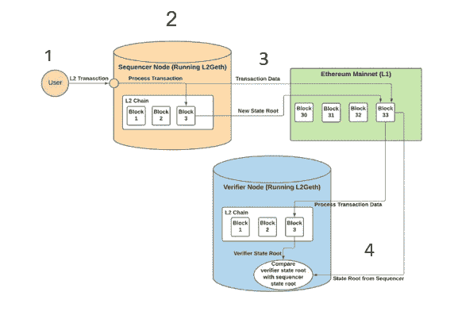
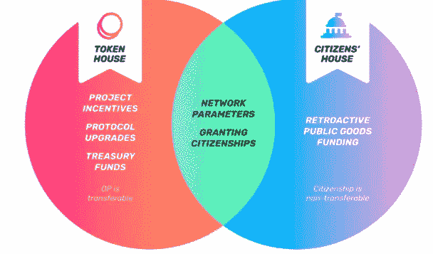

# 对以太坊规模的乐观看法

> 原文：<https://medium.com/coinmonks/an-optimistic-take-on-ethereum-scaling-32868e1d1df5?source=collection_archive---------32----------------------->

## 概述以太坊扩展的需求以及乐观主义如何提供可行的第 2 层解决方案

当我开始深入研究加密时，我很快意识到有很多东西需要学习。

在这个领域做学生的部分乐趣在于，在我最不希望听到的时候接触到新的概念和想法。

一个引起了我的注意，当我在线等待电晕测试时。我排了一个小时的长队，所以很自然地，我和旁边的陌生人聊了起来。最终，crypto 出现了，这也是我第一次听说以太坊第二层的地方，我不知道它是什么。

在听到更多关于它的情况后，我怀疑这是可能的

*   1)利用以太坊的安全性
*   2)将每个块的事务数增加数百或数千。

随着时间的推移，我明白这是可能的。

我想通过乐观协议向您展示如何实现这一目标，并简要介绍一下为什么以太坊第 2 层[锁定的总价值(TVL)从 Q1 2021 年到 Q1 2022 年增长了 964%，从 6.87 亿美元增加到 73 亿美元](https://newsletter.banklesshq.com/p/state-of-ethereum-q1-2022?s=r)。

Optimism’s TVL increased to from zero to approximately $400 million today in less than a year and have saved users over $1 billion in transaction fees. [https://defillama.com/chain/Optimism](https://defillama.com/chain/Optimism) [https://www.optimism.io/](https://www.optimism.io/)

为什么这与你有关？

以太坊的未来将**依赖于它以安全和分散的方式扩展的能力**，乐观主义提供了一个可行的解决方案。

在我们变得乐观之前，我们先来了解一下为什么以太坊的 1 层是不可持续的。

## **为什么以太坊需要第二层？**

对任何在以太坊交易过的人来说，他们知道交易是多么缓慢和昂贵。

截至今天，以太坊的交易速度为每秒 15 次交易。这只是 Visa 每秒 1700 笔交易的一小部分。

这意味着在以太坊区块链上交易的许多用户都在争夺少量的交易空间(块空间)。

当很多人在争夺一个很小的空间时会发生什么？他们为进入那个空间而互相竞价。

*街区空间供给少，以太坊用户需求高=交易成本高*

这是一个主要问题，因为有效的市场由两个关键因素组成:

*   1)高交易速度
*   2)交易成本低。

典型的交易(交易价格可能会波动)可能如下所示:

*   我想用价值 50 美元的以太币换 50 美元的另一个基于以太币的代币(本质上就像用美元换欧元)。
*   这笔交易的汽油费可能超过 70 美元，如果您支付当前的汽油价格，您的交易可能会在 15 秒至 5 分钟内结算
*   如果你设置了 30 美元的交易费限额，你的交易可能几个小时都不会被批准，而且可能永远不会被批准

无论你如何分割，以太坊的第 1 层**都无法**同时受益于高交易速度和低交易成本。

这个问题倾向于将许多低资本市场参与者排除在以太坊生态系统之外。

## **为什么以太坊不增加它的块大小，允许每秒更多的交易？**

如果每秒交易量这么低，以太坊为什么不增加每个区块的交易量？

这将增加每秒的交易量，从而降低交易成本。

看起来很简单，除了一个问题，**它会降低以太坊的分散性/安全性，违背以太坊存在的目的**。

如何降低以太坊的去中心化和安全性？

因为像今天的以太坊一样，任何一个拥有普通电脑的人都可以运行一个节点，并为以太坊的去中心化做出贡献。当产生每个块时，节点通过下载前一个块并验证它来验证事务。

如果区块大小增加，将会有更少的人有足够强大的计算机来验证区块链。

这意味着更少的人能够对协议负责，这意味着更少的分散和网络的安全性。

在以太坊社区中，降低以太坊的分散性和安全性是不可能的。

## **乐观主义提供了一个第二层的解决方案，它不会损害以太坊的去中心化。**

如果以太坊不能在其基础层上扩展太多，那么它将不得不添加额外的层来“汇总”和压缩并处理链外的交易数据，并将这些数据存储在链上。

乐观通过乐观汇总来实现这一点(将在下一部分更详细地解释)。

[乐观主义通过处理链外交易，同时受益于链上交易数据以太坊的安全性和去中心化，将效率提高了 10-100 倍](https://www.nansen.ai/research/optimism-paving-an-optimistic-future-for-ethereum)。

乐观主义让人们以很少的费用参与 DeFi。

以下是我在 5 月 9 日查阅时的成本差异:

L2fees.info (keep in mind prices fluctuate with demand)

## 乐观是如何工作的？

好吧，那么实际上乐观主义如何在不损害以太坊安全性的情况下增加每秒交易量并降低费用呢？

他们使用所谓的乐观汇总——以他们的假设命名，即交易是真的，直到它们被证明是假的。

我将简单地解释乐观主义的乐观汇总是如何工作的:

Made by Kyle Charbonnet in her piece [An Introduction to Optimism’s Optimistic Rollup](/p/8450f22629e8)

使用上面的图表，我们来看一下基本步骤:

1)用户使用乐观网络在 uni WAP(DeFi 平台)上发起交易。

2)这被发送到处理和存储事务的定序器节点，并将其添加到其 L2 乐观链副本上的块中。定序器正在收集许多事务，并将它们全部放入一个块中。

3)在被处理后，定序器将向以太坊提交一个包含交易数据的交易块，以及一个对应于乐观链(状态根)上处理交易的块的唯一编号。

(这就是为什么乐观汇总是乐观的，因为它们首先提交假设为真的事务，然后才检查它们实际上是否是真的)。

4)然后，其他 L2 节点(验证者)将在它们的节点上处理该事务，以验证它是真的(如果它们的状态根匹配定序器的状态根

5–7 不在图表上:

5)有一周的等待时间让任何节点声明事务数据是假的。

6)如果一周之后没有索赔，则资金被完全批准并可以使用。

7)如果在一周内有索赔证明交易是虚假的，资金将保留在虚假交易开始前的位置。

批准虚假交易的测序员在被发现时会被罚款。

用户和机构被激励运行一个验证交易的节点，以保持资金的安全(尽管抓到坏人没有得到任何明确的奖励)。

如果事情感觉有点复杂，不要担心，因为肯定有很多事情要处理。

从中得出的主要观点是，乐观主义允许在以太坊上进行更便宜的交易，同时受益于以太坊的安全性。

如果你想要一个更全面的解释，看看凯尔·查博纳的文章[一篇介绍乐观主义者的乐观汇总](/p/8450f22629e8)的文章，它帮助我理解了基本步骤，并且用我目前能找到的最简单的术语提供了对乐观汇总更全面的分析。

## **乐观使用与以太坊相同的编码语言和结构**

由于乐观主义使用可靠性(与以太坊相同的语言)，所有智能合约都以与以太坊完全相同的方式书写。

这很重要，原因有二:

以太坊开发者加入生态系统很容易:对于我们大多数人来说，这可能不会有什么不同，因为我们不了解大多数(如果不是所有)智能合同的细节。但是这很重要，因为这意味着以太坊开发者很容易加入乐观生态系统。

**2)** **易于审计智能合约:**如果开发人员必须用新代码编写智能合约，那么将需要许多额外的参与方来专门确保智能合约将做他们声称正在做的事情。用以太坊语言构建意味着已经致力于审计以太坊智能合约的人可以无缝地转换和审计乐观的智能合约。

既然我们对乐观主义是如何运作的有了一个基本的概念，让我们回顾一下乐观主义的利弊:

## 乐观主义的优点

*   **交易更经济:**跨平台交易本身只需花费以太坊的一小部分(仍然很可观)。
*   **需求增加=分享成本增加:** [随着对乐观主义的需求增加](https://podcasts.apple.com/us/podcast/the-trillion-dollar-l2-opportunity-part-two/id1499409058?i=1000559683701)，这将导致每个乐观主义街区的更多人分享成本，随着更多人根据乐观主义进行交易，交易成本降低。
*   **易于搭载以太坊开发人员/审计:**以太坊开发人员在乐观的生态系统上构建和审计智能合同将变得简单，因为它使用与以太坊(solidity)相同的编码语言。
*   **象征性激励:**乐观象征性激励将在不久的将来正式推出——提供象征性激励(其他大多数 L2 目前还没有),帮助改进协议。

There will be two token houses with different responsibilities.

## 乐观的缺点

*   **交易结算缓慢:**由于欺诈证明，交易效率低下，需要一周左右的时间才能正式结算(有第三方公司愿意提供即时流动性，解决这个问题的讨论)。
*   **代币不会分享收取的费用:**代币将仅用于治理，不会分享来自平台的任何收入(有传言称乐观主义者不同意未来分享潜在的交易费收入。代币持有者可以投票改变这一点)。
*   **成本仍然令人望而却步:**尽管成本已经乐观地降低了 10 到 100 倍，但对于一些用户来说，成本仍然令人望而却步。
*   **验证者错过虚假交易的可能性:**如果验证者没有因发现不良参与者而获得奖励，则可能会出现搭便车问题，即每个人都依赖于其他人来验证交易，但最终没有人进行验证。

## **最后的想法**

如果你已经做到了这一步，我希望你能理解:

*   以太坊第一层的问题和以太坊第二层的价值
*   乐观主义如何工作以及它如何帮助解决以太坊的第一层问题的基础
*   该协议的一些利弊

作为我学习以太坊之旅的一部分，很明显第二层是以太坊扩张的下一步。乐观主义有机会在以太坊的广泛采用中发挥主要作用，并为生态系统提供令人难以置信的价值。

我认识到关于乐观主义还有很多要讨论的，但我希望这是一个良好的开端，让你对第二层感到舒适，并激发你更多地了解它们的兴趣。

*本文并非投资建议。*

> 加入 Coinmonks [电报频道](https://t.me/coincodecap)和 [Youtube 频道](https://www.youtube.com/c/coinmonks/videos)了解加密交易和投资

# 另外，阅读

*   [3 商业评论](/coinmonks/3commas-review-an-excellent-crypto-trading-bot-2020-1313a58bec92) | [Pionex 评论](https://coincodecap.com/pionex-review-exchange-with-crypto-trading-bot) | [Coinrule 评论](/coinmonks/coinrule-review-2021-a-beginner-friendly-crypto-trading-bot-daf0504848ba)
*   [莱杰 vs n rave](/coinmonks/ledger-vs-ngrave-zero-7e40f0c1d694)|[莱杰 nano s vs x](/coinmonks/ledger-nano-s-vs-x-battery-hardware-price-storage-59a6663fe3b0) | [币安评论](/coinmonks/binance-review-ee10d3bf3b6e)
*   [Bybit Exchange 审查](/coinmonks/bybit-exchange-review-dbd570019b71) | [Bityard 审查](https://coincodecap.com/bityard-reivew) | [Jet-Bot 审查](https://coincodecap.com/jet-bot-review)
*   [3 commas vs crypto hopper](/coinmonks/3commas-vs-pionex-vs-cryptohopper-best-crypto-bot-6a98d2baa203)|[赚取加密利息](/coinmonks/earn-crypto-interest-b10b810fdda3)
*   最好的比特币[硬件钱包](/coinmonks/hardware-wallets-dfa1211730c6) | [BitBox02 回顾](/coinmonks/bitbox02-review-your-swiss-bitcoin-hardware-wallet-c36c88fff29)