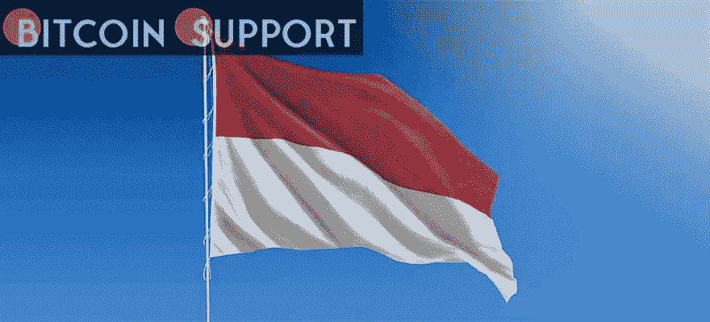

# 2022 年印度尼西亚比特币社区概述

> 原文：<https://medium.com/coinmonks/an-outline-of-indonesias-bitcoin-community-in-2022-98b4d1133158?source=collection_archive---------60----------------------->

**Visit our website:-** [**https://bitcoinsupports.com/**](https://bitcoinsupports.com/)

Cryptocurrencies are gaining popularity in Indonesia thanks to regulations, exchanges, and local usage.

In Indonesia, cryptocurrency is the next big thing. According to the Ministry of Trade, Bitcoin (BTC) transactions increased by more than 14 times from 60 trillion rupiahs ($4.1 billion) in 2020 to 859 trillion rupiahs ($59.83 billion) in 2021.

It’s getting to the stage where cryptocurrency is outperforming traditional stocks in terms of popularity. In 2021, more than 11 million Indonesians bought or sold cryptocurrency, according to Vice Minister of Trade Jerry Sambuaga. According to the Indonesian Central Securities Depository, the overall number of portfolio investors in 2021 was 7.35 million, as measured by the number of single investor IDs.

Despite this, 11 million cryptocurrency investors account for only roughly 4% of Indonesia’s overall population, indicating that there is still plenty of possibility for growth. The rise of the crypto community in Indonesia is accompanied by a number of local phenomena, including but not limited to:

**Regulatory assistance from government agencies**

Cryptocurrency trading has become easier to access, thanks to the adoption of big local tech companies.

Regulators strive to make things safer.

Despite the fact that crypto assets are still not permitted as payment instruments, businesses in Indonesia are free to buy and sell crypto as trading commodities. Since 2019, the Commodity Futures Trading Regulatory Agency (BAPPEBTI), an agency within the Ministry of Trade, has been in charge of overseeing and regulating cryptocurrency trading in Indonesia.

This governmental organisation is in charge of screening, recording, and approving companies and commodity products that can be traded in Indonesia, among other things. Its whitelist of allowed crypto tokens had grown to 229 by 2021, including well-known assets like Bitcoin, Ether (ETH), Polkadot (DOT), and Cardano (ADA).

These products are allowed based on BAPPEBTI’s own screening procedures, which include market capitalization rankings, security, background checks on development teams, blockchain system administration, and development roadmaps with verifiable success criteria.

The governing body stated in an official statement that its major goal is to provide legal stability and defend the interests of Indonesian crypto customers. According to BAPPEBTI:

**“With the new guidelines that we’ve released, we’re hoping that we and Indonesian crypto exchanges can work together to ensure that every crypto transaction is legally regulated and safe for Indonesian investors.”**

Another regulatory authority, the Financial Service Authority, has explicitly forbidden financial service organisations from marketing or supporting crypto trading, repeating BAPPEBTI’s requirement that all crypto exchanges be specifically registered with them.

The rise in the number of crypto and stock investors in Indonesia has coincided with the rise in popularity of fintech apps like Bareksa and Ajaib, implying that a significant fraction of these new investors are likely to be beginners. Tokocrypto, a well-known local crypto exchange, has declared its intention to engage with the government to improve trade security by assisting investors in understanding the hazards of crypto trading and how to avoid legally questionable exchanges and assets.

To obtain local consumers’ trust, companies that want to increase crypto usage in Indonesia must establish an active and favourable working relationship with the government and assure compliance with all of its legislation.

**In Indonesia, there are 17 crypto exchanges that have been registered**

There were 17 companies registered and allowed by BAPPEBTI to exchange cryptocurrencies in Indonesia until March 2022, and their userbases were fast growing. Indodax, a market leader, predicted attaining 5 million members in 2022, up 104 percent from 2021\. Tokocrypto, another popular exchange, reported achieving 2 million users by the end of 2021, an eightfold growth over 2020.

As previously said, a key component in these platforms’ success is their mobile-first strategy, which includes easy-to-use apps. With Indonesia’s internet penetration at 73.7 percent in 2021, it’s no surprise that the country’s mobile-heavy user base is gaining traction.

Beyond exchanges, Indonesia’s crypto community is expanding. As of 2022, the Indonesia Blockchain Association has 28 member companies and organisations, making it a local consortium and advocacy group for blockchain and cryptocurrencies. The group includes not only exchanges, but also startups and IT firms that use blockchain in their ecosystems, as well as crypto-focused media platforms.

“Regulators in Indonesia have become adaptable to technological changes over the past 10 years, from e-commerce to ride-hailing and, most recently, P2P lending,” Steven Suhadi, co-founder of Indonesia Crypto Network and founding member of the Indonesia Blockchain Association, told. Indonesia already has clear guidelines in place for exchanges and crypto trading. Regulators have taken more proactive moves for digital assets in the recent 24 months, which will aid the spread of Bitcoin and cryptocurrencies in Indonesia.”

More supply means more demand, and as more players join the country, the stage is set for another surge in cryptocurrency adoption.

**Local tech leaders are enthusiastic about cryptocurrency**

Binance established a collaborative venture with a group led by MDI Ventures to develop a new digital asset exchange in Indonesia in December 2021.

MDI is the $830 million venture capital arm of Telkom Indonesia, Indonesia’s largest telecommunications operator. MDI’s portfolio includes financial technology leaders Kredivo and KoinWorks, as well as several more companies that have gone on to become household brands in Indonesia.

“With fast technology adoption and tremendous economic potential, Indonesia might become one of the major centres of the blockchain and crypto ecosystem in Southeast Asia,” said Binance founder and CEO Changpeng Zhao of his optimism and goals for crypto in Indonesia.

“Cryptocurrencies, crypto assets, and the underlying technology, blockchain,” MDI CEO Donald Wihardja said, “are an unquestionably essential aspect of the financial and other digital infrastructures in the future.”

It’ll be interesting to watch this collaboration develop in the future, but for now, it’s a hint that crypto is no longer a niche sector in Indonesia. More mainstream firms have begun to enter the market, which might mean more resources and impetus for adoption to grow.

**What is Indonesia’s next step?**

We can expect crypto and blockchain to grow even more in 2022 and beyond, given the rising trend in transaction volume and the number of traders and exchanges in recent years. Ghozali, a computer science student who made over $1 million selling NFT selfies on OpenSea, brought nonfungible tokens (NFT) into the forefront in Indonesia recently. NFTs could be the newest chapter in Indonesia’s crypto adventure, with its rising crypto community and already vibrant cultural scene — either way, it’s become an emergent sector to keep an eye on.

**访问我们的网站:-**[**【https://bitcoinsupports.com/】**](https://bitcoinsupports.com/)

**免责声明:这些是作者的观点，不应被视为投资建议。读者应该自己做研究。**

> 加入 Coinmonks [电报频道](https://t.me/coincodecap)和 [Youtube 频道](https://www.youtube.com/c/coinmonks/videos)了解加密交易和投资

# 另外，阅读

*   [阿联酋 5 大最佳加密交易所](https://coincodecap.com/best-crypto-exchanges-in-uae) | [SimpleSwap 评论](https://coincodecap.com/simpleswap-review)
*   购买 Dogecoin 的 7 种最佳方式
*   [最佳期货交易信号](https://coincodecap.com/futures-trading-signals) | [流动性交易所评论](https://coincodecap.com/liquid-exchange-review)
*   [用于 Huobi 的加密交易信号](https://coincodecap.com/huobi-crypto-trading-signals) | [Swapzone 审查](/coinmonks/swapzone-review-crypto-exchange-data-aggregator-e0ad78e55ed7)
*   最佳[密码交易机器人](https://coincodecap.com/best-crypto-trading-bots) | [购买索拉纳](https://coincodecap.com/buy-solana) | [矩阵导出评论](https://coincodecap.com/matrixport-review)