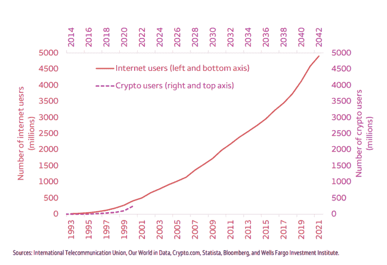

# 4 个第 1 层项目概述

> 原文：<https://medium.com/coinmonks/an-overview-of-4-layer-1-projects-1aa6e0412b85?source=collection_archive---------22----------------------->

**简介:**

根据 chain analysis 全球加密货币采用情况[报告](https://blog.chainalysis.com/reports/2021-global-crypto-adoption-index/)，2021 年至 2022 年间，加密的采用增加了 880%。截至 2022 年 3 月，只有不到 5%的世界人口在进行加密交易，区块链应用的全部潜力尚未大规模释放，我们预计将有大量新项目推出。

在这里，我们分享四个有前途的区块链项目的概况。这些项目已按其技术能力、生态系统、路线图，以及它们如何解决安全性、去中心化和可扩展性的区块链三难困境及其竞争优势进行了总结。

Internet usage history versus crypto users

# **沙登**

**简介:**

Shardeum 是一个与 EVM 兼容的第一层智能协议，分布式应用程序可以建立在这个协议上。这是一个[分片区块链](https://www.investopedia.com/terms/s/sharding.asp)，具有无限的可扩展性、真正的去中心化和可靠的安全性。它旨在扩展和捕获数十亿用户和交易，同时保持去中心化。

Shardeum 和互联网一样，将是开放的、协作的和社区驱动的，这将使权力下放的可及性民主化。它是使用 Omar 在 2018 年初推出的独特分布式账本项目 [Shardus 开发的。](https://shardus.com/)

Shardeum 将是互联网下一代的基础设施，也就是 Web3。

**竞争优势:**

*   它旨在利用现有的工具和应用程序(如 EVM)来解决可伸缩性的三难问题，而不损害安全性和分散性。
*   添加到网络中的每个节点都会增加网络容量(TPS)。该网络还使用单独的“存档节点”来存储数据，并使用“验证节点”来验证交易。这使得低配置设备能够参与网络，获得激励并保持网络真正的分散化。
*   Shardeum 将解决可扩展性和昂贵的交易成本。然而，它将保持高度的中央集权，而这正是当今大多数区块链所缺少的。

**路线图:**

来源:[https://shardeum.org/#roadmap](https://shardeum.org/#roadmap)

# 海德拉哈希图

Hedera 是一个公共分布式分类帐，用于构建去中心化的应用程序和智能合同。Hedera network 由一个由 39 家企业和机构(截至目前有 26 家)组成的管理委员会运营，涉及不同行业，包括谷歌、Wipro、Tata communications、IBM、波音、LG 和 IIT 马德拉斯。该网络目前在许可模式下运作，其中节点由管理委员会管理，并计划在未来达到规模和稳定性后转向无许可模式。管理委员会投票决定在 2022 年 1 月从 Swirlds Inc .购买 Hashgraph 技术专利并对其进行开源(2)。

Hashgraph 分布式账本技术是无块的，是为了速度、公平和安全而构建的。异步拜占庭容错是所使用的共识机制，其中每个成员都达到共识的某个状态，该状态不可修改。假设至少有 2/3 的成员是无恶意的。每个交易接收一个时间戳，该时间戳是由节点捕获的时间戳的中间值，并且交易按照时间戳而不是费用排序。Hashgraph 速度很快，只受成员上传和下载网速的限制。事务消息传送也消耗低带宽。“流言”协议用于在网络中从一个成员向其他成员传播信息，直到每个成员都收到它。同步信息的过程称为“gossip sync ”,为每个 gossip sync 存储一个事件，其中包含一个加密签名、一个时间戳、两个父哈希和一组事务。事件历史被称为关于八卦的八卦，通过‘有向无环图’相互链接。虚拟投票算法保证拜占庭协议具有最小的带宽。

**海德拉生态系统**

1.主网发布时间:2021 年 2 月

2.总地址:728k

3.每日交易量(平均过去 7 天):250 万

4.交易成本(平均过去 7 天):0.0001 美元

Hedera ecosystem

**三难**

1.分权:Hedera 将分权区分为治理和共识。一致性算法是分散的，没有节点具有特殊影响。理事会由 39 个不同部门的企业和机构管理，没有任何部门的不当代表，任期 3 年，最多连任两届。每个成员在理事会中都有平等的投票权。hashgraph 技术的开发商 Swirlds Inc .在该委员会保留了一个永久席位。

2.可伸缩性:Hashgraph consensus 算法可以在 10000TPS 的速度下每秒处理几十万个事务

3.安全性:通过异步拜占庭容错算法，consensus 算法可以容忍高达 1/3 的恶意行为者，该算法被称为拜占庭容错的最强形式之一。该算法旨在抵御恶意节点、DDoS 攻击和防火墙。

**竞争优势**

1.时间戳的无阻塞共识，确保速度，公平的交易与可预测的天然气费用

2.理事会中的关键企业合作伙伴——区块链企业的最佳选择

3.负碳区块链

# **月光**

**简介:**

Moonbeam 是一个智能合约平台，提供了与以太坊的兼容性，代码更改很少或没有更改。Moonbeam 是 Polkadot 上的一个副链，允许它通过桥和副链连接性跨链集成到其他协议。

Moonbeam 是用 Rust 编程语言构建的，带有底层框架。Rust 在语法上类似于 C++，此外，它还在编译期间内置了内存功能，可以防止错误和安全问题。Substrate framework 是一个区块链开发框架，包含多个关于 Rust 的模块。智能合同可以使用 Solidity、Vyper 或任何其他与 EVM 兼容的语言来实现。

Moonbeam 的区块链致力于 Polkadot 的股权证明模型——整理器收集 Moonbeam parachain 上的事务，并为中继链上的验证器提供状态转换证明。前 N 名赌注者被选为整理者，一部分块奖励归整理者所有。月光也有一个额外的一致层，叫做光轮。副链桩形成了主动整理库。Nimbus 应用了一个过滤器，选择 parachain staking 池的子集作为排序器。这些排序规则每 600 个数据块更换一次。第二过滤器被应用于每个块的这些选择的候选者的随机子集。

Moonbeam 维持着一个社区金库，以支持进一步发展该网络的倡议。财政部由一个委员会管理，并通过一定比例的交易费获得资金。利益相关者分享提案以促进网络发展，这些提案由委员会进行审查和投票。为了避免垃圾邮件，提交提案时要交押金或保证金。

Moonbeam 有参与管理流程的指导原则，这是受以太坊的 Vlad Zamfir 的著作(2)的启发。链上治理采用象征性的股权加权投票。投票的权重由锁定投票的令牌数量和令牌锁定的时间段决定。Polkadot 的集成协议称为“交叉链消息协议”(XCMP)，它促进了 parachains 之间的通信，并进一步桥接其他协议。

**月光生态系统:**

*来源:*[*https://parachains.info/details/moonbeam*](https://parachains.info/details/moonbeam)

**三难困境:**

**可扩展性:** Moonbeam 旨在为 dapps 提供入口点，以便从以太坊扩展到 Polkadot parachains 中的其他链，进而提供到其他区块链协议的桥梁。

**安全性:** Moonbeam 使用 Polkadot 整理器和验证网络，并增加了一层过滤器。安全性一直是跨链协议的讨论点。根据 Vitalik，“交叉链活动具有反网络效应”(4)。安全风险可能会大规模出现。Polkadot 声称通过将经济激励转移到中继链来解决这个问题。(5)

**竞争优势:**

1.以太网兼容性

2.通过 Polkadot 网络实现跨链集成

主网发布时间:2021 年 12 月

总地址:195k

交易/天(平均过去 7 天):35k

交易成本(平均过去 7 天):0.005 美元

# **算法和**

**简介:**

Algorand 解决了去中心化、可扩展性和安全性问题。它基于“纯粹的利害关系证明”共识。交易吞吐量与大型支付和金融网络相当

智能合约是用一种叫做交易执行批准语言(TEAL)的语言和 Python 使用 PyTeal 库编写的。TEAL 类似于汇编语言，通过支持循环和子程序来实现 Turing complete。它还限制了使用“动态操作码成本评估算法”执行合同的时间。阿尔格兰德虚拟机(AVM)运行在区块链的每个节点上，并解释 TEAL 程序来运行智能合同。AVM 的目标是让区块链的发展更容易实现。

共识协议具有两个关键特征，这使得它能够容忍任意数量的恶意用户:

1.认证每个块的用户是秘密地单独选择的。对手不知道他需要贿赂哪些用户。

2.当对手意识到所选择的用户时，所选择的用户将已经认证了一个区块。为每个块选择一组新的用户。

“纯粹利益证明”共识的实施:

分两个阶段添加新块:

第一阶段:随机选择一个令牌，其所有者提议下一个块

第二阶段:随机选择 1000 个代币作为委员会的一部分，该委员会批准第一个用户提出的区块。

每个用户运行彩票算法来确定他/她的任何代币是否被选中。

Algorand 也有协议升级的共识机制——提议的变更发布在区块链上，社区使用共识协议投票接受或拒绝变更，社区就变更发生的区块达成一致，同时切换到新协议。

**三难困境:**

可伸缩性:选择用户进行验证需要几微秒的时间。一旦被选中，用户需要发送 1000 条简短的、立即编译的消息

安全:每个街区的认证委员会由抽签决定。只要区块链拥有大多数公平节点，它就不会被破坏。

去中心化:每个节点都有平等的机会参与网络。

**竞争优势:**

1.除了声称解决了区块链三难问题之外，Algorand 还声称通过设计分叉的可能性极低----在越过所需的委员会投票门槛后，一次只允许将一个区块添加到区块链。

2.阿尔格兰德承诺通过与二氧化碳排放和可追溯性解决方案合作，成为一个负碳网络。algrand 和 ClimateTrade 合作实施了一个可持续发展 oracle，以计算 algrand 在每个时期的链上碳足迹。一套智能合同将在财政部锁定等量的碳信用额。“Algorand 正在加速采用和网络扩张。随着这一高速增长期的持续，我们发现在碳负水平上运营至关重要。事实上，可持续增长要比单纯增长好得多，”阿尔格兰德公司创始人希尔维奥·米卡利说。

**生态系统:**

技术:

金融:

Dapps:

大学合作伙伴:

主要利益相关方:

主网发布:2019 年 6 月

总地址(百万):23

交易/天(最近 7 天的平均交易数):1.7

交易成本:0.00071 美元

参考资料:

[https://docs . moon beam . network/learn/](https://docs.moonbeam.network/learn/)

[https://medium . com/@ Vlad _ Zam fir/how-to-part-in-the-governance-in-good-faithy-bd4e 16846434](/@Vlad_Zamfir/how-to-participate-in-blockchain-governance-in-good-faith-and-with-good-manners-bd4e16846434)

[https://moonbase.subscan.io/](https://moonbase.subscan.io/)

[https://Twitter . com/VitalikButerin/status/1479501366192132099？s=20](https://twitter.com/VitalikButerin/status/1479501366192132099?s=20)

[https://wiki . polkadot . network/docs/learn-Security #:~:text = Security % 20 is % 20 independent % 20 of % 20 the，to%20try%20to%20take%20down。](https://wiki.polkadot.network/docs/learn-security#:~:text=Security%20is%20independent%20of%20the,to%20try%20to%20take%20down.)

[https://medium . com/algo rand/algo rands-core-technology-in-a-shell-e 2b 824 e 03 c 77](/algorand/algorands-core-technology-in-a-nutshell-e2b824e03c77)

[https://www.algorand.com/technology](https://www.algorand.com/technology)

[https://ecosystem.algorand.com/explore](https://ecosystem.algorand.com/explore)

[https://www . business wire . com/news/home/20210422005075/en/Algorand-pleasures-to-be-the-Greenest-block chain-with-a-Carbon-Negative-Network-Now-and-the-Future](https://www.businesswire.com/news/home/20210422005075/en/Algorand-Pledges-to-be-the-Greenest-Blockchain-with-a-Carbon-Negative-Network-Now-and-in-the-Future)

[https://developer . algrand . org/docs/get-details/dapps/AVM/teal/](https://developer.algorand.org/docs/get-details/dapps/avm/teal/)

https://www.algorand.com/ecosystem1[。](https://www.algorand.com/ecosystem)[https://docs.hedera.com/guides/](https://docs.hedera.com/guides/)

[https://hedera . com/blog/hedera-governing-Council-votes-to-purchase-hashgraph-IP-commits-to-open-source-worlds-most-advanced-distributed-ledger-technology](https://hedera.com/blog/hedera-governing-council-votes-to-purchase-hashgraph-ip-commits-to-open-source-worlds-most-advanced-distributed-ledger-technology)

[https://hacker noon . com/an-overview-of-hash graph-b 0900 a1 FD 7 BF](https://hackernoon.com/an-overview-of-hashgraph-b0900a1fd7bf)

[https://hedera . com/blog/going-carbon-negative-at-hedera-hashgraph](https://hedera.com/blog/going-carbon-negative-at-hedera-hashgraph)

[https://app.dragonglass.me/hedera/home](https://app.dragonglass.me/hedera/home)

[https://help . Hedera . com/HC/en-us/articles/360000665138-Is-the-Hedera-network-decentralized](https://help.hedera.com/hc/en-us/articles/360000665138-Is-the-Hedera-network-decentralized-)

 [## 海德拉是什么？海德拉

### Hedera 是一个全新构建的公共分布式分类帐和管理机构，旨在支持新的和现有的…

hedera.com](https://hedera.com/learning/what-is-hedera-hashgraph) 

*与* [合著*舒瓦姆拉纳*](https://medium.com/u/a156fb3a8cab?source=post_page-----1aa6e0412b85--------------------------------)

> 加入 Coinmonks [电报频道](https://t.me/coincodecap)和 [Youtube 频道](https://www.youtube.com/c/coinmonks/videos)了解加密交易和投资

# 另外，阅读

*   [Bookmap 点评](https://coincodecap.com/bookmap-review-2021-best-trading-software) | [美国 5 大最佳加密交易所](https://coincodecap.com/crypto-exchange-usa)
*   最佳加密[硬件钱包](/coinmonks/hardware-wallets-dfa1211730c6) | [Bitbns 评论](/coinmonks/bitbns-review-38256a07e161)
*   [新加坡十大最佳加密交易所](https://coincodecap.com/crypto-exchange-in-singapore) | [购买 AXS](https://coincodecap.com/buy-axs-token)
*   [红狗赌场评论](https://coincodecap.com/red-dog-casino-review) | [Swyftx 评论](https://coincodecap.com/swyftx-review) | [CoinGate 评论](https://coincodecap.com/coingate-review)
*   [投资印度的最佳密码](https://coincodecap.com/best-crypto-to-invest-in-india-in-2021)|[WazirX P2P](https://coincodecap.com/wazirx-p2p)|[Hi Dollar Review](https://coincodecap.com/hi-dollar-review)