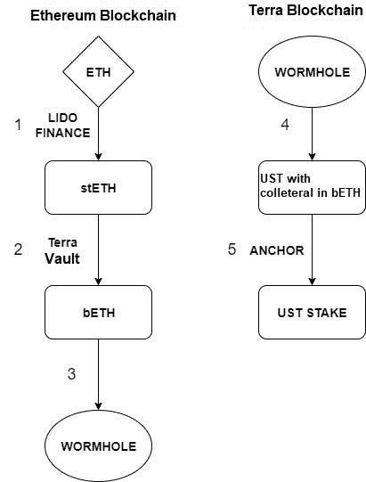
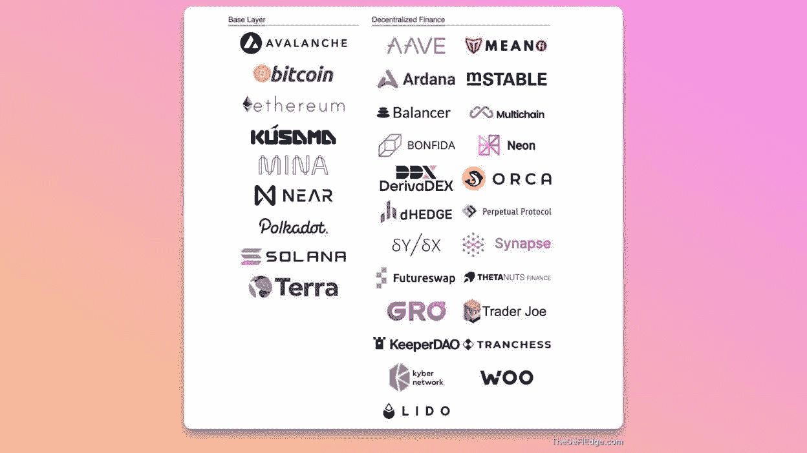

# 通过主要参与者概述流动性危机:Celsius 和 3AC

> 原文：<https://medium.com/coinmonks/an-overview-of-the-liquidity-crisis-through-the-lead-actors-celsius-and-3ac-6deecc959ae9?source=collection_archive---------8----------------------->

对许多人来说，比特币跌破 18000 美元的情景不太可能发生。然而，我们必须承认，这并不是比特币第一次经历如此剧烈的涨跌，我们在每一个案例中都见证了超出预期的上涨或下跌。

在市场上涨的时期，投资欲望会增加，各种项目会相应涌现。尽管如此，在市场下跌期间，这些项目中有多少实际上是基于可持续的想法，或者它们管理得有多好变得显而易见。简而言之，市场上优质和劣质项目在下跌时期确实是相互区分的。

在目前的下跌趋势中，我们一直在经历类似的情况。就像每次上涨趋势都有不同的故事一样，每次下跌趋势结束时，我们都会遇到不同的故事。例如，由 DeFi 和 NFT 引领的最新上升趋势与之前的上升趋势不同。这是因为直到 2-3 年前，就连像 NFT 这样的行业的形成也不太容易预测。NFT 等创新可以很快达到数百亿美元的市场规模，这一事实使投资公司能够向加密货币分配更多资金。结果，又出现了一个不同的故事，也许是第一次，加密货币市场上管理良好和管理不善的投资公司开始出现分歧。

Celsius 和 Three Arrows Capital (3AC)面临的流动性危机已被提上日程数日，因为这两家公司都管理着数十亿美元规模的基金。我们已经为您仔细检查了这两家公司的流程，因为它们被认为是市场急剧下滑的原因，尤其是在 Luna 危机之后。

**斯特思**

在描述该过程的细节之前，我们应该提供关于 stETH 令牌的初步信息。如果您已经有了关于这个令牌的信息，您可以直接进入下一个标题。

随着被称为 ETH 2.0 或 Merge 的过程，以太坊网络进入了一个新的挖掘系统和一个完整的重组过程。那些希望加入新采矿系统的人需要将至少 32 个 ETH 锁定到网络中。现在，锁定的金额无法提取到钱包中。在网络完全升级到新系统并进行下一次更新后(预计在 1 年内)，锁定的 ETH 余额将能够收回到钱包中。

丽都平台创建了 stETH token，既简化了锁定过程，又确保锁定的金额可以随时提取。当你喜欢通过 Lido 锁定 ETH 而不是直接将 ETH 锁定到以太坊网络时，Lido 会为你锁定，并给你一个 stETH 令牌作为回报。即 1 stETH = 1 ETH +因锁定而获得的赌注奖励。当锁定的 ETH 余额可以从钱包中取出时，您可以将余额中的 stETH 代币换成原来的 ETH 代币。

在 curve 平台上创建的 stETH-ETH 池具有最大的流动性，您可以在该池中交易该令牌。也就是说，这是一种平价，通过它你可以将你锁定的代币转换成以太坊区块链，而无需等待事态的发展。

现在，根据这些信息，我们可以描述摄氏温度和 3AC 所经历的过程。

**摄氏度**

拥有 170 万用户的 Celsius 是一家在加密货币市场提供银行服务的金融机构。在卢纳和 UST 代币贬值后，无法很好地管理现金余额的 Celsius 和 3AC 经历了流动性危机，原因是两个用户都损失了投资，并要求在恐慌中撤回资金。

提款请求达到如此高的水平，以至于 Celsius 宣布停止提款。这并不是因为 Celsius 损失了大部分资金，而是因为其大部分资产因投资而被锁定。换句话说，它几乎没有资源来转换成现金并支付给用户。

引发流动性危机的因素之一是 Celsius 投资的两个 DeFi 平台遭到黑客攻击。据称，由于 BadgerDAO 和 Stakehound 的黑客攻击，Celsius 损失了价值约 1 . 2 亿美元的 ETH。

拥有 5 亿 UST 余额的 Celsius 是引发 UST 衰落的重要钱包之一。Celsius 突然大举抛售资产，损害了 UST 的稳定。然而，它是为数不多的几乎没有损失地克服 UST 危机的公司之一。怎么发生的？

尽管 Celsius 希望从锚定 UST 的较高利率中获益，但它并没有通过直接从市场上购买 UST 来进行交易。相反，它使用了 ETH 天平。

1.  分配给 5 亿 UST 的 ETH 余额首先通过利多转换成 stETH 代币。我们已经提到了这个令牌是如何获得的。
2.  然后 stETH 余额通过以太坊网络上的 Terra 的金库再次转换为 bETH 购买 bETH，这是 Terra 网络上公认的 ETH 类型。
    此时，你可能会问为什么 ETH 余额没有直接转换成 bETH。这样做的原因是，他们希望通过在利多下注来获得赌注奖励。在直接转换的情况下，他们不会赚取任何赌注收入。
3.  获得的 bETH 令牌必须从以太坊网络发送到 Terra 网络。虫洞平台被用于这次交易。
4.  他们通过虫洞将贝斯余额转移到 Terra 网络，并以此作为抵押品购买 UST 作为回报。
5.  UST 余额被发送到锚平台并锁定，以产生更高的利息收入。

那么，当 UST 的稳定失败时，Celsius 如何能够毫无损失地撤回资金呢？

既然 Celsius 是用 bETH 的抵押品买下 UST 的，他们拿回抵押品就足够了。换句话说，它必须偿还借入的 UST +利息。因此，UST 是否等于 1 美元并不重要，重要的是要偿还的 UST 的数额。被锁定的 ust 从平台上撤回，贷款得到偿还，BETH 抵押品被收回。然后，按照图中相反的顺序，将 bETH 令牌转换为 stETH 令牌。

最初锁定在 Lido 中的 ETH 令牌无法收回，因为以太坊的新网络尚未完全投入运行。因此，Celsius 使用 Curve 平台上的 stETH-ETH 池将 stETH 令牌转换回 ETH。然而，这个游泳池的深度不足以容纳所有人。由于 Alameda Research、3AC(我们将在后面提到)和 Celsius 等公司希望在同一时期大量出售其 stETH 代币，资金池失去了稳定性。出售后，池中 stETH 的量变成了 ETH 量的 4 倍多。换句话说，虽然池子里有很多水，但并不是每个人都有足够的水。因此，由于没有足够的 ETH，Celsius 无法满足用户的 ETH 撤销需求。

尽管 Celsius 挺过了 UST 危机，但它仍然受到了这场危机引起的恐慌的负面影响。该公司计划在需要时使用 stETH-ETH 资金池产生现金，但由于市场存在巨大的抛售压力，该计划未能实现。因此，可以说 Celsius 没有通过将大部分 ETH 余额用于投资来进行适当的风险分配。

Celsius 的流动性危机并没有就此结束…该公司将其 BTC 余额锁定为 MakerDAO 的抵押品，以创造现金，并收到了价值 2.78 亿美元的 DAI，并将其用于现金需求。然而，由于比特币价格的大幅下跌，作为抵押品的比特币覆盖率逐渐下降。当第一次收到贷款时，如果 BTC 价格下跌到 20，000 美元左右，Celsius 面临失去所有抵押品的风险。幸运的是，通过增加额外的担保品，它设法将这一水平降低到 13，600 美元左右。换句话说，如果 BTC 价格不下跌到 13，600 美元的水平，那么 Celsius 的抵押品将是安全的。

截至 6 月 20 日，该笔提现交易仍以摄氏度成交。据报道，该公司已开始接受来自花旗集团等大公司的咨询。

**三箭头大写(3AC)**

根据去年 4 月的数据，曾经管理着 30 亿美元资金的 3AC 是加密市场中最负盛名的投资公司之一。3AC 通过早期投资以太坊、Solana 和 Avalanche 等区块链的标志而闻名，这些都是市场上最大、最知名的区块链项目。纵观 3AC 投资组合中的公司，可以发现它们都是众所周知的重要平台和基础设施。

因此，3AC 对一家公司的投资表明该公司的未来相当有前途。然而，由于该公司积极的贸易战略，3AC 的这一声誉可以说与它以前的日子相去甚远。

3AC 的流动性危机在该公司未能偿还其 4 亿美元贷款并没收其抵押品时暴露出来。像 3AC 这样的大公司无法为其贷款增加额外的抵押品，这一事实表明存在严重的现金短缺。由于经历危机的公司是 3AC，整个市场的兴趣和议程转向了 3AC 的交易、贷款和余额。

研究显示，3AC 由于在露娜和 UST 的投资遭受了巨额亏损。该公司 5.59 亿美元的 Luna 投资现在只值 670 美元。据估计，由于 UST，3AC 损失了 9 位数，即 10 亿美元或更多。

从 Compound 和 Aave 平台获得约 3 亿美元贷款以解决现金问题的 3AC 是否能够偿还这些贷款也是一个争论的问题。因为，如果加密货币价格继续降低，为这些贷款给出的抵押品可能无法满足贷款，被清算。

虽然 3AC 的贷款是议程上的一个话题，但作为 3AC 的创始人和市场代表的祖恕并没有否认这些事件，他解释说他们正在努力解决这个问题。

与摄氏温度相似，3AC 也有大量的 stETH。由于现金短缺而积极出售 stETH 的 3AC 是另一家对 stETH/ETH 平价曲线造成抛售压力的大公司。然而，正如我们之前在摄氏一节提到的，池的不稳定性导致亏本出售 stETH。

与 3AC 合作了一年半的 8 Blocks Capital 的评论带来了对这个问题的不同看法。根据 8 Blocks 与 3AC 之间的协议，8 Blocks 将可以向 3AC 交易的账户转账。8 块将获得所有收益。8 Blocks 只会向 3AC 支付佣金。除此之外，3AC 无权使用 8 Blocks 的资金并将其转移到其他帐户。

虽然该协议顺利执行，但 8 Blocks 最近要求退出时，无法联系到 3AC 的任何人。8 Blocks 自然对这一过程感到恼火和怀疑，其调查结果显示，100 万美元被违反协议从 8 Blocks 的账户转移到另一个账户，并被用来弥补 3AC 的损失。

伴随着这一事件，据称 3AC 积极地建立杠杆多头，即考虑到市场将上涨而建仓，以弥补由于 Luna 造成的余额损失，这些头寸也由于市场下跌而被清算，并且 3AC 的现金短缺变得更加严重。

这些说法得到了 FTX、德里比特和比特墨西哥当局的证实，他们确认 3AC 的交易已经完成。甚至有人说，3AC 在平仓后欠 Bitmex 万美元。因此，可以说，3AC 在亏损时采取了更激进的方法，因此损失了更多的钱。

在该公司创始人祖恕的 Twitter 个人资料上，他的投资组合中有代币的标签。现金危机之后，祖恕从他的个人资料中删除了这些符号，表明该公司可能出售了其投资组合中的替代硬币来产生现金。

根据 3AC 最近的声明，该公司仍在寻求解决方案，讨论各种提议，如出售公司拥有的资产，或将 3AC 出售给另一家公司。

**操纵主张**

上面，我们已经看到了两大公司经历了多么严重的现金危机。这一事件引发了关于市场的重要主张。这些指控中最重要的是，与 Celsius 和 3AC 竞争的其他公司，或者那些将从这两家公司的破产中获得利润的公司，故意压低了市场。这是因为加密货币价格的下降使 DeFi 平台上的贷款抵押品逐渐贬值，导致贷款的流动性。因此，清算 Celsius 和 3AC 的贷款导致这些公司因获得贷款以满足其短期现金需求而失去长期投资。

在贷款清算的情况下，抵押的加密货币被出售，贷款金额返回到平台的账户。现在让我们把这些点连接起来…除了 3AC 和 Celsius，我们还应该包括 DeFi 平台的借款人。由于做市商故意操纵价格，即降低价格，这些贷款(如果没有存放额外的抵押品)将被清算。当 DeFi 平台出售他们作为抵押品收到的加密货币时，市场上的抛售压力将增加，这将促进做市商的工作。随着 3AC 和 Celsius 等主要投资者余额中的代币释放到市场，竞争公司可以以更低的价格将 3AC 和 Celsius 头寸添加到他们的投资组合中。

由于这种策略是可行的，操纵索赔也应仔细监测。

**stETH 销售对以太坊有损害吗？**

由于现金短缺而面临过度抛售压力的 stETH tokens，几乎不可能对以太坊造成损害。由于抛售压力而变得不稳定的 stETH/ETH 池提供了一个非常有吸引力的套利机会，目前的抛售压力预计不会持续很长时间。

stETH/ETH 池目前的不稳定导致 stETH 以 3%左右的折扣出售。也就是说，1 个 ETH 可以买 1.03 个 stETH。这样，当新的以太坊网络完全运行时，每返还一个 stETH 令牌，就要拿 1 ETH +赌注收入+ 3%的套利利润。因此，预计在危机环境平复时会利用套利机会。

丽都金融生产 stETH 代币；由于这项服务，它代表了锁定到新网络的所有以太网令牌的 32%。考虑到最坏的情况，Lido 可能希望从网络中收回所有的 ETH 余额。即使在这种情况下，以太坊网络也没有被破坏。因为提取锁定 eth 的过程也是有额度的。因此，一旦配额被填满，不管退出请求的数量有多少，其余的都必须等待。该系统旨在确保区块链以太坊的安全。所以，即使丽都要撤出所有 eth，这个过程也可能需要数周或数月。总之，即使在最坏的情况下，以太坊网络也不太可能被 stETH 令牌直接破坏。

**压力测试**

可以说，两家公司都希望通过追求稳定的回报来降低风险。由于这场由 UST 引发的危机甚至对遵循低风险原则的公司都产生了负面影响，因此它不同于以往的任何一场危机。然而，有一个问题是肯定的，把所有鸡蛋放在同一个篮子里的公司迟早会受到惩罚，即使它们是稳定的硬币。这些公司应该更好地分配风险，他们不应该如此依赖 stETH pool 的深度。最终，正如在文章的引言中提到的，管理不善和管理良好的公司在每个衰退期都会被分离出来，这确保了市场的健康基础。

尽管玻璃的空白部分表明信贷清算在一个链条中相互触发，但玻璃的填充部分揭示了 DeFi 平台经历了一次重要的压力测试。MakerDAO、Aave 和 Compound 等平台已经证明，即使在最糟糕的情况下，它们的系统也能以健康的方式运行，它们的抵押率也得到优化调整。因此，我们应该关注 DeFi 平台将通过从这些测试中吸取的经验教训实现的长期收益，而不是像现金危机这样的短期过程。

编制人:Berkay Aybey

*此处表达的观点和评论归 BV Crypto 所有。BV Crypto 对基于此帖子的任何金融交易概不负责。每一次投资和交易都有风险。当你做决定时，你应该自己做调查。*

> 加入 Coinmonks [电报频道](https://t.me/coincodecap)和 [Youtube 频道](https://www.youtube.com/c/coinmonks/videos)了解加密交易和投资

# 另外，阅读

*   [如何在 FTX 交易所交易期货](https://coincodecap.com/ftx-futures-trading) | [OKEx vs 币安](https://coincodecap.com/okex-vs-binance)
*   [CoinLoan 审查](https://coincodecap.com/coinloan-review) | [YouHodler 审查](/coinmonks/youhodler-4-easy-ways-to-make-money-98969b9689f2) | [BlockFi 审查](https://coincodecap.com/blockfi-review)
*   XT.COM 评论[币安评论](https://coincodecap.com/profittradingapp-for-binance) |
*   [SmithBot 评论](https://coincodecap.com/smithbot-review) | [4 款最佳免费开源交易机器人](https://coincodecap.com/free-open-source-trading-bots)
*   [比特币基地僵尸程序](/coinmonks/coinbase-bots-ac6359e897f3) | [AscendEX 审查](/coinmonks/ascendex-review-53e829cf75fa) | [OKEx 交易僵尸程序](/coinmonks/okex-trading-bots-234920f61e60)
*   [如何在印度购买比特币？](/coinmonks/buy-bitcoin-in-india-feb50ddfef94) | [WazirX 审查](/coinmonks/wazirx-review-5c811b074f5b)