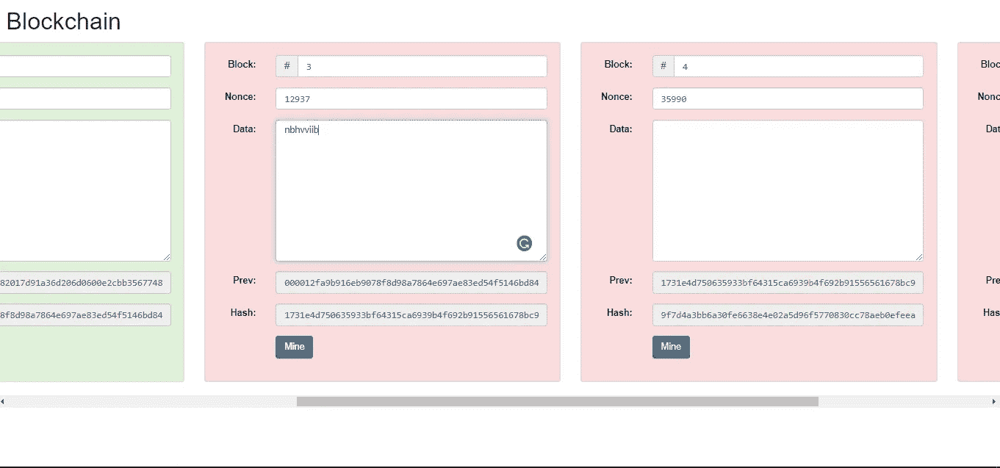
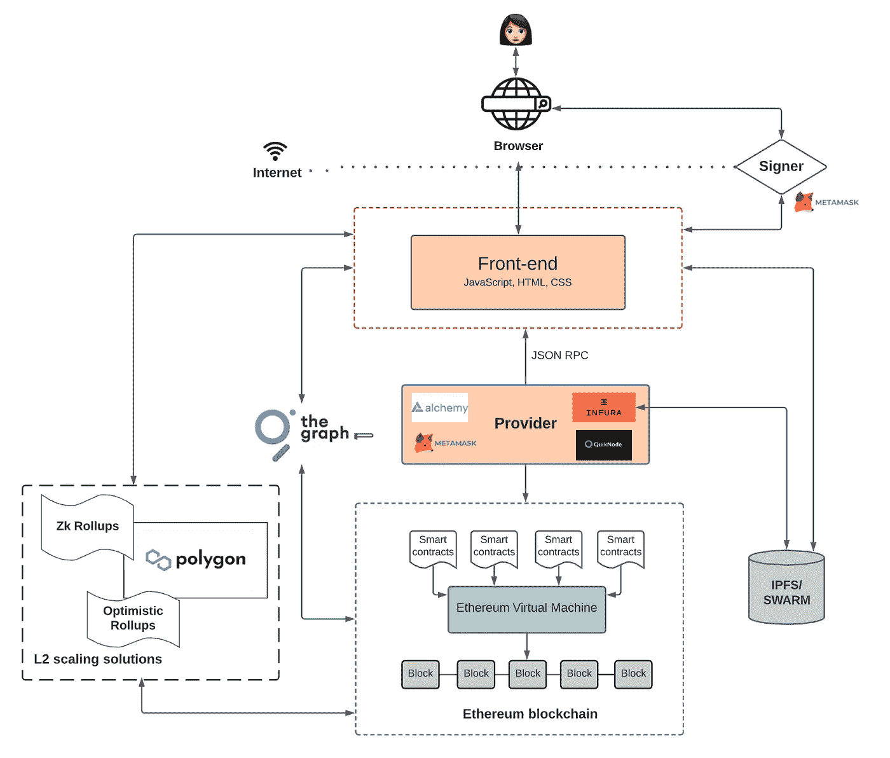

# 区块链技术和 Web3.0 理念的终极深度剖析

> 原文：<https://medium.com/coinmonks/an-ultimate-in-depth-breakdown-of-blockchain-technology-and-the-idea-of-web3-0-9a8d2c6a2f61?source=collection_archive---------18----------------------->

我相信现在许多人都意识到我们的隐私在互联网上是不安全的，不知何故互联网知道我们想要的一切。

举个例子，前几天，我想在我家附近找一些好吃的 ***包子馒头餐馆*** ，于是我在**【脸书】**上输入了它。在我找到理想的餐馆后，我合上标签，去找一些网上新闻，然后当我看到新闻页面上出现的关于馒头和面条餐馆的广告时，我吓坏了。

这种情况发生在任何使用互联网的人身上，他们的个人信息在不知情的情况下暴露了。如果你做一些这方面的研究，你可能会遇到一个叫做“ **Web3.0** 的东西来解决这个问题。

那么， **Web3.0** 是什么，为什么它能解决现在的网络问题？这些问题将在本文中得到解答，但首先，让我们来看看互联网的发展。

## **1。从 *WEB1.0* 到 *WEB3.0* 到**

Web1.0 是第一个互联网模型，在这个模型中，我们这些客户与只读网站相连，我们无法与之互动，它的信息只能由它的创建者更改。例如像大英百科全书或百科全书这样的网站。

The basic model of Web1.0

另一方面，我们现在使用的 Web2.0 和 T31 要先进得多。它由 3 个主要部分组成:

*   数据库:存储随着时间推移而更新的重要数据，如用户帐户、标签、帖子等。
*   **后端代码**(可以用 C++、Java 等各种语言编写。)定义了网站的工作方式。例如，当某人创建新帐户、发布视频等时会发生什么。
*   **前端代码**(可以用各种语言编写)定义了网站用户界面的逻辑( **UI** )，通常是网站看起来是什么样子，以及当用户与页面上的元素交互时会发生什么。

The basic model of Web2.0 ([source](https://www.preethikasireddy.com/post/the-architecture-of-a-web-3-0-application))

Web2.0 网站不仅向我们展示其数据库中的信息，还允许我们与它们互动。同样值得注意的是，网站收集的所有数据都将存储在其数据库中，这样的数据库被称为**集中式数据库**，他们控制着网站背后的组织。

与 **Web2.0** 不同， **Web3.0** 没有一个集中的数据库来存储网站的状态，后端现在连接到由**分散自治组织(DAO)** 管理的**区块链网络**，分散自治组织(DAO)是形成区块链网络的一群人或机构。

The basic model of Web3.0 ([source](https://www.youtube.com/watch?v=hG5zFHftMDI&t=286s))

但是在我们深入了解 Web3.0 之前，让我们先了解一下区块链技术，它是互联网新版本的核心。

## **2。区块链技术——web 3.0 的心脏**

这一切都归结为一个公共分类账，用于存储社交数字平台上的交易，然而，网站将控制分类账，并决定如何向分类账添加新的行。这需要用户对该网站的信任，然而随着人们变得越来越谨慎，他们希望在自己的电脑上为每个人保留一份账本，每当有人进行交易时，他们都会向其他人宣布，以便人们可以在他们的账本中记录下来，这被称为**分散网络**，每个加入网络的人都是一个**节点，** 这个网络将确保账本永久留在网络中，如果有人试图攻击一个节点，他们可以通过复制其他节点来恢复丢失的数据。

然而，有一个关键问题是，你如何知道**其他人是否有和你一样的分类账**，或者更具体地说，**什么是应该遵循的正确分类账？**你怎么知道人们在以同样的顺序听同样的交易？

**比特币**提供了一种解决这个问题的方法，即信任**计算工作量最大的账本。这涉及到一种叫做加密散列函数的东西。**当一段数据被放入哈希函数(无论是文件还是消息)时，结果将是一串固定长度的数字和字母，即使它总是在相同的输入下给出相同的结果，也不可能从输出追溯到输入(唯一的方法是猜测和检查)，即使我们改变输入中的一个单词，字符串也会完全改变。

Before changing

After changing

那么这和大量的计算工作有什么联系呢？他们想出了一个主意，有一个特殊的数字，如果我们把这个数字放在分类账的末尾，然后对它应用某个**加密哈希函数**，比如说 **SHA256** ，我们将得到一个以 50 个零开始的哈希(比如说)。由于 **SHA256** 是一个**加密哈希函数**，找到这个数字的唯一方法就是通过**猜测和检查**(从 1 开始，直到我们得到那个数字)。这需要进行大量的试验和努力。该数字现在被称为 **nonce** (使用一次的数字)

现在，我们需要做的是将给定的分类帐放入“块”中，每个块都有一个 nonce，这样当我们散列块中的所有内容时，输出以一串零开始，只有具有有效 nonce 的块才能存在。为了将这些块按顺序排列，每个块都用**前一个块的散列**或**括号来实现。**因为块之间是有序的，所以它们被称为**区块链。**

> 要点:一个块由 4 个主要部分组成，即**括号**、**哈希**、**数据**和**随机数**。

A basic valid block

由于区块链的这些特性，如果想要更改数据块中的数据或交换区块链的顺序，此操作将会更改该数据块的哈希，这将会更改所有剩余数据块的哈希，当然，这将会非常明显并会被阻止。

An invalid blockchain

因为添加一个新的区块是一个重要但非常具有挑战性的行为，为该区块找到一个有效随机数以将其添加到链中的过程被称为“**挖掘**”，被接受添加到链中意味着该区块已经通过了一个称为“**工作证明**”(**PoW**)的过程，并且**挖掘者**将获得奖励(加密货币，如**比特币、**等)。，取决于网络使用什么货币)，这里的“工作”一词暗示了挖掘过程。

现在回到最初的关于找到正确分类账的问题，人们只需要相信最长的区块链(也就是投入最多工作的那个)。对于一个人来说，添加欺诈块或维护不同于“正确”链的第二个链将是极其困难的**，因为这要求他们比任何人都更快地创建块，这意味着他们需要拥有至少 **51%的计算设备**，这在现实中很难实现，因为区块链的网络可能有数千个这样的设备。**

> **外卖:链条越长越可靠。**

**然而，权力并非完美无缺:**

*   **因为这种模式需要矿工不断地做大量的计算工作，并相互竞争以获得区块奖励，这对环境非常不利，并导致巨大的能量损失。**
*   **拥有更好计算设备的人总是更有可能获得集体奖励，这对较贫穷的矿工来说是不公平的。**
*   **许多人相互合作，创建了一个名为“**矿池**的小组，并分享区块奖励，这集中了一个区块链系统(据说是分散的)，因为更大的池更有可能获得区块奖励，如果池由 51%的计算机组成，他们可以允许欺诈区块出现。**

****

**Bitcoin pools distribution ([source](https://en.bitcoinwiki.org/wiki/Comparison_of_mining_pools))**

****利益相关证明(PoS)** 被设计成作为**共识机制**来取代 **PoW，**那么它是如何工作的呢？在这种情况下，添加新块的工作不再分配给**矿工**，而是一些人称之为**验证者**。每次提出一个块时，在网络中的所有验证者中随机选择一个验证者，他或她必须验证一个块中的所有数据，签署该块，并将其添加到网络的区块链中，并为该块中的每个数据收取加密费。一个人拥有越多的**股份**(这是一个节点投入到网络中的钱的数量与**在网络中的钱的总量**)就越有可能被选为**验证者。****

**要注册为验证器节点，必须满足一些要求，包括拥有足够的技术设备和向系统中存放足够数量的密码。如果一个验证者被发现允许一个欺诈性的阻止，作为惩罚，他或她将失去一些他或她的股份。因为这个加密量大于验证器验证一个块所能得到的量，所以这些验证器是可靠的。**

**这种方法将解决一些关键功率问题。它减少了能源损失，因为没有竞争的矿工，而且“51%攻击”也不太可能发生，因为一个人必须向**支付数亿**到**数十亿**美元才能拥有一个网络中 51%的股份。然而这种机制也有一些问题:**

*   **很明显，这个模型更喜欢富人，因为他们越有钱，就越有可能被选为验证者，他们会变得越富有，这增加了他们成为验证者的机会。**
*   **另一个问题是，当选择的验证器没有出现来验证代码块时，会有机会出现。然而，这可以通过选择一些备份验证器来解决。**

**区块链系统有大量的**共识算法**，一些创造性的网络结合一些算法来减少它们各自的缺陷。Opet Foundation 的**工作证明**和**权威证明**的组合在他们的区块链上使用，以存储他们的聊天机器人收集的数据，这是一个完美的例子，其中他们使用 PoA 来选择最有信誉的验证器，并让他们与 PoW 相互竞争。**

> **T akeaway:在选择使用什么**共识算法**时，要保持开放的心态。**

**在我们深入了解 **Web3.0** 之前，我不得不提到的**区块链技术**的另一个重要部分是**智能合约。****

**简而言之，**智能契约**是一个程序，一旦满足一些预定义的条件，它就会发出一个**事件**。例如，当有人按下“转移 20 ETH”按钮时，智能合约会将 20 ETH(以太坊的硬币)转移到给定的目的地。**智能合约**存储在**区块链**中，因此一旦部署就不能更改。**

**因为**智能合约**是一个程序，所以它是用一些高级编程语言编写的，但最著名的是 **Solidity** 。许多区块链支持智能合约，但最大的是**以太坊**，它将在我即将展示的**web 3.0 架构**中发挥重要作用。**

## **3.web 3.0——互联网的未来**

**让我们看看下面关于 Web3.0 架构的图片，然后我将分解 Web3.0 网站的每个部分**

****

**([source](https://www.preethikasireddy.com/post/the-architecture-of-a-web-3-0-application))**

*****a)以太坊区块链网络。*****

**首先，我们连接**浏览器**，这样我们就可以像在 **Web2.0** 一样进入网站的**前端**。然而，**前端**不再连接到一个集中的后端部分，而是一个去中心化的**区块链网络。****

**这里我们使用以太坊区块链(简称以太坊)，因为它广泛支持智能合约。**以太坊区块链**本身被称为一个“**状态机**，也就是说它在每个区块被验证后都停留在一个且只有一个“**状态**”。一个状态由所有关于**以太坊**的**当前信息**组成，包括的**币数、**账号**、**网站**等(关于以太坊状态的更多信息，可以查看[这里](https://eth.wiki/en/fundamentals/patricia-tree))。因此，当一个块被验证并被添加到区块链时，存储在该块中的事务将移动**以太坊**到另一个状态，并且由于添加新块的方式(**一致性算法**)被网络中的每个节点所同意，所以这个新状态也将被相互同意。****

****

**([source](https://ethereum.org/en/developers/docs/blocks/))**

**而且，必须有一些东西来定义以太坊计算新状态的规则，它被称为**以太坊虚拟机(EVM)。事务(上图中的****)**可以导致消息调用或智能合约。然而， **EVM** 无法理解用于编写**智能合约的高级语言，**所以这些语言必须被分解成 **EVM** 能够理解的字节码。每当有人对契约进行消息调用时， **EVM** 将执行它的字节码并将**以太坊**移动到另一个状态，导致我们可以观察到的 **UI** 的变化。**

****

**([source](https://www.preethikasireddy.com/post/the-architecture-of-a-web-3-0-application))**

**然而，必须有一个特定的过程允许前端与以太坊通信。为了更好地了解这一过程，让我们进入下一部分。**

*****b)前端如何与区块链交互*****

**要将一个事务发送到一个块，让 **EVM** 执行，你必须将它广播到网络(因为以太坊是一个分散的网络)，但是要做到这一点，你必须连接到网络中的一个**节点**。有两种方法可以做到:**

*   **建立你自己的运行以太坊区块链软件的节点。**
*   ****使用第三方服务提供的节点，如** [**Infura**](https://infura.io/) **，**[**Alchemy**](https://www.alchemy.com/)**，**[**Quicknode**](https://www.quicknode.com/)**。****

**建立你自己的节点是可以的，但是要建立它是非常困难的，因为你需要满足一定的技术要求，并且随着你的应用程序或网站的扩展，这是非常昂贵的。**

**为了避免这些问题，大多数人选择使用第三方节点，因为这些服务将为他们管理节点，这些节点被称为“**提供商**”。**

**每个**提供者**都用一个 **API** 实现，通常是 **JSON-RPC** 。这个 **API** 将确保网站前端有一套统一的方法来连接他们的**提供者**，因此，你可以**向**以太坊**广播**你的请求。**

****

**([source](https://www.preethikasireddy.com/post/the-architecture-of-a-web-3-0-application))**

*****c)数字签名*****

**一旦连接到提供者，就可以在区块链上读取虚拟机的状态(因为每个节点都会存储一份区块链)。然而，如果你想在以太坊中写些东西，你必须使用一种叫做“**数字签名**的方法来签署你的交易(否则交易将被视为无效)。以下是对这种方法的解释:**

*   **每个人都有两个密钥:一个**秘密密钥(SK)** 和一个**公开密钥(PK)** (密钥是一个数字和单词的序列)，从 PK 中追溯 SK 是不可行的。**
*   **人家留着自己的 SK，把 PK 的事宣传给其他所有人。**
*   **人们使用他们的 SK 来签署他们的交易，产生的签名是一系列**密码加密的数字和单词序列**，它们是每条消息和 SK 所独有的。换句话说，不同的 SKs 和交易会导致不同的签名。**
*   **如果一个人想要验证交易是否来自人 A，他或她必须使用人 A 的 PK 来验证。**
*   **如果 A 想给 B 写一封机密邮件，A 需要用 B 的 PK 加密邮件，B 用他的 SK 解密。如果除了 B 之外的任何人使用 B 的 PK 打开消息，他们将看到的一切都是不可读的加密消息。**

**因此，每当用户想向 **EVM** 发送一些东西时，例如创建一个帖子，网站会要求他或她在帖子上签名，然而，很难记住一长串不可预知的数字和单词，甚至按 Ctrl+A 然后 Ctrl+C 然后 Ctrl+V 的工作也很不方便。这时**超屏蔽**出现了。**

****元掩码**的工作方式非常简单:它将用户的 sk 存储在浏览器上，每当网站或应用程序需要使用用户的 SK 时，它就调用**元掩码。****

**我们已经讨论了如何将交易发送到以太坊，但是如何以一种既易于访问和检索又经济高效的方式存储用户数据呢？**

****

**([source](https://www.preethikasireddy.com/post/the-architecture-of-a-web-3-0-application))**

**d)用 IPFS 或 SWARM 存放你的东西。**

**谈到存储，在**以太坊区块链**上存储数据是昂贵的，因为**以太坊**每当用户想要在区块链上存储数据时，都要向用户收取费用(称为**气**)。如果你是一个 web 开发人员，这是可以理解的，但是从用户的角度来看，这不是一个非常愉快的体验。**

**这就是为什么你需要存储你的数据，如帖子，视频，图片等。在另一个分布式网络上，当一个应用程序如[**【IPFS】**](https://ipfs.io/)**或 [**群**](https://www.ethswarm.org/) 派上用场时。****

******IPFS** 和**蜂群**为你提供分散的网络来存储文件和数据。由于分散网络的特点，您可以很容易地检索和访问数据。****

******IPFS** 要求你在他们的系统中有一个节点，可以通过使用 [**Infura**](https://infura.io/) **来实现。IPFS** 有一个被称为**垃圾收集**的过程，在这个过程中，旧的、未使用的缓存数据将被删除，以便为新的数据腾出空间，为了防止一些数据被驱逐，用户可以 **pin** 他们可以自己做的数据，或者使用另一个应用程序，如 **Pinata** 。****

******IPFS** 和**蜂群**彼此非常相似，都是分散存储。他们之间的一个关键区别是他们的激励制度。****

******IPFS** 有一个名为 **Filecoin** 的激励层，你需要支付更多的费用，这样你才能有更多的空间来存储你的数据。****

******SWARM** ，另一方面，是自我维持的(意味着你不需要为它支付任何费用),因为在**以太坊区块链有一个通过智能合同执行的内置激励系统。******

******前端代码**不是存储在以太坊区块链上，而是存储在 IPFS 或 SWARM 上(这就是为什么你可以在架构图中看到连接 IPFS 和前端的箭头)。它也可以存储在**亚马逊网络服务(AWS)** 上，但这将为网站创建一个集中的特征，他们可以审查你的网站，而如果存储在 **IPFS** 或 **SWARM 上，**你的代码将有一个抵抗篡改和审查的加密哈希。****

****我们现在知道如何向区块链发出请求，以及如何存储您的数据。那么，如何在以太坊这样的区块链网络中找到某个数据或文件呢？****

*******e)图—解*******

****让我们来谈谈没有所谓的“**图**”来索引区块链中的信息的时候。如果 DApps(分散式应用程序)开发人员想要在区块链中找到某些数据，比如说一个事务，他们必须在块 1 中搜索，并检查存储在其中的所有事务。如果找不到该数据，它们会移动到数据块 2，依此类推。然而，这个过程花费了大量的处理时间，可能是几个小时甚至几天:v。****

****dApps 开发人员当时可以做的另一件事是自己索引数据，然而这需要大量的工作。****

****已经有一些集中式的解决方案，例如 **Etherscan、**，但是，当然，这些都是完全依赖于信任的关系(这意味着开发人员需要完全信任那些第三方组织)和单点故障。****

******图**提供了一个**分散索引服务**(类似于教科书中的索引，诸如此类的东西)，这样用户就可以很容易地找到他们一直在寻找的数据。****

******图**中某个 dApp 的数据被分配到一个叫做**子图**的东西中(把它想象成一本书的索引，这样的书就是一个 **dApp** )。一个子图可以由另一个子图组成。其他 dApp 或用户可以查询存储在关于该 dApp 的子图中的数据来做其他事情。例如，如果开发人员想要创建一个收集每种加密货币的硬币总数的 dApp，那么 dApp 需要向每种加密货币的子图中的**索引器**发送一个数据查询(每种加密货币的硬币总数),他们将发送回该数据并接收 **GRT** (图的令牌)作为费用。****

> ****注意:在**图**的分散网络中有大量的角色，你可以阅读[这个博客](https://thegraph.com/blog/the-graph-network-in-depth-part-1)来获得更多关于这些角色的信息。****

****对于 dApps 的用户来说，他们永远不必直接与图形交互，因为他们可以在应用程序的 UI 中找到这些信息。****

********

****([source](https://www.preethikasireddy.com/post/the-architecture-of-a-web-3-0-application))****

****现在让我们跳到这个架构的最后一部分:扩展解决方案。****

*******f)以太坊中的缩放。*******

****随着**以太坊**的用户越来越多，发送到区块链的**交易**数量也会增加。这意味着区块链将变得更加繁忙，交易费用也将更高，这导致构建和维护 dApp 可能非常昂贵，并导致糟糕的 UX。因此，必须对此问题进行缩放解决。****

****以太坊有两种主要的缩放方式:****

1.  ******链上伸缩**:这导致更改以太坊协议，以增加可伸缩性。一种**已经**在以太坊区块链上使用的方法是“**分片**”。主区块链( **Mainnet** 或**第 1 层**)被水平分割成更小的区块链，称为**碎片**，**验证器**只需要存储它们正在验证的**碎片**，而不是**整个网络**。这大大提高了处理交易的速度，降低了成为验证者的技术要求。****
2.  ******链外扩展:**这意味着这些解决方案不会在以太坊区块链的主服务器上实现，因此不会影响以太坊协议。主要有两种解决方案:“**第二层解决方案**”(回想一下主以太坊区块链叫第一层)和“**侧链**”。"**第 2 层解决方案**"受到以太坊协议的保护，因为这些解决方案实际上是一些扩展协议，旨在帮助以太坊更快地处理更多交易。例如，**乐观汇总**和 **zkSNARK 汇总**是一些**以太坊验证器**(不是其他网络的验证器)**批处理**(或有时称为“汇总”)一些使用**汇总智能契约的事务，**在主链之外执行那些事务，然后将事务数据发送回主链。当然，这两种汇总解决方案之间存在一些关键差异，您应该查看[该视频](https://youtu.be/7pWxCklcNsU)以更好地了解汇总和这两种解决方案。另一方面，“**侧链**”意味着我们使用与主链**并行**的另一个链来执行和处理事务，然后侧链将收集其最近块的数据并提交给主链。因为“**侧链**”可以是其他一些与以太坊主链兼容的链，可以有自己的共识算法。 [**多边形**](https://polygon.technology/) 提供了这样的边链。****

****结合以上所有信息，我们得到了 Web3.0 应用程序或网站的基本架构，正如我在第三个主题开始时所展示的。****

********

****我们已经经历了 Web1.0、Web2.0、区块链技术和 Web3.0 的架构。现在，让我们来看看 Web3.0 可以解决什么问题，以及这类网站在这个时代是如何被使用的。****

## ****4.Web3.0 —游戏规则的改变者****

****Web3.0 带来了一些好处:****

1.  ****网络上的任何人都可以访问该网络的服务，不需要许可。****
2.  ****没有人能阻止或拒绝你使用这项服务。例如，Twitter 可以审查你的推文，但类似的 dApp 不能。****
3.  ****DApps 使用本地令牌(如 ETH)进行支付。Web2.0 网站和应用程序没有本机令牌，因此它们有时需要您的一些个人数据，如信用卡号码。DApps 不需要这些东西。****
4.  ****Web2.0 网站可能会出现单点故障，而 dApp 不会，因为它是建立在由数千甚至数百万台计算机作为后端的分散式网络之上的。****
5.  ****你可以在区块链网络上编写几乎任何东西。****

****然而，dApps 有一些限制:****

1.  ****与 Web2.0 相比，与 Web3.0 交互需要额外的教育、步骤和要求****
2.  ****与 Web2.0 相比，Web3.0 上的交易可能更慢，UX 可能更差，因为分散式网络具有非常复杂的协议。****
3.  ****将代码放入区块链的成本可能非常昂贵，因此一些 dApp 开发人员可能会拒绝这一选择。****
4.  ****Web3.0 应用程序对大多数用户来说不太容易访问，因为它们没有与现代的 Web 浏览器集成在一起。****
5.  ****像改变网络工作方式这样的网络级决策可能很难做出，因为没有人对这样做有最终决定权。****

****很难说 Web3.0 应用程序将来会完全取代 Web2.0 应用程序，两者各有利弊。(如需进一步解释，请点击[此处](https://ethereum.org/en/developers/docs/web2-vs-web3/))****

****有很多例子可以说明 dApps 在这个时代是如何应用的。****

****像 **IPFS** 、**群集**存储数据、**多边形**增加网络可扩展性、**图形**查询和索引数据。实际上，我已经在前面的章节中简要地谈到了它们是如何工作的****

****这些应用程序主要是为了支持 web 开发人员而创建的，那么互联网的临时用户呢？好吧，我来介绍几个提供服务的 dApps:****

1.  ******Uniswap** :构建在以太坊区块链网络之上的顶级**去中心化加密交换应用**。在这里，你可以用一个 **ERC-20 令牌** (ERC 是一套在区块链以太坊创建令牌的指导方针，当有人向智能合约中注入一定数量的 ETH 时，使用智能合约创建新类型的令牌)换取另一个令牌(例如链接到 ETH)。****
2.  ******高地**:一款**基于区块链的游戏**，用户可以购买、出售和交易映射到现实世界的虚拟财产，并与他人社交(基本上是一个元宇宙)，它是基于**EOS 区块链**(它不需要以太坊，因为它可以是任何有虚拟机的区块链网络)。每个属性都绑定到一个 NFT(不可替换的令牌，这意味着同一令牌的 NFT 可以有不同的值)****
3.  ******达拉尼亚的矿山:**一款2D 动作的动作冒险游戏在克劳莉娅区块链上运行。这个游戏包括引导一个角色通过程序生成的关卡和收集物品来升级你的角色。玩家可以通过出售物品或参加活动、完成任务等获得加密货币。****
4.  ******Odysee** :一个内容发布和共享平台，建立在一个分散的区块链网络上，名为 LBRY(读作“图书馆”)。它基本上是 YouTube，但分散在区块链。****

****这些是一些受欢迎的 dApp。世界上还有很多这样的 dapp，然而，它们中的大多数都是 **DeFi 应用**(分散金融应用是为**密码相关目的**而设计的应用)比如我上面提到的 Uniswap，或者**游戏**比如 **CryptoKitties** 或者 **Mines of Dalarnia，**或者**社交媒体**比如 **Steemit** 或者 **收藏品(一种 dApp，人们轮流分享或出售他们收藏的东西，用于加密)、市场和其他东西，如 VPN 等。******

****越来越多的 dApps 被创造出来，它们的知名度也越来越大。在未来，也许我们可以在任何地方看到 dapp，人们将习惯于加密货币，一些“ **siren servers** ”(指大型组织)，如脸书或 Youtube，抖音可能会被其他类似的 dapp 永久取代。银行或医院等机构将利用区块链技术以更快、更易访问的方式存储交易、患者信息等，同时仍保持高度安全性。****

> ****摘要:我们今天所知道的世界在未来可能会因为 **Web3.0** 而发生很大变化。****

## ****5.一篇长文章的结尾****

****如果你已经花了宝贵的时间阅读了这篇文章的这一部分，我欠你一个大大的感谢，并希望你学到了一些关于区块链技术和 Web3 思想的新东西。****

****这篇文章是基于我自己对区块链科技和 Web3 的理解而写的，在我写这篇文章的时候，我确实学到了很多新东西。****

****如果你有任何问题或指出任何事实错误，请通过这个电子邮件地址联系我:dhcno2345@gmail.com。****

****安静点。****

> ****加入 Coinmonks [电报频道](https://t.me/coincodecap)和 [Youtube 频道](https://www.youtube.com/c/coinmonks/videos)了解加密交易和投资****

# ****另外，阅读****

*   ****[5 款最佳加密交易终端](https://coincodecap.com/crypto-trading-terminals) | [最佳 DeFi 应用](https://coincodecap.com/best-defi-apps)****
*   ****[最佳网上赌场](https://coincodecap.com/best-online-casinos) | [币安评论](/coinmonks/binance-review-ee10d3bf3b6e) | [BitMEX 评论](https://coincodecap.com/bitmex-review)****
*   ****[麻雀交换评论](https://coincodecap.com/sparrow-exchange-review) | [纳什交换评论](https://coincodecap.com/nash-exchange-review)****
*   ****[美国最佳加密交易机器人](https://coincodecap.com/crypto-trading-bots-in-the-us) | [经常性回顾](https://coincodecap.com/changelly-review)****
*   ****[在印度利用加密套利赚取被动收入](https://coincodecap.com/crypto-arbitrage-in-india)****
*   ****[Godex.io 评审](/coinmonks/godex-io-review-7366086519fb) | [邀请评审](/coinmonks/invity-review-70f3030c0502) | [BitForex 评审](https://coincodecap.com/bitforex-review)****