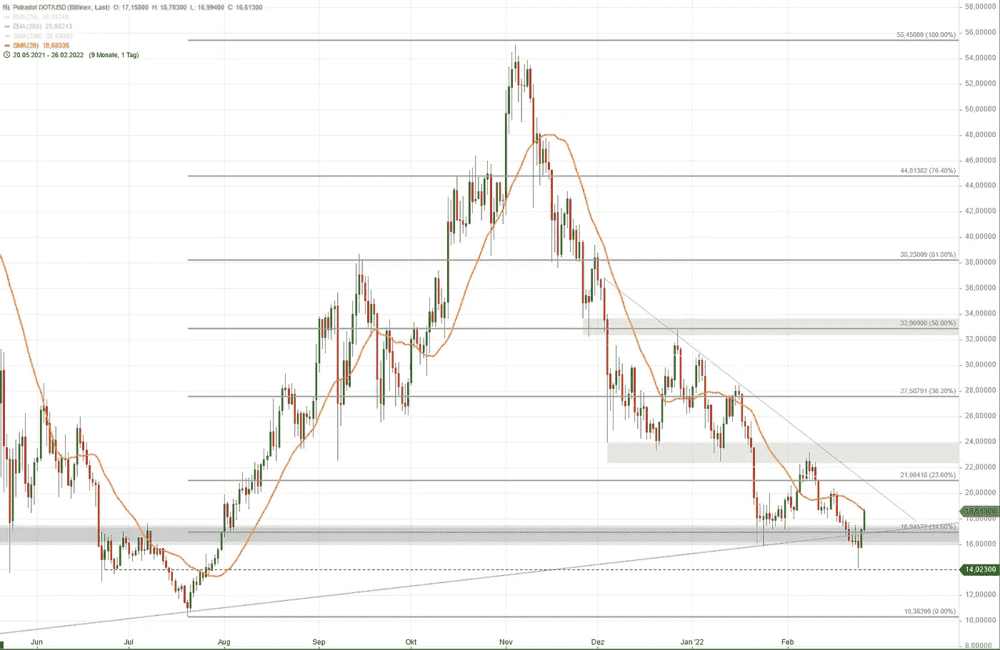
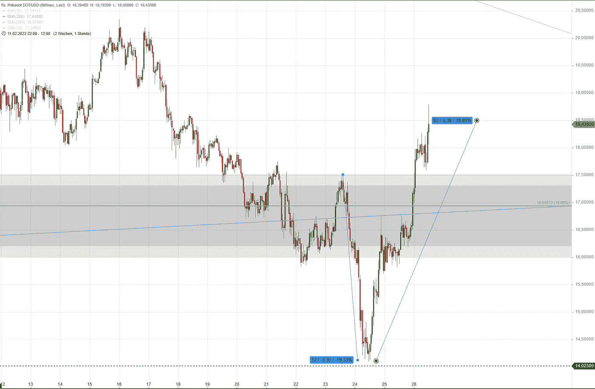
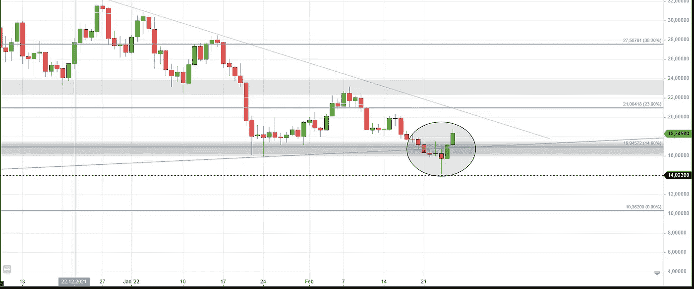
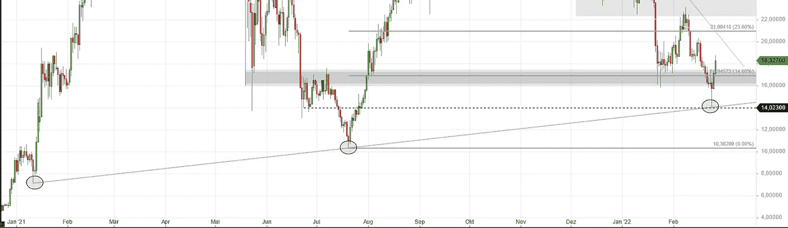
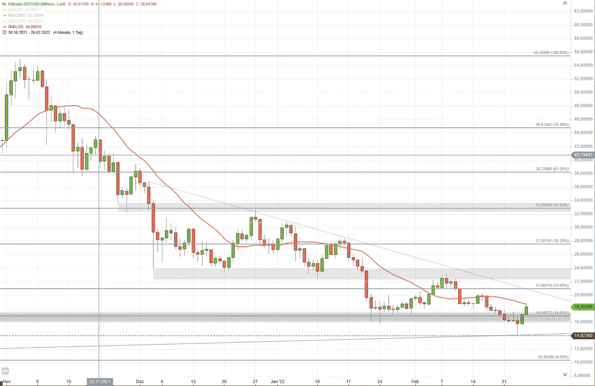

# 波尔卡多特(大图)更新(26.02.2022)

> 原文：<https://medium.com/coinmonks/an-update-on-polkadot-big-picture-26-02-2022-e0f1ba7abf50?source=collection_archive---------23----------------------->

来更新一下我们对波尔卡多的[大图检查。](/coinmonks/polkadot-big-picture-21-02-2022-566d531587dd)

Polkadot’s daily chart on 26th February 2022

# 大规模抛售和复苏

在乌克兰的恐怖事件之后，大多数加密资产经历了大规模抛售，随后出现了类似的大规模盘中反弹。正如 2022 年 2 月 24 日所见，积极的日内反转通常是看涨事件，尽管很难确定它们是否只影响短期或长期时间框架。

Polkadot’s hourly candle chart

如 1h 图表所示，价格在不到 24 小时内下跌了约 20%。自那以后，Polkadot 反弹了 33%,目前实际交易价格比抛售开始时的水平高出近 8%。

# 主要和次要趋势

目前，多头可以稍微放松一下了。但是长期上升趋势和二次下降趋势呢？

# 点/美元的主要趋势

Polkadot: The trendline was broken

如上图所示，蓝色长期趋势线被打破(圆圈)。之后，价格反转，当前日线图重新测试了蓝色趋势线(圆圈)。

由于抛售期间的当前高-低仍在上次高-低之上，长期上升趋势仍然有效，尽管它变成了一个小裂缝。

对我来说，这条趋势线不再有效，因此它不再作为一个方向。

相反，抛售的新低可能是另一条趋势线的第三次触碰，这条趋势线至少是我在日线图上看到的最后一条有效趋势线，它最好地描述了当前的主要趋势:

Polkadot chart: Last obvious and valid trendline that has not been breached yet

不用说，如果价格突破这一趋势线，价格预计将下降到 10，362 美元，这是前一个高低点的水平。对我来说，长期上涨趋势将会失效。

## 点/美元的次级趋势

Polkadot daily chart showing the current correction

二级趋势仍然是下跌趋势，有一系列下跌的低点和高点。抛售后，16-17 美元之间的区域重新获得。但目前的日线蜡烛线未能突破日线 SMA20，这通常是短期内空头占上风的迹象。

# 现在什么水平重要？

如果价格保持在 16，945 上方，然后在 SMA20 上方交易，这将是看涨信号。这将是克服下一个阻力区域(22 至 24 美元之间的灰色条)的前提条件。

如果价格设法交易到 32.9 美元以上，通过形成一个新的重要的高-高和高-低(与二级趋势相关)来打破当前的二级趋势，这将是一个极端的看涨和顺周期信号。

> 加入 Coinmonks [电报频道](https://t.me/coincodecap)和 [Youtube 频道](https://www.youtube.com/c/coinmonks/videos)了解加密交易和投资

# 另外，阅读

*   [Botsfolio vs nap bots vs Mudrex](/coinmonks/botsfolio-vs-napbots-vs-mudrex-c81344970c02)|[gate . io 交流回顾](/coinmonks/gate-io-exchange-review-61bf87b7078f)
*   [CoinFLEX 评论](https://coincodecap.com/coinflex-review) | [AEX 交易所评论](https://coincodecap.com/aex-exchange-review) | [UPbit 评论](https://coincodecap.com/upbit-review)
*   [AscendEx 保证金交易](https://coincodecap.com/ascendex-margin-trading) | [Bitfinex 赌注](https://coincodecap.com/bitfinex-staking) | [bitFlyer 审核](https://coincodecap.com/bitflyer-review)
*   [Bitget 回顾](https://coincodecap.com/bitget-review)|[Gemini vs block fi](https://coincodecap.com/gemini-vs-blockfi)cmd |[OKEx 期货交易](https://coincodecap.com/okex-futures-trading)
*   [AscendEx Staking](https://coincodecap.com/ascendex-staking)|[Bot Ocean Review](https://coincodecap.com/bot-ocean-review)|[最佳比特币钱包](https://coincodecap.com/bitcoin-wallets-india)
*   [霍比评论](https://coincodecap.com/huobi-review) | [OKEx 保证金交易](https://coincodecap.com/okex-margin-trading) | [期货交易](https://coincodecap.com/futures-trading)
*   [网格交易机器人](https://coincodecap.com/grid-trading) | [Cryptohopper 审查](/coinmonks/cryptohopper-review-a388ff5bae88) | [Bexplus 审查](https://coincodecap.com/bexplus-review)
*   [7 个最佳零费用加密交易平台](https://coincodecap.com/zero-fee-crypto-exchanges)
*   [氹欞侊贸易评论](https://coincodecap.com/anny-trade-review) | [霍比保证金交易](/coinmonks/huobi-margin-trading-b3b06cdc1519)