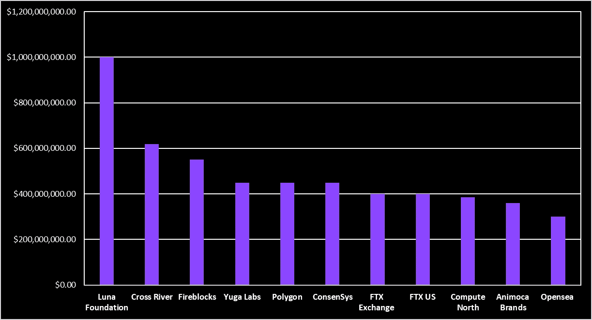
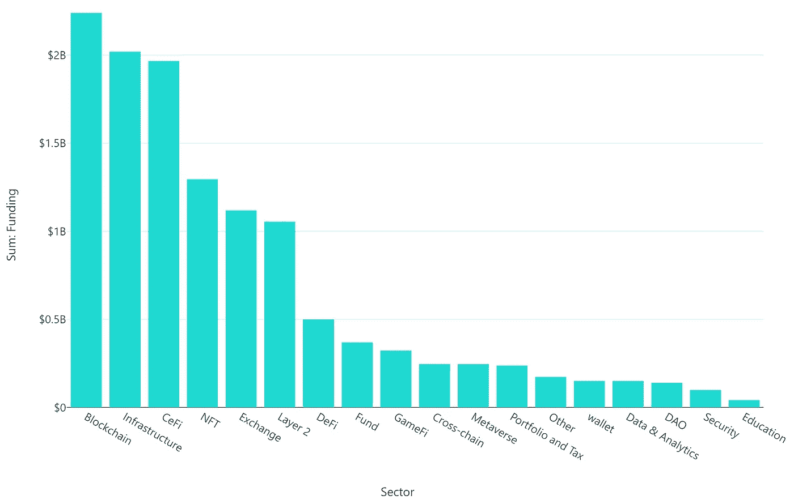
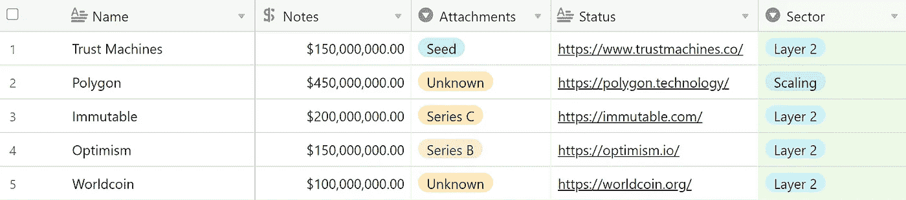
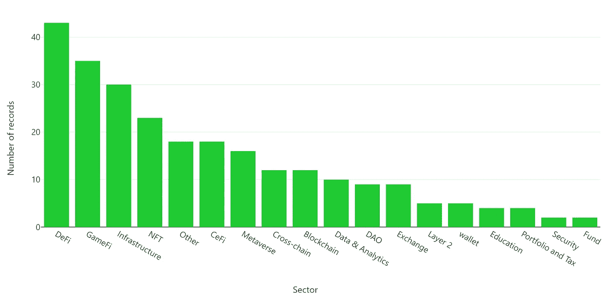

# Q1 风险资本投资分析 22

> 原文：<https://medium.com/coinmonks/analysing-vc-investments-in-q1-22-a6ab714553ee?source=collection_archive---------16----------------------->

## **关键见解**

*   *在 Q1 2022 年奥运会期间，超过 355 轮融资筹集了超过 1 20 亿美元的资金*
*   *大多数投资发生在早期种子期和首轮融资阶段*
*   *36 笔 1 亿美元以上的高价值交易占本季度融资总额的四分之三*
*   *大部分资金流向了区块链领域，其次是基础设施项目——这两个领域的资金流入都超过了 20 亿美元*
*   *尽管 DeFi 和 GameFi 的融资总额有限，但这两个部门在本季度的交易流量最大，这主要是由于大量的早期融资*
*   *总体而言，本季度有超过 300 家不同的风险投资公司参与其中，这些公司既有传统背景，也有秘密背景*

> 在我继续研究之前，请务必查看我们的风险分析网站，以获得最新的交易，并浏览我们 2022 年的整个资金数据库。
> 
> 此外，订阅我们的每周简讯，在您方便的时候收到融资轮次和可操作的 alpha 轮次的每周摘要。

 [## 数据库|风险分析

### 风险分析提供最新的资金数据库

www.ventureanalytics.xyz](https://www.ventureanalytics.xyz/) 

既然我们已经解决了这个问题，让我们继续详细分析 Q1 的风险投资。

# 对 Q1 的资助 22

随着加密市场形势恶化，2022 年第一季度是一个很容易被遗忘的缓慢增长的季度。由于对投降的恐惧和担忧以及股票市场的调整折磨着散户投资者的情绪，这一领域的风险公司就不能这么说了。在所有季度中，Q1 的融资额都是最高的。事实上，仅 Q1 的融资额就占了 2021 年加密初创公司筹集的 250 亿美元资金的近一半。本季度有 300 多家风险投资公司和 100 多家天使投资人投资。

以下是 Q1 所有融资的详细清单:

总体而言，Q1 各行业的加密初创企业共筹集了 125 亿美元。

# 顶级融资轮次

今年，Q1 经历了数轮高调的融资，金额高达数亿美元，其中最大的一轮融资包括:

*   **卢娜基金会卫队——10 亿美元**

受欢迎的 Terra 生态系统的非营利机构 Luna Foundation Guard 通过 OTC 出售 Luna 筹集了创纪录的 10 亿美元，为他们的 UST stablecoin 创建了一个分散的储备。这轮融资由重量级公司 3 Arrows Capital 和 Jump Crypto 共同牵头，筹集的资金用于购买比特币。自这次注资以来，该基金会已公开宣布收购大量比特币。

*   **跨河——6.5 亿美元**

美国银行即服务(BaaS)提供商 Cross River 已经筹集了 6.5 亿美元的融资，由 Eldridge 和 a16z 牵头。这家金融服务机构为多家金融科技和加密公司(如比特币基地)提供加密 onramp、offramp 和贷款服务。该公司的目标是朝着加密优先的战略发展，并在未来增加其符合法规的产品。

*   **消防栓——5.5 亿美元**

Fireblocks 是最大的数字资产托管公司之一，帮助金融机构存储加密货币，在 E 轮融资中筹集了 5.5 亿美元。这轮融资由 D1 资本和 Spark Capital 共同牵头，其估值达到了惊人的 80 亿美元。这轮投资使 Fireblocks 成为迄今为止业内最有价值的数字资产基础设施提供商。

*   **康赛斯公司——4.5 亿美元**

受欢迎的加密货币移动钱包、Metamask 和其他区块链基础设施产品的母公司 ConsenSys 已经筹集了 4.5 亿美元，估值超过 70 亿美元。D 轮由帕拉菲资本领投。web 3 公司是以太坊的联合创始人之一约瑟夫·卢宾的创意。ConsenSys 打算用这一轮的收益将其转换为以太坊，并管理国库。

*   **多边形——4.5 亿美元**

以太坊缩放解决方案 Polygon 通过私下出售其原生 MATIC 令牌，在一轮融资中筹集了 4.5 亿美元。这是 Polygon 自 2017 年成立以来的第一轮重大融资，由红杉资本印度公司牵头，老虎环球、软银和其他许多知名投资者参与。除了活跃的 POS 侧链，该团队还通过收购各种开发项目将其纳入旗下，扩展到乐观和 zk 汇总。核心团队的目标是确保 polygons 在大规模采用方面的领先地位，并投资于零知识积累技术。

*   **宇迦实验室——4.5 亿美元**

广受欢迎的 NFT 系列 Bored Ape 游艇俱乐部(BAYC)的母公司宇迦实验室筹集了 4.5 亿美元的种子资金，估值为 40 亿美元。这轮融资由 a16z 牵头，并创造了种子轮融资金额最高的历史。这一轮种子投资的著名投资者包括 Animoca Brands、阿迪达斯、谷歌风投和三星电子。在种子轮宣布之前，宇迦实验室购买了竞争对手 Cryptopunk 的知识产权，并推出了$APE 令牌。宇迦实验室打算利用这笔资金建立一个位于 NFT 的名为“彼岸”的元宇宙，并将其 APE 令牌整合到系统中。

*   **FTX FTX 交易所——4 亿美元**

广受欢迎的加密交易交易所 FTX 在 D 轮融资中筹集了 4 亿美元，使其估值达到 320 亿美元。软银、新加坡主权财富基金淡马锡控股(Temasek Holdings)和 Paradigm 等公司参与了这轮融资。这是过去 6 个月来的第三轮融资，该交易所在此期间已融资 18 亿美元。此次筹资将支持新产品的引入，并扩大 FTX 的全球影响力。

与 FTX 交易所的 4 亿美元 D 轮融资同时，FTX 美国公司筹集了自 2020 年成立以来的首轮融资。这一轮使美国交易所的估值接近 80 亿美元。日本软银集团(SoftBank Group)、淡马锡控股(Temasek Holdings)、Paradigm 和其他风险投资公司也参与了这轮融资。FTX 美国公司打算利用这次资本注入来更好地定位自己，以与其他交易所竞争，并雇用有才华的个人。

*   **北算-3.85 亿美元**

矿业基础设施公司 Compute North 在股权和债务融资轮中总共筹集了 3.85 亿美元。该公司在其位于美国的数据中心设施内为客户提供采矿设备和分布式计算托管服务。Compute North 打算利用这笔资金在美国各地扩展和开放新的数据中心设施。

*   **Animoca Brands——3.59 亿美元**

广受 NFT 和元宇宙投资者欢迎的 Animoca Brands 筹集了 3.59 亿美元，投资前估值为 50 亿美元。这轮融资由自由城风险投资公司(Liberty City Ventures)牵头，去年 12 月获得了 C 轮融资。该公司还是 150 多家 NFT 和元宇宙公司的积极投资者，包括 Axie Infinity、Opensea 和 Dapper Labs。Animoca Brands 打算继续其战略投资、业务发展和知识产权许可。

*   **Opensea-3 亿美元**

广受欢迎的 NFT 市场 Opensea 已经在由 Paradigm 和 Coatue 共同牵头的 C 轮融资中筹集了 3 亿美元。这轮融资对市场的估值为 133 亿美元，高于去年 7 月 B 轮融资时的 15 亿美元。Opensea 打算将这笔资金用于产品开发、招聘和改善客户支持。

*   **1 亿美元以上的其他融资轮次**

总而言之，超过 1 亿美元的高价值融资约占 Q1 126 亿美元融资总额的 75%。

# **按部门分类的资金**

*   **第一层区块链投资**

来自 Q1 风险投资公司的大部分资金都流向了第一层区块链项目。在过去的两年中，各种具有扩展能力的区块链出现了大量的交易流和价格上涨。

Q1 看到大量已经流行的第 1 层，如月球，氦和米娜。然而，多个相对不知名的区块链进行了融资，有些还是首次。在这个资助名单中，有几个区块链关注隐私，如 Secret Network 和 Aleo。除了这个隐私焦点之外，列表中还包含了几个区块链，他们对共识机制有自己的理解——比如子空间实验室使用能力证明，Humanode 使用唯一性证明和存在性证明的组合。总共有 22 亿美元的资金流向了 Q1 的区块链地区。

Layer 1 Funding Rounds

*   **基础设施**

基础设施项目获得了第二多的资金。Q1 看到大量与开发者平台和工具相关的项目从投资者那里获得了大量资金。开发商发电站炼金术，数据索引器图协议是一些开发基础设施项目获得资金。

Infrastructure Funding Rounds

*   **NFT 的**

非正规金融公司在 Q1 遍地开花，这一领域的风险投资也是如此。除了宇迦实验室的这轮融资，NFT 创业公司朋克金库(Punks Vault)也获得了资金，将 NFTs 用于电影等更多娱乐领域。朋克金库是广受欢迎的 NFT 朋克系列漫画的幕后推手。

不同连锁店的多个 NFT 市场在本季度获得了融资。著名的以太坊 NFT 市场 Opensea、Solana marketplace Magic Eden 和较新的市场如 Hyperspace 和 Burnt Finance 获得了资金。此外，专门的利基 NFT 平台，包括汤姆·布拉迪的名人聚焦亲笔签名，音乐 NFT 市场解封，玩具/收藏品市场 Ucollex，以及亲贸易商聚焦市场模糊，也发现了名单。

NFT Funding Rounds

*   **第二层&缩放解决方案**

第 2 层和扩展解决方案项目也在 Q1 看到了融资名单。除了已经讨论过的 Polygon 之外，使用乐观汇总的第 2 层缩放解决方案乐观获得了大量资助。此外，在以太坊扩展方面，NFT 平台使用 starkware，Immutable，也能够筹集一轮资金。其他第二层投资包括区块链初创公司 Trust Machines，旨在创建一个高于比特币的层，以增强其 web3 功能，以及高于以太坊的第二层 Worldcoin。

*   **DeFi**

Q1 的许多 DeFi 项目获得了早期资助。分散化的交易所、预测市场、贷款和收益率市场只是榜上有名的几个 dapps。总体而言，该部门的资金流入超过 4.9 亿美元。

DeFi Funding Rounds

*   **GameFi**

Q1 已经看到 GameFi 项目筹集的金额大幅上升。这一领域出现了许多游戏工作室，团队成员从传统游戏转型获得资金，其中一些包括数字洞察游戏和新兴游戏。

Ancient8 和 IndiGG 等公会也在本季度获得了融资。对公会和游戏工作室的投资远不及该领域游戏的投资。许多仍在开发中的游戏设法从投资者那里筹集了一轮资金。

GameFi 部门总共获得了 3.23 亿美元的资金。

GameFi Funding Rounds

# 每个类别的投资总额

尽管第 1 层区块链在本季度获得了最多的资金，但每个类别的总投资为我们提供了一幅不同的画面。DeFi 在风投的交易数量中占据主导地位，超过 43 笔交易，紧随其后的是 GameFi 项目。

融资轮次和每个行业的投资数量之间的差异主要是因为某些行业的大多数交易主要是早期阶段和种子轮次。

# Q1 最活跃的风险投资公司

*   **Animoca Brands (70 项投资)**

Animoca Brands 已成为最活跃的风险投资公司，仅在 Q1 就投资了 70 家公司。此外，这家专注于游戏和 NFT 的公司几乎投资了 2021 年全年投资的所有公司。在这 70 笔投资中，该公司已成为 33 轮的领投方。其一些比较重大的投资包括以太坊缩放解决方案、[T3、多边形](https://polygon.technology/)；无聊猿背后的公司， [**宇迦实验室**](https://yuga.com/)**；**元宇宙建设者，[**every realm**](https://everyrealm.com/)；数字资产公司，[**Hex Trust**](https://www.hextrust.com/)；还有索拉纳[NFT，**变构**。](https://www.metaplex.com/)

*   **比特币基地风险投资公司(44 项投资)**

比特币基地交易所著名的风险投资机构比特币基地风险投资公司投资了 44 家加密领域的公司。这使得 Q1 22 成为该风险公司最高的交易流量，超过了 2021 年第四季度 32 笔投资的纪录。来自比特币基地风险投资公司的著名投资包括 omnichain protocol、 [**Layerzero**](https://www.layerzero.com/) 实验室；第一层区块链，[**Aptos**](https://aptoslabs.com/)；数字资产公司， [**琥珀集团**](https://www.ambergroup.io/)；中东密码交易所， [**雨**](https://www.rain.bh/)；还有流行的投资组合跟踪者，**。**

*   ****阿拉米达研究公司(34 项投资)****

**加密领域最大的量化交易公司之一 Alameda Research，由 Sam Bankman-Fried 创办，在 Q1 投资了 34 家公司。该公司的一些重大投资包括 NFT 第二层解决方案、**；第 1 层区块链， [**附近协议**](https://near.org/)；数字资产平台， [**Seba 银行**](https://www.seba.swiss/)；还有以太坊缩放解决方案， [**多边形**](https://polygon.technology/) 。****

> ****不要忘记订阅我们的风险分析时事通讯，否则就有机会错过最被低估的融资周阿尔法！****

**** [## 风险邮报

### 分析风险投资并为加密领域的投资者提供可操作的 Alpha 的每周时事通讯。

venturepost.ghost.io](https://venturepost.ghost.io/) 

*免责声明:研究文章中提供的任何信息都不构成投资建议。在投资本文讨论的任何项目之前，请做好自己的研究。*

> 加入 Coinmonks [电报频道](https://t.me/coincodecap)和 [Youtube 频道](https://www.youtube.com/c/coinmonks/videos)了解加密交易和投资

# 另外，阅读

*   [7 大副本交易平台](https://coincodecap.com/copy-trading-platforms) | [买币点评](https://coincodecap.com/buycoins-review)
*   [MyConstant 点评](https://coincodecap.com/myconstant-review) | [8 款最佳摇摆交易机器人](https://coincodecap.com/best-swing-trading-bots)
*   [Godex.io 审核](/coinmonks/godex-io-review-7366086519fb) | [邀请审核](/coinmonks/invity-review-70f3030c0502) | [BitForex 审核](https://coincodecap.com/bitforex-review)
*   [10 本关于加密的最佳书籍](https://coincodecap.com/best-crypto-books) | [英国 5 个最佳加密机器人](https://coincodecap.com/uk-trading-bots)
*   [ko only 回顾](https://coincodecap.com/koinly-review) | [Binaryx 回顾](https://coincodecap.com/binaryx-review)|[Hodlnaut vs CakeDefi](https://coincodecap.com/hodlnaut-vs-cakedefi-vs-celsius)****