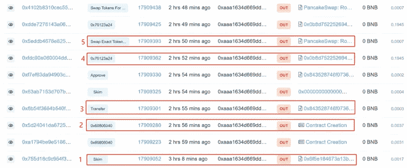
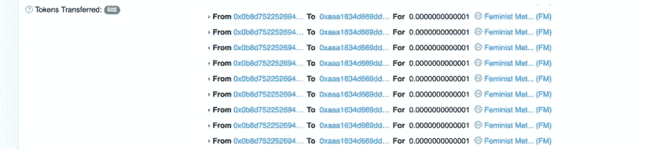
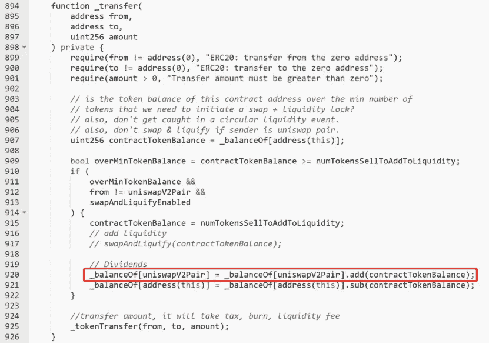
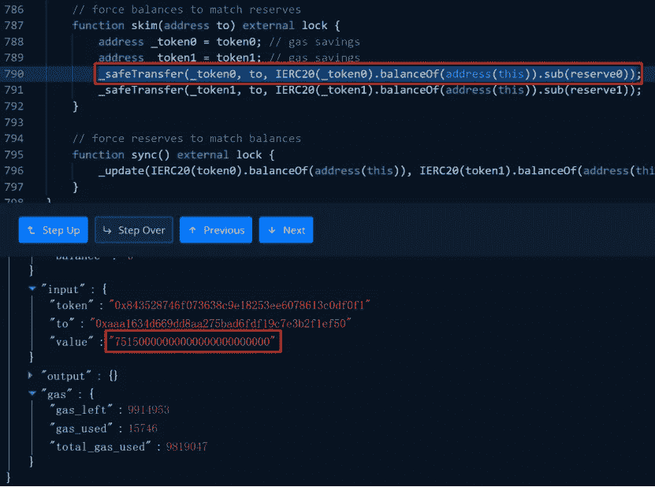
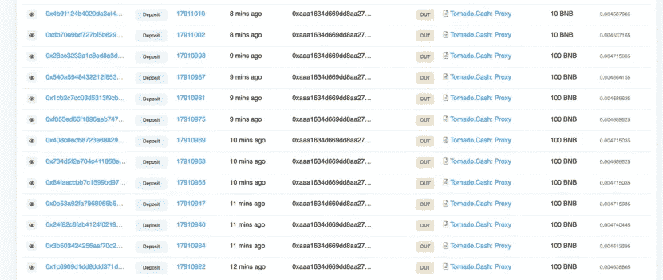

# 对女权主义者元宇宙的攻击分析

> 原文：<https://medium.com/coinmonks/analysis-of-attack-on-feminist-metaverse-77e3e25d5963?source=collection_archive---------7----------------------->

2022 年 5 月 18 日，据 Beosin-Alert 报道，女权主义者元宇宙的 FmToken 合同被剥削约 1838 BNB(约 54 万美元)。Beosin 安全团队分析了该事件，结果如下所示。

女权元宇宙是 BSC 链上的一个 Dao 项目.官方网站:[*https://feministmetaverse.org/*](https://feministmetaverse.org/)

**相关信息**

**交易哈希:**

0 xfdc 90 e 060004 DD 902204673831 DCE 466 DCF 7 e 8519 a 79 CCF 76 b 90 CD 6 C1 c8 b 320d

**黑客的地址**

0 xaaa 1634d 669 DD 8 aa 275 bad 6 fdf 19 c 7 E3 B2 f1 ef 50

**发起黑客攻击的合同**

0x0b 8d 752252694623766 DFB 161 e 1944 f 233 BC a10 f

**受害人合同**

0x 843528746 f 073638 c9e 18253 ee 6078613 c 0 df 0f 1

**开采流程**

1.攻击者地址通过 SakeSwapPair 契约的 skim 函数直接接收未记入流动性池的 FM_Token，大概也在这一点上意识到了 FM_Token 契约中的漏洞。

2.部署攻击契约，用于加速 FM_Token 的提取。

3.转移 10 个 FM_Tokens 到攻击契约，为后续攻击做准备。

4.调用攻击契约，循环传递 FM_Token 到攻击者的地址，触发 FM_Token 契约传递 FM_Token 令牌到 SakeSwapPair 的操作，最后通过 skim 函数提取到攻击者的地址，具体如下。

4.1 使用创建的攻击契约 0x0B8d…a10F 多次向自己的地址转移少量 FM 令牌。

4.2 由于 FM_Token 合同余额已经达到用于转移到 SakeSwapPair 的标准 150，000 token，所以每次转移触发行 920 以增加 FM token 到 SakeSwapPair 的余额。因此，sakeSwapPair 在代币余额和储备之间存在差异。

4.3 然后攻击者调用 SakeSwapPair 中的 skim()函数，将令牌余额的差额提取到自己的地址。

5.使用 pancakeswap 将 FM 令牌交换为 BNB

6.重复步骤 4 和 5，并将结果 1838 BNBs 转移到 Tornado.cash

# 弱点分析

这种攻击主要利用了这样一个事实，即余额被直接添加到 Pair，而不是写入 Pair 的分类帐。攻击者通过多次转账将 FmToken 契约地址持有的币转移到 Pair 契约中，在这个过程中转移的币并没有记录在 Pair 自己的账本中。由于 Pair 契约并没有将收到的代币同步到 reserve，攻击者直接通过 skim 将相应的硬币转移到自己的账户，然后出售获利。

# 资金追踪

截至目前，被盗资金已转入 Tornado.cash。

# **总结**

针对这一事件，Beosin 安全团队建议:

1.  不要直接转移到结对合同。
2.  在访问非标准令牌进行配对时，应充分考虑令牌定制功能对配对契约可能产生的影响。
3.  项目上线前，一定要选择专业的安全审计公司进行全面的安全审计。

# 更大的

[***1。LUNA 崩溃和 DeFi“出逃”后对 Web3 有什么影响？***](/coinmonks/what-is-the-impact-on-web3-after-lunas-crash-and-defi-fled-b80334e00aba)

[***2。在 Web 3.0 热潮下，如何保证 NFT 的安全？***](/@Beosin_com/how-to-ensure-the-security-of-nft-under-the-web-3-0-boom-beosin-vaas-has-provided-with-a-solution-50697ccd4f56)

[***3。DEUS Finance 遭遇今年第二次闪贷攻击:Beosin 详细分析***](/@Beosin_com/deus-finance-suffered-its-second-flashloan-attack-this-year-beosins-detailed-analysis-5032be0ec4f2)

[**4。Beosin 已完成加密乐高算法**](/@Beosin_com/beosin-has-completed-security-audit-service-of-crypto-lego-alg-no-critical-high-or-medium-risk-b656849e9334) 的安全审计服务

[***5。LUNA 崩溃和 DeFi“出逃”后对 Web3 有什么影响？***](/coinmonks/what-is-the-impact-on-web3-after-lunas-crash-and-defi-fled-b80334e00aba)

[***6。「重述」AMA 关于如何在使用 Beosin VaaS***](/@Beosin_com/recap-ama-about-how-to-keep-your-smart-contract-secure-during-development-with-beosin-vaas-f7ecd2dc27a) 进行开发期间保护您的智能合约的安全

# 接触

如果您需要任何区块链安全服务，请联系我们:

[**网站**](https://beosin.com/) [**邮箱**](http://contact@beosin.com/) [**官方推特**](https://twitter.com/Beosin_com) [**预警**](https://twitter.com/BeosinAlert) [**电报**](https://t.me/beosin)**[**LinkedIn**](https://www.linkedin.com/company/beosin)**

> **加入 Coinmonks [电报频道](https://t.me/coincodecap)和 [Youtube 频道](https://www.youtube.com/c/coinmonks/videos)了解加密交易和投资**

# **另外，阅读**

*   **[Bookmap 评论](https://coincodecap.com/bookmap-review-2021-best-trading-software) | [美国 5 大最佳加密交易所](https://coincodecap.com/crypto-exchange-usa)**
*   **最佳加密[硬件钱包](/coinmonks/hardware-wallets-dfa1211730c6) | [Bitbns 评论](/coinmonks/bitbns-review-38256a07e161)**
*   **[新加坡十大最佳加密交易所](https://coincodecap.com/crypto-exchange-in-singapore) | [购买 AXS](https://coincodecap.com/buy-axs-token)**
*   **[红狗赌场评论](https://coincodecap.com/red-dog-casino-review) | [Swyftx 评论](https://coincodecap.com/swyftx-review) | [CoinGate 评论](https://coincodecap.com/coingate-review)**
*   **[投资印度的最佳密码](https://coincodecap.com/best-crypto-to-invest-in-india-in-2021)|[WazirX P2P](https://coincodecap.com/wazirx-p2p)|[Hi Dollar Review](https://coincodecap.com/hi-dollar-review)**
*   **[加拿大最好的加密交易机器人](https://coincodecap.com/5-best-crypto-trading-bots-in-canada) | [库币评论](https://coincodecap.com/kucoin-review)**