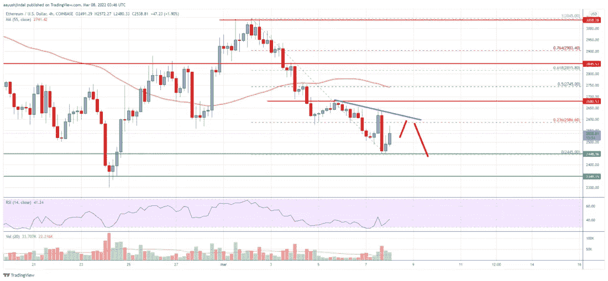

# 以太坊价格分析:以太坊在$3K 以下挣扎

> 原文：<https://medium.com/coinmonks/analysis-of-the-ethereum-price-eth-struggles-below-3k-e1ed6d98a727?source=collection_archive---------82----------------------->

Source photo Unsplash.com

以太坊的价格开始了新的下跌，从 3000 多美元一美元。ETH 的价格现在低于 2800 美元和 55 天简单移动平均线(4 小时)。
4 小时图上，在 2590 美元附近形成一根强劲的阴线趋势线，阻力。(数据来自比特币基地)。
如果该货币对未能保持在 2445 美元支撑位上方，可能会继续下跌。
的价格…