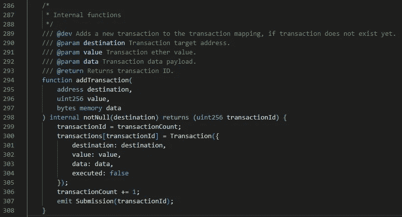
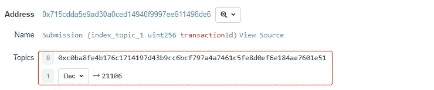
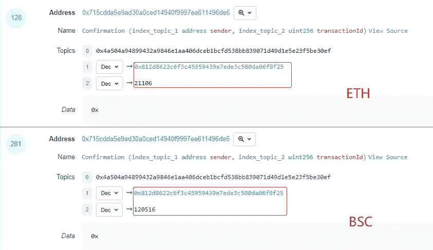
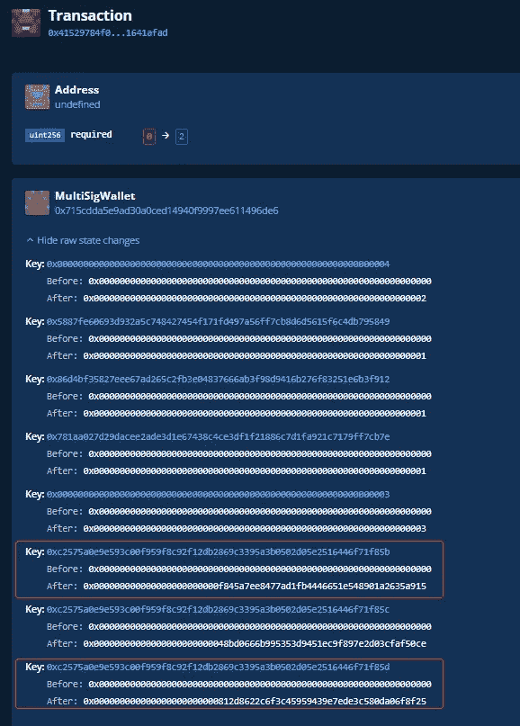
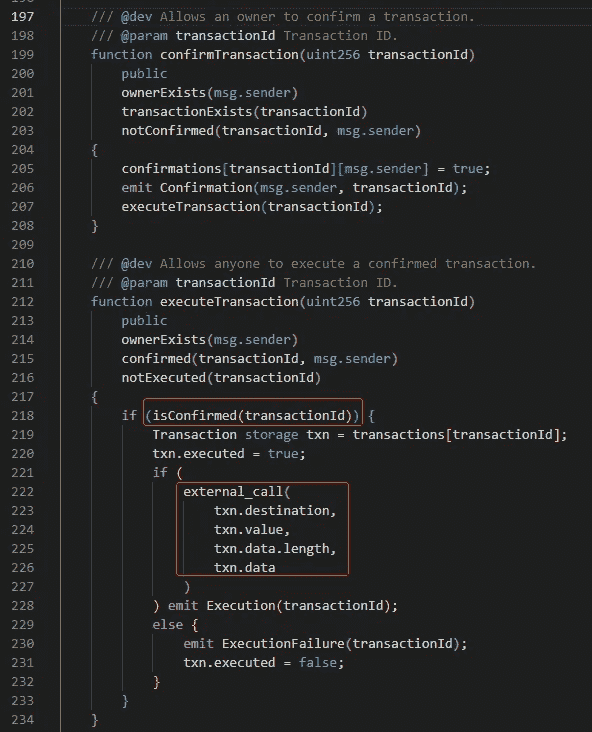
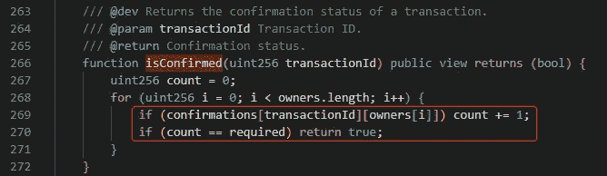
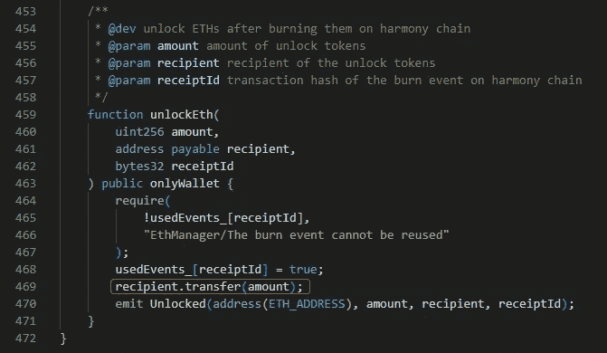
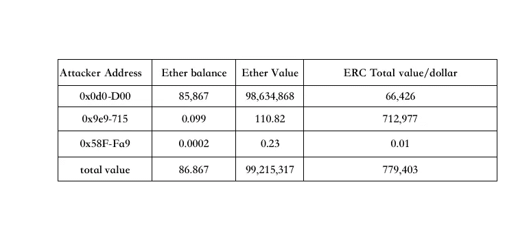

# 和谐天价损失分析

> 原文：<https://medium.com/coinmonks/analysis-of-the-harmony-astronomical-price-loss-b0d18864f29?source=collection_archive---------23----------------------->

**0x01 事件背景**

2022 年 6 月 24 日，以太坊与和谐之间由 Layer1 公链 Harmony 开发的资产跨链桥 Horizon 遭到攻击，损失约 1 亿美元。

**0x02 攻击者信息**

**攻击者钱包**

0x0d 043128146654 c 7683 fbf 30 AC 98d 7 b 2285 ded 00

0x 9 e 91 AE 672 e 7 f 7330 fc 6b 9 Bab 9 c 259 BD 94 CD 08715

0x 58 F4 baccb 411 acef 70 a5 F6 DD 174 af 7854 fc 48 fa 9

**MultiSigWallet**

0x 715 cdda 5 e 9 ad 30a ced 14940 f 9997 ee 611496 de 6

**艾思曼纳格**

0 xf 9 fb1 c 508 ff 49 f 78 b 60d 3 a 96 de a99 fa 5d 7 F3 A8 a 6

**0x03 攻击分析**

攻击者获得 13，100 ETH 和 5，000 BNB 的契约调用过程是相同的。本文主要分析这两种交易。
这两笔交易是

[https://ethers can . io/tx/0x 27981 c 7289 c 372 e 601 c 9475 e5b 5466310 be 18 ed 10 b 59 D1 AC 840145 f 6e 7804 c 97](https://etherscan.io/tx/0x27981c7289c372e601c9475e5b5466310be18ed10b59d1ac840145f6e7804c97)

[https://bscscan . com/tx/0xa 72 c 7262340 c 25 b 9258 b 33 dcad 089 CB 3473 ed 048 D1 f 808 f 436 a 96 b 8 ed 577 CD 1](https://bscscan.com/tx/0xa72c7262340c25b9258b33dcad089cb3473ed048d1f808f436a96b8ed577cdb1)

上述交易流程如下:

第一步

地址 0 xf 845 a7ee 8477 ad 1 FB 4446651 e 548901 a 2635 a 915 调用 MultiSigWallet 组合系统中的 **addTransaction** 方法，向事务映射添加新事务。

第二步

**0x 812d 8622 c6f 3c 45959439 e 7 ede 3c 580 da 06 F8 f 25**地址调用 MultiSigWallet 契约中的 **confirmTransaction** 方法传入映射的交易 id。

注意: **confirmTransaction** 只能由钱包管理员调用。通过分析，管理员是部署合同时已经确定的管理员地址。按如下方式部署合同事务:

很明显，以上两个步骤是管理员调用的。

第三步:

第二步，方法内部最终调用 **executeTransaction** 方法，然后调用 **isConfirmed** 方法进行判断。

**isConfirmed** 方法根据该值决定事件是否通过，需要两个管理员成功执行。

在方法内部调用**ETH manager**contract**unlocket**方法，最终将 ETH/BNB 资金发送到攻击者的钱包。

**0x05 资金流向**

令牌信息被 ETH 链中的攻击者窃取:

13100 乙醚

4120 万 USDC

WBTC 街 592 号

998.1 万 USDT

607 万戴

553 万 BUSD

8462 万 AAG

11 万 FXS

415，000 个寿司

990 号

43 WETH

562 万 FRAX

攻击者通过一系列交换交易将获得的一部分 Erc20 令牌转换成以太网

BSC 链中攻击者窃取的令牌信息:

5000 BNB 64 万 BUSD

攻击者通过这两个连锁店总共获利 1 亿美元。

**0x06 摘要**

从上面的攻击来看，攻击方法是在多重签名契约中控制钱包的私钥。由于资金的转移只需要两个地址的同意，当攻击者控制了这两个地址的钱包私钥时，攻击者的转移就在跨链中被批准了。资金交易会导致资金被盗。

建议转账时增加多签名地址的数量，避免通过控制少量地址的私钥进行转账；

建议安全存储多签名地址的私钥，避免将私钥存储在云端或易受攻击的服务器上**。**

> 加入 Coinmonks [电报频道](https://t.me/coincodecap)和 [Youtube 频道](https://www.youtube.com/c/coinmonks/videos)了解加密交易和投资

# 另外，阅读

*   [Bookmap 评论](https://coincodecap.com/bookmap-review-2021-best-trading-software) | [美国 5 大最佳加密交易所](https://coincodecap.com/crypto-exchange-usa)
*   [如何在 FTX 交易所交易期货](https://coincodecap.com/ftx-futures-trading) | [OKEx vs 币安](https://coincodecap.com/okex-vs-binance)
*   [CoinLoan 评论](https://coincodecap.com/coinloan-review) | [YouHodler 评论](/coinmonks/youhodler-4-easy-ways-to-make-money-98969b9689f2) | [BlockFi 评论](https://coincodecap.com/blockfi-review)
*   [XT.COM 评论](https://coincodecap.com/profittradingapp-for-binance)币安评论 |
*   [SmithBot 评论](https://coincodecap.com/smithbot-review) | [4 款最佳免费开源交易机器人](https://coincodecap.com/free-open-source-trading-bots)
*   [比特币基地僵尸程序](/coinmonks/coinbase-bots-ac6359e897f3) | [AscendEX 审查](/coinmonks/ascendex-review-53e829cf75fa) | [OKEx 交易僵尸程序](/coinmonks/okex-trading-bots-234920f61e60)