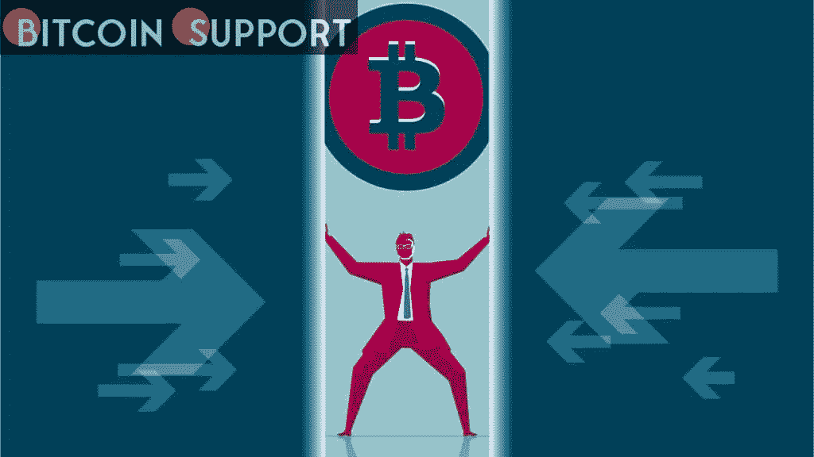
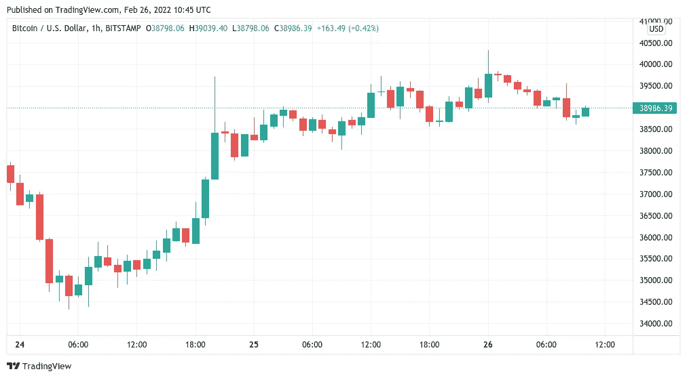
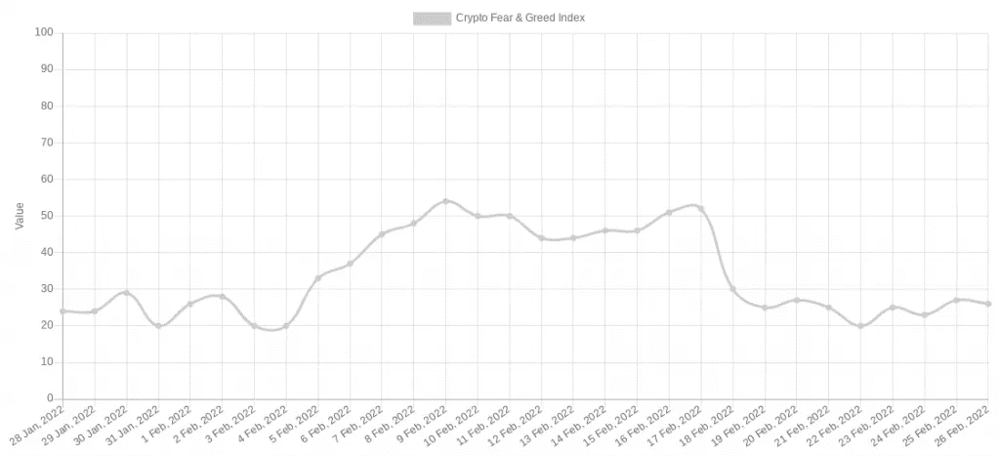
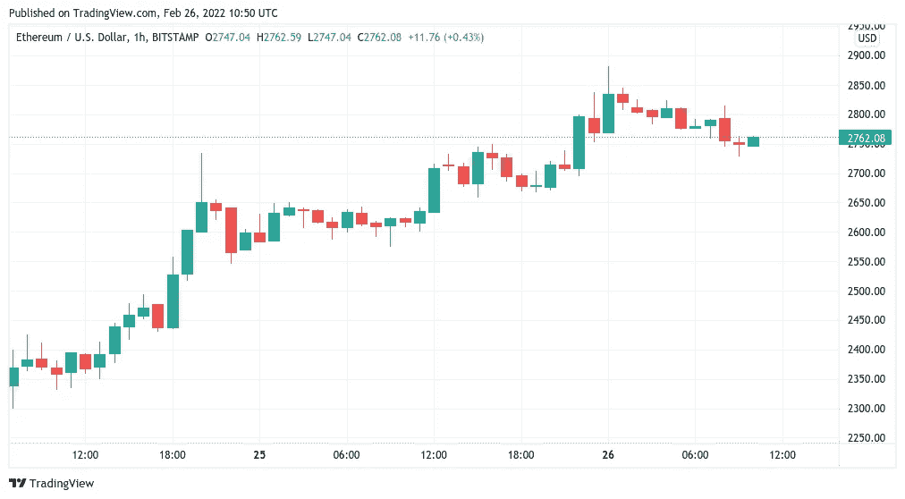

# 分析师预计比特币在 4 万美元的峰值后将出现每周更高的低点

> 原文：<https://medium.com/coinmonks/analysts-expect-a-weekly-higher-low-for-bitcoin-after-a-40k-spike-42df24efb9ec?source=collection_archive---------48----------------------->

**Visit our website:-** [**https://bitcoinsupports.com/**](https://bitcoinsupports.com/)

尽管本周地缘政治动荡，比特币价格活动仍在遵循剧本。2 月 26 日，比特币(BTC)以大约 39000 美元的价格开始了一个紧张的周末，此前一夜之间，价格短暂回到 40000 美元。

**Visit our website:-** [**https://bitcoinsupports.com/**](https://bitcoinsupports.com/)

**股市在上涨，但对加密货币的“恐惧”却无处不在。在 Bitstamp 经历了 40，330 美元的隔夜波动高点后，TradingView 的数据显示 BTC/美元周六的情况更加平静。

由于加密市场周末交易量较低，随着常规市场关闭,“伪造”波动的可能性增加。围绕乌克兰及其占领国俄罗斯的地缘政治动荡提供了一个日益谨慎的背景，人们尤其担心周一可能会带来进一步的波动。

当一周接近尾声时，隐藏的恐惧&贪婪指数停留在 26/100 的低“恐惧”区。**

**Visit our website:-** [**https://bitcoinsupports.com/**](https://bitcoinsupports.com/)

与此同时，周线图为比特币多头提供了潜在的一线希望。BTC 设法创下比 1 月份 32，800 美元更高的低点，最近因入侵乌克兰创下 34，300 美元的低点。交易员兼分析师 Rekt Capital 认为，如果这种说法成立，那么 2 月份从 45500 美元的下跌极有可能是一次“必要的”盘整行动。

[https://twitter.com/rektcapital/status/1497222581786759175](https://twitter.com/rektcapital/status/1497222581786759175)

与此同时，宏观市场本周以高位收盘，欧洲和美国指数均大幅上涨。

因紧张局势爆发而升值的美元已经放弃了大部分涨幅，美元货币指数(DXY)从 97.7 的高点跌至 96.5。

月神是 10 大 altcoins 中最有价值的。Altcoins 呈现了一个多变但依然正面的形象。周六，主要标志在一周内上涨了约 50%，以 Terra (LUNA)为最高。随着比特币价格的下跌，一些后期涨幅仍然可见，比如 XRP，在本文撰写前的 24 小时内上涨了 10.3%。在一夜之间试图突破 2900 美元后，市值最大的替代货币 ETH 在日涨幅 5.6%的基础上飙升至 2750 美元以上。

**访问我们的网站:-**[**https://bitcoinsupports.com/**](https://bitcoinsupports.com/)

**免责声明:以上为作者观点，不应视为投资建议。读者应该自己做研究。**

> 加入 Coinmonks [电报频道](https://t.me/coincodecap)和 [Youtube 频道](https://www.youtube.com/c/coinmonks/videos)了解加密交易和投资

# 另外，阅读

*   【Crypto.com 评论】|[【T4 评论】](/coinmonks/crypto-com-review-f143dca1f74c)
*   [如何在加拿大购买加密货币？](https://coincodecap.com/how-to-buy-cryptocurrency-in-canada)
*   [无聊猿游艇俱乐部(BAYC)评论](https://coincodecap.com/bored-ape-yacht-club-bayc-review)
*   [5 款最佳加密交易终端](https://coincodecap.com/crypto-trading-terminals) | [最佳 DeFi 应用](https://coincodecap.com/best-defi-apps)
*   [最佳网上赌场](https://coincodecap.com/best-online-casinos) | [币安评论](/coinmonks/binance-review-ee10d3bf3b6e) | [BitMEX 评论](https://coincodecap.com/bitmex-review)
*   [麻雀交换评论](https://coincodecap.com/sparrow-exchange-review) | [纳什交换评论](https://coincodecap.com/nash-exchange-review)
*   [美国最佳加密交易机器人](https://coincodecap.com/crypto-trading-bots-in-the-us) | [经常性回顾](https://coincodecap.com/changelly-review)
*   [在印度利用加密套利赚取被动收入](https://coincodecap.com/crypto-arbitrage-in-india)