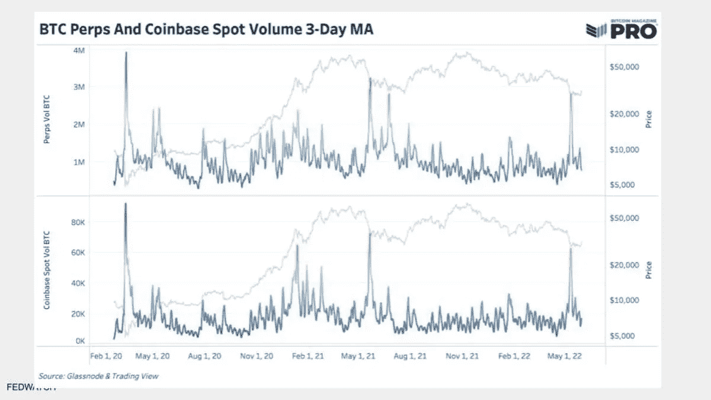
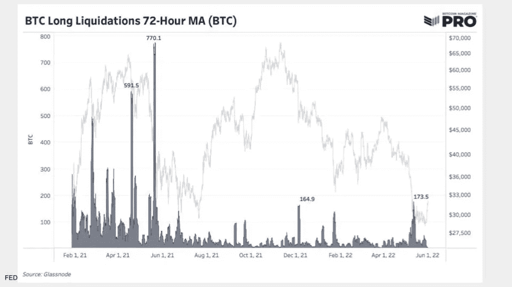
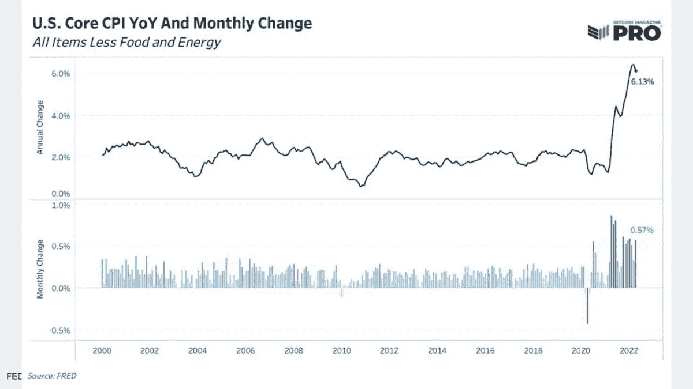
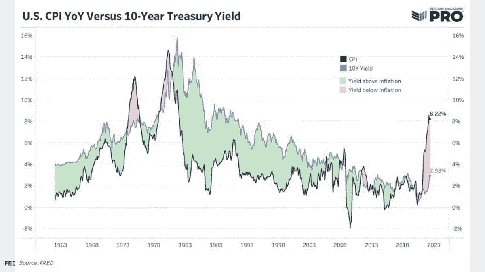
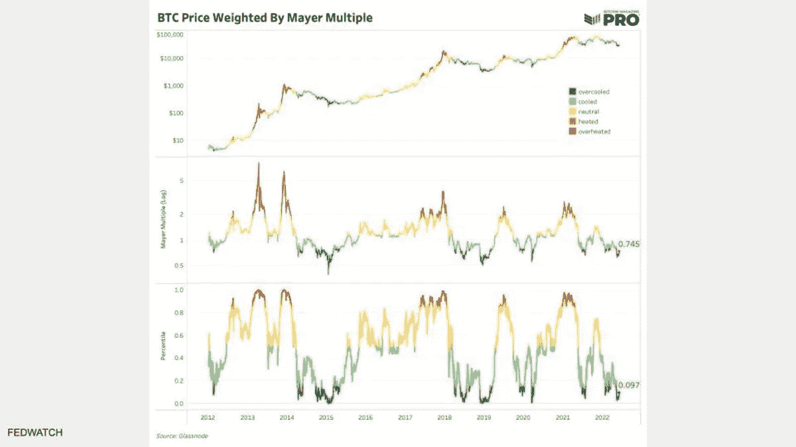
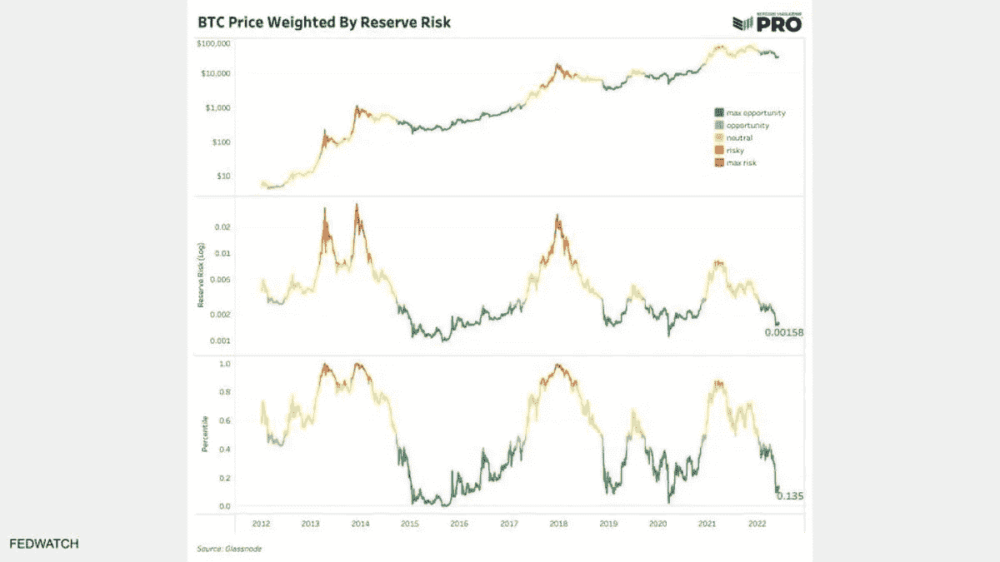
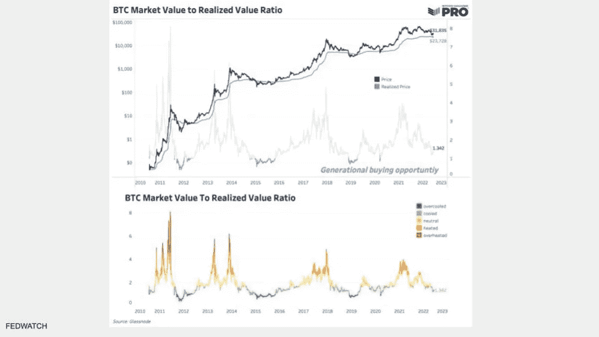

# 分析当前的比特币市场周期

> 原文：<https://medium.com/coinmonks/analyzing-the-current-bitcoin-market-cycle-baeb04569317?source=collection_archive---------59----------------------->

查看不同的指标可以帮助确定比特币在传统市场周期中的位置，以及宏观经济如何影响比特币价格。

[在 YouTube 上看这一集](https://youtu.be/zHJzeN0vgP8?t=7138)或者[隆隆](https://rumble.com/v17mqk9-bitcoin-and-the-american-experiment.html)

**听这一集:**

*   苹果
*   [Spotify](https://open.spotify.com/episode/06GcliehB8tKLu2fgozCrX?si=62c8aca8b1a84779)
*   [谷歌](https://podcasts.google.com/feed/aHR0cHM6Ly9mZWR3YXRjaC5saWJzeW4uY29tL3Jzcw/episode/YWIzNzU1NDktMTMyNS00YTFlLWIzOWMtZTVkOWQxNzUyNmFm?sa=X&ved=0CAUQkfYCahgKEwiAtITv6J_4AhUAAAAAHQAAAAAQlAE)
*   [Libsyn](https://fedwatch.libsyn.com/bitcoin-pro-w-dylan-leclair-fed-96)
*   [阴天](https://overcast.fm/+m2acXYN9I)

在本期“美联储观察”播客中，我和克里斯蒂安采访了比特币杂志 Pro*的市场研究主管迪伦·勒克莱尔。每周，他和 Sam Rule 几乎每天都为用户写更新，每月发布一次大型比特币市场报告。*比特币杂志 Pro 的*“[2022 年 5 月报道](https://bmpro.substack.com/p/bitcoin-magazine-pro-may-monthly)”是我们今天这一集报道的大部分内容。*

*你可以在这里找到我们为这一集[使用的幻灯片，或者你可以在这篇文章的结尾看到所有的图表。](https://docs.google.com/presentation/d/10dBmfTpkSGxzHKWFSFeS7kdAlCGlZdaErNtIC_PBmQk/edit?usp=sharing)*

*“美联储观察”是比特币创造者的宏观播客。每集，我们讨论当前全球宏观事件，重点是中央银行和货币问题。*

# *市场周期*

*在我们进入勒克莱尔带来的令人敬畏的图表之前，我想知道他认为比特币在市场周期中处于什么位置。我有点开玩笑地问，我们是否处于熊市，因为我们肯定没有处于典型的 80-90%的下跌。*

*勒克莱尔回应说，我们正处于一个经典的熊市，而不一定是经典的比特币熊市。他指出，这个周期的上升没有我们之前在比特币中看到的典型的抛物线型顶部，以及在 20，000 美元左右到 30，000 美元之间有更多的技术和基本面支持，所以下降压力也可能有限。勒克莱尔还补充说，平均用户成本基础受到灯芯触及最近的低点。总的来说，在当前价格下有重要的支撑，是否有足够的空头动能来打破新低还有待观察。*

*最后，在市场周期的时机问题上，勒克莱尔指出了一个非常不受重视的市场发展:交易所的抵押品类型大多从以前的比特币转变为现在的稳定比特币，如泰瑟(USDT)和 USDC。换句话说，交易所的主导交易对和现金存款已经从比特币变成了稳定币。在过去，任何替代硬币最重要的交易对手是 BTC，现在已经变成了 USDT 这样的稳定硬币。这是市场动态的一个重大转变，可能会导致比特币价格更加稳定，因为在高度投机的 shitcoin 泡沫中，将有更少的比特币被迫清算。*

# *比特币杂志职业排行榜*

> **“这是作为美国主要交易所的比特币基地现货交易量，以及一系列不同衍生品交易所的永久期货交易量。我们能看到的是各种音量峰值。从历史上看，当比特币交易量达到这一规模时，它预示着某种市场顶部或底部，市场结构的一些重大变化。”—迪伦·勒克莱尔**

**

**Bitcoin perpetual futures and Coinbase spot volume**

*下一张图表显示了由于稳定的收入而导致的市场结构的差异。勒克莱尔表示，在 2021 年夏季抛售前后，70%的衍生品市场仍由比特币担保。今天，它比那要小得多。因此，我们应该预计当 shitcoin 泡沫破裂时，比特币的清算会减少，这正是我们所看到的。*

**

**Bitcoin long liquidations are shrinking due to stablecoin collateralization**

*《T4》*比特币杂志 Pro* 时事通讯的伟大之处在于，它们不仅关注比特币市场，还关注宏观如何影响比特币。接下来的两张图表是关于 CPI 和利率的。勒克莱尔在播客中很好地分解了这些。*

**

**Cunsumer price index year-over-year and the monthly change**

**

**Cunsumer price index year-over-year versus the 10-year Treasury yield**

*我询问勒克莱尔对美联储货币政策的看法，他的分析主要围绕实际利率。他说，为了减轻巨大的全球债务负担，实际利率将不得不保持为负。因此，如果美联储加息至 3.5%，为了让实际利率保持负值，CPI 将不得不保持在 3.5%以上。*

*接下来是 CK 最喜欢的指标，Mayer 倍数，或 200 天移动平均价格除以当前价格。当价格低于 200 天移动平均线时，这个比率低于 1，这在历史上是一个很好的市场时机。*

**

**Bitcoin price weighted by Mayer Multiple**

*接下来是比特币杂志 Pro 上最密集的信息图表之一，那就是储备风险。*

*"准备金风险图基本上是用价格来衡量霍德勒信念的强弱."*

**

**Bitcoin price weighted by reserve risk**

*我们今天的最后一个图表是实现价格，这是勒克莱尔的最爱。这是去除比特币价格的大部分噪音和波动并专注于趋势的一个好方法。*

> **“这个网络透明的一个很酷的事情是，我们可以看到每一枚比特币何时移动过，或何时被开采过。我们还可以[给每个 UTXO 分配一个上次移动时的价格]来得到我们所说的实现价格。[……]我们可以看到平均每个人在水下的时间。”—勒克莱尔**

**

**Bitcoin realized value ratio**

# *参议员卢米斯的比特币监管*

*在节目的最后，我们结束了对最近由参议员 Lummis 提出的[立法草案](https://www.lummis.senate.gov/wp-content/uploads/Lummis-Gillibrand-Responsible-Financial-Innovation-Act-Final.pdf)的讨论，该草案概述了比特币和该法案所称的“数字资产”的新框架事实上，他们在草案中根本没有使用比特币、以太坊、区块链甚至加密货币等术语。*

*可以说，我们梳理了一些来自 LeClair 的观点，并与 livestream 的工作人员进行了反复讨论，但你必须倾听才能获得整个有见地的讨论！我们深入研究对比特币市场、交易所和未来比特币现货 ETF 的影响！*

*这周就这样了。感谢读者和听众。如果你喜欢这个内容，请订阅，审查和分享！*

*这是安塞尔·林德纳的客座博文。所表达的观点完全是他们自己的，不一定反映 BTC 公司或比特币杂志的观点。*

**原载于 2022 年 6 月 10 日 https://bitcoinmagazine.com***。***

> **交易新手？试试[加密交易机器人](/coinmonks/crypto-trading-bot-c2ffce8acb2a)或者[复制交易](/coinmonks/top-10-crypto-copy-trading-platforms-for-beginners-d0c37c7d698c)**