# 分析 Tornado 现金交易

> 原文：<https://medium.com/coinmonks/analyzing-tornado-cash-transactions-3d8d6b9731fb?source=collection_archive---------1----------------------->

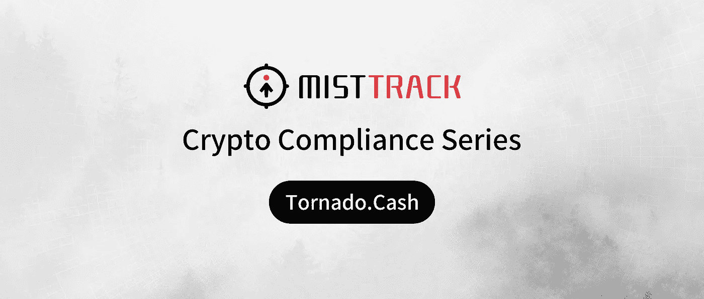

我们最近出版了[On-Chain Tracking:Peel Chain](https://slowmist.medium.com/crypto-compliance-series-what-is-peel-chain-7b5be0bb7214)，这是一个关于检测加密洗钱技术的系列。由于压倒性的需求，我们决定在 Tornado.Cash 上发表一篇如何识别被盗资金的文章。

# 什么是龙卷风现金

龙卷风。Cash 是一种完全去中心化的非托管协议，它通过断开发送方和接收方地址之间的链上链接来提高交易隐私。为了提高隐私，龙卷风。Cash 使用智能合约，从一个地址接受 ETH 和其他代币，并允许它们提取到不同的地址。这些智能合约充当一个池，将所有存放的资产混合在一起，并生成一个私钥，证明您执行了存放操作。然后，发送者可以使用这个私钥在他们选择的时间将存入的资金提取到任何地址。

龙卷风。由于加密事件的增加，现金越来越受欢迎。对于许多黑客来说，这里通常是存放他们被盗资金的必去之地。在我们以前的文章中，我们讨论了如何根据交易行为识别被盗资金。今天，我们将看看另一个事件，我们如何利用交易行为识别被盗资金。

# 个案分析

让我们从分析以前的事件开始，但是由于客户保密，我们不能透露是哪个项目。黑客能够从以太坊、币安智能链和多边形网络提取资金，然后最终将其存入 Tornado.Cash

黑客地址:(为防止受害者身份，我们将地址缩写)
0x489…1F4(以太坊/BSC/多边形)
0x24f…bB1(BSC)

## 以太坊

使用 SlowMist 反洗钱系统[**mistrack**](https://misttrack.io/)，我们创建了被盗资金的大致轮廓。

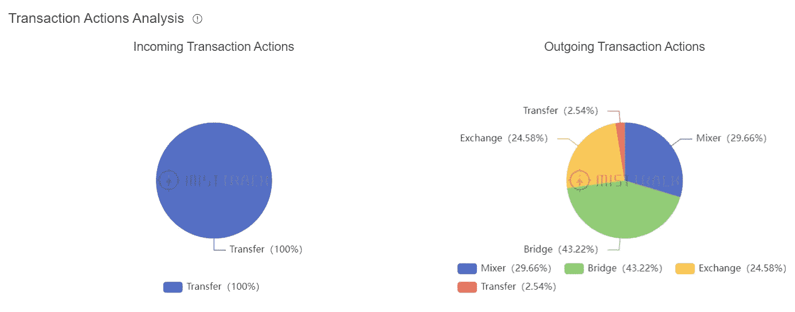

从上面的图表中，我们可以确定大部分的资金被转移或存入混合器。这是帮助我们识别黑客模式的一个关键因素。

随后，我们对资金和交易行为进行了深入分析。根据 MistTrack，大约 2450 ETH 首先沉积在龙卷风中。10 ETH 的 5 次单独交易和 100 ETH 的 24 次单独交易中的现金。另一个 198 Eth 被直接发送到 FixedFloat 以交换到其他密码中。

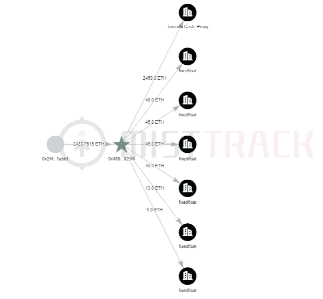

我们的调查在资金存入后就开始了。我们首先关注所有涉及 100 次 ETH 取款的交易。由于仍然有大量的取款，我们决定将搜索进一步限制在特定的时间范围内。

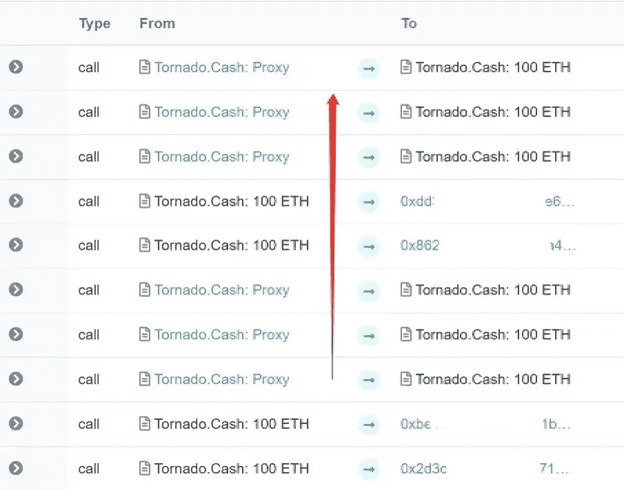

我们决定重点关注前十笔 100 ETH 取款及其交易。在 MistTrack 的帮助下，没多久我们就发现了一个带有一些红旗的取款点。

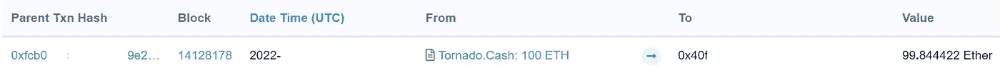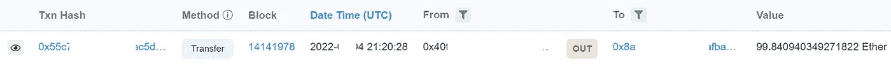

根据 MistTrack 的说法从 Tornado 提取的资金。现金被分成 3 个单独的交易，并被转移到固定浮动。

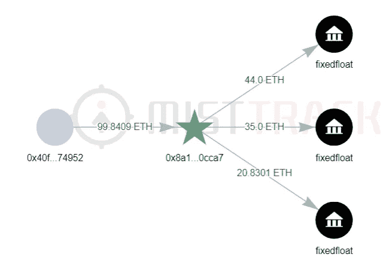

只有一个样本，我们无法验证这种行为是否属于黑客。所以我们搜索了同一时间段内的其他交易。我们很快发现了其他三个取款地址也遵循同样的模式。所有这些地址都收到了来自龙卷风的 100 ETH 撤回。现金，并最终全部转移到固定浮动。

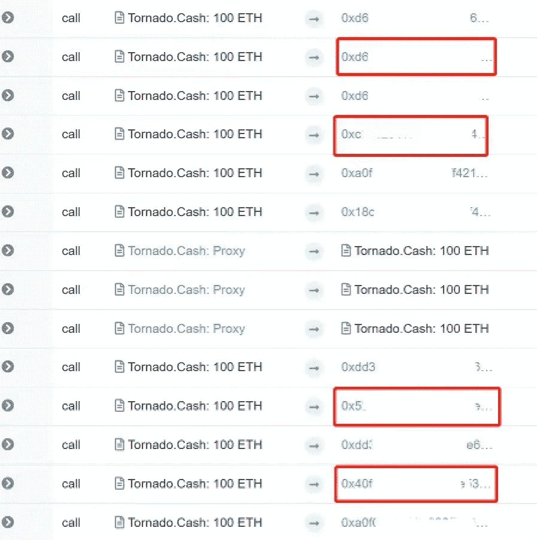

没过多久我们就发现了黑客使用的剩余取款地址。

## 多边形

同一名黑客还窃取了 365，247 Matic 并将其存入 Tornado。使用 7 种不同交易的现金。两个 1 万存款，五个 10 万存款。

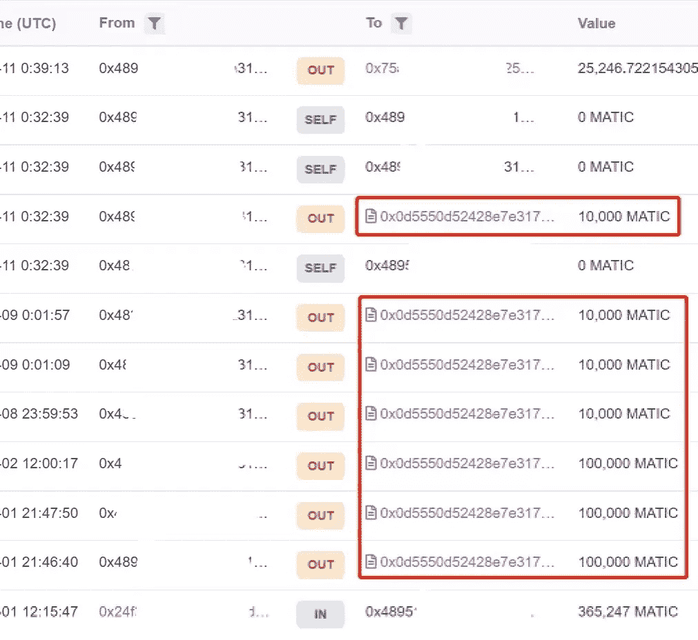

剩余的 25，246 matic 被传输到此地址(0x75a…5c1)。当我们追踪这个地址时，资金也被存入了一个固定的浮动账户。既然我们知道这是黑客的首选方法，我们可以从 Tornado.Cash 中寻找类似的取款模式。

我们通过跟踪转账到 Tornado.Cash 后的第一笔 100，000 Matic 取款开始了我们的调查。由于符合要求的取款并不多，因此使用 MistTrack 进行跟踪相对容易。我们很快发现了一个地址，它不仅将资金存入固定浮动账户，而且还从中收取资金。

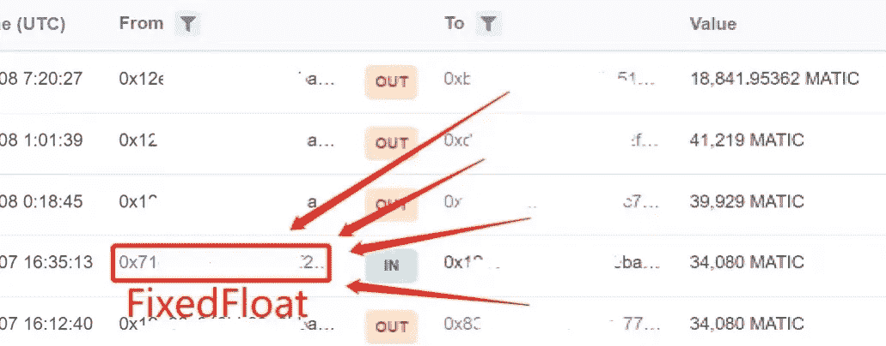

我们发现其余的资金只是时间问题。在这段时间内有 24 个地址遵循相同的模式。

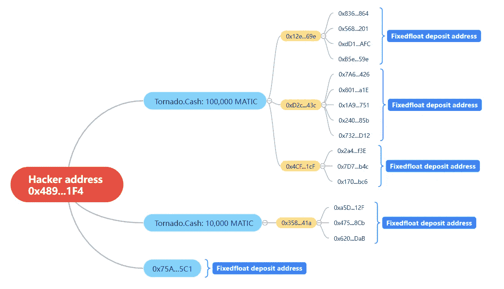

从之前的分析来看，似乎黑客对 FixedFloat 有着独特的偏好，但这也成为了抓住他的把柄。

## 币安智能连锁

利用我们在上面发现的信息，我们将其应用于我们对币安智能链的搜索。这里涉及到两个地址，让我们看看第一个(0x489..1F4)。

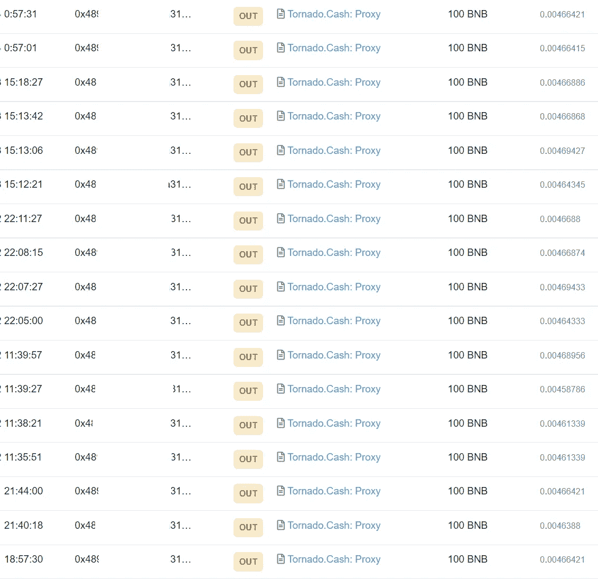

黑客把 1700 BNB 转到了龙卷风。在 17 笔不同的交易中兑现 100 BNB。

我们最初搜索 FixedFloat 中的传输，但我们很快意识到黑客不再使用该平台。我们重新开始我们的搜索，并应用了与以前相同的格式。

在我们的调查中，地址(0x152..fB2)引起了我们的注意，因为他们转入的所有资金都被转到了 SimpleSwap。没过多久，我们就发现了剩余的资金。

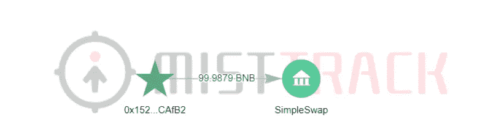

虽然黑客改变了他们的平台，但模式保持不变。所有资金都被直接发送到 SimpleSwap，或通过多次交易发送。

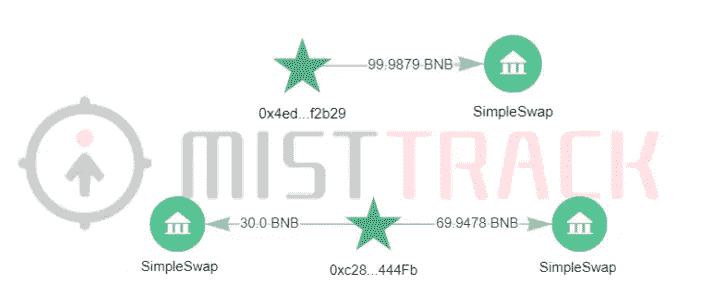

另一个黑客地址(0x24f…bB1)给龙卷风发了 50 BNB。分五次兑现，每次 10 BNB。

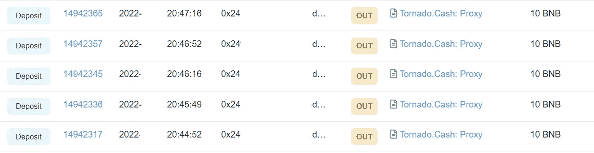

虽然这个黑客选择了另一个平台，但他们使用的方法与上面列出的方法相似。

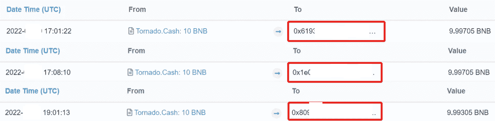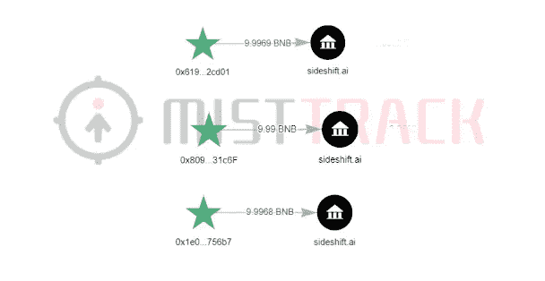

# **总结**

我们研究了一个真实的案例，并解释了黑客如何使用 Tornado。现金隐藏被盗资金跨越各种区块链。他们会先把资金存入龙卷风。现金，然后直接或间接转移到另一个混合平台，如 FixedFloat、SimpleSwap 或 Sideshift.ai。显然，这不是使用 Tornado 的唯一方式。隐藏被盗资金的现金。跟随我们，这样你就可以在将来学会识别其他行为。

尽管单靠自己的力量做这件事并不是不可能的，但如果有合适的工具，事情会简单得多。这就是我们创建**mistrack**的原因，它包含了超过 2 亿个与世界各地交易所相关的地址。它可以识别从交易所到热钱包和冷钱包的各种地址。MistTrack 反洗钱系统还可以对任何钱包执行分析和行为模式。这在帮助建立一个连接到其他未识别钱包的模式中起着至关重要的作用。

> 加入 Coinmonks [电报频道](https://t.me/coincodecap)和 [Youtube 频道](https://www.youtube.com/c/coinmonks/videos)了解加密交易和投资

# 另外，阅读

*   [有哪些交易信号？](https://coincodecap.com/trading-signal) | [Bitstamp vs 比特币基地](https://coincodecap.com/bitstamp-coinbase) | [买索拉纳](https://coincodecap.com/buy-solana)
*   [ProfitFarmers 回顾](https://coincodecap.com/profitfarmers-review) | [如何使用 Cornix Trading Bot](https://coincodecap.com/cornix-trading-bot)
*   [十大最佳加密货币博客](https://coincodecap.com/best-cryptocurrency-blogs) | [YouHodler 评论](https://coincodecap.com/youhodler-review)
*   [my constant Review](https://coincodecap.com/myconstant-review)|[8 款最佳摇摆交易机器人](https://coincodecap.com/best-swing-trading-bots)
*   [MXC 交易所评论](/coinmonks/mxc-exchange-review-3af0ec1cba8c) | [Pionex vs 币安](https://coincodecap.com/pionex-vs-binance) | [Pionex 套利机器人](https://coincodecap.com/pionex-arbitrage-bot)