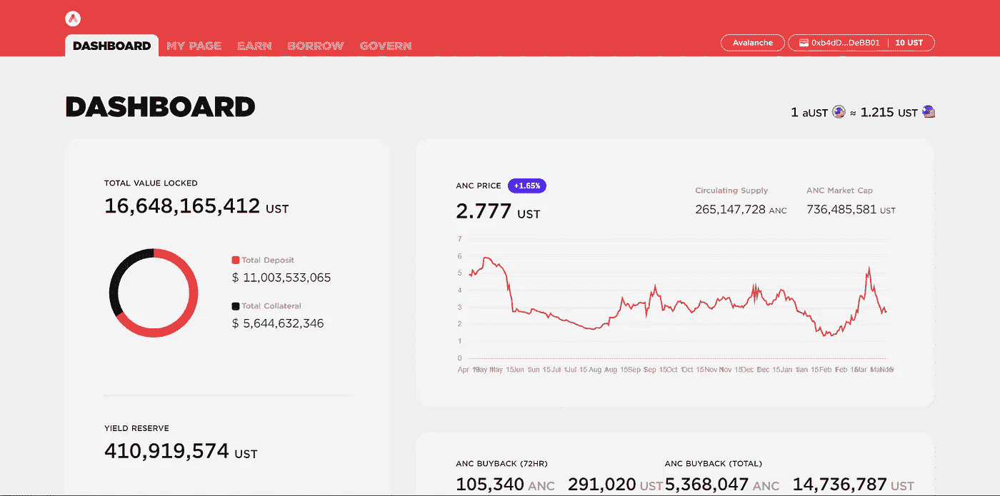

# Avax 上的锚协议-在你的马厩上获得 20%的收益

> 原文：<https://medium.com/coinmonks/anchor-protocol-on-avax-get-20-yield-on-your-stables-6bff5461635f?source=collection_archive---------1----------------------->

如果您还没有注册，请使用此[链接](https://theguywhowrites.medium.com/membership)注册 Medium。

锚协议，一贯给予马厩 20%的 APY，即将雪崩。用户很快就可以将 sAvax 作为抵押品，借入 UST，同时存入 UST，以获得在 UST 支付的 20%的利息。

Anchor Protocol

让我们深入了解一下 Avax 上的 Anchor。