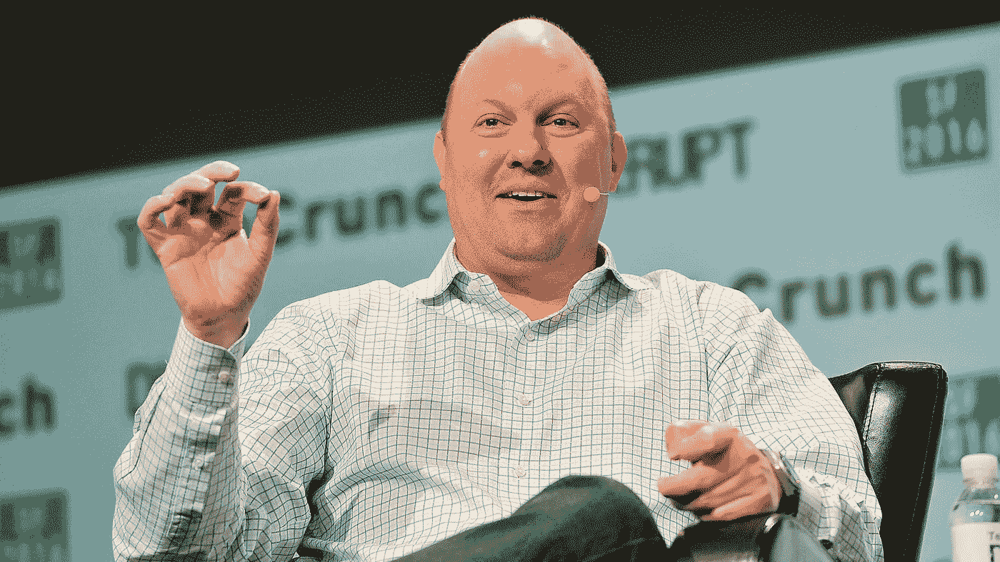

# 安德森·霍洛维茨向以太坊赌注平台 Lido 投资 7000 万美元

> 原文：<https://medium.com/coinmonks/andreessen-horowitz-invests-70-million-in-lido-an-ethereum-staking-platform-703858503e2f?source=collection_archive---------22----------------------->

**Visit our website:-** [**https://bitcoinsupports.com/**](https://bitcoinsupports.com/)

这家风险投资公司表示，Lido 的流动性赌注解决方案消除了与机构投资者赌注 ETH 相关的“运营挑战”。以太坊赌注解决方案 Lido Finance 从风险投资公司 Andreessen Horowitz 获得了 7000 万美元的资金，这是该协议自 2021 年 5 月以来的第一轮融资。一位风险投资公司的女发言人表示，安德森·霍洛维茨投资丽都旨在加速以太坊 2.0 的分散化赌注解决方案的采用。以太坊 2.0 对网络的共识过程进行了重大改变，引入了利益证明(PoS)和其他可能提高可扩展性和削减费用的增强功能。2020 年 11 月开始的以太坊 2.0 过渡目前正在进行。

[https://twitter.com/cdixon/status/1499436156861227008](https://twitter.com/cdixon/status/1499436156861227008)

据 Andreessen 介绍，由于运行一个节点的成本很高，跑马圈地(ETH)很困难。要成为一个完整的验证者，用户必须至少持有 32 个 ETH，按照目前的汇率，这相当于 9 万多美元。

在投资利多的同时，Andreessen 表示，它正通过协议将其以太坊资产的一部分押在信标链上。这家风险投资公司表示:“与利多合作消除了机构投资者迄今为止遇到的大量操作障碍。”。

行业数据显示，以太坊的信标链最近注册了第 30 万个验证器。在撰写本报告时，已有近 970 万 ETH 被下注，总计超过 271 亿美元。

虽然以太坊 2.0 和 Eth2 等短语仍在业内普遍使用，但以太坊基金会在 1 月份表示将逐步淘汰它们。与其这样，最初的以太坊区块链现在被称为“执行层”，而 PoS 链被称为“共识层”

丽都金融成立于 2020 年，是以太坊 2.0 的一个流动赌注解决方案，使客户能够在没有任何锁定或最低存款的情况下押注其 ETH。

2021 年 5 月，丽都完成了由加密风险投资公司 Paradigm 牵头的 7300 万美元融资。三箭资本、阿拉米达研究、数字货币集团和阿拉米达研究提供了额外的资金。

**访问我们的网站:-**[【https://bitcoinsupports.com/】T21](https://bitcoinsupports.com/)

**免责声明:以上为作者观点，不应视为投资建议。读者应该自己做研究。**

> 加入 Coinmonks [电报频道](https://t.me/coincodecap)和 [Youtube 频道](https://www.youtube.com/c/coinmonks/videos)了解加密交易和投资

# 另外，阅读

*   [加密货币储蓄账户](/coinmonks/cryptocurrency-savings-accounts-be3bc0feffbf) | [YoBit 审核](/coinmonks/yobit-review-175464162c62)
*   [Botsfolio vs nap bots vs Mudrex](/coinmonks/botsfolio-vs-napbots-vs-mudrex-c81344970c02)|[gate . io 交流回顾](/coinmonks/gate-io-exchange-review-61bf87b7078f)
*   [CoinFLEX 评论](https://coincodecap.com/coinflex-review) | [AEX 交易所评论](https://coincodecap.com/aex-exchange-review) | [UPbit 评论](https://coincodecap.com/upbit-review)
*   [AscendEx 保证金交易](https://coincodecap.com/ascendex-margin-trading) | [Bitfinex 赌注](https://coincodecap.com/bitfinex-staking) | [bitFlyer 点评](https://coincodecap.com/bitflyer-review)
*   [Bitget 回顾](https://coincodecap.com/bitget-review)|[Gemini vs block fi](https://coincodecap.com/gemini-vs-blockfi)cmd |[OKEx 期货交易](https://coincodecap.com/okex-futures-trading)
*   [AscendEx Staking](https://coincodecap.com/ascendex-staking)|[Bot Ocean Review](https://coincodecap.com/bot-ocean-review)|[最佳比特币钱包](https://coincodecap.com/bitcoin-wallets-india)
*   [霍比审核](https://coincodecap.com/huobi-review) | [OKEx 保证金交易](https://coincodecap.com/okex-margin-trading) | [期货交易](https://coincodecap.com/futures-trading)