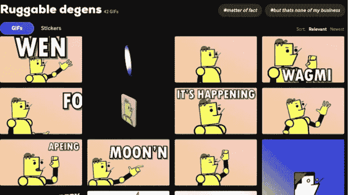

# 动画 NFT gif 是推特上的下一波情感浪潮

> 原文：<https://medium.com/coinmonks/animated-nft-gifs-are-the-next-wave-of-emoting-on-twitter-7486b0e8d050?source=collection_archive---------59----------------------->

## NFT gif 很蠢，为什么不直接点？

大多数 NFTs 收藏(尤其是受欢迎的)都有一个 gif 来展示他们的收藏、硬币或项目。但是他们在某种能力上都缺少什么呢？

*一种真实的表达方式。*

[Ruggable Degens](https://marketplace.kalao.io/collection/0xcc7c6efd2409d10e88b971e930c1036b119c5c02) 创造了[多种实用的动画 gif](https://giphy.com/search/ruggable-degens)可以用于几乎任何加密项目！为什么将 NFT gif 绑定到不和、社区或持有者？为什么不为任何项目创建可用的 NFT gif 呢！创建动画 NFT gif 可以是一种吸引人的方式来寻找新的观众，并为持有人提供一个更大的加密社区的一部分。

众所周知， [Ruggable Degens](https://marketplace.kalao.io/collection/0xcc7c6efd2409d10e88b971e930c1036b119c5c02) 一直是[无障碍第一 NFT 系列。](https://www.ruggabledegens.xyz/)一个进入成本低，获得奖励的机会多，在正常对话中表达自己感受的 gif。

这些 gif 可以在名为 [Giphy](https://giphy.com/search/ruggable-degens) 的网站上找到，这里有一些已经存在的:

[文](https://media.giphy.com/media/lnJqFTjO8R6NLJFri3/giphy.gif)、[、](https://media.giphy.com/media/lbvstwrt3CeyBd15Fn/giphy.gif)、[瓦米](https://media.giphy.com/media/pu64VpFOJOT8MdXu8O/giphy.gif)、[月恩](https://media.giphy.com/media/hE5jUeRhHFDfrR9VUq/giphy.gif)、[阿平](https://media.giphy.com/media/3nUbRhsX2OE4c18nVa/giphy.gif)、[、](https://media.giphy.com/media/xND9i3AMEKV9Wf6l2b/giphy.gif)、[其事](https://media.giphy.com/media/OaROpLZhuUckY4E682/giphy.gif)、 [GM](https://media.giphy.com/media/lelGPjlUHwzY8vjcR6/giphy.gif) 、 [MAD](https://media.giphy.com/media/kgrvtStz73VuDkJZFo/giphy.gif)

Available NFT GIFS — RUggable Degens

Ruggableleader 承诺在时间允许的情况下增加 GIFS 的数量(他真的很忙)。

**这也是你作为读者的机会！在下面评论一些你最喜欢的加密俚语，你可能很快就会看到一个新的德根 GIFS。**

[***当前可用的表情可以在这里找到。***](https://giphy.com/search/ruggable-degens)

[***想买个德根？***](https://marketplace.kalao.io/collection/0xcc7c6efd2409d10e88b971e930c1036b119c5c02)

[***关注@RuggableDegens***](https://twitter.com/RuggableDegens)

[***贸易$RDST***](https://traderjoexyz.com/trade?inputCurrency=0xa2869a58cec44993a7fb5631b8d8215ee1c474a1&outputCurrency=0xb31f66aa3c1e785363f0875a1b74e27b85fd66c7#/)

RDST | RUGDUST

> 加入 Coinmonks [电报频道](https://t.me/coincodecap)和 [Youtube 频道](https://www.youtube.com/c/coinmonks/videos)了解加密交易和投资

# 另外，阅读

*   [分散交易所](https://coincodecap.com/what-are-decentralized-exchanges) | [比特 FIP](https://coincodecap.com/bitbns-fip) | [Pionex 审查](https://coincodecap.com/pionex-review-exchange-with-crypto-trading-bot)
*   [用信用卡购买密码的 10 个最佳地点](https://coincodecap.com/buy-crypto-with-credit-card)
*   [最好的卡达诺钱包](https://coincodecap.com/best-cardano-wallets) | [Bingbon 副本交易](https://coincodecap.com/bingbon-copy-trading)
*   [印度最佳 P2P 加密交易所](https://coincodecap.com/p2p-crypto-exchanges-in-india) | [柴犬钱包](https://coincodecap.com/baby-shiba-inu-wallets)
*   [八大加密附属计划](https://coincodecap.com/crypto-affiliate-programs) | [eToro vs 比特币基地](https://coincodecap.com/etoro-vs-coinbase)
*   [最佳以太坊钱包](https://coincodecap.com/best-ethereum-wallets) | [电报上的加密货币机器人](https://coincodecap.com/telegram-crypto-bots)