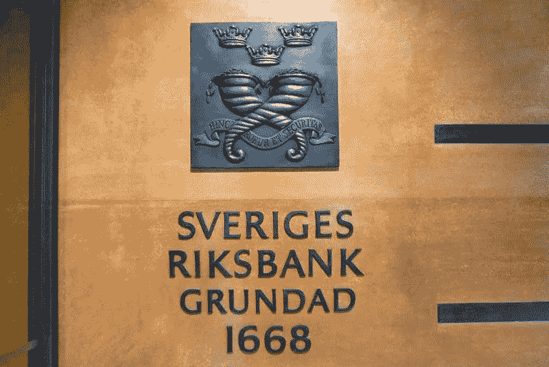
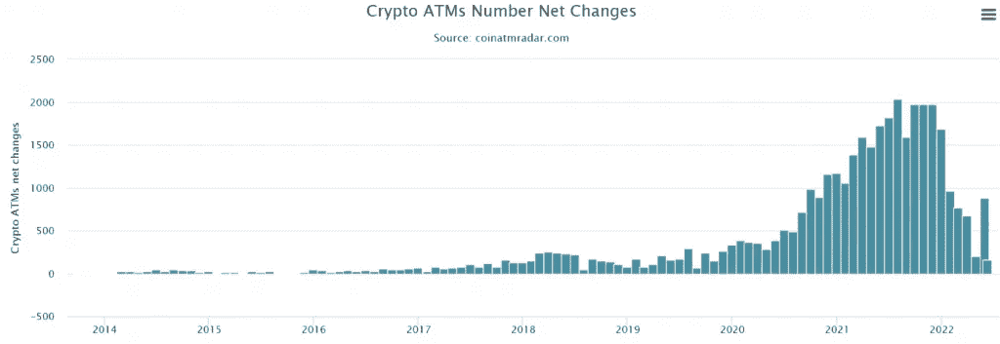

# 宣布今天区块链工业最有趣的事件。

> 原文：<https://medium.com/coinmonks/announcement-of-the-most-interesting-events-in-the-blockchain-industry-today-ac56552bdfcb?source=collection_archive---------18----------------------->

## 业内最有趣事件的公告，黑客攻击和新的限制，更多细节…

## 报告:网络钓鱼者正在积极攻击加密货币所有者

随着加密货币和 NFT 的日益流行，骗子们越来越多地瞄准这一领域， [Proofpoint 表示](https://www.proofpoint.com/us/blog/threat-insight/how-cyber-criminals-target-cryptocurrency)。

根据研究人员的观察，在 2022 年，攻击者经常试图通过发送带有受感染文件或链接的邮件来访问加密货币钱包。

通常，他们从所谓的加密货币平台(如[币安](https://www.binance.com/)或 [OpenSea](https://opensea.io/) )发送电子邮件，鼓励受害者在虚假页面上输入种子短语。

## 被执法人员“清算”，Emotet 又活跃起来了。新模块面向 Chrome 用户

研究人员发现，一种新的 Emotet 僵尸网络模块旨在通过 Chrome 浏览器窃取银行卡数据。

## 攻击者开始通过 Roblox 游戏平台出售解密器

研究人员发现了 WannaFriendMe 勒索软件。它不需要加密货币形式的赎金，而是通过 Roblox Game Pass 商店在 Roblox 游戏平台上购买解密程序。

WannaFriendMe 运营商将其称为 Ryuk 勒索软件，但专家指出，实际上它是混沌勒索软件的一种变体。据[bleeding Computer](https://www.bleepingcomputer.com/news/security/roblox-game-pass-store-used-to-sell-ransomware-decryptor/)报道，像 Chaos 这样的勒索软件不仅加密数据，在很多情况下还会破坏数据。

## 为了环境，瑞典银行呼吁禁止比特币

瑞典央行发表了一份报告“加密货币及其对金融稳定的影响”，其中他分享了自己对工作证明共识算法进行挖掘的研究结果。

由于环境影响，瑞典央行呼吁禁止比特币和其他证明有效的加密货币。根据文件，这种采矿方法的能源消耗相当于 20 万户家庭。

> “央行无权告诉人们如何使用他们的电力。如果他们真的关心环境，他们会在明天早上关闭他们的业务，”比特币最大专家 Knut Svanholm 告诉 Cointelegraph。

在对 Riksbank 推文的回应中，他还发布了一个关于比特币开采的视频，该视频声称用于开采第一种加密货币的能量“没有浪费”。

瑞典比特币交易所 BTCX 的创始人克里斯蒂安·安德(Christian Ander)也批评了瑞典央行的报告:

> “能源消耗必须是中性的，生产必须受到管制。不要规范人们用它做什么。”

## Circle 同意收购加密初创公司 Cybavo

stablecoin USD Coin (USDC)背后的 Circle 已经签署了一项最终协议，收购加密货币初创公司 Cybavo。

Cybavo 将自己定位为专注于机构客户的基础设施平台。这家初创公司提供一系列服务，包括加密货币存储和赌注。客户包括比特币交易所、NFT 和游戏平台，以及 DeFi 协议。

Circle 首席执行官杰里米·阿莱尔(Jeremy Allaire)表示，此次收购将使该公司扩大其技术能力和客户基础。交易条款没有披露。

## 比特币做了一个 V 形转弯——但目前为止只是在安装的自动取款机数量上

比特币自动取款机(BATM)又开始营业了。6 月是 2022 年的第一个月，这一数字开始上升。

自年初以来，新 BATMs 的数量稳步下降，5 月是有史以来最糟糕的一个月，今年第五个月仅安装了 205 台新机。但是 6 月的前 10 天让 cryptans 重拾乐观——前 10 天安装了超过 882 个新的 BATMs。

如此少的装机量，像今年 5 月，上一次观测是在 2019 年。自那以后，由于友好的监管和加密货币市场的发展，BATM 的安装时间表在 2020 年和 2021 年稳步增长。

萨尔瓦多也做出了贡献。在采用比特币作为支付手段的法律生效后，加密自动取款机的安装激增。中国积极继续打击加密货币和采矿，这也导致了 BATM 数量增长的暂时放缓。

比特币 ATM 的安装高峰(1971 件)出现在 2021 年 12 月。然而，在 2022 年，这个数字下降了 89.75%。

Monthly change in the number of installed and removed cryptocurrency ATMs Source: Coin ATM Radar

根据 CoinATMradar 服务，目前全世界平均每天安装 23 台加密 ATM。在撰写本文时，全球共有 38，000 个 BATMs。这些机器通过允许用户和投资者将他们的法定货币兑换成比特币来实现一个重要目的，反之亦然。于是，买卖加密货币就成了一种习惯动作，每个人都可以使用。

全球安装的 87.9% (33，403 台)ATM 位于美国。最受欢迎的 BATM 生产商是 Genesis Coin、General Bytes、BitAccess、Coinsource 和 Bitstop。

📰 ***订阅*** [***斐波那契***](/@unclefibonacci) ***我来保持最新***

> 加入 Coinmonks [电报频道](https://t.me/coincodecap)和 [Youtube 频道](https://www.youtube.com/c/coinmonks/videos)了解加密交易和投资

# 另外，阅读

*   [AscendEx Staking](https://coincodecap.com/ascendex-staking)|[Bot Ocean Review](https://coincodecap.com/bot-ocean-review)|[最佳比特币钱包](https://coincodecap.com/bitcoin-wallets-india)
*   [Bitget 回顾](https://coincodecap.com/bitget-review)|[Gemini vs block fi](https://coincodecap.com/gemini-vs-blockfi)|[OKEx 期货交易](https://coincodecap.com/okex-futures-trading)
*   [美国最佳加密交易机器人](https://coincodecap.com/crypto-trading-bots-in-the-us) | [经常性回顾](https://coincodecap.com/changelly-review)
*   [在印度利用加密套利赚取被动收入](https://coincodecap.com/crypto-arbitrage-in-india)
*   [霍比评论](https://coincodecap.com/huobi-review) | [OKEx 保证金交易](https://coincodecap.com/okex-margin-trading) | [期货交易](https://coincodecap.com/futures-trading)
*   [麻雀交换评论](https://coincodecap.com/sparrow-exchange-review) | [纳什交换评论](https://coincodecap.com/nash-exchange-review)